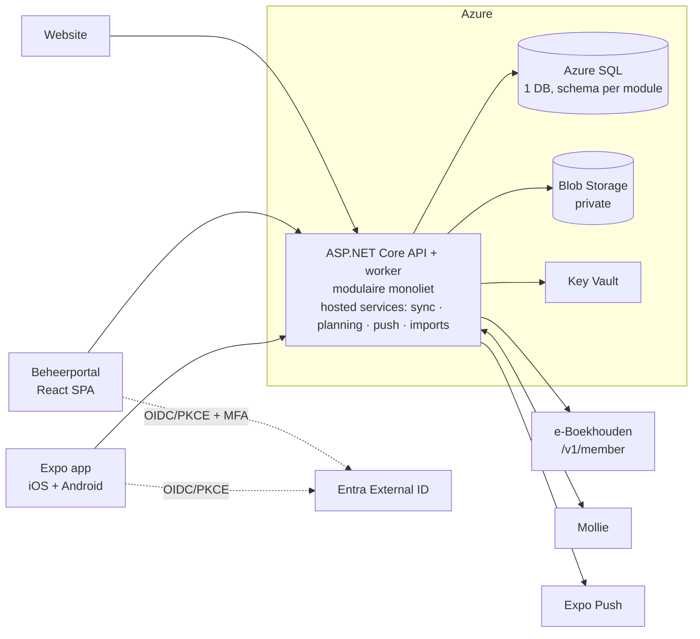

# Architectuur – De Vrolijke Drammers App

Beknopt overzicht (v0.2, 2026-09-24). Details staan in [docs/03-architecture.md](docs/03-architecture.md), de [ADR's](docs/adr/) en het [besluitenregister](docs/10-open-questions.md).

## In één oogopslag

## Principes

1. **Eenvoud**: één API-deployable (modulaire monoliet), PaaS, geen microservices.
2. **API-first**: alle clients gebruiken `/api/v1` (OpenAPI); niemand verbindt rechtstreeks met de database.
3. **Security by default**: managed identities, Key Vault, deny-by-default-autorisatie op permissions, audit.
4. **Offline waar nodig**: QR-weergave en scanner werken zonder netwerk; reconciliatie op de server.
5. **Betaalbaar**: ± € 60–100 per maand voor alle omgevingen.

## Modules

`Identity` · `Membership` · `Content` · `Notification` · `Ticketing` · `Payments` · `Parade` · `Import` · `Audit` (+ `Reporting` read-models). Elke module heeft een eigen databaseschema en schrijft alleen naar de eigen tabellen.

## Belangrijkste besluiten

| ADR | Besluit |
|---|---|
| [001](docs/adr/ADR-001-mobile-framework.md) | React Native + Expo |
| [002](docs/adr/ADR-002-backend-framework.md) | ASP.NET Core modulaire monoliet |
| [003](docs/adr/ADR-003-database-architecture.md) | Eén Azure SQL-database, schema's per module |
| [004](docs/adr/ADR-004-authentication.md) | Entra External ID (één tenant, zelfregistratie uit) + eigen RBAC |
| [005](docs/adr/ADR-005-qr-ticket-security.md) | Dynamische, device-gebonden, ondertekende QR |
| [006](docs/adr/ADR-006-offline-scanning.md) | Offline scanqueue + deterministische reconciliatie |
| [007](docs/adr/ADR-007-azure-hosting.md) | App Service (API + hosted workers) + Static Web Apps; geen Functions (B-01) |
| [008](docs/adr/ADR-008-file-storage.md) | Private Blob + quarantaine + malwarescan |
| [009](docs/adr/ADR-009-push-notifications.md) | Expo Push achter abstractie |
| [010](docs/adr/ADR-010-eboekhouden-sync.md) | Pull-sync e-Boekhouden, idempotent op lidnummer |
| [011](docs/adr/ADR-011-parade-registration-number.md) | Opgavenummer via teller-tabel met lock |
| [012](docs/adr/ADR-012-parade-start-number.md) | Startnummer uniek via filtered index; expliciete generatie |
| [013](docs/adr/ADR-013-design-system.md) | Figma-tokens als gedeeld design system |
| [014](docs/adr/ADR-014-account-provisioning.md) | Alleen leden (+ ouders) een account; provisioning na goedkeuring |

## Omgevingen

Development → Acceptance → Production, elk met een eigen resource group, identity, Key Vault en app-registraties in **één gedeelde Entra-tenant**; Dev/Acc zijn afgeschermd met gebruikerstoewijzing + claim `environmentAccess` (B-02). Deploy via GitHub Actions (publieke repository, B-03); Production alleen na goedkeuring via de environment `production`.

## Accounts

Alleen leden en ouders van minderjarige leden hebben een account; geen zelfregistratie. Accounts worden aangemaakt na goedkeuring door het bestuur (nieuwe leden: e-Boekhouden → lokaal → Entra) of bij een exacte match lidnummer + e-mailadres (bestaande leden). Zie [ADR-014](docs/adr/ADR-014-account-provisioning.md). Zie [docs/08-azure-infrastructure.md](docs/08-azure-infrastructure.md).
