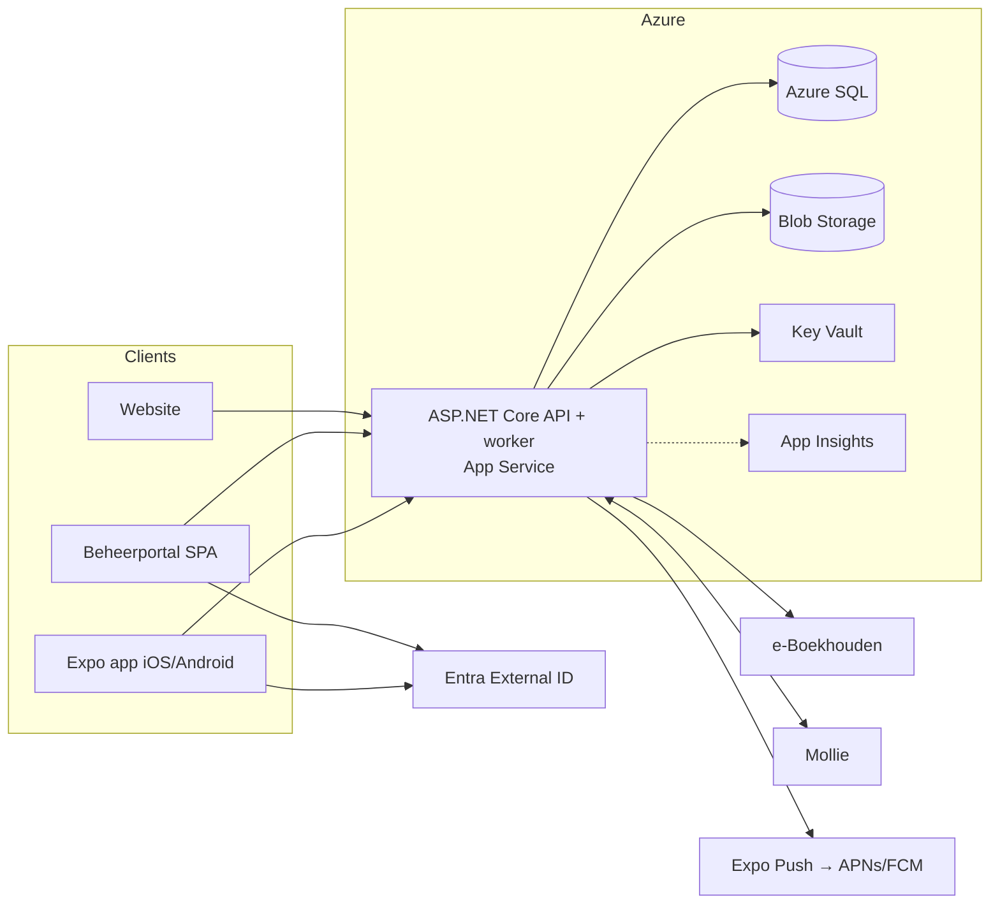

# 00 – Overzicht fase 0 (de 23 gevraagde onderdelen)

> Status: v0.3 · 2026-09-24 · Compacte samenvatting met verwijzingen naar de detaildocumenten. **Architectuurfase afgerond**: zie het [besluitenregister](10-open-questions.md) (alle blockers besloten), de [architectuurreview](18-architecture-review.md) en het [implementatieplan](15-implementation-plan.md).

## 1. Samenvatting requirements
Eén platform (iOS/Android-app, beheerportal, API in Azure) voor gasten en leden van CV De Vrolijke Drammers. Het omvat publieke content, leden met meerdere rollen (RBAC), een ledenbron in e-Boekhouden, lid worden met handmatige goedkeuring, veilige QR-toegang met scanmodus (ook offline), bandjes, generieke ticketing (dagkaarten, pronkzitting via Mollie), een volledig optochtproces (wizard, opgave- en startnummer, samenstellen, aanrijtijden, exports), push naar fijnmazige doelgroepen (incl. ouders), rapportages, jubilarissen, audit en AVG. → [01-requirements.md](01-requirements.md)

## 2. Ontbrekende requirements
Waar geboortedatum/inschrijfjaar/status staan (e-Boekhouden heeft er geen velden voor); interpretatie deelnemers versus categorie; wie mag inschrijven; definitie carnavalstoegang/bandjes; jubileumregels; minimumleeftijd account; "Uitslagen" en "Route" uit Figma; ontbrekende schermontwerpen; nieuwsbriefdienst; privacyverklaring/DPA's. → [01 §6](01-requirements.md#6-ontbrekende-of-onduidelijke-requirements)

## 3. Openstaande vragen
Besluitenregister: alle 7 **blockers besloten** (2026-09-24): workers in de API-app, één Entra-tenant, publieke GitHub-repo, accounts op naam van de vereniging, alleen leden (+ ouders) een account met provisioning na goedkeuring, vrije velden in e-Boekhouden, geen planning in de documentatie. Resterend: IMPORTANT- en LATER-besluiten. → [10-open-questions.md](10-open-questions.md)

## 4. Voorgestelde architectuur
Modulaire monoliet (ASP.NET Core) als enige API voor app, portal en website; hosted services in dezelfde App Service voor achtergrondwerk (B-01); één Azure SQL-database met schema's per module; private Blob Storage; Entra External ID voor identiteit, RBAC in de eigen DB; Expo Push. → [03-architecture.md](03-architecture.md)

## 5. Architectuurdiagram (Mermaid)

## 6. Technologie-stack
React Native + Expo (TS) · React + Vite (portal) · ASP.NET Core .NET 10 LTS · EF Core · Azure SQL · hosted background services · Blob · Key Vault · App Insights · Entra External ID · Expo Push · Azure Communication Services Email · Bicep · GitHub Actions (of Azure DevOps, B-03). → [03 §4](03-architecture.md#4-technologie-stack), ADR-001/002/007

## 7. Databaseadvies
**Eén Azure SQL-database met schema's** (`identity`, `membership`, `content`, `notification`, `ticketing`, `payments`, `parade`, `import`, `audit`, `config`) en least-privilege DB-users per managed identity. Aparte identity-DB biedt weinig extra, omdat wachtwoorden in Entra staan, en maakt transacties/DR complexer. → [ADR-003](adr/ADR-003-database-architecture.md)

## 8. Authenticatieadvies
**Entra External ID** (gratis tot 50k MAU): e-mail + wachtwoord / e-mail-OTP, OIDC + PKCE via systeembrowser in de app, MFA (passkey of e-mail-OTP) verplicht voor het beheerportal via Conditional Access; **één tenant** met Dev/Acc afgeschermd via gebruikerstoewijzing + claim `environmentAccess` (B-02); **geen zelfregistratie**: accounts pas na goedkeuring, volgorde e-Boekhouden → lokaal → Entra (ADR-014); rollen/permissions in de eigen DB; bestaande leden vragen een account aan met lidnummer + e-mailadres. Eigen auth afgewezen (securitylast). → [ADR-004](adr/ADR-004-authentication.md)

## 9. QR-securityontwerp
**Dynamische, device-gebonden, ondertekende QR**: random 128-bit ticket-ref + credential-version + device-id + tijd, ondertekend met een niet-exporteerbare P-256-sleutel in Secure Enclave/Keystore; geldig ~45 s, ververst elke 30 s; geen persoonsgegevens; scanner valideert met publieke sleutels (ook offline); replaydetectie; printkaart als fallback. → [ADR-005](adr/ADR-005-qr-ticket-security.md)

## 10. Offline scanontwerp
Scanner met een versleutelde bootstrap-cache (tickets, publieke sleutels, revocaties, scans van anderen), online-first met 1,5 s timeout, anders lokaal resultaat + queue. Server-reconciliatie deterministisch op device-tijd (met klokcorrectie): eerste = FirstEntry, rest = Repeat(Same/Other)Device met `conflict_detected_after_sync`. Scans worden nooit overschreven. → [ADR-006](adr/ADR-006-offline-scanning.md)

## 11. e-Boekhouden-integratieontwerp
Geverifieerd tegen de officiële OpenAPI-spec: `POST /v1/session` → `GET /v1/member` (lijst, max 2000 per pagina) + `GET /v1/member/{id}` (detail). Eén naamveld, één adresregel, `freeText1..10`, **geen** geboortedatum, inschrijfjaar, status, delta-filter of webhooks. Ontwerp: nachtelijke volledige pull-sync met hash-vergelijking, idempotent op lidnummer, veldeigenaarschapsmatrix, massadeletie-guard, dry-run, SyncJob/Item/Conflict. → [ADR-010](adr/ADR-010-eboekhouden-sync.md)

## 12. Mollie-integratieontwerp
Server-side order + `POST /v2/payments` met capaciteitsreservering; webhook bevat alleen `id` → status altijd via `GET /v2/payments/{id}` (geverifieerd in de Mollie-docs; Mollie raadt IP-allowlisting af; 10 retries in 26 uur, 200 OK verwacht); idempotente verwerking; redirect wordt nooit vertrouwd; refunds blokkeren tickets. Release R4. → [02 §5.6](02-functional-design.md#56-ticket-kopen-dagkaartpronkzitting-r4), [06 §6](06-security.md#6-mollie-betalingen)

## 13. RBAC-model
~38 permissions (`member.*`, `event.*`, `news.*`, `photo.*`, `notification.*`, `parade.*`, `ticket.*`, `payment.*`, `report.view`, `import.run`, `audit.read`, `role.manage`, `config.manage`), 12 standaardrollen; **alleen leden** (rol Lid, label "Carnavalist") en **ouders van minderjarige leden** (rol Ouder/verzorger) hebben een account (B-05, ADR-014), resource-scoping (eigen inschrijving, eigen kind, eigen groep), audiences apart van permissions, deny by default, matrix-tests. → [07-rbac.md](07-rbac.md)

## 14. Volledig optochtproces
Optocht aanmaken → inschrijving open → 8-staps wizard (concept) → definitief indienen (opgavenummer) → beoordeling (aanvulling/goed/afwijzen) → samenstellen (drag-and-drop `parade_order`) → expliciet startnummers genereren/toekennen → publiceren → aanrijtijden-import (Excel, preview, validatie) → definitief → optochtdag (gemeten lengte). → [13-parade-process.md](13-parade-process.md)

## 15. Datamodel optocht
`Parade`, `ParadeCategory` (configureerbaar, 9 seeds), `ParadeRegistration` (alle velden uit §62 + `parade_order`, `spacing_after_meters`, `extra_fields` JSON), `Address` als owned value object, `ParadeNumberSequence`, `ParadeStatusEditPolicy`, `ParadeRegistrationHistory`, `ParadeStatusHistory`, `ParadeDocument`, `ParadeArrivalTime`, `ParadeRegistrationManager`. → [14-parade-data-model.md](14-parade-data-model.md)

## 16. Opgavenummer versus startnummer
**Opgavenummer** = volgorde van definitief indienen; systeem kent het toe in de submit-transactie (teller-tabel + rij-lock + unique index); nooit wijzigbaar of hergebruikt. **Startnummer** = positie in de optocht; de commissie kent het toe (handmatig of expliciet gegenereerd uit `parade_order`); wijzigbaar, gelogd, uniek per optocht via een filtered unique index. Voorbeeld: opgave 3 → startnummer 17. → [13 §6](13-parade-process.md#6-opgavenummer-versus-startnummer), ADR-011/012

## 17. Validatieregels optocht
Verplichte velden; telefoon (libphonenumber, E.164), e-mail; aantallen ≥ 0 en totaal ≥ 1; totaal (kinderen + volwassenen) binnen min/max van de categorie met `Block`/`Warn` per categorie; waarschuwing bij een jeugdcategorie met meer volwassenen; lengte > 0, ≤ 100, 2 decimalen; juryadres verplicht als afwijkend; wijzigbaarheid per status configureerbaar. → [14 §8](14-parade-data-model.md#8-businessregel-deelnemers--categorie-28), [13 §5](13-parade-process.md#5-validatieregels-samenvatting)

## 18. MVP-afbakening
MVP = fase 0–18 in [15](15-implementation-plan.md): fundament, publieke lancering (portal, contentbeheer, publieke app, productie), leden + push (inclusief accountprovisioning, ADR-014), optocht, en QR/scanner/aanrijtijden/dansgarde met carnavals-gereedheid. Buiten het MVP: Mollie/dagkaarten (19), jubilarissen/rapportage (20). Planning en datums zijn bewust niet opgenomen (B-07). → [09](09-mvp-roadmap.md)

## 19. Release-roadmap
21 implementatiefasen (0–20) met per fase doel, database, API, security, tests, DoD en acceptatiecriteria → [15-implementation-plan.md](15-implementation-plan.md). Releases (zonder datums): R0 fundament → R1a publieke lancering → R1b leden & push → R2 optocht → R3 carnaval → R4 Mollie → R5 rapportage. → [09](09-mvp-roadmap.md)

## 20. Securityrisico's
Top: admin-account-takeover (MFA), gelekte e-Boekhouden-token (Key Vault, minimale rechten), offline dubbele toegang (reconciliatie + bandjes), BOLA op optochtgegevens (resource-autorisatie + tests), gemanipuleerde webhook (server-side verificatie), kwaadwillende uploads (quarantaine + scan), misbruik pushkanaal. 21 dreigingen uitgewerkt met STRIDE. → [11-threat-model.md](11-threat-model.md), [06-security.md](06-security.md)

## 21. Azure-componenten
Noodzakelijk: App Service (B1, API + workers), Azure SQL, Storage, Key Vault, App Insights/Log Analytics, Static Web Apps, Communication Services Email, Entra External ID. Optioneel: Defender for Storage (malwarescan), opschaling tijdens carnaval, DNS. Later: private endpoints/VNet, Front Door WAF, Notification Hubs. Niet nodig: APIM, AKS, VM's. → [08-azure-infrastructure.md](08-azure-infrastructure.md)

## 22. Globale Azure-kosten (indicatief per maand)
Dev **€ 0–10** · Acc **€ 10–15** · Prod **€ 45–60** (noodzakelijk) / **€ 60–80** incl. aanbevolen opties, + ~€ 45 in februari voor opschaling. Totaal ≈ **€ 60–100/mnd** + app stores ~€ 100/jaar. → [08 §10](08-azure-infrastructure.md#10-kostenindicatie-83)

## 23. Openstaande technische beslissingen
Zie het [besluitenregister](10-open-questions.md): blockers B-01…B-07; technisch besloten: één DbContext (OQ-62), Controllers (OQ-63), pnpm-monorepo (OQ-64), SQL-firewall (OQ-60 via B-01); IMPORTANT o.a. malwarescan (OQ-65), hardware-sleutel-spike (OQ-68), MFA-kosten (OQ-69). → [10-open-questions.md](10-open-questions.md)

---

### Documentindex
| # | Document |
|---|---|
| 01 | [Requirements](01-requirements.md) |
| 02 | [Functioneel ontwerp](02-functional-design.md) |
| 03 | [Architectuur](03-architecture.md) |
| 04 | [Datamodel](04-data-model.md) |
| 05 | [API-ontwerp](05-api-design.md) |
| 06 | [Security](06-security.md) |
| 07 | [RBAC](07-rbac.md) |
| 08 | [Azure-infrastructuur](08-azure-infrastructure.md) |
| 09 | [MVP en roadmap](09-mvp-roadmap.md) |
| 10 | [Open vragen](10-open-questions.md) |
| 11 | [Threat model](11-threat-model.md) |
| 12 | [Teststrategie](12-testing-strategy.md) |
| 13 | [Optochtproces](13-parade-process.md) |
| 14 | [Datamodel optocht](14-parade-data-model.md) |
| 15 | [Implementatieplan](15-implementation-plan.md) |
| 16 | [Definition of Done](16-definition-of-done.md) |
| 17 | [Design system (Figma)](17-design-system.md) |
| 18 | [Architectuurreview](18-architecture-review.md) |
| ADR | [001](adr/ADR-001-mobile-framework.md) · [002](adr/ADR-002-backend-framework.md) · [003](adr/ADR-003-database-architecture.md) · [004](adr/ADR-004-authentication.md) · [005](adr/ADR-005-qr-ticket-security.md) · [006](adr/ADR-006-offline-scanning.md) · [007](adr/ADR-007-azure-hosting.md) · [008](adr/ADR-008-file-storage.md) · [009](adr/ADR-009-push-notifications.md) · [010](adr/ADR-010-eboekhouden-sync.md) · [011](adr/ADR-011-parade-registration-number.md) · [012](adr/ADR-012-parade-start-number.md) · [013](adr/ADR-013-design-system.md) · [014](adr/ADR-014-account-provisioning.md) |
