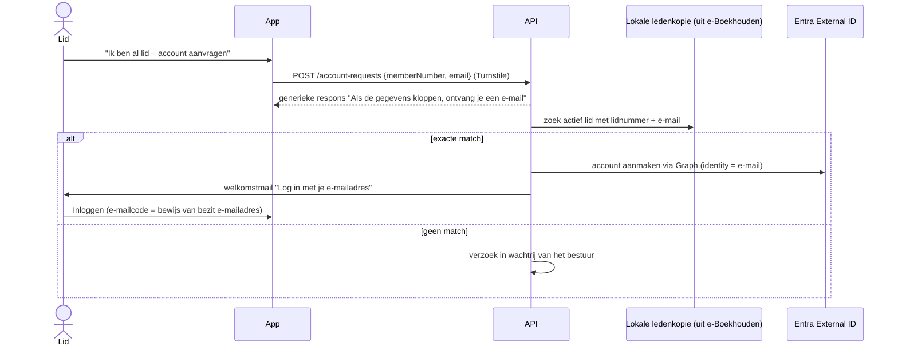
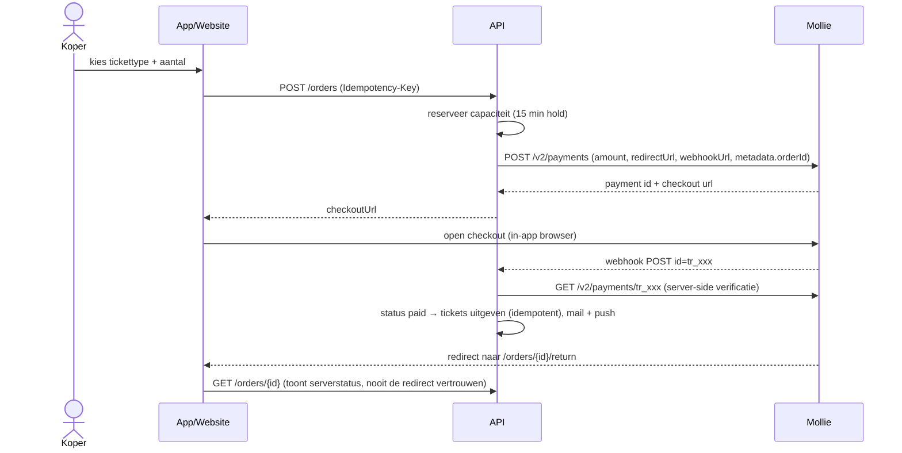

# 02 – Functioneel ontwerp

> Status: v0.3 · 2026-09-24 · accountmodel: alleen leden + ouders, provisioning na goedkeuring (B-05, ADR-014)

## 1. Kanalen

| Kanaal | Gebruikers | Technologie |
|---|---|---|
| **Mobiele app** (iOS/Android) | Gasten, leden, ouders, groepsverantwoordelijken, scanners | React Native + Expo (ADR-001) |
| **Beheerportal** (web, responsive) | Bestuur, optochtcommissie, redactie, Raad van Elf | React + Vite SPA (ADR-007) |
| **Website** (later) | Publiek, aanmelden lid, optochtinschrijving | Bestaande/nieuwe website die dezelfde API gebruikt |

Alle kanalen gebruiken uitsluitend de API (`/api/v1`). Geen enkel kanaal verbindt rechtstreeks met de database.

## 2. Rollen × functies

Legenda: ● volledig · ◐ beperkt/eigen scope · — geen toegang. Het definitieve rechtenmodel staat in [07-rbac.md](07-rbac.md).

| Functie | Gast | Lid (Carnavalist) | Groepsverantw. | Kaderlid | Dansgarde (leiding) | Ouder/verzorger | Raad van Elf | Bestuur |
|---|---|---|---|---|---|---|---|---|
| Publiek programma/nieuws/foto's | ● | ● | ● | ● | ● | ● | ● | ● |
| Leden-content | — | ● | ● | ● | ● | — (alleen eigen kinderen) | ● | ● |
| Kader-/interne agenda | — | — | — | ● | — | — | ● | ● |
| Mijn QR-toegang | — | ● | ● | ● | ● | ◐ (van kinderen) | ● | ● |
| Push ontvangen | ◐ (publiek) | ● | ● | ● | ● | ● (voor kinderen) | ● | ● |
| Optochtinschrijving | ◐ (webformulier, zonder account) | ● (app) | ◐ (eigen) | ● | ● | — | ● | ● |
| QR scannen | — | — | — | — | — | — | ◐ (indien toegewezen) | ● |
| Dansgarde-meldingen sturen | — | — | — | — | ◐ (eigen groep) | — | — | ● |
| Ledenbeheer | — | — | — | — | — | — | — | ● |
| Rapportages | — | — | — | — | — | — | ◐ | ● |

## 3. App-informatiearchitectuur (volgens Figma)

Tabbar (5 tabs), gelijk op iOS en Android:

```
Home ─ Programma ─ Optocht ─ Nieuws ─ Meer
```

| Tab / scherm | Figma | Gast | Lid | Inhoud |
|---|---|---|---|---|
| **01 Home** | ✅ `3:2` | ● | ● | Header (logo, naam, bel), begroeting, countdown naar carnaval, eerstvolgende activiteit, snelkoppelingen (Foto's, Uitslagen, Meldingen, Locatie), laatste nieuws. Voor leden (rolafhankelijk) daarnaast: **Mijn QR**, **Optocht (mijn groep)**, **Dansgarde** |
| **02 Programma** | ✅ `4:46` | ● | ● | Seizoen, filterchips (Alle/Carnaval/Jeugd/Vereniging), lijst per maand, badges (Jeugd, Hoogtepunt), FAB "Mijn agenda" (Android) |
| **06 Activiteit detail** | ✅ `8:262` | ● | ● | Hero, labels, datum + "Toevoegen aan agenda", tijd, locatie, omschrijving, ticketvoortgang, sticky CTA "Tickets bestellen" |
| **04 Optocht** | ✅ `5:174` | ● | ● | Hero, start/deelnemers/route, "Groep inschrijven", "Route", tijdlijn. Voor groepsverantwoordelijke: status, opgavenummer, startnummer, aanrijtijd |
| **03 Nieuws** | ✅ `4:474` | ● | ● | Uitgelicht bericht, eerder nieuws |
| **05 Meer** | ✅ `5:391` | ● | ● | "Word ook een Drammer!" (gast), tegels (Vereniging, Foto's, Uitslagen, Meldingen, Locatie, Contact), instellingen (push, herinneringen, over de app). Voor leden: Mijn gegevens, Mijn apparaten, Uitloggen, Scanmodus (met `ticket.scan`) |
| **07 Foto's** | ✅ `8:428` | ● | ● | Albums (horizontaal), recent toegevoegd (grid) |
| Inloggen / account aanvragen | ❌ | ● | — | "Inloggen" (e-mailcode, optioneel wachtwoord); "Ik ben al lid – account aanvragen" (lidnummer + e-mail); "Lid worden"; "Wachtwoord opnieuw instellen". **Geen vrije registratie** (ADR-014) |
| Mijn QR-toegang | ❌ | — | ● | Dynamische QR (ververst elke ~30 s), naam en foto (optioneel), geldigheid, helderheid maximaal, "offline beschikbaar"-indicator |
| Scanmodus | ❌ | — | ◐ | Camera, resultaatkaart groen/oranje/rood met icoon en tekst, bandje-knop, teller, offline-indicator + wachtrij |
| Optochtwizard (8 stappen) | ❌ | — | ◐ | Zie [13-parade-process.md](13-parade-process.md) |
| Lid worden | ❌ | ● | — | Formulier + bevestiging + status |
| Meldingeninbox | ❌ | ◐ | ● | Lijst, gelezen/ongelezen, deeplinks |
| Mijn gegevens | ❌ | — | ● | Gegevens (read-only uit e-Boekhouden, met hint "wijzigen via secretariaat"), lidmaatschap, rollen, kinderen (ouder), voorkeuren, AVG-export |

Ontbrekende ontwerpen worden in de bouwfase met dezelfde tokens en componenten gemaakt (zie [17-design-system.md](17-design-system.md)). Voorkeur: eerst in Figma laten aanvullen (OQ-42).

## 4. Rolafhankelijke home

De server levert `GET /api/v1/me` met `permissions[]` en `features[]`. De app toont tegels op basis van **permissions en features, niet op rolnamen**:

| Tegel | Voorwaarde |
|---|---|
| Mijn QR | `ticket.read.own` en er is een actief ticket in het actieve CarnivalYear |
| Mijn optochtgroep | er bestaat een inschrijving waarvan de gebruiker (een lid) manager is |
| Dansgarde | lid van een groep met type `DanceGuard` of guardian van zo'n lid |
| Kader | er zijn voor de gebruiker zichtbare events/nieuws met audience-rol Kader (audience-regels, [07 §4](07-rbac.md#4-audience-regels-zichtbaarheid-content)); geen aparte permission |
| Scanmodus | `ticket.scan` én het huidige device is `trusted_scanner` |

## 5. Kernflows

### 5.1 Account aanvragen (bestaand lid)

Er is **geen vrije registratie**: accounts bestaan alleen voor leden en ouders/verzorgers van minderjarige leden, en worden door de backend aangemaakt ([ADR-014](adr/ADR-014-account-provisioning.md)).



Regels:
- Een lidnummer alleen is nooit genoeg: de match is lidnummer **én** het e-mailadres zoals dat in e-Boekhouden staat; wie de mailbox niet bezit, kan niet inloggen.
- Altijd een generieke respons (geen uitvissen van leden of e-mailadressen); rate limit 5 per uur per IP.
- Leden zonder (juist) e-mailadres: het bestuur laat het e-mailadres in e-Boekhouden vastleggen of corrigeren; daarna wordt het account aangemaakt vanuit de wachtrij.
- Bij einde of blokkade van het lidmaatschap wordt het Entra-account uitgeschakeld.

### 5.2 Lid worden

Een aanvraag staat in een **tijdelijke wachtrij** en komt pas na goedkeuring door het bestuur in e-Boekhouden en Entra (statusdiagram in [ADR-014](adr/ADR-014-account-provisioning.md)):

1. Formulier in de app of op de website (zonder account), e-mailverificatie, indienen (Turnstile).
2. Het bestuur beoordeelt: **handmatige goedkeuring is altijd verplicht**; afwijzen met reden.
3. Na goedkeuring voert de backend automatisch uit: lid aanmaken in e-Boekhouden (`POST /v1/member`, vrije velden volgens B-06) → lokaal lid met rol Lid → Entra-account (en ouderaccount bij < 16 jaar) → welkomstmail.
4. Mislukt een stap, dan is de aanvraag `ProvisioningFailed`, met "opnieuw proberen" of handmatig koppelen in het portal.

- Opgeslagen: aanvraagdatum, status, behandelaar, goedkeuringsdatum, opmerkingen, afwijzingsreden, bron (app/website), provisioningstappen.
- Voor minderjarigen (< 16) zijn gegevens en toestemming van een ouder/verzorger verplicht; bij goedkeuring worden de guardian-relatie en het ouderaccount aangemaakt.

### 5.3 Push versturen (beheer)

1. De redacteur kiest een type: Nieuws-push / Losse melding / Dringend.
2. De doelgroep wordt samengesteld uit: Iedereen (incl. gasten met push-toestemming) · Alle leden · Rollen (multi) · Groepen (multi) · Specifieke leden · Ouders van geselecteerde kinderen.
3. Preview: het aantal ontvangers (unieke users/devices) wordt getoond vóór verzending.
4. Direct of gepland versturen; voor "Iedereen"/"Alle leden" geldt een bevestigingsdialoog (4-ogen optioneel, OQ-44).
5. De server expandeert de doelgroep naar `NotificationRecipient`-records (per user). Ouders ontvangen meldingen over hun kind met een prefix: "Namens [kind]: …".
6. Delivery-receipts (Expo) worden bijgewerkt; de read-status komt uit de inbox (`POST /me/notifications/{id}/read`).

### 5.4 QR-toegang en scannen

Zie [ADR-005](adr/ADR-005-qr-ticket-security.md) en [ADR-006](adr/ADR-006-offline-scanning.md).

**Scanresultaten** (weergave-enum in de API; opgeslagen als `local_result`. Na reconciliatie volgt `final_result`, zie [04 §7](04-data-model.md#7-schema-ticketing)):

| Resultaat | Kleur | Icoon | Tekst | Extra |
|---|---|---|---|---|
| `Valid` (eerste geldige scan in deze toegangsperiode) | GROEN | ✓ vinkje | "Toegang geldig." | Naam + optioneel foto, tickettype, bandje-knop |
| `ValidRepeatSameDevice` | GROEN | ✓ + klok | "Toegang geldig. Deze QR-code is al eerder gescand op dit apparaat." | Datum/tijd vorige scan |
| `WarnRepeatOtherDevice` | ORANJE | ⚠ driehoek | "Deze QR-code is eerder gescand vanaf een ander apparaat." | Datum/tijd, scannernaam (indien `ticket.scan.details`), knoppen "Toch toelaten"/"Weigeren" |
| `Invalid` | ROOD | ✕ kruis | Reden: "Ticket verlopen" / "Ticket geblokkeerd" / "Geen geldig lidmaatschap" / "Onbekende code" / "Code verlopen – vraag om te verversen" / "Ticket niet geldig voor dit evenement" | — |

- Elk resultaat heeft een eigen trillingspatroon en geluid; de schermlezer leest de tekst voor.
- "Toegangsperiode" = een configureerbare `AccessWindow` (bijv. per carnavalsdag 06:00–05:59). Een tweede scan de volgende dag is weer `Valid` (nieuwe eerste toegang).
- Een beslissing van de scanner bij ORANJE ("Toch toelaten"/"Weigeren") wordt als `operator_decision` in de scan opgeslagen.

### 5.5 Bandjes

- Na een geldige scan: knop "Bandje verstrekt", met een type (bijv. kleur per dag). Geregistreerd wordt: tijd, verstrekker, type, geldig van/tot.
- De `WristbandPolicy` per event/AccessWindow bepaalt het volgende:
  - `required_after_first_scan` (bool);
  - `rescan_required` (bool, bij geldig bandje);
  - de geldigheid (dag / hele carnaval);
  - welke tickettypen een bandje krijgen.
- Bij een volgende scan met een geldig bandje toont de scanner: "Bandje [type] verstrekt op … om …".

### 5.6 Ticket kopen (dagkaart/pronkzitting, R4)



Statussen: `Pending → Paid | Failed | Canceled | Expired`; `Paid → Refunded | PartiallyRefunded`. Bij een refund wordt het ticket automatisch geblokkeerd.

### 5.7 Optocht

Volledig uitgewerkt in [13-parade-process.md](13-parade-process.md).

## 6. Beheerportal – menu en release

| Menu | Belangrijkste functies | Permission | Release |
|---|---|---|---|
| Dashboard | Kerncijfers, sync-status, open taken | `report.view` | R1 |
| Leden | Zoeken, filters, detail, rollen, status, laatste login, syncstatus, scanhistorie, blokkeren, export | `member.read` / `member.update` / `member.export` | R1 |
| Lidmaatschapsaanvragen | Wachtrij, beoordelen, goedkeuren/afwijzen | `member.approve` | R1 |
| Agenda / Programma | Events, doelgroepen, publicatie, bijlagen | `event.manage` | R1 |
| Nieuws | Berichten, planning, push | `news.manage` | R1 |
| Foto's | Albums, upload, volgorde, zichtbaarheid | `photo.manage` | R1 |
| Carnavalsjaar | Jaren, actief jaar, datums, AccessWindows | `config.manage` | R1 |
| Pushmeldingen | Opstellen, doelgroep, historie, statistiek | `notification.send` | R1 |
| Import/synchronisatie | SyncJobs, fouten, conflicten, handmatig starten | `import.run` | R1 |
| Rollen/rechten | Rollen, permissions, toewijzen | `role.manage` | R1 |
| Auditlog | Zoeken, filteren (read-only) | `audit.read` | R1 |
| Configuratie | Feature flags, minimum appversie, maintenance, bewaartermijnen | `config.manage` | R1 |
| Optocht / Optochtinschrijvingen | Overzicht, detail, status, export | `parade.manage` | R2 |
| Optocht samenstellen | Volgorde, startnummers, lengtes | `parade.assign-start-number` | R2 |
| Documenten | Optochtdocumenten, scanstatus | `parade.manage` | R2 |
| Aanrijtijden | Excel-import wizard | `parade.import-arrival-times` | R3 |
| Tickets / QR-scans | Tickets, blokkeren, heruitgeven, scanlog, devices/scanners | `ticket.manage` / `ticket.read` | R3 |
| Rapportages | Bezoekers, optocht, leden | `report.view` | R2/R3 |
| Dagkaarten / Betalingen | Verkoop, statussen, refunds | `payment.read` / `payment.manage` | R4 |
| Jubilarissen | Rapport per carnavalsjaar, regels | `report.view` + `member.export` | R5 |

UX-principes voor het portal: tabellen met kolomkeuze, opgeslagen filters, bulkacties waar veilig, exports altijd met herkenbare Nederlandse kolomnamen, bevestigingsdialoog bij destructieve acties, en een auditvermelding bij gevoelige wijzigingen.

## 7. Notificatievoorkeuren

| Categorie | Standaard | Uit te zetten |
|---|---|---|
| Dringend (veiligheid, afgelasting) | aan | **nee** |
| Programma-wijzigingen | aan | ja |
| Nieuws | aan | ja |
| Optocht (voor eigen groep) | aan | nee (transactioneel) |
| Dansgarde (eigen/kind) | aan | nee (transactioneel) |
| Kader | aan | ja |
| Ticketverkoop | aan | ja |
| Herinneringen activiteiten | aan | ja |

## 8. Lidmaatschapsstatussen (lokaal afgeleid)

`Active`, `Inactive` (beëindigd/verdwenen uit e-Boekhouden), `Suspended` (door bestuur geblokkeerd), `Deceased`. Een aanvrager is nog geen `Member`; die status staat op `MembershipApplication`. De bron van `Active/Inactive` volgt uit B-06 (vrij veld in e-Boekhouden of lokaal).
