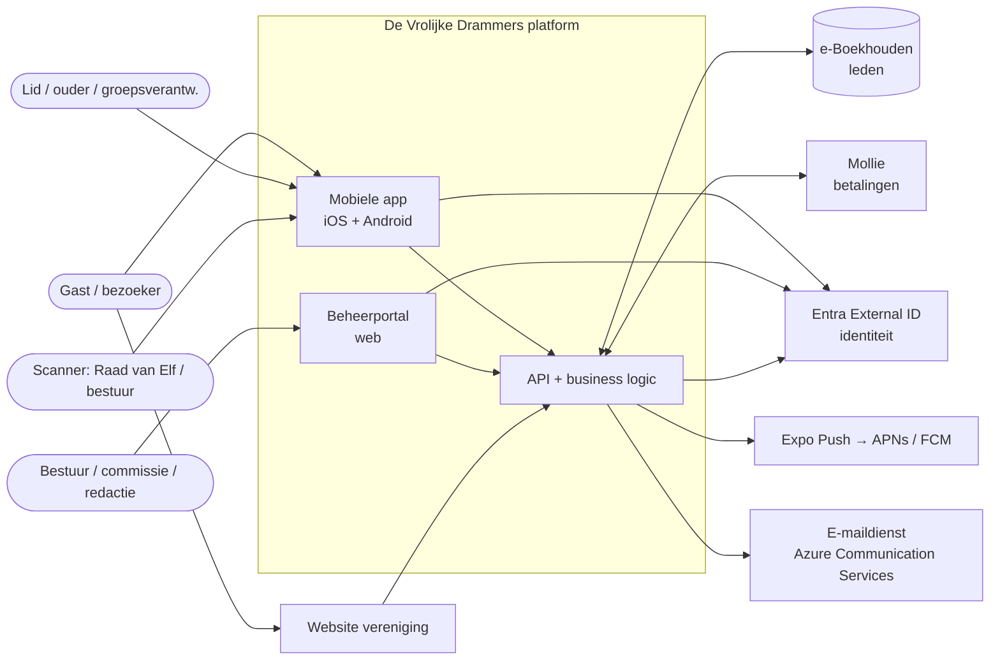
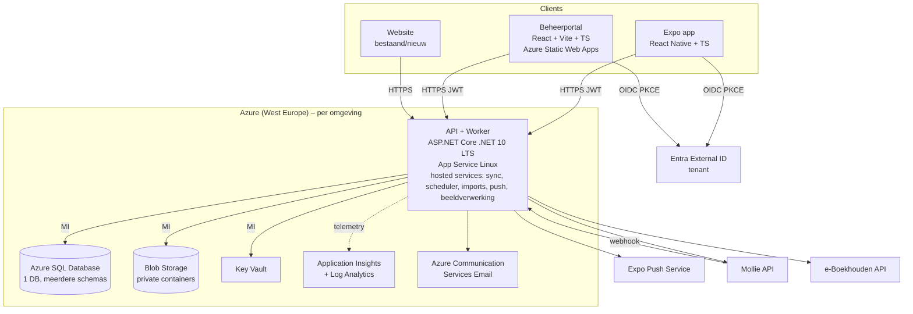

# 03 – Technische architectuur

> Status: v0.2 · 2026-09-24 · herzien: achtergrondverwerking (B-01), Controllers (OQ-63), monorepo-tooling (OQ-64)

## 1. Uitgangspunten

1. **Eenvoud boven schaal**: een *modulaire monoliet* (één API-deployable) met duidelijke modulegrenzen. Geen microservices, geen message bus, geen Kubernetes.
2. **API-first**: app, beheerportal en website gebruiken dezelfde REST API (`/api/v1`), gedocumenteerd met OpenAPI.
3. **PaaS in Azure**: App Service (API + achtergrondworkers), Azure SQL, Blob Storage, Key Vault en Static Web Apps. Geen VM's en (in het MVP) geen Functions (ADR-007/B-01).
4. **Security by default**: managed identities, geen secrets in code, least privilege, auditlog.
5. **Offline waar het ertoe doet**: alleen de scanner en "Mijn QR" zijn offline-capabel; de rest werkt met cache.

## 2. Systeemcontext



## 3. Containers (Azure)



MI = Managed Identity (geen connection-string-secrets).

## 4. Technologie-stack

| Laag | Keuze | Toelichting |
|---|---|---|
| Mobiel | **React Native + Expo** (SDK LTS), TypeScript, Expo Router, TanStack Query, Zustand, `expo-camera` (QR), `expo-notifications`, `expo-secure-store`, `expo-sqlite`, `react-native-svg`, `expo-auth-session` (OIDC/PKCE) | ADR-001 |
| Beheerportal | React + Vite + TypeScript, TanStack Router/Query/Table, MSAL.js, `dnd-kit` (optocht samenstellen) | Zelfde taal/tooling als de app, gedeelde tokens en API-client |
| Gedeeld | `packages/design-tokens` (Figma-tokens), `packages/api-client` (gegenereerd uit OpenAPI met `openapi-typescript`) | Eén bron voor types |
| API | **ASP.NET Core (.NET 10 LTS)**, **Controllers** (besluit OQ-63), service-klassen per use case (geen MediatR), FluentValidation, EF Core (SQL Server), Serilog → App Insights, `Microsoft.Identity.Web`, rate limiting middleware, ProblemDetails | ADR-002 |
| Achtergrond | Hosted services in de API-app (`Drammers.Worker`): scheduler met `sp_getapplock` (sync, gepland nieuws, receipts, retentie) en DB-queues (outbox: push/mail; media-jobs; imports) | ADR-007 (B-01) |
| Database | Azure SQL Database (1 DB, schemas per module) | ADR-003 |
| Bestanden | Blob Storage (private), SAS-downloads met korte levensduur | ADR-008 |
| Identiteit | Entra External ID (één tenant; zelfregistratie uit; accounts via Graph-provisioning) + eigen RBAC in de DB | ADR-004, ADR-014 |
| Push | Expo Push Service achter `IPushSender` | ADR-009 |
| E-mail | Azure Communication Services Email (transactioneel) | Goedkoop, Azure-native |
| Excel | ClosedXML (import/export), CsvHelper | MIT-licentie |
| IaC | Bicep + GitHub Actions (OIDC federatie) | §7 |
| Tests | xUnit, Testcontainers (SQL Server), Respawn, WireMock.Net (Mollie/e-Boekhouden), Jest + React Native Testing Library, Playwright (portal), Maestro (app E2E) | [12](12-testing-strategy.md) |

## 5. Modulaire monoliet – modules

| Module | Schema | Verantwoordelijkheid |
|---|---|---|
| Identity | `identity` | User, Role, Permission, Device, LoginHistory, autorisatie |
| Membership | `membership` | Member, Guardian, MembershipApplication, groepen, sync-mapping |
| Content | `content` | CarnivalYear, Event, News, Photo(Album), audiences |
| Notification | `notification` | Notification, NotificationRecipient, PushDevice, voorkeuren |
| Ticketing | `ticketing` | TicketType, Ticket, TicketScan, Wristband, AccessWindow |
| Payments | `payments` | Order, Payment, PaymentWebhook, Refund |
| Parade | `parade` | Parade, ParadeCategory, ParadeRegistration(+History), documenten, aanrijtijden |
| Import | `import` | ImportJob/ImportRow, SyncJob/SyncJobItem/SyncConflict |
| Audit | `audit` | AuditLog (append-only) |
| Reporting | views in `reporting` | Read-only views/queries voor dashboards en exports |

Regels:
- Een module benadert alleen de eigen tabellen voor schrijven; lezen over modulegrenzen gebeurt via een interface of een read-model-view.
- Gedeelde concepten (UserId, MemberId, CarnivalYearId) zijn strongly-typed IDs.
- Domeinlogica (statusmachines, nummering, validatie) zit in domeinklassen en services, en is unit-testbaar zonder database.

## 6. Projectstructuur (monorepo)

> Wordt pas in de bouwfase aangemaakt.

```
vrolijkedrammers/
├─ README.md · ARCHITECTURE.md · SECURITY.md
├─ docs/                         # deze documentatie + ADR's + design-exports
├─ src/                          # backend (.NET)
│  ├─ Drammers.Api/              # ASP.NET Core host, controllers, auth, middleware, OpenAPI; host van de workers
│  ├─ Drammers.Worker/           # BackgroundServices: scheduler, outbox-, media- en importverwerking
│  ├─ Drammers.Modules.Identity/
│  ├─ Drammers.Modules.Membership/
│  ├─ Drammers.Modules.Content/
│  ├─ Drammers.Modules.Notification/
│  ├─ Drammers.Modules.Ticketing/
│  ├─ Drammers.Modules.Payments/
│  ├─ Drammers.Modules.Parade/
│  ├─ Drammers.Modules.Import/
│  ├─ Drammers.Modules.Audit/
│  ├─ Drammers.Infrastructure/   # EF Core DbContext, migrations, Blob, KeyVault, Expo, Mollie, e-Boekhouden clients
│  └─ Drammers.SharedKernel/     # IDs, Result, errors, clock, guard clauses
├─ tests/
│  ├─ Drammers.UnitTests/
│  ├─ Drammers.IntegrationTests/ # Testcontainers SQL, WireMock
│  └─ Drammers.ApiTests/         # WebApplicationFactory, auth/permission-matrix tests
├─ apps/
│  ├─ mobile/                    # Expo app
│  └─ admin/                     # beheerportal (Vite)
├─ packages/
│  ├─ design-tokens/             # Figma-tokens → TS/JSON (licht/donker)
│  └─ api-client/                # gegenereerd uit OpenAPI
├─ infra/
│  ├─ main.bicep
│  ├─ modules/*.bicep
│  └─ env/{dev,acc,prod}.bicepparam
├─ Drammers.sln · package.json · pnpm-workspace.yaml   # OQ-64
└─ .github/workflows/            # ci.yml, deploy-api.yml, deploy-admin.yml, mobile-eas.yml (of Azure Pipelines, B-03)
```

## 7. Cross-cutting concerns

| Concern | Aanpak |
|---|---|
| Authenticatie | JWT van Entra External ID, gevalideerd met `Microsoft.Identity.Web`; audience per API |
| Autorisatie | Permission-based policies (`[RequirePermission("parade.manage")]`) + resource-based checks (eigen inschrijving, eigen kind). Zie [07-rbac.md](07-rbac.md) |
| Validatie | FluentValidation op request-DTO's + domeininvarianten in entiteiten |
| Fouten | RFC 9457 ProblemDetails met `code` (bijv. `PARADE_START_NUMBER_TAKEN`) en `traceId` |
| Logging | Serilog structured → App Insights; PII-redactie-enricher; geen tokens/wachtwoorden |
| Tijd | Alles in UTC opgeslagen (`datetime2`); presentatie in `Europe/Amsterdam`; `IClock` voor testbaarheid |
| Concurrency | Optimistic concurrency via `rowversion` op muteerbare aggregaten; pessimistische lock alleen voor opgavenummer |
| Idempotency | `Idempotency-Key`-header op POST's voor orders, submit, scans (`client_scan_id`) |
| Caching | Permissions per user in memory (5 min); publieke content met ETag/`Cache-Control` |
| Configuratie | App Settings + Key Vault references; feature flags in DB (`config.FeatureFlag`) |
| Achtergrondwerk | Hosted services; outbox-tabel (in dezelfde transactie geschreven) voor betrouwbare push/mail na commit; singleton-jobs via `sp_getapplock` |
| Bestanden | Upload via API (stream naar quarantine-container) → scan → promote; download via kortlevende SAS |

## 8. Offline-strategie (samenvatting)

| Onderdeel | Offline gedrag |
|---|---|
| Publieke content | TanStack Query persistente cache; bruikbaar zonder netwerk (laatst bekende stand) |
| Mijn QR | Device-key in Secure Enclave/Keystore; QR wordt lokaal gegenereerd en gesigneerd → werkt volledig offline |
| Scanner | Lokale validatie met gecachte publieke sleutels, ticket-/revocatielijst en scan-historie; queue in SQLite; sync bij verbinding. Zie [ADR-006](adr/ADR-006-offline-scanning.md) |
| Optochtwizard | Concept lokaal bewaard; indienen vereist verbinding |

## 9. Observability

- Application Insights (workspace-based) voor API/worker en portal (JS SDK, zonder PII).
- Custom events en metrics: `LoginFailed`, `SyncCompleted/Failed`, `MollieWebhookFailed`, `QrValidationFailed`, `ScanReconciliationConflict`, `ParadeImportFailed`, `PushSendFailed`.
- Alerts (Action Group → e-mail/SMS bestuur-IT): 5xx-rate > 2 % gedurende 5 min; sync mislukt; webhook-fouten > 3 per 15 min; health check down; SQL DTU/CPU > 90 %; tijdens carnaval ook "geen scans ontvangen in 30 min tijdens AccessWindow".
- Health endpoints: `/health/live`, `/health/ready` (SQL, Blob, Key Vault, laatste sync, outbox-achterstand).

## 10. Website-integratie

```
Website → API (/api/v1, public + authenticated endpoints) → Business logic → Database
```

- Publieke endpoints (events, news, photos, parade info) met CORS-allowlist voor het websitedomein.
- Formulieren (lid worden, optochtinschrijving) via dezelfde endpoints; bot-bescherming met Cloudflare Turnstile of hCaptcha (OQ-45) + rate limiting.
- Optioneel: embeddable widgets (agenda) of een eenvoudige SPA-pagina.

## 11. Belangrijkste ontwerpkeuzes (verwijzing naar ADR's)

| # | Onderwerp | Keuze |
|---|---|---|
| ADR-001 | Mobiel framework | React Native + Expo |
| ADR-002 | Backend | ASP.NET Core modulaire monoliet |
| ADR-003 | Database | Eén Azure SQL DB, schemas per module |
| ADR-004 | Authenticatie | Entra External ID (één tenant) + eigen RBAC |
| ADR-005 | QR-security | Dynamische, device-gebonden, gesigneerde QR |
| ADR-006 | Offline scannen | Lokale validatie + queue + server-reconciliatie |
| ADR-007 | Hosting | App Service (API + workers) + Static Web Apps |
| ADR-008 | Bestanden | Private Blob + quarantaine + malwarescan |
| ADR-009 | Push | Expo Push achter abstractie |
| ADR-010 | e-Boekhouden | Pull-sync `/v1/member`, idempotent op lidnummer |
| ADR-011 | Opgavenummer | Sequence-tabel met lock in submit-transactie |
| ADR-012 | Startnummer | Filtered unique index, expliciete generatie |
| ADR-013 | Design system | Figma-tokens als gedeeld pakket |
| ADR-014 | Accounts | Alleen leden (+ ouders); geen zelfregistratie; provisioning e-Boekhouden → lokaal → Entra na goedkeuring |
