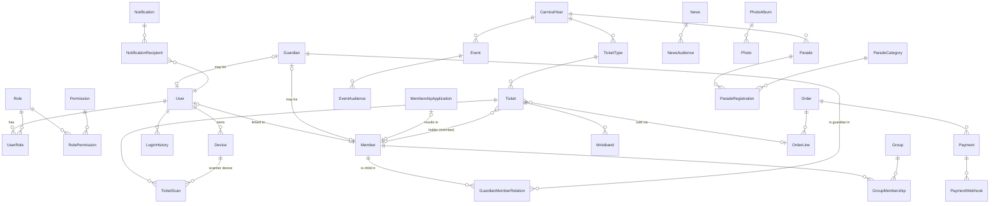

# 04 – Datamodel

> Status: v0.3 · 2026-09-24 · accountmodel ADR-014 (AccountRequest, AccountProvisioning, aanvraagstatussen), scanresultaat-mapping, één DbContext
> Database: één Azure SQL Database met schemas per module (ADR-003).
> Optochtentiteiten staan gedetailleerd in [14-parade-data-model.md](14-parade-data-model.md).

## 1. Conventies

| Onderwerp | Conventie |
|---|---|
| Primaire sleutel | `id` `uniqueidentifier` (UUIDv7 in de applicatie gegenereerd, sequentieel voor indexen). Uitzondering: lookup-tabellen met `int` |
| Tijd | `datetime2(3)` in **UTC**, suffix `_at` (tijdstip) of `_date` (datum, `date`) |
| Audit-kolommen | `created_at`, `created_by`, `updated_at`, `updated_by` op alle muteerbare tabellen |
| Concurrency | `row_version rowversion` op aggregaten die gelijktijdig kunnen worden gewijzigd |
| Soft delete | Alleen waar nodig (`deleted_at`); bij voorkeur statussen (Inactive/Archived) |
| Enums | Opgeslagen als `varchar(40)` (leesbaar, stabiel), gevalideerd in code + `CHECK`-constraint |
| Naamgeving | Tabellen PascalCase enkelvoud (`Member`), kolommen snake_case (`registration_number`) |
| Geld | `decimal(10,2)` + `currency char(3)` (altijd EUR) |
| Persoonsgegevens | Gemarkeerd in de modeldocumentatie met 🔒; de kolommen komen in de Data Discovery & Classification van Azure SQL |

**Bevestigd in fase 2 (2026-09-25)**, met deze aanvullingen:
- **UUIDv7 en SQL Server:** SQL Server sorteert `uniqueidentifier` eerst op de laatste zes bytes, dus UUIDv7 is daar níét index-sequentieel. Bij de volumes van deze app (duizenden rijen per tabel) is de fragmentatie verwaarloosbaar. Wordt dat een probleem, dan komt er een SQL-geordende variant in `IdGenerator`. Tabellen met veel inserts en geen externe ID (`AuditLog`) gebruiken `bigint identity`.
- **Namen:** tabellen expliciet per configuratie (`ToTable(naam, schema)`); een entiteit zonder schema faalt bij het opstarten. Kolomnamen worden automatisch snake_case (`ModelConventions`). CHECK-constraints heten `CK_<Tabel>_<kolom>`.
- **Tijd:** alle `DateTime`-kolommen zijn `datetime2(3)` en worden bij het lezen als UTC gemarkeerd. Datums zonder tijd zijn `DateOnly` → `date`.
- **Auditkolommen:** entiteiten met `IAuditable` krijgen `created_*`/`updated_*` automatisch via een interceptor; `created_*` is na aanmaken niet meer te wijzigen.
- **Jobstatus:** extra tabel `config.ScheduledJob` (`name`, `last_started_at`, `last_completed_at`, `last_succeeded_at`, `last_error`, `last_instance`) voor de coördinatie van tijdgestuurde jobs over instanties heen (ADR-007) en de health check.
- **Outbox:** extra kolom `locked_until` in `notification.Outbox` (claim met verloop; na een crash komt een bericht vanzelf terug).
- **Rechten:** rollen `app_runtime` (DML op alle module-schema's; op `audit` alleen `SELECT`/`INSERT`, `UPDATE`/`DELETE`/`ALTER` expliciet geweigerd), `app_migrator` en `app_reporting` (alleen `reporting`). Aangemaakt in de migratie `DatabaseRoles`; bewezen met integratietests.

## 2. Overzicht per schema

## 3. Schema `identity`

### User
| Kolom | Type | Opm. |
|---|---|---|
| id | uuid PK | |
| external_object_id | nvarchar(64) UQ | `oid` uit Entra External ID |
| email 🔒 | nvarchar(254) | Login-e-mail (kopie uit Entra, geverifieerd) |
| display_name 🔒 | nvarchar(200) | |
| member_id | uuid NULL UQ (filtered) | Gekoppeld lid (0..1); kolom in fase 3, FK naar `membership.Member` toegevoegd in fase 8 (implementatieplan 15) |
| account_status | varchar(20) | `Active`, `Disabled` (lidmaatschap beëindigd; Entra-account uitgeschakeld), `Blocked` (door bestuur), `Deleted`. Een User bestaat alleen voor een lid (`member_id`) of een ouder/verzorger (`Guardian.user_id`) (B-05, ADR-014); aangemaakt door de provisioning, nooit door zelfregistratie |
| last_login_at | datetime2 | |
| permissions_version | int | Opgehoogd bij rolwijziging → cache-invalidatie |
| created_at / updated_at | | |

### Role
`id int PK`, `code varchar(50) UQ` (bijv. `bestuur`), `name nvarchar(100)`, `description`, `is_system bit` (niet verwijderbaar), `is_assignable_by_sync bit` (door koppelingen toe te kennen), `sort_order`.

### Permission
`id int PK`, `code varchar(80) UQ` (bijv. `parade.assign-start-number`), `description`, `category` (UI-groepering). Permissions worden via migraties/seed beheerd (ze hangen samen met code); rollen zijn configureerbaar.

### UserRole
`user_id`, `role_id`, `valid_from date NULL`, `valid_to date NULL`, `assigned_by`, `assigned_at`. PK (`user_id`,`role_id`). De geldigheid maakt tijdelijke rollen mogelijk (bijv. scanner tijdens carnaval).

### RolePermission
`role_id`, `permission_id`. PK samengesteld.

### Device
| Kolom | Type | Opm. |
|---|---|---|
| id | uuid PK | Server-gegenereerd `device_id` |
| user_id | uuid FK | |
| device_name | nvarchar(100) | Door gebruiker te wijzigen ("iPhone van Jan") |
| platform | varchar(10) | `ios` / `android` |
| os_version, app_version, model | varchar | Informatief (manipuleerbaar) |
| public_key | varbinary(128) | ECDSA P-256-publieke sleutel van het device (sleutelpaar in Secure Enclave/Keystore, niet exporteerbaar) |
| attestation_status | varchar(20) | `None`, `Verified`, `Failed` (App Attest / Play Integrity, S) |
| trusted_scanner | bit | Door bestuur goedgekeurd als scanner |
| device_status | varchar(20) | `Active`, `Revoked`, `Lost` |
| first_seen_at, last_seen_at | datetime2 | |
| revoked_at, revoked_by, revoke_reason | | |

Device-identiteit = een server-uitgegeven ID + een bewijs van bezit van de private key (challenge-signature bij registratie en bij gevoelige calls). Zie [06-security.md](06-security.md).

### LoginHistory
`id bigint identity`, `user_id NULL`, `email_hash` (bij mislukte login zonder user), `occurred_at`, `result` (`Success`, `Failed`, `Locked`), `ip_hash`, `device_id NULL`, `user_agent`. Bewaartermijn 12 maanden.

## 4. Schema `membership`

### Member
| Kolom | Type | Bron | Opm. |
|---|---|---|---|
| id | uuid PK | lokaal | |
| member_number | nvarchar(15) UQ | **EB** `memberNumber` | Externe unieke sleutel |
| eb_member_id | int UQ NULL | **EB** `id` | Intern ID in e-Boekhouden |
| full_name 🔒 | nvarchar(100) | **EB** `name` | e-Boekhouden kent één naamveld |
| first_name 🔒 / name_prefix 🔒 / last_name 🔒 | nvarchar | afgeleid / lokaal | Parser (best effort) + handmatige correctie (OQ-01) |
| salutation | nvarchar(50) | EB | |
| gender | char(1) | EB | `m`/`v` |
| address_line 🔒 | nvarchar(150) | EB `address` | Straat + huisnummer in één veld |
| postal_code 🔒, city 🔒, country | | EB | |
| email 🔒 | nvarchar(150) | EB `emailAddress` | |
| phone 🔒, mobile_phone 🔒 | nvarchar(50) | EB | |
| birth_date 🔒 | date NULL | EB `freeTextN` (mapping) of lokaal | Zie OQ-01 |
| join_year | smallint NULL | EB `freeTextN` of lokaal | Inschrijfjaar (jubilarissen) |
| eb_status_raw | nvarchar(100) NULL | EB `freeTextN` | Ruwe waarde |
| member_category | nvarchar(50) NULL | EB `freeTextN` | Bijv. jeugdlid, gezinslid |
| membership_status | varchar(20) | afgeleid | `Active`, `Inactive`, `Suspended`, `Deceased` |
| membership_valid_from / valid_to | date NULL | lokaal | Tijdelijk lid |
| local_status_override | varchar(20) NULL | lokaal | Bijv. `Suspended`, `Deceased` (wint van afleiding) |
| eb_hash | binary(32) | sync | SHA-256 over EB-velden → wijzigingsdetectie |
| eb_last_seen_at | datetime2 | sync | Laatst gezien in e-Boekhouden |
| eb_missing_since | datetime2 NULL | sync | Verdwenen uit EB |
| sync_state | varchar(20) | sync | `InSync`, `Missing`, `Conflict` |
| photo_blob_path | nvarchar NULL | lokaal | Optionele pasfoto (toegangscontrole), expliciete toestemming |
| created_at / updated_at | | | |

IBAN, BIC, mandaat, notities en factuur-e-mailadressen worden **niet** overgenomen (dataminimalisatie).

### Veldeigenaarschap e-Boekhouden ↔ lokaal

| Categorie | Velden | Eigenaar | Sync-gedrag |
|---|---|---|---|
| Identificatie | member_number, eb_member_id | e-Boekhouden | Nooit lokaal wijzigbaar |
| NAW/contact | full_name, salutation, gender, address, postcode, city, country, email, phone, mobile | e-Boekhouden | Overschreven bij wijziging in EB; lokaal read-only |
| Vrije velden (gemapt) | birth_date, join_year, eb_status_raw, member_category | e-Boekhouden (indien gemapt) | Idem; bij parsefout → SyncJobItem-waarschuwing, oude waarde blijft |
| Afgeleide naamdelen | first_name, name_prefix, last_name | lokaal (afgeleid) | Opnieuw afgeleid alleen als full_name wijzigt én er geen handmatige correctie is |
| App-gegevens | User, rollen, devices, push tokens, tickets, scans, guardians, groepen, voorkeuren, foto, audit, local_status_override, validiteit | **lokaal** | **Nooit** aangeraakt door de sync |

### Guardian
| Kolom | Opm. |
|---|---|
| id uuid PK | |
| user_id uuid NULL | Ouderaccount (rol Ouder/verzorger), aangemaakt door de provisioning na verificatie van de relatie (ADR-014) |
| member_id uuid NULL | Als de ouder zelf lid is |
| full_name 🔒, email 🔒, phone 🔒 | Voor ouders die (nog) geen account/lid zijn |
| created_at… | |

### GuardianMemberRelation
`guardian_id`, `member_id` (kind), `relation_type` (`Parent`, `Guardian`, `Other`), `is_primary_contact bit`, `receives_notifications bit`, `valid_from`, `valid_to`, `verified_by`, `verified_at`. PK (`guardian_id`,`member_id`). N:M: een kind kan meerdere ouders hebben en een ouder meerdere kinderen.

### Group / GroupMembership
Voor doelgroepen die geen rol zijn: `Dansgarde meisjes`, `Dansgarde leiding`, `Jeugdcommissie`, optochtgroepen, enz.
- `Group`: `id`, `code`, `name`, `type` (`DanceGuard`, `Committee`, `ParadeGroup`, `Other`), `carnival_year_id NULL`, `active`.
- `GroupMembership`: `group_id`, `member_id` (of `user_id` voor niet-leden zoals een ouder), `function` (`Member`, `Lead`), `valid_from/to`.

> **Rol vs groep**: een *rol* geeft rechten (permissions); een *groep* is een doelgroep voor content en meldingen. Voorbeeld: "Dansgarde leiding" is een groep + de rol `dansgarde-leiding` (recht om de eigen groep te berichten).

### MembershipApplication
| Kolom | Opm. |
|---|---|
| id | |
| status | `Draft`, `EmailVerified`, `Submitted`, `InReview`, `Approved`, `Rejected`, `Provisioning`, `ProvisioningFailed`, `Activated`, `Withdrawn` (ADR-014) |
| source | `App`, `Website`, `Portal` |
| email_verified_at | Aanvrager heeft het e-mailadres bevestigd (vereist vóór `Submitted`) |
| first_name 🔒, name_prefix, last_name 🔒, birth_date 🔒, address fields 🔒, email 🔒, phone 🔒 | Aanvraaggegevens |
| guardian_name/email/phone 🔒 | Verplicht < 16 jaar |
| consent_privacy_at, consent_photo bit | Toestemmingen |
| submitted_at | |
| handled_by, handled_at | Behandelaar |
| decision_at | Datum goedkeuring/afwijzing |
| rejection_reason | |
| internal_notes | |
| resulting_member_id NULL | Na provisioning |
| provisioning_id NULL | FK naar `identity.AccountProvisioning` |

### identity.AccountRequest (bestaand lid vraagt account aan, ADR-014)
`id`, `member_number` (ingevoerd), `email` 🔒 (ingevoerd), `matched_member_id NULL`, `status` (`AutoApproved`, `PendingReview`, `Approved`, `Rejected`, `Expired`), `handled_by`, `handled_at`, `ip_hash`, `created_at`. Bewaartermijn 3 maanden na afhandeling.

### identity.AccountProvisioning (idempotente saga, ADR-014)
`id`, `source_type` (`MembershipApplication`, `AccountRequest`, `Guardian`, `Manual`), `source_id`, `kind` (`Member`, `Guardian`), `step` (`Pending`, `EbCreated`, `MemberCreated`, `AccountCreated`, `WelcomeSent`, `Completed`, `Failed`), `eb_member_id NULL`, `member_number NULL`, `member_id NULL`, `entra_object_id NULL`, `user_id NULL`, `attempts`, `last_error`, `created_at`, `completed_at`, `row_version`.

### MembershipApproval
Historie van beoordelingsstappen: `id`, `application_id`, `from_status`, `to_status`, `actor_user_id`, `comment`, `occurred_at`. (Iedere transitie = 1 record; audit-vriendelijk.)

## 5. Schema `content`

### CarnivalYear
| Kolom | Opm. |
|---|---|
| id int PK | |
| name | `2026/2027` |
| start_date / end_date | Seizoen (bijv. 2026-11-11 t/m 2027-02-10) |
| carnival_start_date / carnival_end_date | De carnavalsdagen zelf (2027-02-06 t/m 2027-02-09) |
| active bit | Precies één actief (filtered unique index `WHERE active = 1`) |

### Event
`id`, `carnival_year_id`, `title`, `summary`, `description` (sanitized HTML/Markdown), `start_at`, `end_at`, `all_day bit`, `location_name`, `location_address`, `latitude/longitude NULL`, `category_id` (FK `EventCategory`: Carnaval, Jeugd, Vereniging, Kader…), `image_blob_path`, `visibility` (`Public`, `Members`, `Restricted`), `publication_status` (`Draft`, `Scheduled`, `Published`, `Archived`), `publish_at`, `is_highlight bit`, `badge_text NULL`, `ticket_type_id NULL` (koppeling naar verkoop), `row_version`.

### EventAudience (bij `visibility = Restricted`)
`event_id`, `audience_type` (`Role`, `Group`, `Member`), `audience_ref_id`. Meerdere regels = OR.

### EventAttachment
`id`, `event_id`, `file_name`, `blob_path`, `content_type`, `size_bytes`, `visibility_inherit bit`.

### News / NewsAudience
News: `id`, `title`, `summary`, `body`, `image_blob_path`, `author_user_id`, `category`, `publish_at`, `expire_at`, `visibility`, `status` (`Draft`, `Scheduled`, `Published`, `Archived`), `send_push bit`, `push_notification_id NULL`, `row_version`. NewsAudience gelijk aan EventAudience.

### PhotoAlbum / Photo
- PhotoAlbum: `id`, `carnival_year_id NULL`, `event_id NULL`, `title`, `album_date`, `description`, `visibility`, `cover_photo_id`, `status`.
- PhotoAlbumAudience: gelijk aan EventAudience.
- Photo: `id`, `album_id`, `original_blob_path`, `thumbnail_blob_path`, `display_blob_path` (≈ 1600 px), `sort_order`, `width`, `height`, `taken_at`, `caption`, `photographer`, `hidden bit` (portretrecht-verzoek), `uploaded_by`, `uploaded_at`. EXIF/GPS wordt bij verwerking gestript.

### Newsletter (voorbereid, R5)
`id`, `title`, `body`, `channels` (`InApp`, `Email`), `audience…`, `status`, `sent_at`.

## 6. Schema `notification`

### Notification
| Kolom | Opm. |
|---|---|
| id | |
| title, body | Max 65 / 240 tekens (push-limieten) |
| category | `Urgent`, `Program`, `News`, `Parade`, `DanceGuard`, `Kader`, `Tickets`, `Reminder`, `System` |
| deep_link | Bijv. `drammers://events/{id}` |
| audience_definition | JSON (bijv. `{roles:[…], groups:[…], members:[…], guardiansOf:[…], all:false, membersOnly:true}`) |
| sender_user_id | NULL bij systeemmeldingen |
| source_type / source_id | Bijv. `News`/id, `ParadeRegistration`/id |
| scheduled_at, sent_at | |
| status | `Draft`, `Scheduled`, `Sending`, `Sent`, `PartiallyFailed`, `Failed`, `Canceled` |
| recipient_count, delivered_count, failed_count, read_count | Gedenormaliseerd voor dashboards |

### NotificationRecipient
`id bigint`, `notification_id`, `user_id` (NULL voor anonieme push-devices van gasten), `on_behalf_of_member_id NULL` (ouder ontvangt voor kind), `delivery_status` (`Pending`, `Sent`, `Delivered`, `Failed`, `NoDevice`, `OptedOut`), `provider_ticket_id`, `error_code`, `sent_at`, `delivered_at`, `read_at`.

### PushDevice
`id`, `device_id NULL` (FK identity.Device voor ingelogde users), `anonymous_install_id NULL` (gasten), `user_id NULL`, `provider` (`Expo`), `push_token` (versleuteld opgeslagen, zie 06), `platform`, `enabled bit`, `last_registered_at`, `invalidated_at`.

### NotificationPreference
`user_id`, `category`, `enabled bit`. (Urgent is niet uit te zetten, afgedwongen in code.)

### Outbox
`id`, `type`, `payload json`, `created_at`, `processed_at`, `locked_until`, `attempts`, `last_error`. Push en e-mail worden via de outbox na de commit verstuurd. De worker claimt berichten met `READPAST` en een lock die na 5 minuten verloopt; mislukte berichten krijgen exponentieel uitstel (maximaal 5 pogingen).

## 7. Schema `ticketing`

### TicketType
| Kolom | Opm. |
|---|---|
| id | |
| carnival_year_id | |
| event_id NULL | NULL = geldig voor meerdere events/dagen via TicketValidity |
| code, name | `MEMBER_ACCESS`, `DAY_PASS_SAT`, `PRONKZITTING_2027` |
| kind | `MemberAccess`, `DayPass`, `EventTicket`, `Reservation` |
| price NULL, currency | NULL/0 = gratis/reservering |
| capacity NULL, max_per_order | |
| sale_start_at, sale_end_at | |
| requires_payment bit, requires_membership bit | |
| active bit | |

### TicketValidity
`id`, `ticket_type_id`, `valid_from_at`, `valid_to_at`, `access_window_id NULL`. Een type kan meerdere geldigheidsvensters hebben (bijv. alle carnavalsdagen).

### AccessWindow
`id`, `carnival_year_id`, `name` ("Zaterdag 6 feb"), `starts_at`, `ends_at`, `location NULL`. Bepaalt wat een "eerste toegang" is (per venster).

### Ticket
| Kolom | Opm. |
|---|---|
| id | |
| ticket_type_id | |
| public_ref | 16 bytes random (base64url) — de referentie die (gesigneerd) in de QR staat, nooit het lidnummer |
| holder_member_id NULL | Voor ledentoegang |
| holder_user_id NULL | Koper/houder met account |
| holder_name 🔒, holder_email 🔒 NULL | Voor dagkaarten van gasten |
| order_line_id NULL | |
| bound_device_id NULL | Device dat de QR mag genereren (ADR-005) |
| credential_version int | Ophogen = alle oude QR's ongeldig |
| status | `Active`, `Blocked`, `Revoked`, `Refunded`, `Expired` |
| blocked_reason, blocked_by, blocked_at | |
| issued_at | |
| print_code_hash NULL | Voor geprinte kaart (statische code, gehasht opgeslagen) |

### TicketScan (append-only)
| Kolom | Opm. |
|---|---|
| id bigint identity | |
| client_scan_id uuid UQ | Door scanner gegenereerd → idempotent bij resync |
| ticket_id NULL | NULL bij onbekende code |
| member_id NULL | Gedenormaliseerd voor rapportage |
| carnival_year_id, access_window_id NULL, event_id NULL | |
| scanner_user_id, scanner_device_id | |
| scanned_at_device | Device-tijd (UTC) |
| received_at_server | Servertijd bij ontvangst |
| clock_skew_ms | Verschil device ↔ server bij sync (ingeschat) |
| mode | `Online`, `Offline` |
| local_result | Wat de scanner toonde (weergave-enum): `Valid`, `ValidRepeatSameDevice`, `WarnRepeatOtherDevice`, `Invalid` |
| final_result | Na reconciliatie: `FirstEntry`, `RepeatSameDevice`, `RepeatOtherDevice`, `Invalid` |
| invalid_reason NULL | `Expired`, `Blocked`, `NoMembership`, `Unknown`, `CodeExpired`, `WrongEvent`, `BadSignature`, `DeviceRevoked` |
| previous_scan_id NULL | Vorige scan van hetzelfde ticket |
| conflict_detected_after_sync bit | Offline dubbele toegang |
| operator_decision NULL | `Admitted`, `Refused` (bij oranje) |
| qr_iat, qr_credential_version | Uit de QR (forensisch) |

Mapping weergave → opslag: `Valid` ↔ `FirstEntry`; `ValidRepeatSameDevice` ↔ `RepeatSameDevice`; `WarnRepeatOtherDevice` ↔ `RepeatOtherDevice`; `Invalid` ↔ `Invalid`. Afwijking tussen `local_result` en `final_result` na reconciliatie = conflict (ADR-006).

Er is geen `UPDATE` op historische velden; alleen `final_result`, `previous_scan_id` en `conflict_detected_after_sync` mogen door het reconciliatieproces worden gezet (DB-rechten via een aparte stored procedure). Zie ADR-006.

### Wristband
`id`, `ticket_id`, `scan_id`, `wristband_type` (kleur/code), `issued_at`, `issued_by_user_id`, `valid_from`, `valid_to`, `revoked_at NULL`.

### WristbandPolicy
`id`, `carnival_year_id`, `access_window_id NULL`, `ticket_type_id NULL`, `wristband_type`, `required_after_first_scan bit`, `rescan_required bit`, `valid_scope` (`AccessWindow`, `CarnivalYear`).

### RevocationList (afgeleid)
Geen tabel; gegenereerd uit `Ticket.status`/`credential_version` en `Device.device_status` voor de offline cache van scanners.

## 8. Schema `payments`

- **Order**: `id`, `order_number` (leesbaar, bijv. `DVD-2027-000123`), `buyer_user_id NULL`, `buyer_name/email 🔒`, `status` (`Pending`, `Paid`, `Failed`, `Canceled`, `Expired`, `Refunded`, `PartiallyRefunded`), `total_amount`, `currency`, `hold_expires_at`, `idempotency_key UQ`, `created_at`.
- **OrderLine**: `id`, `order_id`, `ticket_type_id`, `quantity`, `unit_price`.
- **Payment**: `id`, `order_id`, `provider` (`Mollie`), `provider_payment_id` UQ (`tr_…`), `status` (Mollie-status gespiegeld: `open`, `pending`, `authorized`, `paid`, `canceled`, `expired`, `failed`), `amount`, `method`, `checkout_url`, `paid_at`, `last_synced_at`.
- **PaymentWebhook**: `id bigint`, `provider_object_id`, `received_at`, `remote_ip_hash`, `processed_at`, `result` (`Processed`, `Ignored`, `Failed`, `UnknownId`), `error`. Elke webhook wordt vastgelegd; de verwerking is idempotent op `provider_payment_id + status`.
- **Refund**: `id`, `payment_id`, `provider_refund_id`, `amount`, `status`, `reason`, `requested_by`, `created_at`.

## 9. Schema `parade`

Zie [14-parade-data-model.md](14-parade-data-model.md): `Parade`, `ParadeCategory`, `ParadeRegistration`, `ParadeRegistrationHistory`, `ParadeStatusHistory`, `ParadeDocument`, `ParadeArrivalTime`, `ParadeNumberSequence`, `ParadeStatusEditPolicy`, `ParadeRegistrationManager`.

## 10. Schema `import`

- **SyncJob**: `id`, `source` (`EBoekhouden`), `trigger` (`Schedule`, `Manual`), `started_by NULL`, `started_at`, `ended_at`, `status` (`Running`, `Succeeded`, `SucceededWithWarnings`, `Failed`, `Aborted`), `read_count`, `new_count`, `updated_count`, `unchanged_count`, `missing_count`, `error_count`, `conflict_count`, `dry_run bit`.
- **SyncJobItem**: `id`, `sync_job_id`, `member_number`, `action` (`Created`, `Updated`, `Unchanged`, `MarkedMissing`, `Reactivated`, `Error`, `Conflict`), `changed_fields json` (veldnamen + oud/nieuw, **zonder** gevoelige waarden bij export), `message`.
- **SyncConflict**: `id`, `sync_job_id`, `member_id NULL`, `type` (`DuplicateEmail`, `MemberNumberChanged`, `EmailChangedForActiveAccount`, `ParseError`, `MassDeletionGuard`), `details json`, `status` (`Open`, `Resolved`, `Ignored`), `resolved_by`, `resolved_at`, `resolution`.
- **ImportJob**: generiek voor Excel-imports (aanrijtijden, eventueel leden-CSV-fallback): `id`, `type`, `file_blob_path`, `uploaded_by`, `status` (`Uploaded`, `Validated`, `ValidationFailed`, `Confirmed`, `Completed`, `Failed`, `Canceled`), `row_count`, `error_count`, `warning_count`, `confirmed_by`, `confirmed_at`.
- **ImportRow**: `id`, `import_job_id`, `row_number`, `raw json`, `parsed json`, `status` (`Valid`, `Warning`, `Error`), `messages json`, `target_id NULL`.

## 11. Schema `audit`

### AuditLog (append-only)
| Kolom | Opm. |
|---|---|
| id bigint identity | |
| occurred_at | UTC |
| actor_user_id NULL | NULL = systeem |
| actor_type | `User`, `System`, `Sync`, `Webhook` |
| action | Bijv. `member.approved`, `role.assigned`, `parade.start-number.changed` |
| entity_type, entity_id | |
| old_values json, new_values json | Alleen gewijzigde velden; gevoelige velden gemaskeerd |
| ip_hash, device_id, correlation_id | |
| hash_prev, hash | Hash-keten (tamper-evidence, S) |

DB-rechten: de API-identiteit heeft alleen `INSERT` en `SELECT` op `audit.AuditLog` (geen `UPDATE`/`DELETE`). Opschoning volgens de bewaartermijn gebeurt door een aparte job-identiteit.

## 12. Schema `config`

- **FeatureFlag**: `key`, `enabled`, `audience json NULL`, `description`.
- **AppConfiguration**: `key`, `value`: `min_app_version_ios`, `min_app_version_android`, `recommended_app_version`, `maintenance_mode`, `maintenance_message`, `support_email`.
- **RetentionPolicy**: `data_type`, `retention_days`, `action` (`Delete`, `Anonymize`, `Aggregate`).
- **JubileeRule**: zie §14.

## 13. CarnivalYear-koppelingen

| Entiteit | Koppeling |
|---|---|
| Event | `carnival_year_id` verplicht |
| Parade | 1 per CarnivalYear (A-07), `carnival_year_id` |
| TicketType / AccessWindow / WristbandPolicy | `carnival_year_id` |
| TicketScan | `carnival_year_id` (gedenormaliseerd) |
| PhotoAlbum | optioneel |
| Group | optioneel (seizoensgebonden groepen) |
| Statistieken | Views gegroepeerd per `carnival_year_id` |
| Jubilarissen | Berekend per CarnivalYear (peildatum = `start_date` of 11-11, configureerbaar) |

## 14. Jubilarissen (configureerbaar)

`JubileeRule`: `id`, `milestones` (`11,22,33,44,55,66,77`), `basis` (`JoinYear`), `reference` (`CarnivalYearStart` | `CarnivalYearEnd` | `FixedDate`), `count_join_year_as_year_one bit`, `exclude_statuses` (`Inactive,Deceased`), `active`.

Berekening (standaard): `years = startjaar(CarnivalYear) − join_year (+1 indien count_join_year_as_year_one)`. Rapport: Carnavalsjaar, Lidnummer, Naam, Inschrijfjaar, Aantal jaren lid, Jubileumcategorie. De definitieve regel is OQ-30.

## 15. Indexen (selectie)

| Tabel | Index |
|---|---|
| Member | UQ `member_number`; `email`; `membership_status` |
| User | UQ `external_object_id`; UQ filtered `member_id WHERE member_id IS NOT NULL` |
| Ticket | UQ `public_ref`; (`holder_member_id`, `ticket_type_id`) |
| TicketScan | UQ `client_scan_id`; (`ticket_id`, `scanned_at_device`); (`carnival_year_id`, `scanned_at_device`) incl. `final_result` |
| NotificationRecipient | (`user_id`, `read_at`); (`notification_id`, `delivery_status`) |
| Payment | UQ `provider_payment_id` |
| ParadeRegistration | UQ (`parade_id`, `registration_number`) filtered NOT NULL; UQ (`parade_id`, `start_number`) filtered NOT NULL |
| AuditLog | (`entity_type`, `entity_id`, `occurred_at`); (`actor_user_id`, `occurred_at`) |

## 16. Migraties

- EF Core migrations op **één DbContext** met schema-configuratie per module (besluit OQ-62).
- Migraties draaien in de pipeline als idempotent SQL-script (`dotnet ef migrations script --idempotent`) met een aparte migratie-identiteit (DDL-rechten); de runtime-identiteit heeft geen DDL-rechten.
- Seed: permissions, standaardrollen (incl. systeemrollen Lid en Ouder/verzorger, B-05), ParadeCategory-startset, EventCategory, CarnivalYear 2026/2027.
