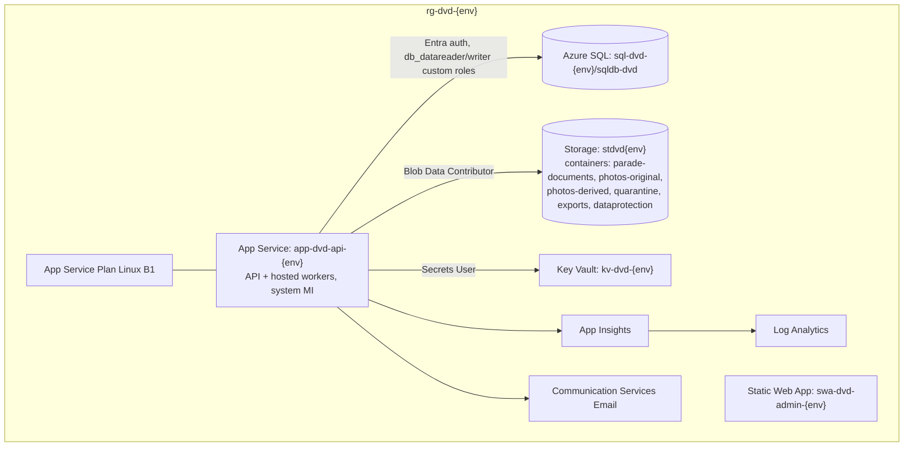
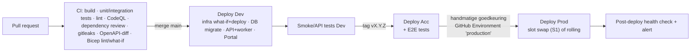

# 08 – Azure-infrastructuur

> Status: v0.3 · 2026-09-24 (besluiten B-01…B-04 verwerkt) · Regio: **West Europe** (Nederland), alle resources
> Prijzen zijn **indicatief** (pay-as-you-go, EUR, excl. btw, prijspeil 2025/2026) en moeten vóór oplevering met de Azure Pricing Calculator worden gecontroleerd.

## 1. Componenten en keuzes

| Component | Keuze | Alternatief (onderzocht) | Waarom |
|---|---|---|---|
| API hosting | **Azure App Service** (Linux, .NET) | Azure Container Apps | App Service is eenvoudiger (geen containers/registry nodig), vaste lage prijs, deployment slots (vanaf S1), managed certificaten. Container Apps is "scale to zero", maar vraagt container-kennis en heeft cold starts; pas relevant bij meerdere services |
| Achtergrondtaken | **Hosted services in de API-app** (`Drammers.Worker`) | Functions Flex Consumption, Functions Windows Consumption, WebJobs | Linux Consumption ondersteunt geen .NET 10; één deployable, vaste outbound-IP's, € 0 extra (ADR-007, B-01) |
| Beheerportal | **Azure Static Web Apps** | App Service | Gratis/goedkoop, CDN, custom domain + certificaat |
| Database | **Azure SQL Database** (single DB) | PostgreSQL Flexible Server, Cosmos DB | Relationeel model, transacties/locking (opgavenummer), EF Core, PITR, gratis offer voor Dev |
| Bestanden | **Blob Storage** (StorageV2, LRS/ZRS) | — | Private containers, SAS, versioning, soft delete |
| Secrets | **Key Vault** (Standard, RBAC) | App Settings | Centrale secrets, managed identity, audit |
| Monitoring | **Application Insights** (workspace-based) + **Log Analytics** + **Azure Monitor alerts** | — | Standaard voor .NET |
| Identiteit | **Entra External ID** | Azure AD B2C (niet meer voor nieuwe klanten), eigen auth | Zie ADR-004 |
| Push | **Expo Push Service** (extern, gratis) | Azure Notification Hubs | ADR-009; Notification Hubs Basic als migratiepad |
| E-mail | **Azure Communication Services Email** | SendGrid, Mailgun | Azure-native, zeer lage kosten |
| Malwarescan | **Defender for Storage – malware scanning** (alleen Prod, optioneel Acc) | ClamAV-container | Managed; zie ADR-008 |
| Front Door | **Niet in MVP** | — | App Service en SWA hebben TLS/certificaten; WAF niet nodig bij dit risicoprofiel. Heroverwegen bij DDoS-/botproblemen (~€ 30+/mnd) |
| API Management | **Niet nodig** | APIM Consumption | Rate limiting, OpenAPI en auth in ASP.NET Core zelf; APIM voegt complexiteit toe |
| Netwerk | Publieke endpoints + firewall/RBAC (MVP); VNet + private endpoints optioneel | — | Kosten/complexiteit versus risico; zie §5 |
| DNS | Azure DNS of bestaande provider | — | `api.`, `beheer.`, `app.` subdomeinen |

## 2. Omgevingen (§58)

| | Development | Acceptance | Production |
|---|---|---|---|
| Subscription | Gedeeld "DVD-NonProd" | Gedeeld "DVD-NonProd" | Aparte "DVD-Prod" (aanbevolen) |
| Resource group | `rg-dvd-dev` | `rg-dvd-acc` | `rg-dvd-prod` |
| Entra External ID | Eén tenant `dvd`; app-registraties `*-dev`, alleen testers (user assignment + claim `environmentAccess`) | Idem `*-acc` | App-registraties `*-prod`, alle leden/ouders (B-02) |
| App Service | Gedeeld B1-plan (dev+acc) of F1 | Gedeeld B1-plan | Eigen B1 (S1/P0v3 tijdens carnaval) |
| SQL | **Free offer** (100k vCore-s/mnd, auto-pause) | Free offer of Basic (5 DTU) | S1 (20 DTU) of serverless GP 1 vCore |
| Data | Synthetisch (seed) | Geanonimiseerde kopie of synthetisch — **nooit** productie-PII | Echt |
| Mollie | Test-key | Test-key | Live-key |
| e-Boekhouden | Mock (WireMock) / testadministratie | Testadministratie (OQ-04) of read-only prod met dry-run | Prod-token |
| Push | Expo (dev build) | Expo (preview build, TestFlight/Internal testing) | Expo (store build) |
| Deploy | Automatisch op merge naar `main` | Automatisch na Dev-succes (of release-tag) | Handmatige goedkeuring |
| Naamgeving | `app-dvd-api-dev`, `sql-dvd-dev`, `kv-dvd-dev`, `stdvddev`, `swa-dvd-admin-dev` | …`-acc` | …`-prod` |

Scheiding: aparte resource groups, aparte managed identities, aparte Key Vaults, aparte app-registraties per omgeving in één gedeelde Entra-tenant (B-02), aparte Mollie-keys. Omdat de tenant gedeeld is, worden tenantwijzigingen (user flow, branding, CA) via een checklist doorgevoerd en direct in alle omgevingen gecontroleerd. Geen enkele identiteit heeft rechten in meerdere omgevingen.

## 3. Architectuurdiagram (per omgeving)



## 4. Managed identities en RBAC

| Identiteit | Rechten |
|---|---|
| API + worker (system MI) | SQL: DB-user `app_runtime` (custom role: DML op module-schemas, INSERT/SELECT op audit, EXEC op scan-reconciliatie-proc, `sp_getapplock`); Storage: `Storage Blob Data Contributor` + `Storage Blob Delegator` (voor user-delegation SAS); Key Vault: `Key Vault Secrets User` (o.a. `eboekhouden-token`, `expo-access-token`, `mollie-api-key`); ACS: `Contributor` op ACS-resource (of connection string in KV) |
| Pipeline-identiteit (GitHub Actions, federated credential per environment) | `Contributor` op de resource group van die omgeving; `Website Contributor` op de API-app; SQL: `app_migrator` (DDL) |
| Mensen | 2–3 beheerders: `Contributor` op Dev/Acc; Prod: `Reader` standaard, `Contributor` alleen via break-glass/tijdelijk. SQL-toegang via Entra-groep `sg-dvd-prod-dba` (read-only standaard) |

## 5. Netwerk

**MVP (aanbevolen):**
- App Service: HTTPS only, TLS 1.2+, FTP uit, alleen publiek inkomend verkeer op 443; `/admin`-routes zijn door auth beschermd (geen IP-beperking, want de commissie werkt vanuit huis).
- SQL: public network access aan **met firewall**: alleen de outbound-IP's van de App Service (vaste set per plan) + tijdelijk beheer-IP's; "Allow Azure services" **uit**; Entra-only auth, geen SQL-logins (OQ-60 opgelost door B-01).
- Storage: public network access aan, **anonymous blob access uit**, shared key access uit (alleen Entra/SAS via user delegation).
- Key Vault: RBAC; public access met "trusted Azure services".

**Optioneel (bij groter risico/budget, LATER):** VNet met App Service VNet-integratie en private endpoints voor SQL/Storage/Key Vault (~€ 7 per endpoint per maand + DNS-zones). Kosten ≈ +€ 25–35/mnd in Prod.

## 6. Infrastructure as Code: Bicep versus Terraform (§59)

| Criterium | Bicep | Terraform |
|---|---|---|
| Azure-ondersteuning | Dag-0 voor nieuwe resources/API-versies | Via azurerm/azapi-provider, soms vertraging |
| State | Geen state-bestand (Azure is de state) | Remote state nodig (Storage + locking) |
| Leercurve | Laag voor Azure-only | Middel; HCL + providers |
| Multi-cloud / extern | Nee | Ja (bijv. ook Expo/GitHub/DNS-providers) |
| Tooling | VS Code-extensie, what-if | plan/apply, grote community |
| Kosten | Gratis | Gratis (OSS), HCP optioneel |

**Advies: Bicep.** Alles draait in Azure, er is geen state-beheer nodig, `what-if` in de pipeline geeft een veilige preview, en Bicep is makkelijker over te dragen aan vrijwilligers. Entra External ID-tenant en app-registraties: eenmalig handmatig/gescript (Graph/`az`), gedocumenteerd, omdat IaC-ondersteuning hiervoor beperkt is.

Structuur:
```
infra/
  main.bicep                 # orchestrator per omgeving
  modules/appservice.bicep, sql.bicep, storage.bicep,
          keyvault.bicep, monitoring.bicep, staticwebapp.bicep, acs.bicep, alerts.bicep
  env/dev.bicepparam, acc.bicepparam, prod.bicepparam
```

## 7. CI/CD (§71)

Platform: **GitHub Actions in een publieke repository** (B-03): gratis branch protection, required reviewers op de environment `production`, CodeQL, secret scanning met push protection en onbeperkte Actions-minuten.



- Mobiel: EAS Build (Free-tier, eventueel $19/mnd bij krapte) → `development` / `preview` (TestFlight + Play internal testing) / `production` (store submit, handmatig). OTA-updates via EAS Update per channel, alleen voor JS-only fixes.
- Databasemigraties: idempotent SQL-script, uitgevoerd door de pipeline-identiteit vóór de app-deploy; backwards-compatible migraties (expand/contract).
- Production-deploys buiten carnavalsdagen (change freeze 1 week vóór t/m carnaval, behalve hotfixes).

## 8. Backup en disaster recovery (§70)

| Onderdeel | Voorziening | Instelling |
|---|---|---|
| Azure SQL | Automatische backups + **Point-in-Time Restore** | PITR-retentie 14 dagen (Prod), 7 dagen (non-prod); **LTR**: maandelijks, 12 maanden bewaren; backup-redundantie geo (Prod) |
| Blob Storage | **Soft delete** (blobs 30 d, containers 30 d), **versioning** aan, point-in-time restore voor block blobs (Prod, 14 d) | Optioneel: object replication naar een 2e regio (kosten) |
| Key Vault | Soft delete + purge protection (90 d) | |
| Configuratie | Alle infra in Bicep (Git); App Settings in Bicep/Key Vault; Entra-configuratie gedocumenteerd en gescript | |
| Code | GitHub (+ periodieke mirror/export) | |
| Mobiele app | Store-builds reproduceerbaar via EAS; signing-credentials in EAS + offline kopie in een wachtwoordkluis van het bestuur | |

**RPO/RTO-voorstel:**

| Periode | RPO | RTO | Toelichting |
|---|---|---|---|
| Normaal | ≤ 1 uur (feitelijk ~5–10 min via PITR-logbackups) | ≤ 8 uur | Vrijwilligersorganisatie; handmatige restore |
| Carnaval (6–9 feb) | ≤ 10 min | ≤ 2 uur | Scanners werken offline door (effectieve RTO voor toegang ≈ 0); stand-by-beheerder bereikbaar |

**Recovery-procedures** (runbooks in `docs/runbooks/`, bouwfase):
1. *Foutieve data* (bijv. verkeerde import): PITR naar een nieuwe DB → vergelijken → gerichte correctie of switch van de connection naar de herstelde DB.
2. *Verwijderde blobs*: soft delete/versioning herstellen.
3. *Regio-uitval*: geo-restore SQL in een andere regio + infra via Bicep uitrollen (RTO ~4–8 uur).
4. *Gecompromitteerde secret*: rotatie in Key Vault (Mollie, e-Boekhouden, Expo), herstart van de API-app.

**Restore-tests**: elk kwartaal een PITR-restore naar Acc (geanonimiseerd) + een blob-restore; jaarlijks (oktober) een volledige DR-oefening vóór het seizoen. Resultaten vastgelegd.

## 9. Observability en alerts (§69)

| Alert | Voorwaarde | Ernst |
|---|---|---|
| API beschikbaarheid | Availability test `/health/ready` faalt 2× in 5 min | Sev1 |
| 5xx-rate | > 2 % over 5 min | Sev2 |
| Failed logins/activaties | > 50 in 15 min | Sev3 |
| e-Boekhouden-sync | SyncJob Failed/Conflict | Sev2 |
| Mollie-webhook | ≥ 3 verwerkingsfouten in 15 min | Sev2 |
| Push | Fout-rate > 20 % bij een verzending | Sev3 |
| QR/scan | Reconciliatieconflicten > 20/uur; geen scans binnen een actief AccessWindow gedurende 30 min | Sev3 |
| Optocht-import | ImportJob Failed | Sev3 |
| SQL | CPU/DTU > 90 % 10 min; storage > 80 % | Sev2 |
| Kosten | Budgetalert 80 % / 100 % per subscription | Info |

Action group: e-mail naar IT-beheer + optioneel SMS/Teams tijdens carnaval.

## 10. Kostenindicatie (§83)

### Production (per maand)

| Component | Tier | € / mnd | Categorie |
|---|---|---|---|
| App Service Plan | Linux B1 (1 core, 1,75 GB) | ~12 | Noodzakelijk |
| ↳ tijdens carnaval (± 1 maand) | Opschalen naar S1/P0v3 | +~45 (alleen feb) | Optioneel |
| Azure SQL Database | Standard S1 (20 DTU, 250 GB) | ~26 | Noodzakelijk |
| ↳ LTR-backups | 12 maandelijkse | ~1–2 | Noodzakelijk |
| Storage (Blob, ± 50 GB foto's) | Hot LRS + versioning | ~2–4 | Noodzakelijk |
| Achtergrondverwerking | Hosted services in de API-app | 0 | Noodzakelijk |
| Static Web Apps | Free (Standard ~9 als SLA/meer nodig) | 0–9 | Noodzakelijk |
| Key Vault | Standard | < 1 | Noodzakelijk |
| Application Insights / Log Analytics | < 5 GB/mnd met sampling | 0–5 | Noodzakelijk |
| Communication Services Email | < 5.000 mails/mnd | < 2 | Noodzakelijk |
| Entra External ID | < 50.000 MAU | 0 | Noodzakelijk |
| Defender for Storage (malware scanning) | Per storage-account + per GB gescand | ~10–12 | Optioneel (aanbevolen) |
| Azure DNS | 1 zone | < 1 | Optioneel |
| Private endpoints + VNet | 3 endpoints | ~25–35 | Later/optioneel |
| Front Door Standard (WAF) | — | ~30+ | Later/optioneel |
| Notification Hubs Basic | — | ~9 | Later (alleen bij migratie weg van Expo) |
| **Totaal Prod (noodzakelijk)** | | **≈ € 45–60** | |
| **Totaal Prod incl. aanbevolen opties** | | **≈ € 60–80** (+ carnavalsopschaling) | |

### Acceptance (per maand)

| Component | € / mnd |
|---|---|
| App Service B1 (gedeeld met Dev) | ~6 (helft van 12) |
| SQL Free offer / Basic 5 DTU | 0–5 |
| Storage, KV, SWA Free, AI | ~2–4 |
| **Totaal** | **≈ € 10–15** |

### Development (per maand)

| Component | € / mnd |
|---|---|
| App Service (gedeeld B1 met Acc, of F1 gratis) | ~6 of 0 |
| SQL Free offer | 0 |
| Overig | ~1–3 |
| **Totaal** | **≈ € 0–10** |

### Eenmalig en overig

| Post | Kosten |
|---|---|
| Apple Developer Program | € 99 / jaar (let op: als vereniging een D-U-N-S-nummer aanvragen, gratis) |
| Google Play Console | $ 25 eenmalig |
| Expo EAS | Free-tier voldoende (Starter $19/mnd optioneel rond releases) |
| GitHub | € 0 (publieke repository, B-03) |
| Gedeelde wachtwoordkluis | ~€ 3–5/mnd (B-04) |
| Domein | bestaand |
| Mollie | Geen vaste kosten; per transactie (iDEAL ~€ 0,29–0,32) |
| e-Boekhouden API | Onderdeel van het abonnement (OQ-03: controleren of de ledenmodule actief is) |

**Totaal indicatief: ≈ € 60–100 per maand voor alle omgevingen samen** + ~€ 100/jaar app stores. Een budgetalert per subscription bewaakt dit.

Kostenbesparingen: Dev/Acc op één App Service Plan; SQL Free offer; auto-shutdown niet nodig (PaaS); App Insights-sampling; foto's als geoptimaliseerde derivaten (originelen naar de Cool-tier na 90 dagen via lifecycle policy).
