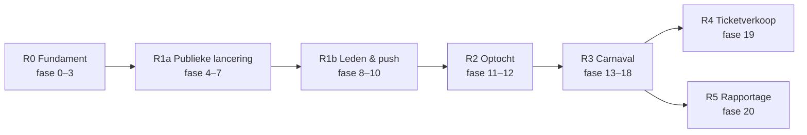

# 09 – MVP en releases

> Status: v0.3 · 2026-09-24 · Besluit B-07: **planning is niet relevant voor de documentatie**. Er staan geen datums of capaciteitsramingen in; de volgorde is technisch bepaald.
> De uitvoering per fase (doel, database, API, security, tests, acceptatiecriteria) staat in [15-implementation-plan.md](15-implementation-plan.md).

## 1. Uitgangspunten voor de volgorde

1. **Technische afhankelijkheden**:
   - RBAC, CarnivalYear, audit en het worker-fundament zijn de basis voor alles (fase 0–3).
   - De publieke app heeft contentbeheer nodig (fase 5), maar geen ledensync.
   - Accounts bestaan alleen voor leden (B-05, ADR-014): de ledensync (fase 8) gaat vóór de leden-app en de provisioning (fase 9).
   - Push (fase 10) komt vóór de optocht, aanrijtijden en dansgarde, omdat die fasen meldingen versturen.
   - QR-toegang vereist devices (fase 9) en push (fase 10); dagkaarten en pronkzitting hergebruiken het ticketmodel + de scanner → Mollie ná QR.
   - Echte ledendata in productie pas na de privacyverklaring (OQ-50).
2. **Seizoenslogica**: binnen een carnavalsseizoen loopt de optochtinschrijving vóór de toegangscontrole; daarom komt de optocht (11–12) vóór QR (13–15).
3. **MVP** = alles wat nodig is voor een volledig carnavalsseizoen met de app: fase 0–18.

## 2. Releases

| Release | Fasen | Inhoud |
|---|---|---|
| **R0 Fundament** | 0–3 | Repo (publiek, B-03), CI/CD, Dev/Acc-infra, database + workers, auth + RBAC, provisioning-kern |
| **R1a Publieke lancering** | 4–7 | Beheerportal, contentbeheer (agenda, nieuws, foto's), publieke app (Figma 01–07), productieomgeving |
| **R1b Leden & push** | 8–10 | e-Boekhouden-sync + ledenbeheer, groepen, accountverzoeken en lid worden met provisioning (ADR-014), leden-app, push + inbox + voorkeuren |
| **R2 Optocht** | 11–12 | Inschrijving (leden via de app, niet-leden via het webformulier), opgavenummer, documenten, beheer, samenstellen, startnummers, exports, optochtrapportage |
| **R3 Carnaval** | 13–18 | QR-tickets, scanner (online + offline), bandjes, bezoekersdashboard, aanrijtijden, dansgarde/ouders, carnavals-gereedheid |
| **R4 Ticketverkoop** | 19 | Mollie, dagkaarten, pronkzitting-ticketing |
| **R5 Rapportage** | 20 | Jubilarissen, trends, PDF-exports |
| Later | — | Website-integratie, nieuwsbrief, uitslagenmodule, pasfoto scanner (zie [10 §4](10-open-questions.md#4-later-na-het-mvp)) |

> **Pronkzitting**: betaalde ticketing via de app pas in R4 (OQ-71). Tot die tijd loopt de kaartverkoop via het bestaande kanaal.

## 3. Definition of Done

Zie [16-definition-of-done.md](16-definition-of-done.md) (algemeen) en de fase-specifieke DoD en acceptatiecriteria in [15](15-implementation-plan.md).

## 4. Risico's

| Risico | Kans | Maatregel |
|---|---|---|
| App Store-accounts/review vertragen (D-U-N-S, organisatieverificatie) | H | Direct aanvragen op naam van de vereniging (B-04); TestFlight/Internal testing als tussenstap |
| e-Boekhouden: ledenmodule niet actief of schrijfrechten niet te beperken | M | OQ-03 vóór fase 8/9 controleren; terugval: handmatig koppelen per aanvraag (ADR-014) |
| Vrije velden in e-Boekhouden onvolledig gevuld | M | Eenmalige vulling vanuit het huidige ledenbestand (B-06) en een validatierapport in de sync |
| Hardware-sleutel in Expo lastiger dan verwacht | M | Spike in fase 9 (OQ-68); fallback: server-signed kortlevende QR |
| Tenantbrede wijzigingen raken alle omgevingen (één tenant, B-02) | M | Wijzigingschecklist met terugdraaiplan; wijzigingen buiten drukke periodes |
| Offline-scannen onvoldoende getest | M | Veldtest in fase 15, generale repetitie in fase 18; noodprocedure met papier + bandjes |
| Ontbrekende Figma-schermen | M | Designer levert per fase aan (OQ-42); anders gereviewde componentvariant |
