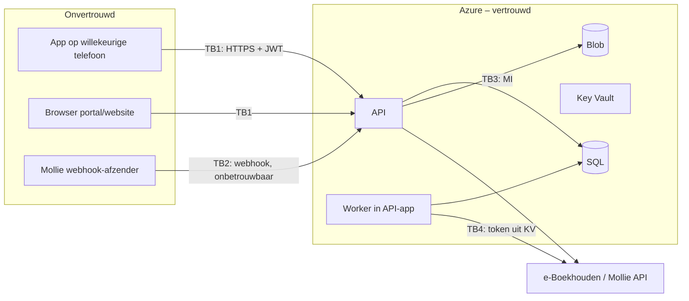

# 11 – Threat model

> Status: concept v0.1 · 2026-09-24 · Methode: STRIDE per scenario, risico = kans × impact (L/M/H)
> Maatregelen verwijzen naar [06-security.md](06-security.md) en de ADR's.

## 1. Assets en vertrouwensgrenzen

| Asset | Waarde |
|---|---|
| Persoonsgegevens leden (incl. minderjarigen) | Hoog (AVG, reputatie) |
| Toegang carnaval (QR/tickets) | Hoog (omzet, veiligheid, capaciteit) |
| Betalingen/orders | Hoog |
| Optochtgegevens (volgorde, nummers, contact) | Middel |
| Beheeraccounts | Zeer hoog (sleutel tot alles) |
| e-Boekhouden-token | Zeer hoog (volledige boekhouding) |
| Pushkanaal | Middel/hoog (misbruik = reputatieschade, paniek) |

## 2. Scenario's

### T1 – Gestolen QR-code (code van iemand anders gebruiken)
| | |
|---|---|
| STRIDE | Spoofing |
| Scenario | Aanvaller fotografeert/kopieert de QR van een lid en probeert daarmee binnen te komen |
| Kans / impact | M / M |
| Maatregelen | Dynamische QR met `exp` 45 s; signature met niet-exporteerbare device-key; replay-detectie `(ref, iat)`; tweede gebruik → ORANJE/GROEN-herhaald met vorige scantijd; scanner ziet naam (en optioneel foto); bandje na eerste toegang |
| Restrisico | L: binnen 45 s hergebruik vlak na de eigenaar wordt als herhaalde scan gedetecteerd |

### T2 – Screenshot van QR
| | |
|---|---|
| STRIDE | Spoofing / Repudiation |
| Scenario | Lid stuurt een screenshot naar een vriend |
| Maatregelen | Code verloopt na 45 s → ROOD "Code verlopen – vraag om te verversen"; bewegend element/tijd in de UI maakt live-weergave herkenbaar voor de scanner; screenshot-detectie (iOS `userDidTakeScreenshotNotification`) → melding "Screenshots werken niet" (educatief). Android: `FLAG_SECURE` op het QR-scherm |
| Restrisico | L |

### T3 – Account takeover
| | |
|---|---|
| STRIDE | Spoofing, Elevation |
| Scenario | Phishing, wachtwoordhergebruik, overname van het e-mailaccount |
| Maatregelen | Entra: smart lockout, banned passwords, e-mail-OTP; zelfregistratie uit, accounts alleen via provisioning na goedkeuring of exacte match (ADR-014); MFA verplicht voor het beheerportal; loginmeldingen bij een nieuw device (push/mail); sessies intrekbaar; bij gebruikerswijziging van e-mail in e-Boekhouden → conflict, geen automatische login-e-mailwijziging |
| Restrisico | M voor gewone leden (geen verplichte MFA), L voor admins |

### T4 – Gestolen telefoon
| | |
|---|---|
| STRIDE | Spoofing, Information disclosure |
| Scenario | Telefoon met ingelogde app wordt gestolen |
| Maatregelen | OS-lock vereist voor Keychain/Keystore-toegang (`WHEN_UNLOCKED_THIS_DEVICE_ONLY`); optionele biometrie voor QR en scanner; device intrekken via portal/andere telefoon/secretariaat → tokens, device-key en push ingetrokken; ticket opnieuw binden op nieuw device; scanner-devices: extra PIN/biometrie bij openen scanmodus |
| Restrisico | L–M (offline scanners kennen de revocatie pas na de volgende sync) |

### T5 – Kwaadwillende scanner (insider)
| | |
|---|---|
| STRIDE | Tampering, Information disclosure, Repudiation |
| Scenario | Iemand met scanrecht scant bewust valse "geldig" of verzamelt gegevens |
| Maatregelen | Scanrecht per persoon en per device (trusted) en tijdgebonden; de scanner ziet minimale gegevens (naam, type; geen adres/telefoon); elke scan en operatorbeslissing gelogd met user+device; rapportage "admitted despite warning" per scanner; ongebruikelijke patronen (veel ROOD→toelaten) in het dashboard; scanrecht direct intrekbaar |
| Restrisico | L |

### T6 – Gemanipuleerde app
| | |
|---|---|
| STRIDE | Tampering, Elevation |
| Scenario | Aanvaller decompileert de app, verandert logica (bijv. altijd "groen" tonen, admin-schermen activeren) of roept de API direct aan |
| Maatregelen | Server beslist altijd (autorisatie, validatie, nummers, prijzen); UI-permissions zijn cosmetisch; scanner-trust vereist attestation + bestuurgoedkeuring; een gemanipuleerde scanner-app kan hooguit lokaal groen tonen, maar de scan wordt server-side gereconcilieerd en het scannerdevice is herleidbaar; geen secrets in de bundle |
| Restrisico | L |

### T7 – Replay attack
| | |
|---|---|
| STRIDE | Spoofing |
| Scenario | Oude QR-payload of API-request (scan, betaling, submit) opnieuw afspelen |
| Maatregelen | QR `exp`; `(ref, iat)`-replaydetectie; device-signatures over timestamp (±5 min) + nonce; `Idempotency-Key` + `client_scan_id` unique; Mollie-status altijd opnieuw opgehaald |
| Restrisico | L |

### T8 – Dubbele scan (online)
| | |
|---|---|
| STRIDE | Repudiation / business logic |
| Scenario | Dezelfde code twee keer scannen (per ongeluk of om een tweede persoon binnen te laten) |
| Maatregelen | Elke scan een eigen record; resultaat GROEN-herhaald (zelfde device) of ORANJE (ander device) met vorige tijd; operatorbeslissing gelogd; rapportage onderscheidt eerste toegang en herhaalde scans; bandje als primaire controle na eerste toegang |
| Restrisico | L |

### T9 – Offline dubbele scan
| | |
|---|---|
| STRIDE | Business logic |
| Scenario | Scanner A en B zijn offline, beide scannen dezelfde code en tonen "eerste geldige scan" |
| Maatregelen | Offline scanners wisselen niets rechtstreeks uit; na sync reconcilieert de server op device-tijd (klokcorrectie), markeert de tweede als `RepeatOtherDevice` + `conflict_detected_after_sync`, en toont dit in het dashboard/scanlog en bij de volgende scan van dezelfde code ("Eerder offline gescand op scanner B om 20:14"). Ondersteunend: scanners syncen elke 30 s zodra er verbinding is; beperkt aantal scanners per ingang; bandjes |
| Restrisico | M (inherent aan offline; de impact is beperkt tot één extra toegang per code en achteraf zichtbaar) |

### T10 – Mollie-webhookmanipulatie
| | |
|---|---|
| STRIDE | Spoofing, Tampering |
| Scenario | Aanvaller POST een vervalste webhook "betaald", of flood de webhook |
| Maatregelen | Body wordt niet vertrouwd (alleen `id`); status via een geauthenticeerde `GET /v2/payments/{id}`; id moet horen bij een bestaande Payment in onze DB; idempotente verwerking; rate limit; geheim pad-segment; alerts bij veel onbekende id's |
| Restrisico | L |

### T11 – Foutieve e-Boekhouden-import
| | |
|---|---|
| STRIDE | Tampering, Denial of service (datakwaliteit) |
| Scenario | API geeft een lege/partiële lijst, de veldmapping is fout, of dubbele lidnummers → leden gedeactiveerd, verkeerde geboortedata, accounts gekoppeld aan de verkeerde persoon |
| Maatregelen | Massa-deactivatie-guard (> 10 %); dry-run + diff-rapport; parsefouten laten de oude waarde staan; idempotent op lidnummer; SyncConflict voor e-mailwijziging bij actieve accounts en voor duplicaten; nooit app-gegevens overschrijven; SyncJob-historie; herstel via de volgende sync of PITR |
| Restrisico | L |

### T12 – Kwaadwillende documentupload
| | |
|---|---|
| STRIDE | Tampering, Elevation |
| Scenario | Malware, polyglot-bestanden, extreem grote bestanden, path traversal, HTML/SVG met script |
| Maatregelen | Allowlist extensie + magic bytes (geen SVG/HTML); groottelimieten; server-gegenereerde paden; quarantaine + Defender-malwarescan; afbeeldingen opnieuw encoderen; download met `attachment` en correct content-type; private containers |
| Restrisico | L |

### T13 – Onbevoegde toegang tot optochtgegevens
| | |
|---|---|
| STRIDE | Information disclosure (BOLA) |
| Scenario | Een groepsverantwoordelijke raadt het ID van een andere inschrijving of roept admin-endpoints aan |
| Maatregelen | Resource-based autorisatie (manager-relatie); UUID's; 404 i.p.v. 403 bij geen toegang; permission-matrix-tests; exports gelogd; contactgegevens alleen voor `parade.read` |
| Restrisico | L |

### T14 – Manipuleren startnummer
| | |
|---|---|
| STRIDE | Tampering, Elevation |
| Scenario | Een groep of onbevoegde probeert een eigen (gunstig) startnummer te zetten, of een race condition geeft twee groepen hetzelfde nummer |
| Maatregelen | `start_number` alleen via een admin-endpoint met `parade.assign-start-number`; niet in de groeps-DTO; filtered unique index (DB-garantie); rowversion; historie + audit; generatie alleen expliciet met preview |
| Restrisico | L |

### T15 – Manipuleren opgavenummer
| | |
|---|---|
| STRIDE | Tampering |
| Scenario | Nummer beïnvloeden (eerder nummer claimen, dubbel indienen, concept terug en opnieuw indienen, gelijktijdige submits) |
| Maatregelen | Toegekend uitsluitend server-side in de submit-transactie met sequence-lock (ADR-011); niet in een DTO; `CHECK`- en unique-constraints; idempotente submit; Draft kan niet terug naar Draft na submit; ingetrokken nummers nooit hergebruikt; `submitted_at` en het nummer zijn beide in audit/historie; concurrency-test in CI |
| Restrisico | Zeer laag |

## 3. Aanvullende dreigingen

| # | Dreiging | Maatregel |
|---|---|---|
| T16 | Misbruik pushkanaal (gehackt redacteuraccount stuurt paniekbericht) | MFA admins; "Iedereen" en "Dringend" alleen met `notification.send.urgent`; bevestigingsdialoog; audit; optioneel 4-ogen (OQ-44) |
| T17 | Lekken e-Boekhouden-token | Alleen in Key Vault, alleen de MI van de API-app en alleen gelezen door de sync-module; token met minimale rechten; rotatie jaarlijks en bij personeelswissel |
| T18 | DoS tijdens carnaval (API down) | Offline scanner; App Service autoscale-optie (S1) tijdens carnaval; rate limits; health alerts |
| T19 | Bot-aanmeldingen / spam via website | Turnstile/hCaptcha, rate limit, handmatige goedkeuring |
| T20 | Ontwikkelaar pusht secret naar Git | gitleaks pre-commit + CI; GitHub secret scanning + push protection (bij publieke repo, B-03); direct roteren in Key Vault bij een lek |
| T21 | Supply chain (npm/NuGet) | Lockfiles, Dependabot, `pnpm install --frozen-lockfile`, beperkte dependencies, CodeQL |
| T22 | Misbruik anonieme formulieren (accountverzoeken, lid worden, optochtformulier): spam, enumeratie van lidnummers, nepinschrijvingen | Turnstile, rate limits, e-mailverificatie vóór verwerking, generieke respons, handmatige beoordeling (ADR-014, B-05a) |
| T23 | Misbruik provisioning-rechten (Graph `User.ReadWrite.All`, schrijftoken e-Boekhouden) | Aparte app-registratie met certificaat in Key Vault, alleen de provisioning-service, audit per aanroep, alerts bij afwijkende aantallen |
| T24 | Tenantbrede misconfiguratie raakt ook Prod (één tenant, B-02) | Wijzigingschecklist, terugdraaiplan, Entra-auditlogs naar Log Analytics, testaccounts nooit toegewezen aan Prod-apps |

## 4. Review

Het threat model wordt herzien bij elke release en vóór elk carnavalsseizoen (oktober). Open securitybesluiten: OQ-24 (Mollie-signatures), OQ-25 (pinning), OQ-26 (verplichte MFA voor leden?).
