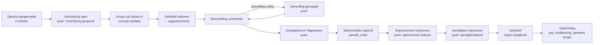
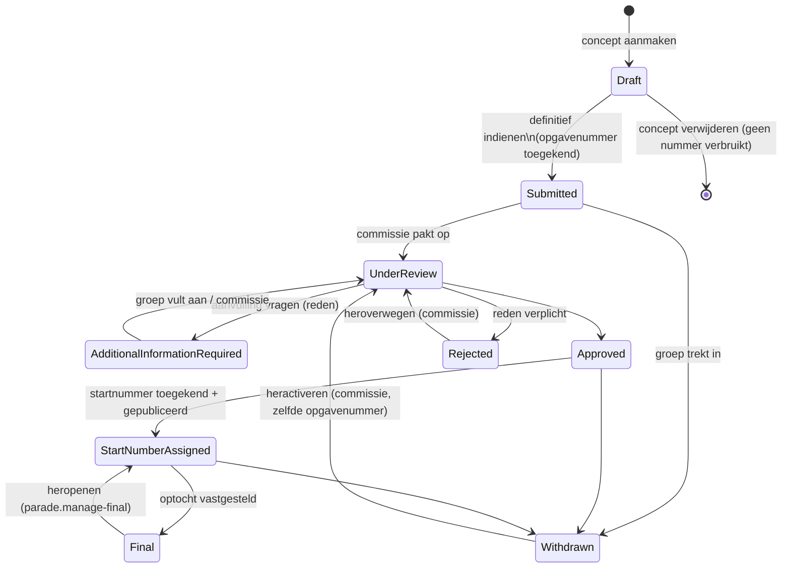
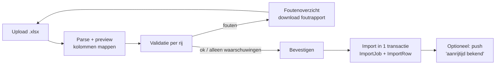

# 13 – Optochtproces

> Status: v0.3 · 2026-09-24 · leden via de app, niet-leden via het webformulier (B-05a)
> Datamodel: [14-parade-data-model.md](14-parade-data-model.md)

## 1. Overzicht

## 2. Actoren

| Actor | Permission(s) | Scope |
|---|---|---|
| Groepsverantwoordelijke (lid, app) | `parade.register` (rol Lid), `parade.update` | Alleen eigen inschrijvingen (ParadeRegistrationManager) |
| Contactpersoon niet-leden (webformulier) | — (geen account) | Alleen de eigen inschrijving, via e-mail en een ondertekende statuslink |
| Optochtcommissie | `parade.read`, `parade.manage`, `parade.assign-start-number`, `parade.import-arrival-times`, `parade.export` | Alle inschrijvingen |
| Speciale beheerder | `parade.manage-final` | Wijzigen na Final |
| Publiek | — | Publieke optochtinfo (Figma 04) |

**Wie mag zich inschrijven?** (B-05a)
- **Leden** schrijven in via de app (of via het portal-webformulier na inloggen). Ze worden `Owner` in ParadeRegistrationManager, krijgen automatisch de rol Groepsverantwoordelijke (per carnavalsjaar), kunnen concepten opslaan en ontvangen push en e-mail.
- **Niet-leden** (geen account, B-05) gebruiken het **openbare webformulier** met dezelfde 8 stappen:
  1. Het formulier doorlopen (concept alleen lokaal in de browser); Turnstile en rate limit.
  2. Indienen → een verificatiemail aan het `contact_email`. **Pas na bevestiging** wordt de inschrijving `Submitted` en krijgt ze een opgavenummer (voorkomt spam en nepinschrijvingen).
  3. Bevestigingsmail met het opgavenummer en een **ondertekende statuslink** (alleen lezen: status, startnummer, aanrijtijd).
  4. Alle latere communicatie (aanvulling gevraagd, goedgekeurd, startnummer, aanrijtijd, planningswijziging) gaat **per e-mail**.
  5. Wijzigingen na indienen verlopen via de optochtcommissie (mail) of via een aanvulling-link die de commissie per aanvraag verstuurt (eenmalig, 7 dagen geldig, alleen de gevraagde velden en documenten).

## 3. Statusmachine

Regels:
- Transities zijn gedefinieerd in een domein-statusmachine (code) en worden server-side afgedwongen. De UI toont alleen toegestane acties.
- Iedere transitie → `ParadeStatusHistory` + eventueel een notificatie (tabel §8).
- **Withdrawn/Rejected geven het opgavenummer nooit vrij.** Het startnummer wordt bij Withdrawn/Rejected leeggemaakt (gelogd), zodat het beschikbaar komt.
- `StartNumberAssigned` kan pas als `start_number IS NOT NULL`. Een startnummer kan al in `Approved` gevuld zijn (concept-indeling); de transitie naar `StartNumberAssigned` is de **publicatie** richting de groep (bulkactie "Startnummers publiceren").

## 4. Wizard inschrijven (app + website, §75)

| Stap | Titel | Velden | Validatie (client + server) |
|---|---|---|---|
| 1 | Groepsgegevens | `group_name` | Verplicht, 2–100 tekens, geen HTML |
| 2 | Contactpersoon | `contact_name`, `contact_phone`, `contact_email` | Standaard vooringevuld met eigen gegevens. Telefoon: libphonenumber (default regio NL), opgeslagen als E.164; e-mail: RFC-5322-lite + domein met punt |
| 3 | Categorie en deelnemers | `category_id` (radio, gegroepeerd Volwassenen/Jeugd, met uitleg min/max), `children_count`, `adult_count` (steppers, min 0) | Categorieregels §5; live feedback "Totaal: 14 deelnemers ✓" |
| 4 | Onderwerp | `subject`, `subject_description` | subject verplicht indien geconfigureerd, max 150; beschrijving max 2000 |
| 5 | Bouwlocatie | `build_address` (straat, huisnr, toevoeging, postcode, plaats; land standaard NL), ☑ "Stalling jury is gelijk aan bouwadres" (standaard aan), anders een tweede adresblok | Postcode NL-formaat; optioneel PDOK-autofill op postcode + huisnummer |
| 6 | Lengte en aanvullende info | `estimated_length_meters` (decimaal toetsenbord, komma of punt), `additional_information` | > 0, ≤ 100, max 2 decimalen; hint: "Inclusief trekkend voertuig en eventuele aanhanger" |
| 7 | Documenten | Upload (PDF/JPG/PNG/DOCX), per type | Max aantal/grootte per optocht; scanstatus zichtbaar |
| 8 | Controle en indienen | Samenvatting per stap met "Wijzig"-links; ☑ "Ik bevestig dat de gegevens juist zijn en ga akkoord met het optochtreglement" | Alle verplichte velden + categorieregels; knop "Definitief indienen" |

UX-details:
- Voortgangsindicator "Stap 3 van 8"; vorige/volgende; elke stap wordt als concept opgeslagen (`PUT /parade/registrations/{id}`, autosave).
- Concepten zijn ook lokaal bewaard (offline-veilig) en worden gesynchroniseerd.
- Na indienen: bevestigingsscherm "Jullie opgavenummer is **12**. Dit is de volgorde van binnenkomst, niet jullie startnummer." + bevestigingsmail.
- Toegankelijk: labels, foutmeldingen bij het veld en bovenaan (samenvatting), focus naar de eerste fout.

## 5. Validatieregels (samenvatting)

| Veld | Regel | Ernst |
|---|---|---|
| group_name | verplicht, 2–100 | Block |
| contact_name | verplicht, 2–100 | Block |
| contact_phone | verplicht, geldig volgens libphonenumber (NL-nummers zonder landcode toegestaan, ook +32/+49) | Block |
| contact_email | verplicht, geldig formaat, max 254 | Block |
| category_id | verplicht, exact één, actieve categorie | Block |
| children_count / adult_count | geheel getal ≥ 0 | Block |
| totaal | ≥ 1 | Block |
| totaal vs categorie | min/max volgens ParadeCategory | per `validation_mode` |
| jeugdcategorie met meer volwassenen | — | Warn |
| subject | verplicht als `subject_required` | Block |
| build_address | straat, huisnummer, postcode, plaats verplicht | Block |
| jury_inspection_address | verplicht als same_as = false | Block |
| estimated_length_meters | > 0, ≤ 100, ≤ 2 decimalen | Block |
| measured_length_meters | alleen door `parade.manage`, > 0, ≤ 100 | Block |
| start_number | alleen door `parade.assign-start-number`, geheel > 0, uniek per optocht | Block (409 Conflict) |
| registration_number | read-only voor iedereen | Block (genegeerd/403) |
| inschrijfperiode | submit alleen tussen opens/closes (commissie kan wel) | Block |

## 6. Opgavenummer versus startnummer

| | **Opgavenummer** (`registration_number`) | **Startnummer** (`start_number`) |
|---|---|---|
| Betekenis | Volgorde van binnenkomst van definitieve inschrijvingen | Positie in de optocht |
| Toegekend door | Systeem, automatisch | Optochtcommissie (handmatig of expliciete generatie) |
| Wanneer | Bij definitief indienen (Draft → Submitted) | Bij het samenstellen van de optocht |
| Wijzigbaar | **Nooit** | Ja, door bevoegden; elke wijziging gelogd |
| Uniek | Per optocht | Per optocht (als gevuld) |
| Hergebruik | Nooit, ook niet na intrekken/verwijderen | Komt vrij bij Withdrawn/Rejected of wijziging |
| Leeg | Alleen in Draft | Mag lang leeg blijven |
| Voorbeeld | 3 | 17 |

Technisch: [ADR-011](adr/ADR-011-parade-registration-number.md) en [ADR-012](adr/ADR-012-parade-start-number.md).

## 7. Beheeromgeving

### 7.1 Overzicht inschrijvingen (§37)

Tabel (TanStack Table) met kolommen:
Opgave · Startnummer · Naam groep · Contactpersoon · Telefoonnummer · E-mailadres · Categorie · Onderwerp · Kinderen · Volwassenen · Totaal deelnemers · Bouwadres · Stalling jury · Geschatte lengte · Gemeten lengte · **Extra info** · Status · Datum inschrijving · Laatste wijziging.

- **Extra info** wordt in de tabel afgekapt getoond met een tooltip/uitklap; in het detailscherm staat het als een prominent geel notitieblok bovenaan.
- Sorteren op elke kolom; vrij zoeken (groep, contact, onderwerp, e-mail, opgave-/startnummer).
- Filters: categorie, status, startnummer (wel/geen/bereik), opgavenummer (bereik), jeugd/volwassenen, wel/geen voertuig, **ontbrekende gegevens** (geen startnummer, geen gemeten lengte, geen documenten, waarschuwingen, juryadres afwijkend).
- Opgeslagen weergaven ("Te beoordelen", "Zonder startnummer").
- Badges voor validatiewaarschuwingen.
- Export van de huidige filterselectie.

### 7.2 Detail

Tabs: Gegevens · Documenten · Historie (ParadeRegistrationHistory) · Statushistorie · Meldingen verstuurd. Acties afhankelijk van status en permission: In behandeling nemen, Aanvulling vragen (met tekst → push/mail), Goedkeuren, Afwijzen (reden), Startnummer wijzigen, Gemeten lengte invoeren, Intrekken.

### 7.3 Optocht samenstellen (§38)

Advies: **drag-and-drop is nuttig** bij 30–80 deelnemers. De commissie wil groepen afwisselen (wagen – loopgroep – jeugd) en rekening houden met lengte en extra info. Gebruik `dnd-kit` met toetsenbordondersteuning (toegankelijk).

Scherm:
- Links: "Niet ingedeeld" (Approved zonder parade_order), filterbaar.
- Midden: geordende lijst met kaarten (per kaart: opgavenummer, groep, categorie-badge (kleur per categorie), onderwerp, deelnemers, lengte (gemeten > geschat), ⚠ extra info-icoon, huidig startnummer).
- Rechts/boven: live totalen (aantal, totale lengte incl. spacing, per categorie), waarschuwingen (bijv. "3 wagens achter elkaar").
- Slepen wijzigt **alleen `parade_order`** (auto-save, optimistic concurrency op Parade-niveau via een `composition_version`).
- **"Startnummers genereren uit volgorde"** is een expliciete actie:
  1. Kies een startwaarde (standaard 1) en een optie: "Alleen lege startnummers invullen" of "Alle startnummers opnieuw nummeren".
  2. Preview-tabel oud → nieuw met gemarkeerde wijzigingen.
  3. Bevestigen met een tekstbevestiging bij hernummering van reeds gepubliceerde nummers ("typ HERNUMMER").
  4. Eén transactie; alle wijzigingen in de historie + één AuditLog-record (bulk) met details.
  5. Pushmeldingen gaan **niet** automatisch; aparte knop "Startnummers publiceren" (→ StartNumberAssigned + push).
- Handmatig startnummer per inschrijving blijft altijd mogelijk (inline-edit met directe uniciteitscontrole).

### 7.4 Aanrijtijden-import (§41)

- **Template** downloadbaar vanuit het portal, voorgevuld met alle goedgekeurde inschrijvingen: `Registratie-ID` (verborgen/vergrendelde kolom), `Opgave`, `Startnummer`, `Naam groep`, `Datum`, `Aanrijtijd`, `Locatie`, `Opmerkingen`.
- **Koppeling** (in volgorde van voorkeur): 1) `Registratie-ID` (parade_registration_id); 2) `Startnummer`; 3) `Opgave`. Groepsnaam wordt alleen **ter controle** gebruikt (waarschuwing bij mismatch), nooit als sleutel.
- **Controles**: onbekende registratie/start-/opgavenummer (Error), dubbele groepen in bestand (Error), startnummer hoort niet bij opgegeven groep (Error), ontbrekende tijd (Error), ongeldige tijd (Error; accepteert `13:05`, `13.05`, Excel-tijdwaarde), datum ontbreekt (standaard `Parade.parade_date`, Warning), naam wijkt af (Warning), inschrijving niet Approved/StartNumberAssigned (Warning), bestaande aanrijtijd wordt overschreven (Info, oud → nieuw getoond).
- Import is alles-of-niets (bij fouten geen gedeeltelijke import). Idempotent: dezelfde import nogmaals geeft "geen wijzigingen".
- Na import: `published_at` wordt gezet bij "Publiceren"; de push "De aanrijtijd voor jullie groep is bekend." gaat naar de managers van de inschrijvingen.

### 7.5 Export (§40)

Excel (ClosedXML) en CSV (UTF-8 met BOM, `;` als scheidingsteken voor NL-Excel).

| Kolom (Excel-kop) | Bron |
|---|---|
| Opgave | registration_number |
| Startnummer | start_number |
| Naam groep | group_name |
| Contactpersoon | contact_name |
| Telefoon nr. | contact_phone (nationaal formaat) |
| Mail adres | contact_email |
| Categorie | category.name |
| Onderwerp | subject |
| Kinderen | children_count |
| Volwassenen | adult_count |
| Bouw adres | geformatteerd adres |
| Stalling voor jury | effectief juryadres ("Gelijk aan bouwadres" of adres) |
| Lengte | estimated_length_meters (+ optionele kolom "Gemeten lengte") |
| Extra info | additional_information |
| Tekst | subject_description |
| Status | NL-label |

Optioneel: Totaal deelnemers, Gemeten lengte, Aanrijtijd, Datum inschrijving. Een export wordt gelogd in de AuditLog (`parade.exported`, met filter en aantal rijen), omdat hij persoonsgegevens bevat. Excel-injectie wordt voorkomen: celwaarden die beginnen met `= + - @` worden als tekst geëscaped.

PDF (later): startlijst voor de speaker en de jury.

## 8. Meldingen in het optochtproces

| Trigger | Ontvangers | Tekst (voorbeeld) | Kanaal |
|---|---|---|---|
| Inschrijving geopend | Alle leden + vorige-jaars groepsverantwoordelijken (opt-in) | "De optocht-inschrijving is geopend!" | Push + nieuws |
| Deadline nadert (7 en 2 dagen) | Managers met Draft-inschrijvingen | "Je concept is nog niet ingediend. Deadline: …" | Push + mail |
| Ingediend | Managers / contactpersoon webformulier | "Ingediend! Jullie opgavenummer is 12." | Push + mail (webformulier: alleen mail) |
| Documenten ontbreken | Managers | "Er ontbreken nog documenten voor …" | Push |
| Aanvulling gevraagd | Managers | "Er is aanvullende informatie nodig: …" | Push + mail |
| Goedgekeurd / Afgewezen | Managers | … | Push + mail |
| Startnummer bekend | Managers | "Jullie startnummer is 17." | Push |
| Aanrijtijd bekend | Managers | "De aanrijtijd voor jullie groep is bekend." | Push |
| Wijziging optochtplanning | Managers van de actieve inschrijvingen | Vrije tekst van de commissie | Push |

## 9. Weergave voor de groepsverantwoordelijke (app, Optocht-tab)

Bovenaan de publieke optochtinfo (Figma 04). Voor een manager daaronder de kaart "Mijn inschrijving":
- Groepsnaam, status (label + icoon + kleur), opgavenummer;
- Startnummer (of "Nog niet bekend");
- Aanrijtijd: datum, tijd, locatie, opmerkingen (zodra gepubliceerd);
- Acties volgens beleid: Bewerken, Documenten, Intrekken;
- Openstaande acties ("2 documenten ontbreken").

## 10. Optochtdag / eindkeuring

- Commissie/jury voert `measured_length_meters` in (mobiel-vriendelijk portalscherm of later in de app). De geschatte lengte blijft ongewijzigd.
- Opmerkingen eindkeuring in `extra_fields.final_inspection_notes`.
- Uitslagen (Figma "Uitslagen"-tegel): buiten scope van de huidige requirements, OQ-40.
