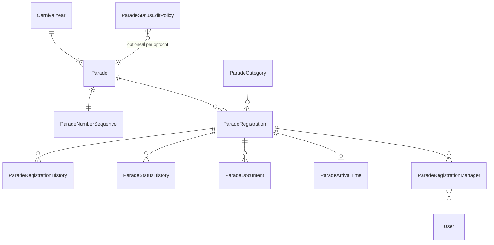

# 14 – Datamodel optocht

> Status: v0.2 · 2026-09-24 · Schema `parade` · herzien: categoriecode-uniciteit, `composition_version`
> Proces en schermen: [13-parade-process.md](13-parade-process.md) · Besluiten: [ADR-011](adr/ADR-011-parade-registration-number.md), [ADR-012](adr/ADR-012-parade-start-number.md)

## 1. Entiteiten

## 2. Parade

| Kolom | Type | Opm. |
|---|---|---|
| id | uuid PK | |
| carnival_year_id | int FK | |
| name | nvarchar(100) | "Optocht Loil 2027" |
| parade_date | date | 2027-02-07 |
| start_time | time | 13:30 |
| start_location, route_description | nvarchar | Figma 04: "Dorpsplein Loil", "3,2 km" |
| route_length_km | decimal(5,2) NULL | |
| registration_opens_at, registration_closes_at | datetime2 | Inschrijfperiode |
| edit_deadline_at | datetime2 NULL | Na deze datum beperkt wijzigbaar |
| subject_required | bit | §25: onderwerp verplicht of optioneel |
| default_spacing_meters | decimal(5,2) | Standaard afstand tussen groepen (bijv. 5,0) |
| max_documents_per_registration, max_document_size_mb | int | Configuratie upload |
| status | varchar(20) | `Planned`, `RegistrationOpen`, `RegistrationClosed`, `Composing`, `Final`, `Completed` |
| composition_version | int | Optimistic concurrency voor het samenstellen (volgorde/startnummer-generatie, ADR-012) |
| row_version | rowversion | |

## 3. ParadeCategory (configureerbaar, §24)

| Kolom | Type | Opm. |
|---|---|---|
| id | int PK | |
| code | varchar(40) | Stabiele sleutel voor imports/exports; **uniek per (`parade_id`, `code`)** (filtered unique indexes: één voor globale rijen waar `parade_id IS NULL`, één voor overrides), zodat een override dezelfde code kan hebben als de globale categorie |
| name | nvarchar(100) | Weergavenaam |
| age_group | varchar(10) | `Adult` / `Youth` |
| type | varchar(20) | `TowedFloat`, `SelfPropelled`, `TowedOrSelfPropelled`, `WalkingGroupLarge`, `WalkingGroupSmall`, `IndividualDuo` |
| minimum_participants | int NULL | |
| maximum_participants | int NULL | |
| participant_count_basis | varchar(20) | `Total` (kinderen + volwassenen), `ChildrenOnly`, `AdultsOnly` — zie §8 |
| validation_mode | varchar(10) | `Block` / `Warn` / `None` |
| has_vehicle | bit | Toont voertuigvelden, lengte extra belangrijk |
| active | bit | Inactief = niet kiesbaar, historie blijft |
| sort_order | int | |
| parade_id | uuid NULL | NULL = globaal; gevuld = specifiek voor een optocht (overrides) |

### Seed (startset)

| sort | code | name | age_group | type | min | max | has_vehicle | validation_mode |
|---|---|---|---|---|---|---|---|---|
| 10 | ADULT_TOWED | Volwassenen Getrokken wagens | Adult | TowedFloat | 1 | — | 1 | Warn |
| 20 | ADULT_SELF | Volwassenen Zelfrijdende voertuigen | Adult | SelfPropelled | 1 | — | 1 | Warn |
| 30 | ADULT_WALK_L | Volwassenen Loopgroepen groot (10+) | Adult | WalkingGroupLarge | 10 | — | 0 | Block |
| 40 | ADULT_WALK_S | Volwassenen Loopgroepen klein (3-10) | Adult | WalkingGroupSmall | 3 | 10 | 0 | Block |
| 50 | ADULT_INDIV | Volwassenen Individueel of duo (1-2) | Adult | IndividualDuo | 1 | 2 | 0 | Block |
| 60 | YOUTH_FLOAT | Jeugd Getrokken en zelfrijdende wagens | Youth | TowedOrSelfPropelled | 1 | — | 1 | Warn |
| 70 | YOUTH_WALK_L | Jeugd Loopgroepen groot (10+) | Youth | WalkingGroupLarge | 10 | — | 0 | Block |
| 80 | YOUTH_WALK_S | Jeugd Loopgroepen klein (3-10) | Youth | WalkingGroupSmall | 3 | 10 | 0 | Block |
| 90 | YOUTH_INDIV | Jeugd Individueel of duo (1-2) | Youth | IndividualDuo | 1 | 2 | 0 | Block |

> Let op de overlap: "Loopgroep klein (3-10)" en "Loopgroep groot (10+)" delen de waarde 10. Dat is toegestaan (een groep van 10 mag kiezen); zie OQ-12.

## 4. ParadeRegistration

| Kolom | Type | Null | Opm. |
|---|---|---|---|
| id | uuid | nee | PK; stabiele identifier (ook in exports/imports) |
| parade_id | uuid | nee | FK; bepaalt carnavalsjaar |
| carnival_year_id | int | nee | Gedenormaliseerd voor rapportage; gezet bij het aanmaken uit `Parade.carnival_year_id`, niet wijzigbaar (domeinregel + integratietest) |
| registration_number | int | **ja** | Opgavenummer, pas bij definitief indienen (ADR-011). Niet wijzigbaar |
| start_number | int | ja | Startnummer, door commissie (ADR-012) |
| parade_order | int | ja | Volgorde bij samenstellen (drag-and-drop), los van start_number |
| group_name | nvarchar(100) | nee* | *Bij Draft optioneel, bij submit verplicht |
| contact_name 🔒 | nvarchar(100) | nee* | |
| contact_phone 🔒 | varchar(20) | nee* | Genormaliseerd naar E.164 (`+31612345678`); origineel formaat weergegeven |
| contact_email 🔒 | nvarchar(254) | nee* | |
| category_id | int | nee* | FK ParadeCategory |
| subject | nvarchar(150) | config | Verplicht als `Parade.subject_required` |
| subject_description | nvarchar(2000) | ja | "Tekst" (§33) |
| children_count | int | nee | CHECK ≥ 0, standaard 0 |
| adult_count | int | nee | CHECK ≥ 0, standaard 0 |
| total_participants | computed | — | `children_count + adult_count` (niet persisted, zie §7) |
| build_address_street, _house_number, _addition, _postal_code, _city, _country | nvarchar | nee* | Owned value object `Address` (§5) |
| jury_inspection_same_as_build_address | bit | nee | Standaard `1` |
| jury_inspection_address_* | nvarchar | ja | Alleen gevuld als same_as = 0 |
| estimated_length_meters | decimal(5,2) | nee* | CHECK > 0 en ≤ 100; 2 decimalen |
| measured_length_meters | decimal(5,2) | ja | Na eindkeuring; overschrijft nooit estimated |
| measured_at, measured_by | | ja | |
| spacing_after_meters | decimal(5,2) | ja | NULL = `Parade.default_spacing_meters` |
| additional_information | nvarchar(4000) | ja | "Extra info" — prominent in beheer |
| status | varchar(40) | nee | Zie §6 |
| validation_warnings | nvarchar(max) json | ja | Actuele waarschuwingen (bijv. deelnemers buiten bereik bij `Warn`) |
| extra_fields | nvarchar(max) json | ja | Toekomstige velden (§34): muziek, geluid, voertuigtype, kenteken, bestuurder, verzekering, generator, brandblusser, technische keuring, opmerkingen eindkeuring |
| submitted_at | datetime2 | ja | Bij definitief indienen |
| approved_at | datetime2 | ja | |
| withdrawn_at | datetime2 | ja | |
| owner_user_id | uuid | ja | Lid dat het concept in de app aanmaakte; NULL bij het webformulier voor niet-leden (B-05a) |
| contact_email_verified_at | datetime2 | ja | Webformulier: e-mail bevestigd (vereist vóór `Submitted`) |
| status_token_hash | varbinary(32) | ja | Webformulier: hash van het token voor de ondertekende statuslink (roteerbaar) |
| source | varchar(10) | nee | `App`, `WebForm` (niet-leden, zonder account), `Portal` (door commissie ingevoerd) |
| created_at, created_by, updated_at, updated_by | | | |
| row_version | rowversion | nee | Optimistic concurrency |

Constraints:
- `UNIQUE (parade_id, registration_number) WHERE registration_number IS NOT NULL`
- `UNIQUE (parade_id, start_number) WHERE start_number IS NOT NULL`
- `CHECK (children_count >= 0 AND adult_count >= 0)`
- `CHECK (start_number IS NULL OR start_number > 0)`
- `CHECK (estimated_length_meters IS NULL OR (estimated_length_meters > 0 AND estimated_length_meters <= 100))`
- `CHECK (measured_length_meters IS NULL OR (measured_length_meters > 0 AND measured_length_meters <= 100))`
- `CHECK (status <> 'Draft' OR registration_number IS NULL)`: een concept heeft nooit een opgavenummer
- `CHECK (status = 'Draft' OR registration_number IS NOT NULL)`: na indienen altijd een nummer (behalve `Draft`)

> **Toekomstvelden** gaan eerst in `extra_fields` (JSON, gevalideerd tegen een versieerbaar schema in code). Velden die vaak gefilterd of gerapporteerd worden, promoveren later naar echte kolommen via een migratie. Dit voorkomt nu overengineering (geen EAV-model).

## 5. Adres als value object

In EF Core modelleren we `Address` als **owned type** (kolommen in dezelfde tabel, prefix `build_address_` / `jury_inspection_address_`). Redenen:
- een adres heeft geen eigen identiteit of levenscyclus;
- het zijn maar 2 adressen per inschrijving; een aparte tabel voegt joins toe zonder voordeel;
- de export wordt eenvoudig.

Validatie: postcode NL `^[1-9][0-9]{3} ?[A-Za-z]{2}$` wanneer country = NL; huisnummer numeriek 1–99999; toevoeging max 10 tekens. Een PDOK-postcode-lookup (Locatieserver, gratis) is optioneel voor gebruiksgemak (S).

"Stalling jury gelijk aan bouwadres": bij `same_as = 1` wordt het juryadres **niet gekopieerd** maar in lees-/exportlogica afgeleid (`EffectiveJuryAddress`). Zo blijft het automatisch gelijk als het bouwadres wordt gewijzigd.

## 6. Status en historie

### Statussen

| Code | Label NL | Betekenis |
|---|---|---|
| `Draft` | Concept | Nog niet ingediend, geen opgavenummer |
| `Submitted` | Ingediend | Definitief ingediend, opgavenummer toegekend |
| `UnderReview` | In behandeling | Commissie beoordeelt |
| `AdditionalInformationRequired` | Aanvulling gevraagd | Groep moet gegevens/documenten aanvullen |
| `Approved` | Goedgekeurd | Deelname goedgekeurd |
| `Rejected` | Afgewezen | Niet toegelaten (reden verplicht) |
| `Withdrawn` | Ingetrokken | Door groep of commissie ingetrokken; opgavenummer blijft bezet |
| `StartNumberAssigned` | Startnummer toegekend | Startnummer bekend en gecommuniceerd |
| `Final` | Definitief | Optocht vastgesteld; alleen speciale permission kan wijzigen |

### ParadeStatusHistory
`id`, `registration_id`, `from_status`, `to_status`, `reason`, `actor_user_id`, `occurred_at`.

### ParadeRegistrationHistory (§36)
| Kolom | Opm. |
|---|---|
| id bigint | |
| registration_id | |
| field_name | Technische naam, bijv. `start_number` |
| field_label | Leesbaar, bijv. "Startnummer" |
| old_value, new_value | nvarchar(max), gevoelige velden volledig (alleen zichtbaar voor `parade.manage`) |
| changed_by_user_id | |
| changed_at | |
| change_source | `App`, `Website`, `Portal`, `Import`, `System` |
| correlation_id | Groepeert velden van één opslagactie |

Wordt gevuld door een EF Core `SaveChanges`-interceptor op ParadeRegistration (per gewijzigd veld). Wijzigingen van start_number/status/measured_length komen daarnaast in `audit.AuditLog`.

## 7. `total_participants`: wel of niet opslaan?

**Besluit:** een **computed column, niet persisted** (`AS (children_count + adult_count)`).
- Er zijn geen redundantie- of consistentieproblemen (het is afgeleid).
- De kolom is wel beschikbaar in SQL voor sorteren, filteren en exports.
- Indexeren is niet nodig bij < 200 inschrijvingen per jaar.

## 8. Businessregel deelnemers ↔ categorie (§28)

**Voorgestelde regel (te bevestigen, OQ-10):**

1. `aantal = children_count + adult_count` (basis `Total`). Configureerbaar per categorie via `participant_count_basis`.
2. `aantal ≥ 1` altijd (een inschrijving zonder deelnemers is ongeldig: **Block**).
3. Als `minimum_participants` gevuld is en `aantal < minimum` → melding.
4. Als `maximum_participants` gevuld is en `aantal > maximum` → melding.
5. De ernst volgt uit `validation_mode`: `Block` (niet indienen/opslaan na indienen), `Warn` (wel indienen, waarschuwing zichtbaar in beheer en opgeslagen in `validation_warnings`), `None`.
6. **Jeugdcategorie en volwassenen**: begeleiders tellen mee in het totaal. Een waarschuwing (Warn, niet configureerbaar als Block) volgt als `adult_count > children_count` in een jeugdcategorie ("Controleer categorie: meer volwassenen dan kinderen"). Aanname, OQ-10.
7. Validatie draait bij elke opslag (voor waarschuwingen in de UI) en is hard bij submit en bij wijzigingen na submit.

Voorbeelden (seed):

| Categorie | Kinderen | Volwassenen | Resultaat |
|---|---|---|---|
| Volwassenen Loopgroep groot (10+) | 0 | 8 | ❌ Block: "Deze categorie vereist minimaal 10 deelnemers (nu 8)." |
| Volwassenen Loopgroep klein (3-10) | 5 | 15 | ❌ Block: "Deze categorie staat maximaal 10 deelnemers toe (nu 20)." |
| Individueel of duo (1-2) | 0 | 2 | ✅ |
| Individueel of duo (1-2) | 1 | 2 | ❌ Block: max 2 |
| Getrokken wagens | 0 | 0 | ❌ Block: minimaal 1 deelnemer |
| Jeugd Loopgroep klein | 2 | 6 | ⚠ Warn: meer volwassenen dan kinderen |

## 9. Overige tabellen

### ParadeNumberSequence (ADR-011)
`parade_id PK`, `last_registration_number int NOT NULL DEFAULT 0`. Wordt atomair opgehoogd in de submit-transactie.

### ParadeStatusEditPolicy (§36, configureerbaar)
| Kolom | Opm. |
|---|---|
| id | |
| parade_id NULL | NULL = standaard |
| status | |
| actor_scope | `Owner` (groepsverantwoordelijke), `Committee` (`parade.manage`), `SpecialAdmin` (`parade.manage-final`) |
| editable_fields | JSON-lijst of `*`; bijv. voor Owner in Submitted: `["contact_phone","contact_email","additional_information","children_count","adult_count","documents"]` |
| can_withdraw | bit |

Standaardbeleid:

| Status | Groepsverantwoordelijke | Commissie (`parade.manage`) | Speciaal (`parade.manage-final`) |
|---|---|---|---|
| Draft | alles | alles | alles |
| Submitted | beperkt: contact, aantallen, extra info, documenten, lengte; intrekken | alles behalve registration_number | alles behalve registration_number |
| UnderReview | beperkt: contact, extra info, documenten | alles behalve registration_number | idem |
| AdditionalInformationRequired | beperkt: gevraagde velden + documenten (feitelijk als Submitted) | idem | idem |
| Approved | alleen contact + documenten | alles behalve registration_number | idem |
| StartNumberAssigned | alleen contact | alles behalve registration_number | idem |
| Final | niets | niets | alles behalve registration_number |
| Rejected / Withdrawn | niets | status terugzetten (met reden) | idem |

`registration_number` is voor **niemand** wijzigbaar via API of UI (ook niet voor admins). Een correctie kan alleen via een gedocumenteerde database-procedure met audit, die buiten de applicatie valt.

### ParadeDocument (§43)
`id`, `registration_id`, `document_type` (`Insurance`, `VehicleInspection`, `Drawing`, `Other`), `file_name` (gesanitiseerd), `content_type`, `size_bytes`, `sha256`, `blob_path` (private container `parade-documents`), `scan_status` (`Pending`, `Clean`, `Infected`, `Failed`), `uploaded_by`, `uploaded_at`, `deleted_at`.

### ParadeArrivalTime (§41–42)
`id`, `registration_id` UQ, `arrival_date date`, `arrival_time time`, `location` (bijv. "Wehlseweg, opstelvak 12"), `remarks`, `import_job_id NULL`, `published_at NULL`, `notified_at NULL`, `updated_by`, `updated_at`. Eén actuele aanrijtijd per inschrijving; historie via ParadeRegistrationHistory-achtige logging (field `arrival_time`).

### ParadeRegistrationManager
`registration_id`, `user_id`, `role` (`Owner`, `CoManager`), `added_at`. Alleen voor inschrijvingen van leden via de app (managers zijn leden). Een groep kan meerdere beheerders hebben. Autorisatie: de groepsverantwoordelijke ziet en bewerkt alleen inschrijvingen waar hij/zij manager is. Inschrijvingen via het webformulier hebben geen managers; de communicatie loopt via `contact_email`.

## 10. Afgeleide berekeningen (§39)

Als SQL-view `reporting.vParadeLengthSummary` / queries:

| Grootheid | Berekening |
|---|---|
| Totale geschatte lengte | `SUM(estimated_length_meters)` over niet-ingetrokken/afgewezen inschrijvingen |
| Totale gemeten lengte | `SUM(measured_length_meters)` + aantal zonder meting |
| Beste schatting | `SUM(COALESCE(measured, estimated))` |
| Per categorie | GROUP BY category |
| Gemiddelde lengte | `AVG(COALESCE(measured, estimated))` |
| Totale optochtlengte incl. afstand | `SUM(COALESCE(measured, estimated) + COALESCE(spacing_after_meters, parade.default_spacing_meters))` − laatste spacing |

"Actieve" inschrijvingen voor berekeningen: status ∈ {Submitted, UnderReview, AdditionalInformationRequired, Approved, StartNumberAssigned, Final}.
