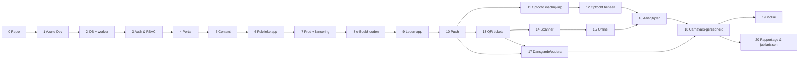

# 15 – Implementatieplan

> Status: v1.1 · **goedgekeurd** 2026-09-24 · besluiten B-01…B-07 en ADR-014 verwerkt
> Basis: requirements (01), architectuur (03), datamodel (04/14), API (05), security (06/11), RBAC (07), infrastructuur (08), besluitenregister (10), review (18), Definition of Done ([16](16-definition-of-done.md)).
> **Alle blockers zijn besloten** (sessie 2026-09-24, [10 §0a](10-open-questions.md#0a-genomen-besluiten-sessie-2026-09-24)). Planning en capaciteit zijn bewust niet opgenomen (B-07): de volgorde is technisch bepaald.

## 1. Uitgangspunten

1. **Iedere fase is afzonderlijk te bouwen, testen, reviewen en committen.** Een fase eindigt met een werkend, getest en gedeployed (minimaal Dev + Acc) increment en een git-tag `phase-NN-done`.
2. **Geen afhankelijkheid van half-afgeronde functionaliteit.** Een fase gebruikt alleen resultaten van fasen die volledig "Done" zijn. Functionaliteit die later wordt uitgebreid, is in de eerdere fase compleet voor haar eigen scope. Voorbeeld: contentdoelgroepen zijn in fase 5 compleet voor Publiek/Leden/Rol; Groep en Lid komen er in fase 8 bij.
3. **Verticale slices**: per fase database → API → portal/app → tests → documentatie.
4. **Feature flags** alleen om *complete* functionaliteit in productie aan of uit te zetten (bijv. ledensync tot OQ-50 is afgerond), nooit om half werk te verbergen.
5. **Databasewijzigingen per fase** via EF Core-migraties (één DbContext, OQ-62), backwards-compatible (expand/contract).
6. **Contract-first**: API-wijzigingen staan in OpenAPI; de gegenereerde TS-client wordt in dezelfde fase bijgewerkt.
7. De algemene **Definition of Done** staat in [16](16-definition-of-done.md). Per fase staan hieronder de *aanvullende* DoD-punten en de acceptatiecriteria.

## 2. Fasevolgorde en afwijkingen van het voorstel

| Nr | Fase | Voorstel opdrachtgever | Reden van afwijking |
|---|---|---|---|
| 0 | Repository / Foundation | 0 | — |
| 1 | Azure Development Infrastructure | 1 | — |
| 2 | Database Foundation (+ worker-fundament) | 2 | Worker-fundament (scheduler, outbox) hoort hier door B-01 |
| 3 | Authentication & RBAC | 3 | — |
| 4 | Admin Portal Foundation | 5 | Moet vóór content; heeft de ledensync niet nodig |
| 5 | **Content Management** (agenda, nieuws, foto's, uploads) | *nieuw* | De publieke app (fase 6) heeft content en beheer nodig; zonder deze fase zou fase 6 van half werk afhangen |
| 6 | Public Mobile App | 6 | — |
| 7 | **Acceptance & Production Environment (publieke lancering)** | deel van 18 | De publieke app kan live zodra er content is; productie-inrichting hoort daarom direct na de publieke app. Fase 18 blijft de carnavals-gereedheid |
| 8 | e-Boekhouden Member Synchronization (+ ledenbeheer) | 4 | Niet nodig voor de publieke app; echte ledendata in productie vraagt eerst de privacyverklaring (OQ-50) |
| 9 | Member Mobile App (+ lid worden, devices) | 7 | — |
| 10 | Push Notifications (+ inbox) | 14 | **Vervroegd**: optocht (11/12), aanrijtijden (16) en dansgarde (17) sturen meldingen; zonder push zouden die fasen halve meldingslogica bevatten |
| 11 | Parade Registration | 11 | Vóór QR: de optochtinschrijving loopt in het seizoen eerder dan de toegangscontrole tijdens carnaval |
| 12 | Parade Administration | 12 | — |
| 13 | QR Ticketing | 8 | Na de optocht (volgorde in het seizoen) |
| 14 | QR Scanner | 9 | — |
| 15 | Offline QR Scanning | 10 | — |
| 16 | Arrival Times | 13 | Na QR: klein en weinig risico; QR is complexer en krijgt voorrang |
| 17 | Dansgarde / Guardian Relationships | 16 | — |
| 18 | Carnaval Readiness: Acceptance / Security / Production | 18 | Restant na afsplitsing van fase 7 |
| 19 | Mollie / Day Tickets | 15 | Buiten het MVP; vereist een werkende scanner (OQ-71) |
| 20 | Reporting & Jubilees | 17 | Buiten het MVP; basisrapportages zitten al in fase 8/12/14/15 |

## 3. Planning

Niet opgenomen (besluit B-07): er zijn geen datums of capaciteitsramingen. Het **MVP** omvat fase 0–18 (alles wat nodig is voor een volledig carnavalsseizoen, inclusief toegangscontrole); fase 19–20 vallen erbuiten.

## 4. Fasen

Legenda: **Tests** vermeldt de fase-specifieke tests bovenop de algemene DoD. Endpoints verwijzen naar [05-api-design.md](05-api-design.md) (allemaal onder `/api/v1`).

---

### Fase 0 — Repository / Foundation

**Doel.** Een werkende, veilige monorepo met build- en kwaliteitspipeline en lege, draaiende skeletten van API, app en portal, zodat elke volgende fase alleen functionaliteit toevoegt.

**Functionaliteit.**
- Repository volgens [03 §6](03-architecture.md#6-projectstructuur-monorepo): `Drammers.sln` (Api, Worker, SharedKernel, Infrastructure, modules als lege projecten), `apps/mobile` (Expo, TS, Expo Router, 5 tabs met placeholders), `apps/admin` (Vite + React + TS), `packages/design-tokens` (tokens uit [17](17-design-system.md), licht/donker), `packages/api-client` (generator-setup).
- App: thema-provider (licht/donker), fonts (Poppins/Inter), basiscomponenten zonder data: TabBar, LargeTitleHeader, Card, EventCard/DateBlock, ShortcutTile, FilterChips, Buttons, SettingsList, EmptyState/ErrorState (Figma-fidelity), plus een Storybook of componentpagina.
- API: `GET /health/live`, ProblemDetails-middleware, Serilog-configuratie, OpenAPI-generatie, `IClock`, strongly-typed IDs.
- Kwaliteit: `.editorconfig`, `dotnet format`, ESLint/Prettier, commit-conventie, PR-template met DoD-checklist ([16](16-definition-of-done.md)), CODEOWNERS.

**Technische componenten.** .NET 10 SDK, pnpm workspaces (OQ-64), GitHub Actions in een **publieke** repository (B-03), gitleaks (pre-commit + CI), Dependabot, CodeQL, GitHub secret scanning + push protection, private vulnerability reporting, **geen open-sourcelicentie** (alle rechten voorbehouden, OQ-74), EAS-projectconfiguratie (development-build), Renovate/Dependabot voor npm.

**Databasewijzigingen.** Geen.

**API-endpoints.** `GET /health/live`.

**Security requirements.** Geen secrets in de repo (gitleaks en push protection); `.gitignore` voor secrets; branch protection op `main` met verplichte review en groene CI; CodeQL en dependency-scan actief; `SECURITY.md` met privékanaal voor meldingen; **geen echte persoonsgegevens** in testdata of issues (publieke repo).

**Tests.** Pipeline draait unit-testprojecten (lege smoke-tests), Jest in app/portal, een snapshot-test van 3 basiscomponenten (licht/donker), een test die faalt bij een gitleaks-vondst (verificatie met een dummy-secret in een tijdelijke branch).

**Aanvullende DoD.** README bevat lokale setup (≤ 30 min van clone tot draaiende API/app/portal).

**Afhankelijkheden.** B-03 (publieke GitHub-repository), B-04 (GitHub-organisatie en accounts op naam van de vereniging).

**Acceptatiecriteria.**
- [ ] `git clone` + README-stappen → API (`/health/live` = 200), portal (leeg dashboard) en app (5 tabs, licht/donker) draaien lokaal.
- [ ] Een PR met een lintfout, een falende test of een gecommit dummy-secret wordt door CI geblokkeerd.
- [ ] Een PR kan niet naar `main` zonder groene CI en review; een gepushte dummy-secret wordt door push protection tegengehouden.
- [ ] Design tokens bevatten de Figma-merkkleuren; voor kleine tekst worden de toegankelijke varianten gebruikt (OQ-66 besloten), vastgelegd als aparte tokens.

---

### Fase 1 — Azure Development Infrastructure

**Doel.** De Dev- (en Acc-) omgeving als code, met automatische deploy van de API-skeleton en het portal.

**Functionaliteit.** Bicep-modules en parameters voor Dev en Acc ([08](08-azure-infrastructure.md)): resource group, App Service Plan B1 (gedeeld Dev/Acc) + API-app (Always On, HTTPS only, TLS 1.2, FTP uit), Azure SQL-server + DB (free offer, Entra-only), Storage-account (geen publieke toegang, shared key uit, containers aangemaakt, soft delete/versioning), Key Vault (RBAC, purge protection), Log Analytics + App Insights, beheerportal als statische bestanden in de API-app onder `/beheer` (OQ-76), ACS Email (domein later). Eén Entra External ID-tenant (B-02) met app-registraties per omgeving (API, app, portal); Dev/Acc-app-registraties op *Require user assignment* (groep `Testers`) en een custom attribuut `environmentAccess` dat als claim in het token komt; zelfregistratie uit (`isSignUpAllowed = false`); alles gescript en gedocumenteerd. Budgetalert.

**Technische componenten.** Bicep, `what-if` in CI, pipeline-identiteit met OIDC/workload identity federation per environment, deploy-workflow voor API + portal (één zip; het portal in `wwwroot/beheer`).

**Databasewijzigingen.** Alleen de lege database; DB-users/rechten volgen in fase 2.

**API-endpoints.** `GET /health/live`, `GET /health/ready` (SQL, Key Vault, Blob).

**Security requirements.** Dev/Acc-API weigert tokens zonder `environmentAccess` voor die omgeving; een niet-toegewezen gebruiker kan niet inloggen op de Dev/Acc-apps; managed identity voor de API; geen connection strings met wachtwoorden; SQL-firewall alleen App Service-outbound-IP's (B-01/OQ-60); Key Vault-references; diagnostische logs naar Log Analytics; pipeline-identiteit alleen `Contributor` op de eigen resource group; geen productietoegang.

**Tests.** Bicep-lint en `what-if` in de PR; post-deploy smoke-test (`/health/ready` = 200 in Dev); een test dat anonieme blob-toegang geweigerd wordt; een test dat SQL-login met gebruikersnaam/wachtwoord uitgeschakeld is (policy-check).

**Aanvullende DoD.** Runbook "Omgeving opnieuw opbouwen vanuit Bicep" (in `docs/runbooks/`); de kosten van Dev en Acc zijn zichtbaar in het budgetoverzicht.

**Afhankelijkheden.** Fase 0; B-01, B-02, B-04 (subscription).

**Acceptatiecriteria.**
- [x] Merge naar `main` → infra `what-if` + deploy + API + portal automatisch in Dev; `/health/ready` groen. *(2026-09-25, Deploy #3/#5)*
- [x] Het verwijderen en opnieuw uitrollen van de Dev-resource-group vanuit Bicep lukt zonder handmatige stappen (behalve de gedocumenteerde Entra-stappen). *(2026-09-25, runbook §5 + Deploy #7; nieuwe API-identiteit kreeg automatisch een databasegebruiker)*
- [x] Geen secrets in pipeline-variabelen, behalve niet-gevoelige ID's. *(OIDC; geen GitHub-secrets)*
- [x] Acc kan met dezelfde templates en andere parameters worden uitgerold. *(2026-09-25, Deploy #6)*
- [x] Een testaccount zonder toewijzing kan niet inloggen op de Dev-app; een token van de Prod-app-registratie wordt door de Dev-API geweigerd. *(2026-09-25: handmatige logintest (tester wel, niet-toegewezen account geweigerd); audience- en environmentAccess-weigering in `EnvironmentAccessTests`; live met een echt token opnieuw in fase 3/4)*

---

### Fase 2 — Database Foundation (+ worker-fundament)

**Doel.** Een betrouwbaar datafundament met migraties, conventies, least-privilege DB-rechten, auditlog, configuratie en de achtergrondverwerking waarop alle modules bouwen.

**Functionaliteit.**
- `DrammersDbContext` met schema-mapping per module, conventies ([04 §1](04-data-model.md#1-conventies)): UUIDv7, UTC, `rowversion`, auditkolommen via interceptor, enum-als-string met CHECK.
- Migratiepipeline: idempotent script, uitgevoerd door de pipeline-identiteit (`app_migrator`), vóór de app-deploy.
- DB-users/rollen: `app_runtime` (DML op module-schema's, alleen INSERT/SELECT op `audit`), `app_migrator`, `app_reporting`.
- `IAuditLogger` (append-only) en `AuditLog`-hash-keten (S).
- Configuratie: `FeatureFlag`, `AppConfiguration`, `RetentionPolicy` + `GET /app-config`.
- `CarnivalYear` (kern-dimensie) + seed 2026/2027.
- **Worker-fundament (B-01)**: `Drammers.Worker` met scheduler (`PeriodicTimer`/Coravel) + `sp_getapplock`, outbox-tabel + polling-loop, graceful shutdown, health-rapportage; één voorbeeldjob (heartbeat).

**Technische componenten.** EF Core 10, Testcontainers (SQL Server), Respawn, `Microsoft.Data.SqlClient` met Entra-auth (managed identity).

**Databasewijzigingen.** Schema's `identity, membership, content, notification, ticketing, payments, parade, import, audit, config, reporting`; tabellen `audit.AuditLog`, `config.FeatureFlag`, `config.AppConfiguration`, `config.RetentionPolicy`, `content.CarnivalYear`, `notification.Outbox`; DB-rollen en -rechten.

**API-endpoints.** `GET /app-config`, `GET /carnival-years/current`.

**Security requirements.** Runtime-identiteit zonder DDL; `UPDATE/DELETE` op `audit` onmogelijk (test); geen raw SQL zonder parameters; PII-kolommen gemarkeerd (Data Discovery & Classification-script).

**Tests.** Integratie: migraties van leeg naar laatste versie en idempotent opnieuw; `app_runtime` kan niet `DELETE FROM audit.AuditLog` (verwacht een permissiefout); `sp_getapplock` voorkomt dubbele uitvoering bij twee gelijktijdige worker-instanties; outbox-bericht wordt precies één keer verwerkt, ook na een herstart halverwege.

**Aanvullende DoD.** Datamodel-conventies in 04 bevestigd of bijgewerkt.

**Afhankelijkheden.** Fase 1.

**Acceptatiecriteria.**
- [x] Een nieuwe migratie wordt in Dev automatisch toegepast vóór de app-deploy; een mislukte migratie stopt de deploy. *(2026-09-25, Deploy #9: migraties `InitialCreate` + `DatabaseRoles` in Dev; de migratiestap staat vóór de app-uitrol en stopt de job bij een fout (exitcode ≠ 0))*
- [x] Twee gelijktijdig draaiende API-instanties voeren de heartbeat-job niet dubbel uit (log + test). *(`JobCoordinationTests`; in Dev één heartbeat per minuut in de logs)*
- [x] `GET /app-config` levert de minimale app-versie en de maintenance-vlag; de wijziging via DB is zonder deploy zichtbaar (cache ≤ 60 s). *(cache 30 s; `PublicEndpointTests`; live in Dev)*
- [x] De auditlog is aantoonbaar niet te wijzigen of te verwijderen met de runtime-identiteit. *(`PermissionTests`: UPDATE, DELETE, TRUNCATE en ALTER geweigerd voor `app_runtime`)*

---

### Fase 3 — Authentication & RBAC

**Doel.** Veilig inloggen via Entra External ID en permission-based autorisatie volgens [07](07-rbac.md), inclusief het accountmodel uit B-05.

**Functionaliteit.**
- JWT-validatie (`Microsoft.Identity.Web`, `ciamlogin.com`-authority); per omgeving de eigen audience; in Dev/Acc een verplichte `environmentAccess`-claim (B-02). **Geen JIT-provisioning**: een token van een onbekende `oid` krijgt 403 (accounts bestaan alleen via de provisioning, ADR-014).
- **Provisioning-kern** (ADR-014): `IAccountProvisioningService` met de Graph-stap (Entra-account aanmaken/uitschakelen) via een aparte provisioning-app-registratie (`User.ReadWrite.All`, certificaat in Key Vault). In deze fase alleen voor **handmatige bootstrap van beheerders** (`source_type = Manual`, via CLI en portal); de koppeling aan het lid volgt in fase 8, de volledige flows in fase 9.
- Permission-catalogus (constants + seed), standaardrollen (Lid, Groepsverantwoordelijke, Kaderlid, Dansgarde-leiding/-lid, Ouder, Raad van Elf, Scanner, Optochtcommissie, Redactie, Bestuur, Beheerder IT), `RequirePermissionAttribute`, `IPermissionService` met cache + `permissions_version`.
- Resource-authorization-framework (basisklassen voor latere handlers).
- `GET /me` (profiel, rollen, permissions, features).
- Accountblokkade (`account_status = Blocked`) en Graph-sessie-intrekking.
- `LoginHistory` (succes/mislukt, gehashte IP).
- Entra: user flow met e-mail-OTP (optioneel wachtwoord), **zelfregistratie uit**, branding. Geen CA-policy (B-02-MFA: e-mailcode naar een mailbox met MFA). Wachtwoordreset via Entra.

**Technische componenten.** Microsoft.Identity.Web, Microsoft Graph SDK (app-only, alleen `User.ReadWrite.All` in de external tenant voor revoke/delete; secret/cert in Key Vault), rate limiting (policies uit [05 §7](05-api-design.md#7-rate-limiting-aspnet-core-ratelimiter)).

**Databasewijzigingen.** `identity.User`, `Role`, `Permission`, `UserRole`, `RolePermission`, `LoginHistory`, `AccountProvisioning` + seeds.

**API-endpoints.** `GET /me`; `GET /admin/permissions`; `GET/POST/PUT/DELETE /admin/roles` (+ `/permissions`); `GET/PUT /admin/users/{id}/roles`; `POST /admin/members/{id}/block` · `/unblock` (op userniveau in deze fase: `/admin/users/{id}/block`).

**Security requirements.** Deny by default; reflectietest "elk endpoint heeft `RequirePermission` of `AllowAnonymous`"; geen permissions in het token; lock-out-preventie (laatste houder van `role.manage`); audit op alle rolwijzigingen; rate limits actief; 401 versus 403 correct; MFA afgedwongen voor de portal-app (handmatige test).

**Tests.** Token-validatietests (issuer, audience, verlopen); **permission-matrix-test** (data-driven, uitbreidbaar per fase); cache-invalidatie bij een rolwijziging; geblokkeerd account → 403; onbekende `oid` → 403 (geen JIT); token zonder `environmentAccess` in Dev → 403; Graph-provisioning idempotent (tweede aanroep maakt geen tweede account; tegen een Graph-mock); lock-out-preventie.

**Aanvullende DoD.** 07-rbac bijgewerkt als de permissions-seed afwijkt; testaccounts per rol (herkenbare `test+…@`-adressen, groep `Testers`, alleen toegewezen aan Dev/Acc-apps; credentials in de kluis).

**Afhankelijkheden.** Fase 2; B-02, B-05 (ADR-014); OQ-26.

**Acceptatiecriteria.**
- [x] Zelfregistratie is niet mogelijk; een beheerder die via de bootstrap is aangemaakt, logt in met een e-mailcode en ziet via `GET /me` zijn/haar rollen en permissions. *(2026-09-25, live in Dev)*
- [x] Een Entra-account dat buiten de provisioning om bestaat (onbekende `oid`), krijgt 403 op alle ingelogde endpoints. *(live in Dev + integratietest)*
- [x] Een beheerder kent de rol Redactie toe; binnen 5 minuten (zelfde instantie: direct) heeft de gebruiker `news.manage`; de wijziging staat in de auditlog. *(live in Dev; direct effect en auditregel in `RoleAdministrationTests`)*
- [x] ~~Het openen van de portal-app vraagt MFA~~ — vervallen door besluit B-02-MFA (2026-09-25): geen Conditional Access; beheerders loggen in met een e-mailcode naar een mailbox met MFA. Tokens bevatten geen `amr`, dus een API-controle is niet mogelijk.
- [x] Een geblokkeerd account krijgt 403 op alle ingelogde endpoints en de sessies zijn ingetrokken. *(live in Dev: Entra-account uitgeschakeld, sessies ingetrokken; deblokkeren herstelt)*
- [x] Er bestaat geen endpoint zonder expliciete autorisatie-annotatie (reflectietest groen).

---

### Fase 4 — Admin Portal Foundation

**Doel.** Een werkend, beveiligd beheerportal met de generieke functies waarop latere beheerschermen aansluiten.

**Functionaliteit.** Login (MSAL, e-mailcode), layout en navigatie volgens het menu uit [02 §6](02-functional-design.md#6-beheerportal--menu-en-release), waarbij menu-items verborgen zijn zonder permission. Dashboard (placeholder-kerncijfers, systeemstatus uit `/health/ready`). Gebruikers en rollen (overzicht, rollen toekennen met geldigheid, beheerdersaccount aanmaken via de provisioning-kern uit fase 3). Rollen/rechten-beheer. Auditlog-viewer (filters, read-only). Configuratie (feature flags, minimum-appversie, maintenance). Carnavalsjaar-beheer. Generieke tabelcomponent (sorteren, filteren, kolomkeuze, CSV/Excel-export via de API), formuliercomponenten, bevestigingsdialogen en foutweergave (ProblemDetails).

**Technische componenten.** React + Vite, TanStack Router/Query/Table, MSAL.js, gegenereerde API-client, design tokens als CSS-variabelen, Playwright + axe-core, CSP en security headers door de API (`PortalHosting`).

**Databasewijzigingen.** Geen (hooguit seeds voor configuratie).

**API-endpoints.** `GET /admin/audit-log`; `GET/PUT /admin/config/feature-flags` · `/app-config` · `/retention`; `GET/POST/PUT /admin/carnival-years` (+ `/activate`); `GET /admin/users` (zoeken); `GET /admin/dashboard` (basis).

**Security requirements.** CSP `default-src 'self'`; tokens niet in localStorage; UI verbergt, API dwingt af; auditviewer toont gemaskeerde gevoelige velden; exports worden geaudit.

**Tests.** Playwright: login (testaccount), rol toekennen, auditregel zichtbaar, config wijzigen; axe-core zonder serious/critical-meldingen; API-matrix uitgebreid met de nieuwe endpoints.

**Aanvullende DoD.** Portal responsive getest (1280 px en 390 px).

**Uitvoering (2026-09-25).**
- Het portal haalt zijn aanmeldinstellingen op via `GET /api/v1/portal-config` (publiek, geen geheimen). Daardoor is het één pakket voor Dev, Acc en Prod.
- MSAL (`msal-browser`) bewaart tokens in `sessionStorage`.
- TanStack Router met routes in code; TanStack Table v9 met sorteren en kolomkeuze; zoeken en paginering server-side.
- De export van de gebruikerslijst valt onder `role.manage` en wordt geaudit (`user.exported`).
- Playwright draait met een nep-login en een gemockte API, 22 tests op 1280 en 390 px, inclusief axe. De echte login met e-mailcode wordt handmatig getest.
- Het API-contract gebruikt enums als string en strikte getallen.

**Afhankelijkheden.** Fase 3.

**Acceptatiecriteria.**
- [x] Een bestuurder logt in (e-mailcode), kent een rol toe en ziet deze actie in de auditlog. *(2026-09-25: handmatig in Dev + Playwright)*
- [x] Een gebruiker zonder beheer-permissions ziet een lege navigatie met de melding "Geen beheerrechten" en kan geen admin-API aanroepen (403). *(Playwright + `AdminPortalApiTests`)*
- [x] Een carnavalsjaar aanmaken en activeren lukt; er is altijd precies één actief jaar. *(integratietest + Playwright)*
- [x] Exporteren van de gebruikerslijst levert een Excel met Nederlandse kolomnamen op en een auditregel. *(handmatig in Dev + integratietest)*

---

### Fase 5 — Content Management (agenda, programma, nieuws, foto's)

**Doel.** Beheer en publieke API voor events, nieuws en fotoalbums, inclusief veilige uploads. Dit is de databron voor de publieke app.

**Functionaliteit.**
- Events: CRUD, categorieën, zichtbaarheid (Public/Members/Restricted), doelgroepen **Rol** (Groep en individueel Lid volgen in fase 8), publicatiestatus/-moment, "Hoogtepunt"/badge, afbeelding, bijlagen, iCal-export.
- Nieuws: CRUD, statussen Draft/Scheduled/Published/Archived, geplande publicatie (worker-job), einddatum. De optie "push" is nog **niet** zichtbaar (volgt in fase 10).
- Foto's: albums, upload (meerdere tegelijk), volgorde, verbergen (portretrecht), derivaten (1600 px + 400 px thumbnail, EXIF/GPS gestript).
- Upload-pijplijn (ADR-008): API-stream → `quarantine` → malwarescan (OQ-65) → promote → media-job (worker).
- Audience-filter `VisibleTo(user)` (07 §4) voor Public/Members (= rol Lid)/Rol.

**Technische componenten.** Blob (user-delegation SAS), ImageSharp, HtmlSanitizer/Markdown, Defender for Storage (Prod; Dev/Acc zonder, zelfde flow), Ical.Net.

**Databasewijzigingen.** `content.EventCategory` (+ seed Carnaval/Jeugd/Vereniging/Kader), `Event`, `EventAudience`, `EventAttachment`, `News`, `NewsAudience`, `PhotoAlbum`, `PhotoAlbumAudience`, `Photo`, `MediaJob`.

**API-endpoints.** Publiek/optioneel ingelogd: `GET /events`, `/events/{id}`, `/events/{id}/ical`, `/event-categories`, `/news`, `/news/{id}`, `/photo-albums`, `/photo-albums/{id}`, `/photo-albums/{id}/photos`. Beheer: CRUD `/admin/events` (+ audiences, attachments), `/admin/news` (+ publish/schedule/archive), `/admin/photo-albums` (+ photos upload, volgorde, hidden).

**Security requirements.** Magic-byte-controle en allowlist (geen SVG/HTML); groottelimieten; server-gegenereerde blob-paden; SAS ≤ 15 min, read-only, per blob; rich text gesanitized; gasten zien alleen Public + Published binnen het publicatievenster; bij geen toegang 404 (geen 403) om het bestaan niet te lekken; audit bij publiceren/verwijderen.

**Tests.** Audience-matrix (gast/Lid/Ouder/rol × Public/Members/Restricted); geplande publicatie verschijnt op het juiste moment (fake clock); EXIF-GPS verwijderd (test-image); upload van een `.exe` met `.jpg`-extensie geweigerd; een "infected" scanresultaat (gesimuleerd) → verwijderd + melding; SAS-verloop; Playwright: event aanmaken → zichtbaar in de publieke API.

**Aanvullende DoD.** OpenAPI-client opnieuw gegenereerd; publieke endpoints met `Cache-Control`/ETag.

**Uitvoering (2026-09-25).**
- **Mediaverwerking via de bestaande outbox** (bericht `media.process-photo`) in plaats van een aparte tabel `content.MediaJob`. Dat is dezelfde wachtrij met claimen, nieuwe pogingen en herstel na een crash (ADR-007).
- **Malwarescan** via `IMalwareScanner`. Dev en Acc slaan de scan over, met dezelfde flow (OQ-65); Defender for Storage in Prod volgt in fase 7.
- **Beeldverwerking** met ImageSharp (Six Labors Split License: gratis voor non-profits). Toegestaan zijn JPEG, PNG en WebP, bepaald op inhoud (magic bytes); HEIC wordt niet ondersteund. Derivaten van 1600 en 400 px, zonder EXIF, GPS, IPTC en XMP. Ook event- en nieuwsafbeeldingen worden zonder metadata opgeslagen.
- **Tekst** in Markdown; de API levert gesanitizede HTML (Markdig zonder ruwe HTML + HtmlSanitizer).
- **iCal** met een eigen, kleine RFC 5545-writer in plaats van Ical.Net.
- **Nieuwe blob-container `content`** voor afbeeldingen en bijlagen van events en nieuws.
- **Geplande content** is vanaf het publicatiemoment zichtbaar (audience-filter); de job `content-publisher` zet de status elke minuut definitief op Gepubliceerd en legt dat vast in de auditlog.

**Afhankelijkheden.** Fase 4; OQ-65.

**Acceptatiecriteria.**
- [ ] Een redacteur publiceert een event voor "Iedereen" → het staat binnen een minuut in `GET /events` zonder token.
- [ ] Een event met zichtbaarheid "Leden" is niet zichtbaar voor een gast of een ouderaccount zonder rol Lid (404 op detail), wel voor een Lid.
- [ ] Nieuws met een publicatiemoment in de toekomst verschijnt automatisch op dat moment.
- [ ] Een geüploade foto heeft een thumbnail en een display-versie, zonder GPS-metadata; een verborgen foto is direct onzichtbaar.
- [ ] Er is geen enkele blob anoniem opvraagbaar.

---

### Fase 6 — Public Mobile App

**Doel.** De publieke app volgens de Figma-schermen 01–07 (licht/donker, iOS/Android) met echte data, zonder login.

**Functionaliteit.** Home (hero, countdown uit CarnivalYear, eerstvolgende activiteit, snelkoppelingen, laatste nieuws). Programma (filterchips, maandsecties, badges, detail). Activiteit detail (toevoegen aan agenda; ticket-CTA verborgen tot fase 19). Nieuws (uitgelicht + lijst + detail). Foto's (albums + grid + viewer). Meer (Vereniging-, Locatie- en Contactpagina's als content/statisch; "Uitslagen" → nieuwscategorie, OQ-40; "Word ook een Drammer!" → informatiepagina, het formulier volgt in fase 9; instellingen: thema). Optocht-tab: statische publieke optochtinfo uit de CarnivalYear-configuratie (volledige optochtdata in fase 11). Offline: persistente cache van de laatste content, offline-banner. Forced update/maintenance via `/app-config`. Deeplinks naar events/nieuws.

**Technische componenten.** Expo Router, TanStack Query (persist), `expo-image`, `expo-calendar`/ics-deeplink, `expo-updates` (code signing), EAS Build (development/preview), Maestro.

**Databasewijzigingen.** Geen.

**API-endpoints.** De publieke GET's uit fase 2 en 5.

**Security requirements.** Geen secrets in de bundle; alleen HTTPS (ATS/network security config); deeplink-validatie; geen PII in logs/crashreports; EAS Update-codesigning.

**Tests.** Jest/RTL voor schermen met fixtures; snapshot licht/donker; Maestro-flows (home → event-detail → toevoegen aan agenda; nieuws; foto-album); offline-weergave (vliegtuigmodus); forced update bij een te lage versie; toegankelijkheidscheck (VoiceOver/TalkBack) op alle 7 schermen; Dynamic Type 200 %.

**Aanvullende DoD.** Visuele review tegen Figma (per scherm, per variant) door de product owner/designer; afwijkingen vastgelegd.

**Afhankelijkheden.** Fase 5; OQ-40, OQ-42 (niet nodig voor deze schermen), OQ-66.

**Acceptatiecriteria.**
- [ ] De 7 Figma-schermen zijn in licht en donker op iOS en Android gerealiseerd; de product owner accepteert de visuele review.
- [ ] Content die in het portal wordt gepubliceerd, verschijnt na pull-to-refresh in de app.
- [ ] Zonder netwerk toont de app de laatst geladen content met de offline-banner; er zijn geen crashes.
- [ ] Een minimale appversie boven de geïnstalleerde versie toont een blokkerend updatescherm.
- [ ] VoiceOver/TalkBack leest alle tegels, knoppen en de countdown begrijpelijk voor.

---

### Fase 7 — Acceptance & Production Environment (publieke lancering)

**Doel.** Een productieomgeving die aan de security- en beheerseisen voldoet, en de publieke lancering (portal + publieke app).

**Functionaliteit.** Productie-infra via Bicep (eigen subscription/resource group, Prod-app-registraties in de gedeelde tenant (B-02), geo-redundante backups, LTR, blob-PITR, Defender for Storage, alerts en action group, budget). Gecontroleerde prod-deploy (B-03). Custom domains (`api.`, `beheer.`, OQ-67). Store-release: TestFlight/Play internal → productie. Privacyverklaring bijgewerkt (OQ-50) en in de app/portal gelinkt. Supportmodel (OQ-52). Runbooks: deploy/rollback, restore (PITR), secret-rotatie, incident. Break-glass-accounts. Feature flag `members-sync` = uit.

**Technische componenten.** Bicep prod-parameters, Azure Monitor alerts ([08 §9](08-azure-infrastructure.md#9-observability-en-alerts-69)), availability test, EAS Submit.

**Databasewijzigingen.** Geen (migraties naar Prod via de pipeline).

**API-endpoints.** Geen nieuwe.

**Security requirements.** Prod alleen via de pipeline met goedkeuring; mensen standaard `Reader` op Prod; SQL-auditing aan; Key Vault purge protection; ZAP-baseline tegen Acc zonder high findings; restore-test van Acc uitgevoerd.

**Tests.** Smoke-tests Prod na deploy; restore-oefening (PITR naar een tijdelijke DB) met gedocumenteerde duur; alert-test (geforceerde 5xx → melding ontvangen); rollback-oefening (vorige versie opnieuw deployen).

**Aanvullende DoD.** Go-live-checklist afgetekend door de product owner en de technisch eigenaar.

**Afhankelijkheden.** Fase 6; B-04 (store-accounts, domein), OQ-50, OQ-52, OQ-67.

**Acceptatiecriteria.**
- [ ] De app staat in de App Store en Play Store (of in TestFlight/Internal testing als de review uitloopt) en toont productie-content.
- [ ] Een productie-deploy is niet mogelijk zonder de goedkeuringsstap.
- [ ] Een PITR-restore is geoefend; de hersteltijd (RTO) is gemeten en ligt binnen 8 uur.
- [ ] Alerts komen aan bij de action group; de availability test staat aan.
- [ ] De privacyverklaring is gepubliceerd en vanuit app en portal bereikbaar.

---

### Fase 8 — e-Boekhouden Member Synchronization (+ ledenbeheer)

**Doel.** Een betrouwbare, idempotente ledensync volgens ADR-010 en de ledenbeheerschermen in het portal.

**Functionaliteit.**
- `EBoekhoudenClient` (session, member list/detail, throttling ≤ 5 req/s, retry, sessie afsluiten).
- Sync-job (nachtelijk + handmatig + dry-run), hash-vergelijking, veldmapping (vrije velden volgens B-06, configureerbaar), naam-parser, massadeletie-guard, conflicten.
- Portal: SyncJobs (tellingen), items, conflicten afhandelen, mappingconfiguratie (`config.manage`), ledenlijst (zoeken, filters status/leeftijd/inschrijfjaar/rol), lid-detail (bron per veld, syncstatus, laatste login), lokale velden bewerken (status-override, geldigheid), export.
- **Groepen** (`Group`, `GroupMembership`) + uitbreiding contentdoelgroepen met **Groep** en **individueel Lid** (REQ-EVT-02 compleet).
- Basisrapportage: actief/inactief, per rol, per leeftijdsklasse, per inschrijfjaar (Excel/CSV).

**Technische componenten.** Typed `HttpClient` + Polly, WireMock.Net (contracttests tegen fixtures uit de officiële OpenAPI-spec), worker-scheduler.

**Databasewijzigingen.** `membership.Member` (incl. EB-velden, hash, syncstate), `membership.Group`, `GroupMembership`, `import.SyncJob`, `SyncJobItem`, `SyncConflict`; `identity.User.member_id`-FK; configuratie van de mapping in `config.AppConfiguration`.

**API-endpoints.** `POST /admin/members/import` (`?dryRun`), `GET /admin/sync-jobs` (+ `/{id}` + items), `GET/POST /admin/sync-conflicts` (+ `/{id}/resolve`), `GET /admin/members`, `GET /admin/members/{id}`, `PATCH /admin/members/{id}`, `GET /admin/members/export`, CRUD `/admin/groups` (+ leden), `GET /admin/reports/members`.

**Security requirements.** Token alleen in Key Vault, alleen door de sync-module gelezen; IBAN/BIC/mandaat/notitie worden niet gemapt en niet gelogd; logs zonder PII-waarden; export geaudit; feature flag `members-sync` in Prod pas aan na OQ-50 en een dry-run-review.

**Tests.** Idempotentie (2× dezelfde bron → 0 wijzigingen), nieuw/gewijzigd/verdwenen/teruggekeerd, parsefout behoudt de oude waarde, massadeletie-guard (> 10 %), dubbele lidnummers → conflict, e-mailwijziging bij een actief account → conflict, lokale velden onaangeroerd, sessie verlopen halverwege, 5xx-retry, contracttest tegen WireMock-fixtures.

**Aanvullende DoD.** Dry-run-rapport tegen de echte (of test-)administratie gereviewd door de secretaris.

**Afhankelijkheden.** Fase 7 (Prod bestaat), fase 5 (audiences uitbreiden); **B-06**, OQ-03, OQ-04, OQ-06, OQ-50.

**Acceptatiecriteria.**
- [ ] Een eerste dry-run toont het verwachte aantal nieuwe leden en eventuele parsefouten; na goedkeuring maakt de echte run exact dat aantal aan.
- [ ] Een tweede run zonder wijzigingen in e-Boekhouden rapporteert 0 nieuw / 0 gewijzigd.
- [ ] Een lid dat uit e-Boekhouden verdwijnt, wordt `Missing` en na bevestiging `Inactive`; rollen, devices en tickets blijven bewaard.
- [ ] Als > 10 % van de leden ontbreekt, wordt niemand gedeactiveerd en gaat er een alert uit.
- [ ] Een event met doelgroep "Groep Jeugdcommissie" is alleen zichtbaar voor leden van die groep.

---

### Fase 9 — Member Mobile App (+ accountverzoeken, lid worden, provisioning, apparaten, AVG)

**Doel.** Alleen leden (en ouders van minderjarige leden) krijgen een account volgens ADR-014; leden loggen in en beheren hun gegevens; nieuwe leden kunnen zich aanmelden en worden na goedkeuring automatisch in e-Boekhouden en Entra ID aangemaakt.

**Functionaliteit.**
- **Accountverzoek bestaand lid** ("Ik ben al lid"): app en webpagina, lidnummer + e-mailadres, generieke respons; exacte match → Entra-account + welkomstmail; geen match → wachtrij van het bestuur (goedkeuren na correctie van het e-mailadres in e-Boekhouden, of afwijzen).
- **Lid worden**: formulier in app en webpagina (zonder account), e-mailverificatie, Turnstile (OQ-45), minderjarigen < 16 met ouder-/verzorgergegevens (OQ-15); portal-wachtrij, beoordelen, goedkeuren/afwijzen met reden.
- **Provisioning-saga** (ADR-014) na goedkeuring: `POST /v1/member` in e-Boekhouden (eerst zoeken op e-mail; vrije velden volgens B-06) → lokaal `Member` + rol Lid → Entra-account via Graph → ouderaccount indien van toepassing → welkomstmail. Portal: provisioningstatus, "opnieuw proberen", "handmatig koppelen". Levenscyclus: lid inactief/overleden → Entra-account uitgeschakeld (koppeling met de sync uit fase 8).
- **App voor leden**: inloggen (OIDC + PKCE via systeembrowser; e-mailcode), uitloggen, Mijn gegevens (read-only EB-velden met hint "wijzigen via secretariaat"), lidmaatschapsstatus, Mijn apparaten (lijst, naam wijzigen, afmelden), account verwijderen, AVG-export aanvragen. Rolafhankelijke home-tegels (02 §4). Ledencontent zichtbaar (audience Members). Het inlogscherm heeft **geen** "Registreren".
- Portal: device-overzicht per gebruiker, device intrekken; account voor een bestaand lid aanmaken (`provision-account`).
- **Spike OQ-68** (1–2 dagen): hardware-ECDSA-sleutel via een Expo native module op iOS en Android; resultaat vastgelegd in ADR-005 (geen productcode).

**Technische componenten.** `expo-auth-session`, `expo-secure-store`, ACS Email (verificatie- en welkomstmails), Turnstile, Microsoft Graph (provisioning-app-registratie), `EBoekhoudenClient` uitgebreid met `POST /v1/member` (en `PATCH` voor e-mailcorrectie), worker-job voor de saga (retry met backoff).

**Databasewijzigingen.** `identity.Device` (incl. nullable `public_key`, `attestation_status`, `trusted_scanner`, `device_status`), `identity.AccountRequest`, uitbreiding van `identity.AccountProvisioning` (alle stappen), `membership.MembershipApplication` (statussen volgens ADR-014, `email_verified_at`, `provisioning_id`), `MembershipApproval`, `membership.Guardian` + `GuardianMemberRelation` (minimaal voor ouderaccounts bij aanvragen van minderjarigen; beheer en meldingen volgen in fase 17), `membership.PrivacyRequest`.

**API-endpoints.** `POST /account-requests`, `POST /membership-applications`, `POST /membership-applications/{id}/verify-email`, `GET /me/member`, `GET/POST/DELETE /me/devices` (+ naam), `DELETE /me`, `POST /me/privacy/export`; beheer: `GET /admin/account-requests` (+ approve/reject), `GET /admin/membership-applications`, `POST /admin/membership-applications/{id}/start-review|approve|reject`, `GET /admin/account-provisioning` (+ retry/link-member), `POST /admin/members/{id}/provision-account`, `GET/POST /admin/devices` (+ `/{id}/revoke`), `GET/POST /admin/privacy-requests` (+ export/anonymize).

**Security requirements.** Geen Entra-account zonder goedkeuring of exacte match (ADR-014); generieke respons op accountverzoeken (geen enumeratie); rate limits en Turnstile op alle anonieme formulieren; e-mailverificatie vóór `Submitted`; handmatige goedkeuring afgedwongen (geen automatische transitie naar `Approved`); Graph- en e-Boekhouden-schrijfacties alleen door de provisioning-service en geaudit; saga idempotent (geen dubbele leden of accounts); tokens in Keychain/Keystore; AVG-export via een tijdelijke link (24 uur) en geaudit; account verwijderen verwijdert ook het Entra-account.

**Tests.** Accountverzoek: match → account (Graph-mock), mismatch → wachtrij, dubbele aanvraag → geen tweede account, identieke respons en responstijd bij match en mismatch; lid worden: alle transities + ongeldige transities, geen `Approved` zonder `member.approve`, geen `Submitted` zonder e-mailverificatie; saga: fout na `EbCreated` → retry hervat zonder tweede `POST /v1/member` (WireMock), bestaand lid met hetzelfde e-mailadres in e-Boekhouden → koppelen in plaats van aanmaken; minderjarige aanvraag → ook ouderaccount + relatie; lid inactief → Entra-account uitgeschakeld; Maestro: account aanvragen → welkomstmail → inloggen met e-mailcode → ledenevent zichtbaar; device afmelden → token-refresh faalt voor dat device; privacy-export bevat alle gegevenscategorieën.

**Aanvullende DoD.** Figma-ontwerpen voor inloggen/account aanvragen/lid worden/Mijn gegevens aanwezig of gereviewde componentvariant (OQ-42); teksten van verificatie- en welkomstmails goedgekeurd door het bestuur; e-Boekhouden-token met schrijfrechten aangemaakt onder een gebruiker met minimale rechten (OQ-03).

**Afhankelijkheden.** Fase 8 (ledenkopie, e-Boekhouden-client, groepen); B-05/ADR-014, B-06; OQ-03, OQ-15, OQ-42, OQ-45.

**Acceptatiecriteria.**
- [ ] Een bestaand lid vraagt met lidnummer + het e-mailadres uit e-Boekhouden een account aan, ontvangt een welkomstmail, logt in met een e-mailcode en ziet ledencontent en de eigen gegevens.
- [ ] Een aanvraag met een onjuist lidnummer of e-mailadres geeft dezelfde melding als een juiste; er ontstaat geen Entra-account en het verzoek staat in de wachtrij van het bestuur.
- [ ] Een nieuwe aanmelding verschijnt pas na e-mailverificatie in de wachtrij; zonder goedkeuring bestaat er geen lid in e-Boekhouden en geen Entra-account.
- [ ] Na goedkeuring staat het lid (met lidnummer en vrije velden) in e-Boekhouden, lokaal en in Entra ID, en is de welkomstmail verstuurd; bij een minderjarige ook het ouderaccount met de relatie.
- [ ] Een provisioning die halverwege faalt, is in het portal zichtbaar en slaagt na "opnieuw proberen" zonder dubbele leden of accounts.
- [ ] Een lid ziet de eigen apparaten, kan er één afmelden, en dat apparaat is daarna uitgelogd.
- [ ] Het spike-rapport voor OQ-68 is opgeleverd met een go/no-go voor ADR-005.

---

### Fase 10 — Push Notifications (+ inbox en voorkeuren)

**Doel.** Gerichte pushmeldingen met inbox, voorkeuren, delivery- en read-status (ADR-009). Het fundament voor alle latere automatische meldingen.

**Functionaliteit.**
- App: push-toestemming (op een logisch moment), tokenregistratie (ingelogd en gast), Android-channels per categorie, inbox (lijst, gelezen/ongelezen, deeplinks), notificatievoorkeuren (Dringend niet uit te zetten).
- Portal: melding opstellen (titel ≤ 65, body ≤ 240, categorie, deeplink), doelgroep (iedereen/leden/rollen/groepen/specifieke leden), preview van aantallen, direct of gepland versturen, annuleren, historie met delivery/read-statistieken.
- Nieuws: optie "push bij publicatie" (koppeling fase 5).
- `INotificationService` (domeininterface) voor systeemmeldingen, bruikbaar door latere fasen.
- Worker: fan-out via de outbox, Expo-batches van 100, receipts na ≥ 15 min, `DeviceNotRegistered` → token deactiveren.

**Technische componenten.** `expo-notifications`, Expo Push API met access token (enhanced security), `IPushSender`.

**Databasewijzigingen.** `notification.Notification`, `NotificationRecipient` (incl. nullable `on_behalf_of_member_id` voor fase 17), `PushDevice`, `NotificationPreference`.

**API-endpoints.** `POST /push-devices/anonymous`, `PUT /me/devices/{id}/push-token`, `GET /me/notifications`, `POST /me/notifications/{id}/read`, `GET/PUT /me/notification-preferences`, `POST /admin/notifications/preview-audience`, `POST /admin/notifications`, `GET /admin/notifications` (+ `/{id}`), `POST /admin/notifications/{id}/cancel`.

**Security requirements.** Push-tokens versleuteld opgeslagen, nooit gelogd; payload zonder PII (alleen titel/body/id); `notification.send.urgent` voor Dringend en voor "Iedereen"; bevestigingsdialoog (OQ-44); audit per verzending; rate limit op het registreren van anonieme tokens.

**Tests.** Doelgroep-expansie (rollen ∪ groepen ∪ leden, zonder dubbele ontvangers, respect voor voorkeuren); preview = werkelijk aantal; idempotente fan-out bij een worker-herstart; receipts verwerken (fixtures); opt-out; Maestro: melding ontvangen → tik → juiste deeplink → gelezen in de inbox.

**Aanvullende DoD.** Push getest op fysieke iOS- en Android-toestellen (Prod-achtige build).

**Afhankelijkheden.** Fase 9; OQ-44, OQ-61.

**Acceptatiecriteria.**
- [ ] De redactie verstuurt een melding aan de rol "Kaderlid"; alleen kaderleden ontvangen haar; de historie toont het aantal verzonden, afgeleverde en gelezen meldingen.
- [ ] Een lid dat "Nieuws" uitzet, ontvangt geen nieuwspush maar wel "Dringend".
- [ ] Een gast met push-toestemming ontvangt meldingen voor "Iedereen", maar niet voor "Leden".
- [ ] Een geplande melding gaat op het ingestelde moment uit; een geannuleerde melding gaat niet uit.
- [ ] De inbox toont ook meldingen als push-toestemming geweigerd is.

---

### Fase 11 — Parade Registration

**Doel.** Leden schrijven hun groep in via de app en niet-leden via het openbare webformulier (B-05a), met de 8-stappen-wizard, inclusief opgavenummer (ADR-011) en documenten.

**Functionaliteit.**
- Optochtconfiguratie in het portal (Parade: datum, starttijd, route, inschrijfperiode, `subject_required`, uploadlimieten) en categoriebeheer (ParadeCategory + seed, OQ-10/12/13).
- App (Optocht-tab): publieke optochtinfo (Figma 04, route OQ-41), "Groep inschrijven" → wizard (13 §4), concept opslaan (autosave, lokaal + server), valideren, samenvatting, expliciet bevestigen, **definitief indienen → opgavenummer**, "Mijn inschrijving"-kaart (status, opgavenummer, acties volgens beleid), intrekken, mede-beheerder uitnodigen.
- **Webformulier voor niet-leden** (zonder account, 13 §2): dezelfde wizard op een webpagina, concept alleen lokaal in de browser, Turnstile, indienen → verificatiemail → pas na bevestiging `Submitted` + opgavenummer; bevestigingsmail met een ondertekende statuslink (alleen lezen); alle meldingen per e-mail; aanvulling-links (eenmalig, 7 dagen) die de commissie per aanvraag verstuurt.
- Documentupload (hergebruik van de pijplijn uit fase 5).
- Wijzigbaarheid per status (`ParadeStatusEditPolicy` + seed), historie (interceptor), statushistorie.
- Automatische meldingen: ingediend (push + mail; webformulier alleen mail), deadline nadert (job, alleen app-concepten), documenten ontbreken.
- Automatische rol Groepsverantwoordelijke (per carnavalsjaar) bij het eerste concept.

**Technische componenten.** libphonenumber (C# + JS), PDOK Locatieserver (optioneel), react-hook-form + zod (web/app), worker-job voor deadline-herinneringen.

**Databasewijzigingen.** `parade.Parade`, `ParadeCategory` (+ seed), `ParadeNumberSequence`, `ParadeRegistration` (incl. adressen als owned types, CHECK-constraints, filtered unique indexes op registration_number en start_number, computed `total_participants`), `ParadeRegistrationManager`, `ParadeRegistrationHistory`, `ParadeStatusHistory`, `ParadeDocument`, `ParadeStatusEditPolicy` (+ seed).

**API-endpoints.** `GET /parade/current`, `GET /parade/categories`, `POST /parade/public-registrations`, `POST /parade/public-registrations/{id}/verify-email`, `GET /parade/public-registrations/status?token=`, `GET/POST /parade/registrations`, `GET/PUT/DELETE /parade/registrations/{id}`, `POST .../validate`, `POST .../submit` (Idempotency-Key), `POST .../withdraw`, `GET/POST/DELETE .../documents`, `GET .../documents/{docId}/download`, `GET/POST .../managers`; beheer: CRUD `/admin/parades`, CRUD `/admin/parade/categories`.

**Security requirements.** `registration_number` bestaat niet in de request-DTO's; BOLA: alleen managers (404 voor anderen); edit-policy server-side; uploads zoals in fase 5; Turnstile, rate limit en e-mailverificatie op het webformulier (geen opgavenummer vóór verificatie); statuslink met een ondertekend, roteerbaar token (alleen lezen, geen contactgegevens van anderen); anonieme documentupload alleen na verificatie en met strengere limieten; contactgegevens alleen zichtbaar voor managers en `parade.read`.

**Tests.** **P1** (50 parallelle submits → 1..50 uniek, zonder gaten, 20× herhaald, echte SQL), P2–P5, P11–P18, P20, P21, P24 uit [12 §3](12-testing-strategy.md#3-specifieke-optochttests-73); submit buiten de inschrijfperiode → 409; autosave-conflict (412); Maestro: wizard volledig doorlopen (lid); Playwright: webformulier niet-lid (indienen → verificatie → opgavenummer → statuslink); niet-geverifieerde inzending krijgt geen opgavenummer en verloopt na 48 uur.

**Aanvullende DoD.** Figma-ontwerp van de wizard aanwezig of gereviewd (OQ-42); categorie-uitleg door de optochtcommissie gecontroleerd.

**Afhankelijkheden.** Fase 10 (meldingen), fase 5 (uploads); OQ-10, OQ-12, OQ-13, OQ-14, OQ-41, OQ-42.

**Acceptatiecriteria.**
- [ ] Een lid doorloopt de wizard in de app, slaat halverwege een concept op, gaat later verder en dient definitief in; hij/zij ziet het opgavenummer met de uitleg "volgorde van binnenkomst, niet het startnummer".
- [ ] Een niet-lid schrijft een groep in via het webformulier; pas na het bevestigen van het e-mailadres volgen het opgavenummer en de bevestigingsmail met statuslink; latere statuswijzigingen komen per e-mail.
- [ ] Twee gelijktijdige inzendingen krijgen aantoonbaar verschillende, opeenvolgende opgavenummers.
- [ ] "Loopgroep groot" met 8 deelnemers wordt geblokkeerd met een duidelijke Nederlandse foutmelding; "Individueel of duo" met 3 deelnemers ook.
- [ ] Met "Stalling jury gelijk aan bouwadres" aangevinkt wordt geen tweede adres gevraagd; uitgevinkt is het tweede adres verplicht.
- [ ] Na indienen kan de groep alleen de velden wijzigen die het beleid toestaat; een ingetrokken inschrijving houdt haar opgavenummer.

---

### Fase 12 — Parade Administration

**Doel.** De optochtcommissie verwerkt inschrijvingen, stelt de optocht samen, beheert startnummers (ADR-012) en exporteert.

**Functionaliteit.** Overzicht (alle kolommen uit 13 §7.1, sorteren/filteren/zoeken, "ontbrekende gegevens", opgeslagen weergaven, Extra info prominent). Detail (tabs, historie, statusacties met reden, aanvulling vragen → push + mail). Startnummer handmatig + wisselen. Gemeten lengte. Samenstellen (drag-and-drop `parade_order`, live totalen, preview/apply van startnummergeneratie, publiceren → StartNumberAssigned + push). Lengteberekeningen. Exports Excel/CSV (kolommen volgens §40, injectie-veilig). Optochtrapportage (aantallen per categorie/status/dag, jeugd/volwassen, deelnemers, lengtes). Melding "wijziging optochtplanning" aan de managers.

**Technische componenten.** TanStack Table, dnd-kit (toetsenbord-toegankelijk), ClosedXML, CsvHelper, SQL-view `reporting.vParadeLengthSummary`.

**Databasewijzigingen.** `ParadeRegistration.parade_order`, `Parade.composition_version` (als die nog niet in fase 11 zijn aangemaakt), view `reporting.vParadeLengthSummary`, reportingrechten.

**API-endpoints.** `GET /admin/parade/registrations` (filters), `GET /admin/parade/registrations/{id}` (+ history, status-history), `PUT /admin/parade/registrations/{id}`, `POST .../transition`, `PUT .../start-number`, `PUT .../measured-length`, `PUT /admin/parades/{id}/order`, `POST /admin/parades/{id}/start-numbers/preview|apply|publish`, `GET /admin/parades/{id}/summary`, `GET /admin/parades/{id}/export`, `GET /admin/reports/parade`.

**Security requirements.** Aparte permissions (`parade.read/manage/manage-final/assign-start-number/export`); startnummer alleen via het admin-endpoint; DB-uniciteit; `previewToken` gebonden aan `composition_version`; export geaudit (filter + aantal rijen); `Final` alleen met `parade.manage-final`.

**Tests.** P6–P10, P19, P22, P23; gelijktijdig slepen door twee commissieleden → 412 bij de tweede; generatie `FillEmpty` raakt bestaande nummers niet; `Renumber` alleen na apply; wissel van twee startnummers in één transactie; totale lengte inclusief spacing klopt tegen een handberekening; Playwright: volledige flow van beoordelen tot publiceren.

**Aanvullende DoD.** Exportbestand gevalideerd door de optochtcommissie (herkenbare kolomnamen).

**Afhankelijkheden.** Fase 11.

**Acceptatiecriteria.**
- [ ] De commissie filtert op "zonder startnummer" en "Jeugd" en exporteert precies die selectie naar Excel.
- [ ] Startnummer 17 toekennen aan een groep terwijl 17 al bezet is, geeft een duidelijke melding met de naam van de andere groep; "Wisselen" lost het op.
- [ ] Slepen wijzigt nooit een startnummer; alleen "Startnummers genereren" + bevestigen doet dat, en de historie toont oud → nieuw.
- [ ] Publiceren stuurt elke betrokken groep een push "Jullie startnummer is …".
- [ ] De gemeten lengte kan worden ingevuld; de geschatte lengte blijft zichtbaar en ongewijzigd.

---

### Fase 13 — QR Ticketing

**Doel.** Ieder geldig lid heeft per carnavalsjaar een veilige, dynamische, device-gebonden QR (ADR-005).

**Functionaliteit.** Tickettypen/validiteiten/AccessWindows (portal). Ledentickets idempotent uitgeven per CarnivalYear (en bij nieuwe activaties). Device-sleutelregistratie (native module uit de spike) + proof-of-possession. Ticket binden aan device (max. 3× per jaar zonder bestuur). "Mijn QR" in de app (ververst elke 30 s, live-indicator, maximale helderheid, werkt offline, screenshot-melding iOS / `FLAG_SECURE` Android). Portal: ticket blokkeren/deblokkeren, heruitgeven (`credential_version++`), printkaart genereren (PDF met statische code) voor leden zonder smartphone. Geen scanner in deze fase; wel een **server-side validatiefunctie** (library + unit-tests) die fase 14 gebruikt.

**Technische componenten.** Expo native module (Swift: CryptoKit/Secure Enclave; Kotlin: Android Keystore/StrongBox), `react-native-qrcode-svg`, base45, QuestPDF (printkaart).

**Databasewijzigingen.** `ticketing.TicketType`, `TicketValidity`, `AccessWindow`, `Ticket` (`public_ref`, `bound_device_id`, `credential_version`, `print_code_hash`); `identity.Device` sleutelvelden actief.

**API-endpoints.** `POST /me/devices` (+ publieke sleutel), `POST /me/devices/{id}/challenge|verify`, `GET /me/ticket`, `POST /me/ticket/bind-device`; beheer: CRUD `/admin/ticket-types` (+ validities), CRUD `/admin/carnival-years/{id}/access-windows`, `POST /admin/carnival-years/{id}/issue-member-tickets`, `GET /admin/tickets` (+ `/{id}`), `POST /admin/tickets/{id}/block|unblock|reissue|print-card`.

**Security requirements.** QR zonder PII of lidnummer; `public_ref` 128-bit CSPRNG; private key niet exporteerbaar; binding vereist device-signature; `print_code` gehasht met pepper uit Key Vault; heruitgifte en blokkade geaudit; ticket alleen geldig bij `membership_status = Active`.

**Tests.** QR-payload-inspectie (geen PII); signature-verificatie met testvectoren (iOS- en Android-formaat); verlopen/`cv`-mismatch/ander device → ongeldig in de validatiebibliotheek; binding-limiet; idempotente uitgifte (2× → geen duplicaten); fysieke test: screenshot na 45 s ongeldig.

**Aanvullende DoD.** ADR-005 bijgewerkt met de spike-uitkomsten; Figma-ontwerp "Mijn QR" aanwezig of gereviewd.

**Afhankelijkheden.** Fase 9 (devices, spike), fase 10; OQ-20, OQ-23, OQ-68, OQ-71.

**Acceptatiecriteria.**
- [ ] Een actief lid opent "Mijn QR" en ziet een code die elke 30 s ververst, ook in vliegtuigmodus.
- [ ] Op een tweede toestel inloggen en de QR openen, maakt de binding op het eerste toestel ongeldig (zichtbaar in de app en in de validatiebibliotheek).
- [ ] Het bestuur blokkeert een ticket; de validatiebibliotheek geeft daarna "Ticket geblokkeerd".
- [ ] Een printkaart voor een lid zonder smartphone wordt als PDF gegenereerd; de code staat alleen gehasht in de database.
- [ ] Een inactief lid heeft geen geldig ticket.

---

### Fase 14 — QR Scanner (online) + bandjes

**Doel.** Geautoriseerde scanners valideren QR-codes online, met de resultaten groen/oranje/rood, een volledige scanlog en bandjesregistratie.

**Functionaliteit.** Scanmodus in de app (alleen met `ticket.scan` + trusted device + biometrie/PIN bij openen): camera, resultaatscherm met kleur + icoon + tekst + haptiek + geluid (02 §5.4), details van de vorige scan, "Toch toelaten/Weigeren" bij oranje, bandje registreren, teller. Printkaart scannen (`P:`-codes, naam ter controle). Portal: scanner-devices goedkeuren/intrekken (attestation "should", OQ-73), bandjesbeleid, scanlog (filters), basis-bezoekersdashboard (per dag/uur, uniek, eerste toegang, herhaald zelfde/ander device).

**Technische componenten.** `expo-camera` (barcode), `expo-haptics`, `expo-local-authentication`, App Attest/Play Integrity (native module, S).

**Databasewijzigingen.** `ticketing.TicketScan` (volledig schema incl. offline-kolommen), `Wristband`, `WristbandPolicy`; `identity.Device.trusted_scanner`; reporting-views voor bezoekers.

**API-endpoints.** `POST /tickets/scan`, `POST /tickets/scans/{id}/decision`, `POST /tickets/{id}/wristbands`, `GET/POST /admin/devices` (+ `/{id}/trust-scanner`), CRUD `/admin/wristband-policies`, `GET /admin/scans`, `GET /admin/members/{id}/scans`, `GET /admin/reports/attendance`.

**Security requirements.** Device-signature op scan-requests; alleen trusted devices; de scanner ziet minimale gegevens (naam, tickettype); de vorige scannernaam alleen met `ticket.scan.details`; elke scan is een apart, onveranderbaar record; rate limit per device; ook ongeldige scans worden gelogd.

**Tests.** Alle QR-tests uit [12 §2](12-testing-strategy.md#qr); zelfde device → GROEN-herhaald met tijd; ander device → ORANJE; nieuw AccessWindow → weer geldig; operatorbeslissing opgeslagen; niet-trusted device → 403; permission-matrix; k6-belastingtest 60 scans/min over 10 devices (p95 < 700 ms).

**Aanvullende DoD.** Toegankelijkheid van het resultaatscherm getest (kleurenblind-simulatie, VoiceOver/TalkBack); Figma-ontwerp scanner aanwezig of gereviewd.

**Afhankelijkheden.** Fase 13; OQ-21, OQ-25, OQ-73.

**Acceptatiecriteria.**
- [ ] Een scanner met een goedgekeurd toestel scant een geldige QR → GROEN "Toegang geldig."; direct nogmaals → GROEN met "al eerder gescand op dit apparaat" + tijd.
- [ ] Dezelfde QR op een tweede scanner → ORANJE "eerder gescand vanaf een ander apparaat" + tijd.
- [ ] Een geblokkeerd, verlopen, onbekend of verlopen-code-ticket → ROOD met de juiste reden.
- [ ] Een toestel zonder goedkeuring kan de scanmodus niet openen.
- [ ] Het dashboard toont scans, unieke bezoekers, eerste toegang en herhaalde scans per uur.

---

### Fase 15 — Offline QR Scanning

**Doel.** Scannen blijft werken zonder netwerk; na synchronisatie wordt dubbele toegang zichtbaar (ADR-006).

**Functionaliteit.** Bootstrap-cache (tickets, publieke sleutels, revocaties, scans van het huidige AccessWindow, servertijd), delta-sync elke 5 min, versleutelde SQLite. Online-first met 1,5 s timeout, anders een lokaal resultaat met de indicator "Offline gecontroleerd". Queue + batch-upload (idempotent), queue-UI, waarschuwing bij > 10 min offline, blokkade bij uitloggen met een niet-lege queue. Server-reconciliatie (stored procedure), conflictvlaggen, conflictweergave in het portal en bij de volgende scan. Dashboard: offline-conflicten.

**Technische componenten.** `expo-sqlite` (SQLCipher), background-fetch voor de sync, stored procedure `ticketing.usp_ReconcileScans` (`EXECUTE AS`, alleen deze mag `final_result` bijwerken).

**Databasewijzigingen.** Stored procedure + rechten; indexen voor bootstrap/delta; eventueel `TicketScan.suspicious_time`.

**API-endpoints.** `GET /scanner/bootstrap` (`?since=`), `POST /tickets/scans/batch`, `GET /admin/scans/conflicts`.

**Security requirements.** Cache versleuteld, gewist na het carnavalsjaar of bij uitloggen; batch vereist device-signature + trusted device; geen secrets op de scanner (alleen publieke sleutels); revocatie-delta wordt toegepast bij reconnect.

**Tests.** Scenario A/B (12 §2): omgekeerde syncvolgorde → hetzelfde resultaat; dubbele batch → idempotent; klokafwijking +10 min → correctie; ticket geblokkeerd tijdens offline → conflict; revocatie-delta; veldtest met 3 toestellen in vliegtuigmodus.

**Aanvullende DoD.** Noodprocedure "papieren lijst + bandjes" beschreven in een runbook.

**Afhankelijkheden.** Fase 14.

**Acceptatiecriteria.**
- [ ] Scanner A en B, beide offline, scannen dezelfde QR en tonen beide groen; na synchronisatie toont het portal 1 unieke bezoeker, 2 scans en 1 offline-conflict, en is de tweede scan `RepeatOtherDevice`.
- [ ] Een volgende scan van diezelfde QR toont ORANJE met "Eerder (offline) gescand op Scanner B om …".
- [ ] 200 offline scans worden na reconnect binnen 1 minuut gesynchroniseerd, zonder duplicaten.
- [ ] Een ticket dat tijdens offline-tijd online geblokkeerd werd, verschijnt na sync als conflict "geblokkeerd ticket toegelaten".
- [ ] Uitloggen met een niet-lege queue is niet mogelijk zonder waarschuwing.

---

### Fase 16 — Arrival Times

**Doel.** Aanrijtijden uit Excel importeren (preview → validatie → bevestigen) en tonen aan groepen (13 §7.4).

**Functionaliteit.** Template-download (voorgevuld, vergrendelde Registratie-ID-kolom). Upload → parse → mapping → validatie (fouten/waarschuwingen/info) → foutrapport → bevestigen → import (alles of niets, idempotent). Publiceren met optionele push "De aanrijtijd voor jullie groep is bekend.". App: aanrijtijd op de kaart "Mijn inschrijving" (datum, tijd, locatie, opmerkingen, startnummer). Handmatig wijzigen per inschrijving in het portal.

**Technische componenten.** ClosedXML, generieke `ImportJob`-pijplijn (herbruikbaar).

**Databasewijzigingen.** `parade.ParadeArrivalTime`, `import.ImportJob`, `import.ImportRow`.

**API-endpoints.** `GET /admin/parades/{id}/arrival-times/template`, `POST /admin/parades/{id}/arrival-times/import`, `GET /admin/import-jobs/{id}`, `POST /admin/import-jobs/{id}/confirm|cancel`, `POST /admin/parades/{id}/arrival-times/publish`, `GET /parade/registrations/{id}/arrival-time`.

**Security requirements.** Uploadpijplijn (geen macro's: alleen `.xlsx` en celwaarden lezen); koppelen nooit alleen op groepsnaam; import en publicatie geaudit; groepen zien alleen hun eigen aanrijtijd.

**Tests.** Alle importcontroles uit 13 §7.4 (onbekend, dubbel, startnummer hoort niet bij de groep, ontbrekende/ongeldige tijd, `13.05`/`13:05`/Excel-tijd, naam-mismatch → waarschuwing); alles-of-niets; herhaalde import → "geen wijzigingen"; push alleen na publicatie.

**Aanvullende DoD.** Template en voorbeeldbestand beoordeeld door de optochtcommissie.

**Afhankelijkheden.** Fase 12, fase 10.

**Acceptatiecriteria.**
- [ ] Een Excel met één onbekend startnummer en één ongeldige tijd wordt niet geïmporteerd; het foutrapport noemt beide rijen en de reden.
- [ ] Na correctie toont de preview alle wijzigingen oud → nieuw; na bevestigen staan ze in de database.
- [ ] Na "Publiceren" ontvangt elke betrokken groep de push en ziet de aanrijtijd in de app.
- [ ] Dezelfde import nogmaals uitvoeren meldt "geen wijzigingen".

---

### Fase 17 — Dansgarde / Guardian Relationships

**Doel.** Ouders/verzorgers ontvangen meldingen voor hun (minderjarige) kinderen; de dansgarde-leiding kan de eigen groep berichten.

**Functionaliteit.** Guardian en GuardianMemberRelation (N:M) beheren in het portal (verificatie door het bestuur); voor bestaande minderjarige leden het ouderaccount aanmaken via de provisioning (ADR-014; ouders zonder lidmaatschap krijgen alleen de rol Ouder/verzorger, geen ledencontent). App: "Mijn kinderen" (gegevens, meldingen, QR van het kind binden aan het device van de ouder volgens ADR-005). Push-doelgroep "ouders van geselecteerde kinderen" en "Namens [voornaam]"-meldingen (`on_behalf_of_member_id`). Dansgarde-leiding: `notification.send.group` voor de eigen groep(en) (meisjes + ouders). Groepen "Dansgarde meisjes/leiding" geseed.

**Technische componenten.** Uitbreiding van de doelgroep-expansie en de audience-filter (kind van U).

**Databasewijzigingen.** Uitbreiding van `membership.Guardian`/`GuardianMemberRelation` (tabellen bestaan sinds fase 9) met verificatie- en meldingsvelden.

**API-endpoints.** `GET /me/children`, `GET /me/children/{id}/ticket`, `GET/POST/DELETE /admin/members/{id}/guardians`; uitbreiding van `POST /admin/notifications` (`guardiansOf`, groepsscope).

**Security requirements.** `GuardianAuthorizationHandler` (alleen een actieve, geverifieerde relatie); payload zonder PII van het kind ("Nieuw bericht voor [voornaam]", details in de app); verificatie van de relatie door een bestuurder, geaudit; guardian ziet geen gegevens van andere kinderen.

**Tests.** Kind met twee ouders → beide ontvangen; ouder met twee kinderen → beide zichtbaar; relatie beëindigd → geen toegang meer; leiding kan alleen de eigen groep berichten (403 daarbuiten); audience "ouders van kind X" levert geen dubbele meldingen.

**Aanvullende DoD.** Privacyverklaring dekt het verwerken van ouder-kindrelaties (OQ-50).

**Afhankelijkheden.** Fase 10, fase 13 (QR van het kind), fase 8 (groepen).

**Acceptatiecriteria.**
- [ ] De dansgarde-leiding stuurt "Aanwezig om 18:30 bij de zaal" naar groep Dansgarde; alle meisjes (≥ 16 met account) én hun gekoppelde ouders ontvangen het.
- [ ] Een ouder met twee dansende dochters ziet beide in "Mijn kinderen" en kan de QR van elk kind tonen.
- [ ] Een ouder zonder geverifieerde relatie ziet geen kindgegevens (404).
- [ ] Na het beëindigen van een relatie ontvangt de ouder geen meldingen meer voor dat kind en kan hij/zij de QR van het kind niet meer tonen.

---

### Fase 18 — Carnaval Readiness: Acceptance / Security / Production

**Doel.** Aantoonbaar gereed zijn voor het eerste carnaval met de app (toegangscontrole, optocht, piekbelasting).

**Functionaliteit.**
- **Security**: OWASP ZAP-baseline + handmatige pentest-light (API1–API5, uploads, QR), dependency-review, toegangsreview van rollen (wie heeft wat), secret-rotatie van de e-Boekhouden- en Expo-token, controle op de break-glass-procedure.
- **Performance**: k6-belastingtest (scans, bootstrap, publieke content), tijdelijk opschalen naar S1 met autoscale, SQL-tier controleren.
- **Operatie**: DR-oefening (PITR + blob-restore), runbooks (incident, scanner-storing, noodprocedure papier/bandjes), bereikbaarheidsrooster, alert-tuning incl. "geen scans in 30 min".
- **Retentie-jobs** actief (loginhistorie, scans ouder dan 2 jaar geaggregeerd, afgewezen aanvragen).
- **Generale repetitie** met ≥ 5 scanners, inclusief offline-scenario.
- Change freeze vanaf een week vóór carnaval.

**Technische componenten.** k6, ZAP, retentie-worker-jobs.

**Databasewijzigingen.** Retentie-seeds; indexen op basis van de loadtest.

**API-endpoints.** Geen nieuwe.

**Security requirements.** Geen high/critical findings open; alle secrets < 12 maanden oud; de mailboxen van beheerders hebben MFA (B-02-MFA); scanner-devices zijn goedgekeurd en getest.

**Tests.** Loadtest-rapport, pentest-rapport, DR-rapport, verslag van de generale repetitie.

**Aanvullende DoD.** Go/no-go-besluit door bestuur en technisch eigenaar op basis van de rapporten.

**Afhankelijkheden.** Fase 15, 16 en 17.

**Acceptatiecriteria.**
- [ ] Loadtest: 3× de verwachte piek (NFR-04) met p95 < 700 ms voor online scans en 0 % fouten.
- [ ] De DR-oefening herstelt de database naar een punt ≤ 10 minuten geleden binnen 2 uur.
- [ ] De generale repetitie met ≥ 5 toestellen (inclusief offline) is zonder blokkerende bevindingen afgerond.
- [ ] Er staan geen high of critical securitybevindingen open.
- [ ] Het bestuur heeft een schriftelijk go-besluit genomen.

---

### Fase 19 — Mollie / Day Tickets (buiten MVP)

**Doel.** Betaalde dagkaarten en pronkzittingkaarten via Mollie, veilig en idempotent.

**Functionaliteit.** Ticketverkoop (TicketType met prijs, capaciteit, verkoopperiode), order + capaciteitsreservering (15 min hold), `POST /v2/payments` server-side, checkout in een in-app browser, webhook (alleen `id` → status ophalen), tickets uitgeven na `paid` (idempotent), statussen mislukt/geannuleerd/verlopen (capaciteit vrijgeven), refunds (ticket geblokkeerd), gast-QR (server-signed, ADR-005 punt 9) per e-mail/webpagina, scanner-ondersteuning voor gast-QR, melding "kaartverkoop geopend", Figma 06-CTA "Tickets bestellen" + voortgang ("82 % verkocht"). Portal: orders, betalingen, refunds, verkoopcijfers.

**Technische componenten.** Mollie API v2 (REST), `Idempotency-Key`, QuestPDF/e-mail-ticket.

**Databasewijzigingen.** `payments.Order`, `OrderLine`, `Payment`, `PaymentWebhook`, `Refund`; capaciteitstellers op TicketType.

**API-endpoints.** `GET /ticket-types/on-sale`, `POST /orders`, `GET /orders/{id}` (+ gast-token), `POST /payments/mollie/webhook/{secretSlug}`, `GET /me/orders`, `GET /me/tickets`, `GET /admin/orders`, `GET /admin/payments`, `POST /admin/payments/{id}/refund`.

**Security requirements.** Zie [06 §6](06-security.md#6-mollie-betalingen); de prijs komt alleen van de server; de redirect wordt nooit vertrouwd; webhook altijd `200` + server-side verificatie; API-key alleen in Key Vault; test-key in non-prod; refunds alleen met `payment.manage`.

**Tests.** Alle Mollie-tests uit 12 §2 (incl. 50 gelijktijdige orders voor de laatste 10 plaatsen → exact 10); handmatige iDEAL-test in de Mollie-testmodus.

**Aanvullende DoD.** Verwerkersovereenkomst met Mollie getekend; privacyverklaring bijgewerkt (betalingen, gastgegevens); een financiële reconciliatie (Mollie-dashboard ↔ orders) is getest met de penningmeester.

**Afhankelijkheden.** Fase 18; OQ-24.

**Acceptatiecriteria.**
- [ ] Een gast koopt een dagkaart, betaalt (testmodus) en ontvangt een QR per mail; de scanner accepteert die.
- [ ] Een vervalste webhook-body "paid" geeft geen ticket.
- [ ] Een refund blokkeert het ticket; de scanner toont ROOD.
- [ ] Er wordt nooit meer verkocht dan de capaciteit.

---

### Fase 20 — Reporting & Jubilees (buiten MVP)

**Doel.** Jubilarissen en geavanceerde rapportages/trends.

**Functionaliteit.** `JubileeRule` (configureerbaar, OQ-30), jubileumrapport per carnavalsjaar (Carnavalsjaar, Lidnummer, Naam, Inschrijfjaar, Aantal jaren lid, Jubileumcategorie) + Excel/CSV/PDF. Trends per carnavalsjaar (bezoekers, dagkaarten versus leden, optocht). Drukste dag/uur. PDF-exports (startlijst, ledenlijst).

**Technische componenten.** Reporting-views, QuestPDF, grafieken in het portal.

**Databasewijzigingen.** `config.JubileeRule`, extra reporting-views/aggregaties.

**API-endpoints.** `GET /admin/reports/jubilees`, `GET/PUT /admin/config/jubilee-rules`, uitbreiding `GET /admin/reports/attendance` (trends).

**Security requirements.** Exports met persoonsgegevens geaudit en alleen met `member.export`; `app_reporting` read-only.

**Tests.** Jubileumberekening met randgevallen (inschrijfjaar als jaar 1 aan/uit, peildatum, inactieve leden uitgesloten); rapportkolommen exact.

**Aanvullende DoD.** De jubileumregel (OQ-30) is door het bestuur bevestigd; de uitkomst is gecontroleerd tegen een handmatige steekproef van 10 leden.

**Afhankelijkheden.** Fase 18; OQ-30.

**Acceptatiecriteria.**
- [ ] Voor een gekozen carnavalsjaar levert het rapport alle leden met 11/22/…/77 jaar lidmaatschap volgens de ingestelde regel.
- [ ] Een wijziging van de regel (bijv. inschrijfjaar telt als jaar 1) verandert het rapport zonder deploy.
- [ ] Het bezoekersdashboard toont trends over ≥ 2 carnavalsjaren (bezoekers per dag, verhouding leden/dagkaarten, drukste dag/uur).

---

## 5. Buiten het plan (LATER)

Website-integratie (widgets, afgezien van het optochtformulier en lid worden), nieuwsbrief (in-app + e-mail, OQ-43), pasfoto in de scanner (OQ-22), VNet/private endpoints/Front Door (OQ-72), migratie naar Notification Hubs, Mollie next-gen webhooks (OQ-24), uitslagenmodule (OQ-40), 

## 6. Werkafspraken per fase

1. **Start**: de blockers en IMPORTANT-besluiten voor die fase zijn 🟢 in [10](10-open-questions.md); de Figma-input voor die fase is beschikbaar of er is een gereviewd alternatief.
2. **Tijdens**: kleine PR's (≤ 400 regels waar mogelijk), elk met een DoD-checklist; de permission-matrix-test wordt per nieuw endpoint uitgebreid.
3. **Einde**: demo aan de product owner op Acc; acceptatiecriteria afgevinkt in de fase-issue; tag `phase-NN-done`; documentatie en ADR's bijgewerkt; retrospectief van 15 minuten (wat vertraagde?).
4. **Release naar Prod**: vanaf fase 7 per fase (of gebundeld), altijd via de pipeline met goedkeuring (GitHub Environment `production`), buiten de change freeze.
