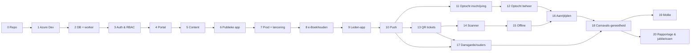
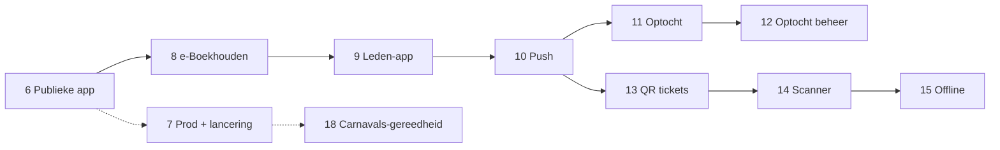

# 15 – Implementatieplan

> Status: v1.1 · **goedgekeurd** 2026-09-24 · besluiten B-01…B-07 en ADR-014 verwerkt
> Basis: requirements (01), architectuur (03), datamodel (04/14), API (05), security (06/11), RBAC (07), infrastructuur (08), besluitenregister (10), review (18), Definition of Done ([16](16-definition-of-done.md)).
> **Alle blockers zijn besloten** (sessie 2026-09-24, [10 §0a](10-open-questions.md#0a-genomen-besluiten-sessie-2026-09-24)). Planning en capaciteit zijn bewust niet opgenomen (B-07): de volgorde is technisch bepaald.

## 1. Uitgangspunten

1. **Iedere fase is afzonderlijk te bouwen, testen, reviewen en committen.** Een fase eindigt met een werkend, getest en gedeployed (minimaal Dev + Acc) increment en een git-tag `phase-NN-done`.
2. **Geen afhankelijkheid van half-afgeronde functionaliteit.** Een fase gebruikt alleen resultaten van fasen die volledig "Done" zijn. Functionaliteit die later wordt uitgebreid, is in de eerdere fase compleet voor haar eigen scope. Voorbeeld: contentdoelgroepen zijn in fase 5 compleet voor Publiek/Leden/Rol; Groep en Lid komen er in fase 8 bij.
3. **Verticale slices**: per fase database → API → portal/app → tests → documentatie.
4. **Feature flags** alleen om *complete* functionaliteit in productie aan of uit te zetten (bijv. ledensync tot OQ-50 is afgerond), nooit om half werk te verbergen.
5. **Databasewijzigingen per fase** via EF Core-migraties (één DbContext, OQ-62), backwards-compatible (expand/contract).
6. **Contract-first**: API-wijzigingen staan in OpenAPI; de gegenereerde TS-client wordt in dezelfde fase bijgewerkt.
7. De algemene **Definition of Done** staat in [16](16-definition-of-done.md). Per fase staan hieronder de *aanvullende* DoD-punten en de acceptatiecriteria.

## 2. Fasevolgorde en afwijkingen van het voorstel

| Nr | Fase | Voorstel opdrachtgever | Reden van afwijking |
|---|---|---|---|
| 0 | Repository / Foundation | 0 | — |
| 1 | Azure Development Infrastructure | 1 | — |
| 2 | Database Foundation (+ worker-fundament) | 2 | Worker-fundament (scheduler, outbox) hoort hier door B-01 |
| 3 | Authentication & RBAC | 3 | — |
| 4 | Admin Portal Foundation | 5 | Moet vóór content; heeft de ledensync niet nodig |
| 5 | **Content Management** (agenda, nieuws, foto's, uploads) | *nieuw* | De publieke app (fase 6) heeft content en beheer nodig; zonder deze fase zou fase 6 van half werk afhangen |
| 6 | Public Mobile App | 6 | — |
| 7 | **Acceptance & Production Environment (publieke lancering)** | deel van 18 | De publieke app kan live zodra er content is; productie-inrichting hoort daarom direct na de publieke app. Fase 18 blijft de carnavals-gereedheid |
| 8 | e-Boekhouden Member Synchronization (+ ledenbeheer) | 4 | Niet nodig voor de publieke app; echte ledendata in productie vraagt eerst de privacyverklaring (OQ-50) |
| 9 | Member Mobile App (+ lid worden, devices) | 7 | — |
| 10 | Push Notifications (+ inbox) | 14 | **Vervroegd**: optocht (11/12), aanrijtijden (16) en dansgarde (17) sturen meldingen; zonder push zouden die fasen halve meldingslogica bevatten |
| 11 | Parade Registration | 11 | Vóór QR: de optochtinschrijving loopt in het seizoen eerder dan de toegangscontrole tijdens carnaval |
| 12 | Parade Administration | 12 | — |
| 13 | QR Ticketing | 8 | Na de optocht (volgorde in het seizoen) |
| 14 | QR Scanner | 9 | — |
| 15 | Offline QR Scanning | 10 | — |
| 16 | Arrival Times | 13 | Na QR: klein en weinig risico; QR is complexer en krijgt voorrang |
| 17 | Dansgarde / Guardian Relationships | 16 | — |
| 18 | Carnaval Readiness: Acceptance / Security / Production | 18 | Restant na afsplitsing van fase 7 |
| 19 | **Kaartverkoop** (Mollie, pronkzitting, dagkaarten, munten) | 15 | **Naar de eerste versie gehaald** (besluit 29-09-2026); in drie delen: 19a backend + portal, 19b app + webpagina, 19c scanner/Kassa |
| 20 | Reporting & Jubilees | 17 | Buiten het MVP; basisrapportages zitten al in fase 8/12/14/15 |

```mermaid
flowchart LR
  P0[0 Repo] --> P1[1 Azure Dev] --> P2[2 DB + worker] --> P3[3 Auth & RBAC] --> P4[4 Portal] --> P5[5 Content] --> P6[6 Publieke app] --> P7[7 Prod + lancering]
  P7 --> P8[8 e-Boekhouden] --> P9[9 Leden-app] --> P10[10 Push]
  P10 --> P11[11 Optocht inschrijving] --> P12[12 Optocht beheer]
  P10 --> P13[13 QR tickets] --> P14[14 Scanner] --> P15[15 Offline]
  P12 --> P16[16 Aanrijtijden]
  P15 --> P16
  P10 --> P17[17 Dansgarde/ouders]
  P13 --> P17
  P16 --> P18[18 Carnavals-gereedheid]
  P17 --> P18
  P18 --> P19[19 Mollie]
  P18 --> P20[20 Rapportage & jubilarissen]
```

**Wijziging 2026-09-25 (besluit product owner).** Fase 7 (Acc/Prod en publieke lancering) schuift op tot ná de functionele fasen: omdat de bouw voorloopt op schema, wordt eerst zoveel mogelijk functionaliteit gebouwd en getest in Dev. De fasen 8 en verder gebruiken in Dev alleen test- of fictieve data; echte ledengegevens komen pas in een omgeving na fase 7 en OQ-50 (privacyverklaring). Fase 7 kan op elk moment tussendoor worden ingepland, uiterlijk vóór fase 18.

```mermaid
flowchart LR
  P6[6 Publieke app] --> P8[8 e-Boekhouden] --> P9[9 Leden-app] --> P10[10 Push]
  P10 --> P11[11 Optocht] --> P12[12 Optocht beheer]
  P10 --> P13[13 QR tickets] --> P14[14 Scanner] --> P15[15 Offline]
  P6 -.-> P7[7 Prod + lancering] -.-> P18[18 Carnavals-gereedheid]
```

## 3. Planning

Niet opgenomen (besluit B-07): er zijn geen datums of capaciteitsramingen. Het **MVP** omvat fase 0–18 (alles wat nodig is voor een volledig carnavalsseizoen, inclusief toegangscontrole); fase 19–20 vallen erbuiten.

## 4. Fasen

Legenda: **Tests** vermeldt de fase-specifieke tests bovenop de algemene DoD. Endpoints verwijzen naar [05-api-design.md](05-api-design.md) (allemaal onder `/api/v1`).

---

### Fase 0 — Repository / Foundation

**Doel.** Een werkende, veilige monorepo met build- en kwaliteitspipeline en lege, draaiende skeletten van API, app en portal, zodat elke volgende fase alleen functionaliteit toevoegt.

**Functionaliteit.**
- Repository volgens [03 §6](03-architecture.md#6-projectstructuur-monorepo): `Drammers.sln` (Api, Worker, SharedKernel, Infrastructure, modules als lege projecten), `apps/mobile` (Expo, TS, Expo Router, 5 tabs met placeholders), `apps/admin` (Vite + React + TS), `packages/design-tokens` (tokens uit [17](17-design-system.md), licht/donker), `packages/api-client` (generator-setup).
- App: thema-provider (licht/donker), fonts (Poppins/Inter), basiscomponenten zonder data: TabBar, LargeTitleHeader, Card, EventCard/DateBlock, ShortcutTile, FilterChips, Buttons, SettingsList, EmptyState/ErrorState (Figma-fidelity), plus een Storybook of componentpagina.
- API: `GET /health/live`, ProblemDetails-middleware, Serilog-configuratie, OpenAPI-generatie, `IClock`, strongly-typed IDs.
- Kwaliteit: `.editorconfig`, `dotnet format`, ESLint/Prettier, commit-conventie, PR-template met DoD-checklist ([16](16-definition-of-done.md)), CODEOWNERS.

**Technische componenten.** .NET 10 SDK, pnpm workspaces (OQ-64), GitHub Actions in een **publieke** repository (B-03), gitleaks (pre-commit + CI), Dependabot, CodeQL, GitHub secret scanning + push protection, private vulnerability reporting, **geen open-sourcelicentie** (alle rechten voorbehouden, OQ-74), EAS-projectconfiguratie (development-build), Renovate/Dependabot voor npm.

**Databasewijzigingen.** Geen.

**API-endpoints.** `GET /health/live`.

**Security requirements.** Geen secrets in de repo (gitleaks en push protection); `.gitignore` voor secrets; branch protection op `main` met verplichte review en groene CI; CodeQL en dependency-scan actief; `SECURITY.md` met privékanaal voor meldingen; **geen echte persoonsgegevens** in testdata of issues (publieke repo).

**Tests.** Pipeline draait unit-testprojecten (lege smoke-tests), Jest in app/portal, een snapshot-test van 3 basiscomponenten (licht/donker), een test die faalt bij een gitleaks-vondst (verificatie met een dummy-secret in een tijdelijke branch).

**Aanvullende DoD.** README bevat lokale setup (≤ 30 min van clone tot draaiende API/app/portal).

**Afhankelijkheden.** B-03 (publieke GitHub-repository), B-04 (GitHub-organisatie en accounts op naam van de vereniging).

**Acceptatiecriteria.**
- [ ] `git clone` + README-stappen → API (`/health/live` = 200), portal (leeg dashboard) en app (5 tabs, licht/donker) draaien lokaal.
- [ ] Een PR met een lintfout, een falende test of een gecommit dummy-secret wordt door CI geblokkeerd.
- [ ] Een PR kan niet naar `main` zonder groene CI en review; een gepushte dummy-secret wordt door push protection tegengehouden.
- [ ] Design tokens bevatten de Figma-merkkleuren; voor kleine tekst worden de toegankelijke varianten gebruikt (OQ-66 besloten), vastgelegd als aparte tokens.

---

### Fase 1 — Azure Development Infrastructure

**Doel.** De Dev- (en Acc-) omgeving als code, met automatische deploy van de API-skeleton en het portal.

**Functionaliteit.** Bicep-modules en parameters voor Dev en Acc ([08](08-azure-infrastructure.md)): resource group, App Service Plan B1 (gedeeld Dev/Acc) + API-app (Always On, HTTPS only, TLS 1.2, FTP uit), Azure SQL-server + DB (free offer, Entra-only), Storage-account (geen publieke toegang, shared key uit, containers aangemaakt, soft delete/versioning), Key Vault (RBAC, purge protection), Log Analytics + App Insights, beheerportal als statische bestanden in de API-app onder `/beheer` (OQ-76), ACS Email (domein later). Eén Entra External ID-tenant (B-02) met app-registraties per omgeving (API, app, portal); Dev/Acc-app-registraties op *Require user assignment* (groep `Testers`) en een custom attribuut `environmentAccess` dat als claim in het token komt; zelfregistratie uit (`isSignUpAllowed = false`); alles gescript en gedocumenteerd. Budgetalert.

**Technische componenten.** Bicep, `what-if` in CI, pipeline-identiteit met OIDC/workload identity federation per environment, deploy-workflow voor API + portal (één zip; het portal in `wwwroot/beheer`).

**Databasewijzigingen.** Alleen de lege database; DB-users/rechten volgen in fase 2.

**API-endpoints.** `GET /health/live`, `GET /health/ready` (SQL, Key Vault, Blob).

**Security requirements.** Dev/Acc-API weigert tokens zonder `environmentAccess` voor die omgeving; een niet-toegewezen gebruiker kan niet inloggen op de Dev/Acc-apps; managed identity voor de API; geen connection strings met wachtwoorden; SQL-firewall alleen App Service-outbound-IP's (B-01/OQ-60); Key Vault-references; diagnostische logs naar Log Analytics; pipeline-identiteit alleen `Contributor` op de eigen resource group; geen productietoegang.

**Tests.** Bicep-lint en `what-if` in de PR; post-deploy smoke-test (`/health/ready` = 200 in Dev); een test dat anonieme blob-toegang geweigerd wordt; een test dat SQL-login met gebruikersnaam/wachtwoord uitgeschakeld is (policy-check).

**Aanvullende DoD.** Runbook "Omgeving opnieuw opbouwen vanuit Bicep" (in `docs/runbooks/`); de kosten van Dev en Acc zijn zichtbaar in het budgetoverzicht.

**Afhankelijkheden.** Fase 0; B-01, B-02, B-04 (subscription).

**Acceptatiecriteria.**
- [x] Merge naar `main` → infra `what-if` + deploy + API + portal automatisch in Dev; `/health/ready` groen. *(2026-09-25, Deploy #3/#5)*
- [x] Het verwijderen en opnieuw uitrollen van de Dev-resource-group vanuit Bicep lukt zonder handmatige stappen (behalve de gedocumenteerde Entra-stappen). *(2026-09-25, runbook §5 + Deploy #7; nieuwe API-identiteit kreeg automatisch een databasegebruiker)*
- [x] Geen secrets in pipeline-variabelen, behalve niet-gevoelige ID's. *(OIDC; geen GitHub-secrets)*
- [x] Acc kan met dezelfde templates en andere parameters worden uitgerold. *(2026-09-25, Deploy #6)*
- [x] Een testaccount zonder toewijzing kan niet inloggen op de Dev-app; een token van de Prod-app-registratie wordt door de Dev-API geweigerd. *(2026-09-25: handmatige logintest (tester wel, niet-toegewezen account geweigerd); audience- en environmentAccess-weigering in `EnvironmentAccessTests`; live met een echt token opnieuw in fase 3/4)*

---

### Fase 2 — Database Foundation (+ worker-fundament)

**Doel.** Een betrouwbaar datafundament met migraties, conventies, least-privilege DB-rechten, auditlog, configuratie en de achtergrondverwerking waarop alle modules bouwen.

**Functionaliteit.**
- `DrammersDbContext` met schema-mapping per module, conventies ([04 §1](04-data-model.md#1-conventies)): UUIDv7, UTC, `rowversion`, auditkolommen via interceptor, enum-als-string met CHECK.
- Migratiepipeline: idempotent script, uitgevoerd door de pipeline-identiteit (`app_migrator`), vóór de app-deploy.
- DB-users/rollen: `app_runtime` (DML op module-schema's, alleen INSERT/SELECT op `audit`), `app_migrator`, `app_reporting`.
- `IAuditLogger` (append-only) en `AuditLog`-hash-keten (S).
- Configuratie: `FeatureFlag`, `AppConfiguration`, `RetentionPolicy` + `GET /app-config`.
- `CarnivalYear` (kern-dimensie) + seed 2026/2027.
- **Worker-fundament (B-01)**: `Drammers.Worker` met scheduler (`PeriodicTimer`/Coravel) + `sp_getapplock`, outbox-tabel + polling-loop, graceful shutdown, health-rapportage; één voorbeeldjob (heartbeat).

**Technische componenten.** EF Core 10, Testcontainers (SQL Server), Respawn, `Microsoft.Data.SqlClient` met Entra-auth (managed identity).

**Databasewijzigingen.** Schema's `identity, membership, content, notification, ticketing, payments, parade, import, audit, config, reporting`; tabellen `audit.AuditLog`, `config.FeatureFlag`, `config.AppConfiguration`, `config.RetentionPolicy`, `content.CarnivalYear`, `notification.Outbox`; DB-rollen en -rechten.

**API-endpoints.** `GET /app-config`, `GET /carnival-years/current`.

**Security requirements.** Runtime-identiteit zonder DDL; `UPDATE/DELETE` op `audit` onmogelijk (test); geen raw SQL zonder parameters; PII-kolommen gemarkeerd (Data Discovery & Classification-script).

**Tests.** Integratie: migraties van leeg naar laatste versie en idempotent opnieuw; `app_runtime` kan niet `DELETE FROM audit.AuditLog` (verwacht een permissiefout); `sp_getapplock` voorkomt dubbele uitvoering bij twee gelijktijdige worker-instanties; outbox-bericht wordt precies één keer verwerkt, ook na een herstart halverwege.

**Aanvullende DoD.** Datamodel-conventies in 04 bevestigd of bijgewerkt.

**Afhankelijkheden.** Fase 1.

**Acceptatiecriteria.**
- [x] Een nieuwe migratie wordt in Dev automatisch toegepast vóór de app-deploy; een mislukte migratie stopt de deploy. *(2026-09-25, Deploy #9: migraties `InitialCreate` + `DatabaseRoles` in Dev; de migratiestap staat vóór de app-uitrol en stopt de job bij een fout (exitcode ≠ 0))*
- [x] Twee gelijktijdig draaiende API-instanties voeren de heartbeat-job niet dubbel uit (log + test). *(`JobCoordinationTests`; in Dev één heartbeat per minuut in de logs)*
- [x] `GET /app-config` levert de minimale app-versie en de maintenance-vlag; de wijziging via DB is zonder deploy zichtbaar (cache ≤ 60 s). *(cache 30 s; `PublicEndpointTests`; live in Dev)*
- [x] De auditlog is aantoonbaar niet te wijzigen of te verwijderen met de runtime-identiteit. *(`PermissionTests`: UPDATE, DELETE, TRUNCATE en ALTER geweigerd voor `app_runtime`)*

---

### Fase 3 — Authentication & RBAC

**Doel.** Veilig inloggen via Entra External ID en permission-based autorisatie volgens [07](07-rbac.md), inclusief het accountmodel uit B-05.

**Functionaliteit.**
- JWT-validatie (`Microsoft.Identity.Web`, `ciamlogin.com`-authority); per omgeving de eigen audience; in Dev/Acc een verplichte `environmentAccess`-claim (B-02). **Geen JIT-provisioning**: een token van een onbekende `oid` krijgt 403 (accounts bestaan alleen via de provisioning, ADR-014).
- **Provisioning-kern** (ADR-014): `IAccountProvisioningService` met de Graph-stap (Entra-account aanmaken/uitschakelen) via een aparte provisioning-app-registratie (`User.ReadWrite.All`, certificaat in Key Vault). In deze fase alleen voor **handmatige bootstrap van beheerders** (`source_type = Manual`, via CLI en portal); de koppeling aan het lid volgt in fase 8, de volledige flows in fase 9.
- Permission-catalogus (constants + seed), standaardrollen (Lid, Groepsverantwoordelijke, Kaderlid, Dansgarde-leiding/-lid, Ouder, Raad van Elf, Scanner, Optochtcommissie, Redactie, Bestuur, Beheerder IT), `RequirePermissionAttribute`, `IPermissionService` met cache + `permissions_version`.
- Resource-authorization-framework (basisklassen voor latere handlers).
- `GET /me` (profiel, rollen, permissions, features).
- Accountblokkade (`account_status = Blocked`) en Graph-sessie-intrekking.
- `LoginHistory` (succes/mislukt, gehashte IP).
- Entra: user flow met e-mail-OTP (optioneel wachtwoord), **zelfregistratie uit**, branding. Geen CA-policy (B-02-MFA: e-mailcode naar een mailbox met MFA). Wachtwoordreset via Entra.

**Technische componenten.** Microsoft.Identity.Web, Microsoft Graph SDK (app-only, alleen `User.ReadWrite.All` in de external tenant voor revoke/delete; secret/cert in Key Vault), rate limiting (policies uit [05 §7](05-api-design.md#7-rate-limiting-aspnet-core-ratelimiter)).

**Databasewijzigingen.** `identity.User`, `Role`, `Permission`, `UserRole`, `RolePermission`, `LoginHistory`, `AccountProvisioning` + seeds.

**API-endpoints.** `GET /me`; `GET /admin/permissions`; `GET/POST/PUT/DELETE /admin/roles` (+ `/permissions`); `GET/PUT /admin/users/{id}/roles`; `POST /admin/members/{id}/block` · `/unblock` (op userniveau in deze fase: `/admin/users/{id}/block`).

**Security requirements.** Deny by default; reflectietest "elk endpoint heeft `RequirePermission` of `AllowAnonymous`"; geen permissions in het token; lock-out-preventie (laatste houder van `role.manage`); audit op alle rolwijzigingen; rate limits actief; 401 versus 403 correct; MFA afgedwongen voor de portal-app (handmatige test).

**Tests.** Token-validatietests (issuer, audience, verlopen); **permission-matrix-test** (data-driven, uitbreidbaar per fase); cache-invalidatie bij een rolwijziging; geblokkeerd account → 403; onbekende `oid` → 403 (geen JIT); token zonder `environmentAccess` in Dev → 403; Graph-provisioning idempotent (tweede aanroep maakt geen tweede account; tegen een Graph-mock); lock-out-preventie.

**Aanvullende DoD.** 07-rbac bijgewerkt als de permissions-seed afwijkt; testaccounts per rol (herkenbare `test+…@`-adressen, groep `Testers`, alleen toegewezen aan Dev/Acc-apps; credentials in de kluis).

**Afhankelijkheden.** Fase 2; B-02, B-05 (ADR-014); OQ-26.

**Acceptatiecriteria.**
- [x] Zelfregistratie is niet mogelijk; een beheerder die via de bootstrap is aangemaakt, logt in met een e-mailcode en ziet via `GET /me` zijn/haar rollen en permissions. *(2026-09-25, live in Dev)*
- [x] Een Entra-account dat buiten de provisioning om bestaat (onbekende `oid`), krijgt 403 op alle ingelogde endpoints. *(live in Dev + integratietest)*
- [x] Een beheerder kent de rol Redactie toe; binnen 5 minuten (zelfde instantie: direct) heeft de gebruiker `news.manage`; de wijziging staat in de auditlog. *(live in Dev; direct effect en auditregel in `RoleAdministrationTests`)*
- [x] ~~Het openen van de portal-app vraagt MFA~~ — vervallen door besluit B-02-MFA (2026-09-25): geen Conditional Access; beheerders loggen in met een e-mailcode naar een mailbox met MFA. Tokens bevatten geen `amr`, dus een API-controle is niet mogelijk.
- [x] Een geblokkeerd account krijgt 403 op alle ingelogde endpoints en de sessies zijn ingetrokken. *(live in Dev: Entra-account uitgeschakeld, sessies ingetrokken; deblokkeren herstelt)*
- [x] Er bestaat geen endpoint zonder expliciete autorisatie-annotatie (reflectietest groen).

---

### Fase 4 — Admin Portal Foundation

**Doel.** Een werkend, beveiligd beheerportal met de generieke functies waarop latere beheerschermen aansluiten.

**Functionaliteit.** Login (MSAL, e-mailcode), layout en navigatie volgens het menu uit [02 §6](02-functional-design.md#6-beheerportal--menu-en-release), waarbij menu-items verborgen zijn zonder permission. Dashboard (placeholder-kerncijfers, systeemstatus uit `/health/ready`). Gebruikers en rollen (overzicht, rollen toekennen met geldigheid, beheerdersaccount aanmaken via de provisioning-kern uit fase 3). Rollen/rechten-beheer. Auditlog-viewer (filters, read-only). Configuratie (feature flags, minimum-appversie, maintenance). Carnavalsjaar-beheer. Generieke tabelcomponent (sorteren, filteren, kolomkeuze, CSV/Excel-export via de API), formuliercomponenten, bevestigingsdialogen en foutweergave (ProblemDetails).

**Technische componenten.** React + Vite, TanStack Router/Query/Table, MSAL.js, gegenereerde API-client, design tokens als CSS-variabelen, Playwright + axe-core, CSP en security headers door de API (`PortalHosting`).

**Databasewijzigingen.** Geen (hooguit seeds voor configuratie).

**API-endpoints.** `GET /admin/audit-log`; `GET/PUT /admin/config/feature-flags` · `/app-config` · `/retention`; `GET/POST/PUT /admin/carnival-years` (+ `/activate`); `GET /admin/users` (zoeken); `GET /admin/dashboard` (basis).

**Security requirements.** CSP `default-src 'self'`; tokens niet in localStorage; UI verbergt, API dwingt af; auditviewer toont gemaskeerde gevoelige velden; exports worden geaudit.

**Tests.** Playwright: login (testaccount), rol toekennen, auditregel zichtbaar, config wijzigen; axe-core zonder serious/critical-meldingen; API-matrix uitgebreid met de nieuwe endpoints.

**Aanvullende DoD.** Portal responsive getest (1280 px en 390 px).

**Uitvoering (2026-09-25).**
- Het portal haalt zijn aanmeldinstellingen op via `GET /api/v1/portal-config` (publiek, geen geheimen). Daardoor is het één pakket voor Dev, Acc en Prod.
- MSAL (`msal-browser`) bewaart tokens in `sessionStorage`.
- TanStack Router met routes in code; TanStack Table v9 met sorteren en kolomkeuze; zoeken en paginering server-side.
- De export van de gebruikerslijst valt onder `role.manage` en wordt geaudit (`user.exported`).
- Playwright draait met een nep-login en een gemockte API, 22 tests op 1280 en 390 px, inclusief axe. De echte login met e-mailcode wordt handmatig getest.
- Het API-contract gebruikt enums als string en strikte getallen.

**Afhankelijkheden.** Fase 3.

**Acceptatiecriteria.**
- [x] Een bestuurder logt in (e-mailcode), kent een rol toe en ziet deze actie in de auditlog. *(2026-09-25: handmatig in Dev + Playwright)*
- [x] Een gebruiker zonder beheer-permissions ziet een lege navigatie met de melding "Geen beheerrechten" en kan geen admin-API aanroepen (403). *(Playwright + `AdminPortalApiTests`)*
- [x] Een carnavalsjaar aanmaken en activeren lukt; er is altijd precies één actief jaar. *(integratietest + Playwright)*
- [x] Exporteren van de gebruikerslijst levert een Excel met Nederlandse kolomnamen op en een auditregel. *(handmatig in Dev + integratietest)*

---

### Fase 5 — Content Management (agenda, programma, nieuws, foto's)

**Doel.** Beheer en publieke API voor events, nieuws en fotoalbums, inclusief veilige uploads. Dit is de databron voor de publieke app.

**Functionaliteit.**
- Events: CRUD, categorieën, zichtbaarheid (Public/Members/Restricted), doelgroepen **Rol** (Groep en individueel Lid volgen in fase 8), publicatiestatus/-moment, "Hoogtepunt"/badge, afbeelding, bijlagen, iCal-export.
- Nieuws: CRUD, statussen Draft/Scheduled/Published/Archived, geplande publicatie (worker-job), einddatum. De optie "push" is nog **niet** zichtbaar (volgt in fase 10).
- Foto's: albums, upload (meerdere tegelijk), volgorde, verbergen (portretrecht), derivaten (1600 px + 400 px thumbnail, EXIF/GPS gestript).
- Upload-pijplijn (ADR-008): API-stream → `quarantine` → malwarescan (OQ-65) → promote → media-job (worker).
- Audience-filter `VisibleTo(user)` (07 §4) voor Public/Members (= rol Lid)/Rol.

**Technische componenten.** Blob (user-delegation SAS), ImageSharp, HtmlSanitizer/Markdown, Defender for Storage (Prod; Dev/Acc zonder, zelfde flow), Ical.Net.

**Databasewijzigingen.** `content.EventCategory` (+ seed Carnaval/Jeugd/Vereniging/Kader), `Event`, `EventAudience`, `EventAttachment`, `News`, `NewsAudience`, `PhotoAlbum`, `PhotoAlbumAudience`, `Photo`, `MediaJob`.

**API-endpoints.** Publiek/optioneel ingelogd: `GET /events`, `/events/{id}`, `/events/{id}/ical`, `/event-categories`, `/news`, `/news/{id}`, `/photo-albums`, `/photo-albums/{id}`, `/photo-albums/{id}/photos`. Beheer: CRUD `/admin/events` (+ audiences, attachments), `/admin/news` (+ publish/schedule/archive), `/admin/photo-albums` (+ photos upload, volgorde, hidden).

**Security requirements.** Magic-byte-controle en allowlist (geen SVG/HTML); groottelimieten; server-gegenereerde blob-paden; SAS ≤ 15 min, read-only, per blob; rich text gesanitized; gasten zien alleen Public + Published binnen het publicatievenster; bij geen toegang 404 (geen 403) om het bestaan niet te lekken; audit bij publiceren/verwijderen.

**Tests.** Audience-matrix (gast/Lid/Ouder/rol × Public/Members/Restricted); geplande publicatie verschijnt op het juiste moment (fake clock); EXIF-GPS verwijderd (test-image); upload van een `.exe` met `.jpg`-extensie geweigerd; een "infected" scanresultaat (gesimuleerd) → verwijderd + melding; SAS-verloop; Playwright: event aanmaken → zichtbaar in de publieke API.

**Aanvullende DoD.** OpenAPI-client opnieuw gegenereerd; publieke endpoints met `Cache-Control`/ETag.

**Uitvoering (2026-09-25).**
- **Mediaverwerking via de bestaande outbox** (bericht `media.process-photo`) in plaats van een aparte tabel `content.MediaJob`. Dat is dezelfde wachtrij met claimen, nieuwe pogingen en herstel na een crash (ADR-007).
- **Malwarescan** via `IMalwareScanner`. Dev en Acc slaan de scan over, met dezelfde flow (OQ-65); Defender for Storage in Prod volgt in fase 7.
- **Beeldverwerking** met ImageSharp 3.1 (Six Labors Split License: gratis voor non-profits). Versie 4 eist bij een Release-build een licentiesleutel; daarom 3.1. Toegestaan zijn JPEG, PNG en WebP, bepaald op inhoud (magic bytes); HEIC wordt niet ondersteund. Derivaten van 1600 en 400 px, zonder EXIF, GPS, IPTC en XMP. Ook event- en nieuwsafbeeldingen worden zonder metadata opgeslagen.
- **Tekst** in Markdown; de API levert gesanitizede HTML (Markdig zonder ruwe HTML + HtmlSanitizer).
- **iCal** met een eigen, kleine RFC 5545-writer in plaats van Ical.Net.
- **Nieuwe blob-container `content`** voor afbeeldingen en bijlagen van events en nieuws.
- **Geplande content** is vanaf het publicatiemoment zichtbaar (audience-filter); de job `content-publisher` zet de status elke minuut definitief op Gepubliceerd en legt dat vast in de auditlog.

**Afhankelijkheden.** Fase 4; OQ-65.

**Acceptatiecriteria.**
- [x] Een redacteur publiceert een event voor "Iedereen" → het staat binnen een minuut in `GET /events` zonder token. *(2026-09-25: handmatig in Dev + integratietest + Playwright)*
- [x] Een event met zichtbaarheid "Leden" is niet zichtbaar voor een gast of een ouderaccount zonder rol Lid (404 op detail), wel voor een Lid. *(audience-matrix in `ContentTests`; handmatig in Dev)*
- [x] Nieuws met een publicatiemoment in de toekomst verschijnt automatisch op dat moment. *(handmatig in Dev + nepklok-test)*
- [x] Een geüploade foto heeft een thumbnail en een display-versie, zonder GPS-metadata; een verborgen foto is direct onzichtbaar. *(handmatig in Dev; GPS-strip bewezen in `FileUploadTests`)*
- [x] Er is geen enkele blob anoniem opvraagbaar. *(live: anonieme toegang tot alle containers geweigerd; SAS ≤ 15 min)*

---

### Fase 6 — Public Mobile App

**Doel.** De publieke app volgens de Figma-schermen 01–07 (licht/donker, iOS/Android) met echte data, zonder login.

**Functionaliteit.** Home (hero, countdown uit CarnivalYear, eerstvolgende activiteit, snelkoppelingen, laatste nieuws). Programma (filterchips, maandsecties, badges, detail). Activiteit detail (toevoegen aan agenda; ticket-CTA verborgen tot fase 19). Nieuws (uitgelicht + lijst + detail). Foto's (albums + grid + viewer). Meer (Vereniging-, Locatie- en Contactpagina's als content/statisch; "Uitslagen" → nieuwscategorie, OQ-40; "Word ook een Drammer!" → informatiepagina, het formulier volgt in fase 9; instellingen: thema). Optocht-tab: statische publieke optochtinfo uit de CarnivalYear-configuratie (volledige optochtdata in fase 11). Offline: persistente cache van de laatste content, offline-banner. Forced update/maintenance via `/app-config`. Deeplinks naar events/nieuws.

**Technische componenten.** Expo Router, TanStack Query (persist), `expo-image`, `expo-calendar`/ics-deeplink, `expo-updates` (code signing), EAS Build (development/preview), Maestro.

**Databasewijzigingen.** Geen.

**API-endpoints.** De publieke GET's uit fase 2 en 5.

**Security requirements.** Geen secrets in de bundle; alleen HTTPS (ATS/network security config); deeplink-validatie; geen PII in logs/crashreports; EAS Update-codesigning.

**Tests.** Jest/RTL voor schermen met fixtures; snapshot licht/donker; Maestro-flows (home → event-detail → toevoegen aan agenda; nieuws; foto-album); offline-weergave (vliegtuigmodus); forced update bij een te lage versie; toegankelijkheidscheck (VoiceOver/TalkBack) op alle 7 schermen; Dynamic Type 200 %.

**Aanvullende DoD.** Visuele review tegen Figma (per scherm, per variant) door de product owner/designer; afwijkingen vastgelegd.

**Uitvoering (2026-09-25).**
- **Data** via de gedeelde, getypte client (`@drammers/api-client`) en TanStack Query. De cache blijft een week bewaard in AsyncStorage (offline). Na 30 seconden ververst een scherm zijn data zodra je het opent (ook bij wisselen van tab), en pull-to-refresh haalt altijd direct op. De publieke API antwoordt met `Cache-Control: no-cache` en een ETag, zodat het toestel geen verouderde lijst uit zijn HTTP-cache toont en een ongewijzigde lijst alleen een 304 kost; alleen de categorielijst houdt 5 minuten. Afbeeldingen gebruiken `expo-image` met een vaste `cacheKey` per item, zodat ze ook offline zichtbaar blijven terwijl de SAS-query per aanroep verandert.
- **API-adres** via `EXPO_PUBLIC_API_URL` (per build in te stellen); zonder waarde gebruikt de app Dev. De bundle bevat geen secrets.
- **Toevoegen aan agenda** via het systeemformulier (`expo-calendar/legacy`, zonder agendatoestemming); lukt dat niet, dan de iCal-export van de API. De nieuwe expo-calendar-API van SDK 57 vraagt wél toestemming en is daarom niet gebruikt.
- **Beschrijvingen** (gesanitizede HTML uit fase 5) worden native weergegeven met een kleine eigen parser, zonder WebView. Alleen http(s)- en mailto-links zijn klikbaar.
- **Deeplinks**: `drammers://activiteit/{id}` en `drammers://nieuws/{id}`. Alleen een geldige GUID gaat naar de API; al het andere toont "niet gevonden".
- **Forced update en onderhoud** via `/app-config`. Zonder antwoord (offline, eerste start) blijft de app bruikbaar.
- **Optocht-tab**: de datum volgt uit het actieve carnavalsjaar (carnavalszondag). Tijden, route en tijdlijn staan voorlopig in `apps/mobile/src/content/static.ts`; de deelnemers en de inschrijving volgen in fase 11.
- **Meer**: Vereniging, Locatie, Contact en Lid worden hebben plaatshoudertekst in `content/static.ts`, met de melding "Voorlopige informatie". Het bestuur levert de definitieve teksten aan vóór fase 7. Contact gebruikt het supportadres uit `/app-config`. Uitslagen toont nieuws met de categorie "Uitslagen" (aanbeveling OQ-40).
- **Instellingen**: alleen Weergave (Automatisch/Licht/Donker). De schakelaars voor pushmeldingen en herinneringen uit Figma volgen in fase 10.
- **Tests**: Jest/RNTL voor alle schermen met fixtures, snapshots in licht en donker voor de 7 Figma-schermen, en app-config- en offlinetests. De Maestro-flows staan in `apps/mobile/.maestro/`; ze draaien pas als Maestro en een build beschikbaar zijn.
- **Nog open**: EAS Build/Update (code signing) vraagt een Expo-account van de vereniging, en de visuele review door de product owner. Tot dan werkt de review met Expo Go (`pnpm --filter @drammers/mobile start`); alle gebruikte native modules zitten in Expo Go.

**Afhankelijkheden.** Fase 5; OQ-40, OQ-42 (niet nodig voor deze schermen), OQ-66.

**Acceptatiecriteria.**
- [x] De 7 Figma-schermen zijn in licht en donker op iOS en Android gerealiseerd; de product owner accepteert de visuele review. *(2026-09-25: geaccepteerd door de product owner; visuele verfijning volgt in een latere versie. Snapshots licht/donker in `snapshots.test.tsx`)*
- [x] Content die in het portal wordt gepubliceerd, verschijnt na pull-to-refresh in de app. *(handmatig getest in Dev na de fix `no-cache` + verversen bij openen van een scherm; tests in `screens.test.tsx`)*
- [ ] Zonder netwerk toont de app de laatst geladen content met de offline-banner; er zijn geen crashes. *(geautomatiseerd getest; test op een toestel (vliegtuigmodus, Maestro-flow 05) verplaatst naar de go-live-checklist van fase 7)*
- [x] Een minimale appversie boven de geïnstalleerde versie toont een blokkerend updatescherm. *(tests "app-config" in `screens.test.tsx`)*
- [ ] VoiceOver/TalkBack leest alle tegels, knoppen en de countdown begrijpelijk voor. *(labels en rollen aanwezig en getest; controle met VoiceOver/TalkBack op een toestel verplaatst naar de go-live-checklist van fase 7)*

**Bekende punten voor later.** Visuele verfijning na de review van de product owner (2026-09-25); de afwijkingen staan in [17 §9](17-design-system.md).

---

### Fase 7 — Acceptance & Production Environment (publieke lancering)

**Doel.** Een productieomgeving die aan de security- en beheerseisen voldoet, en de publieke lancering (portal + publieke app).

**Functionaliteit.** Productie-infra via Bicep (eigen subscription/resource group, Prod-app-registraties in de gedeelde tenant (B-02), geo-redundante backups, LTR, blob-PITR, Defender for Storage, alerts en action group, budget). Gecontroleerde prod-deploy (B-03). Custom domains (`api.`, `beheer.`, OQ-67). Store-release: TestFlight/Play internal → productie. Privacyverklaring bijgewerkt (OQ-50) en in de app/portal gelinkt. Supportmodel (OQ-52). Runbooks: deploy/rollback, restore (PITR), secret-rotatie, incident. Break-glass-accounts. Feature flag `members-sync` = uit.

**Technische componenten.** Bicep prod-parameters, Azure Monitor alerts ([08 §9](08-azure-infrastructure.md#9-observability-en-alerts-69)), availability test, EAS Submit.

**Databasewijzigingen.** Geen (migraties naar Prod via de pipeline).

**API-endpoints.** Geen nieuwe.

**Security requirements.** Prod alleen via de pipeline met goedkeuring; mensen standaard `Reader` op Prod; SQL-auditing aan; Key Vault purge protection; ZAP-baseline tegen Acc zonder high findings; restore-test van Acc uitgevoerd.

**Tests.** Smoke-tests Prod na deploy; restore-oefening (PITR naar een tijdelijke DB) met gedocumenteerde duur; alert-test (geforceerde 5xx → melding ontvangen); rollback-oefening (vorige versie opnieuw deployen).

**Aanvullende DoD.** Go-live-checklist afgetekend door de product owner en de technisch eigenaar. De checklist bevat ook de uit fase 6 verplaatste toesteltests: offline (vliegtuigmodus, Maestro-flow 05) en VoiceOver/TalkBack op alle 7 schermen.

**Afhankelijkheden.** Fase 6; B-04 (store-accounts, domein), OQ-50, OQ-52, OQ-67.

**Acceptatiecriteria.**
- [ ] De app staat in de App Store en Play Store (of in TestFlight/Internal testing als de review uitloopt) en toont productie-content.
- [ ] Een productie-deploy is niet mogelijk zonder de goedkeuringsstap.
- [ ] Een PITR-restore is geoefend; de hersteltijd (RTO) is gemeten en ligt binnen 8 uur.
- [ ] Alerts komen aan bij de action group; de availability test staat aan.
- [ ] De privacyverklaring is gepubliceerd en vanuit app en portal bereikbaar.

---

### Fase 8 — e-Boekhouden Member Synchronization (+ ledenbeheer)

**Doel.** Een betrouwbare, idempotente ledensync volgens ADR-010 en de ledenbeheerschermen in het portal.

**Functionaliteit.**
- `EBoekhoudenClient` (session, member list/detail, throttling ≤ 5 req/s, retry, sessie afsluiten).
- Sync-job (nachtelijk + handmatig + dry-run), hash-vergelijking, veldmapping (vrije velden volgens B-06, configureerbaar), naam-parser, massadeletie-guard, conflicten.
- Portal: SyncJobs (tellingen), items, conflicten afhandelen, mappingconfiguratie (`config.manage`), ledenlijst (zoeken, filters status/leeftijd/inschrijfjaar/rol), lid-detail (bron per veld, syncstatus, laatste login), lokale velden bewerken (status-override, geldigheid), export.
- **Groepen** (`Group`, `GroupMembership`) + uitbreiding contentdoelgroepen met **Groep** en **individueel Lid** (REQ-EVT-02 compleet).
- Basisrapportage: actief/inactief, per rol, per leeftijdsklasse, per inschrijfjaar (Excel/CSV).

**Technische componenten.** Typed `HttpClient` + Polly, WireMock.Net (contracttests tegen fixtures uit de officiële OpenAPI-spec), worker-scheduler.

**Databasewijzigingen.** `membership.Member` (incl. EB-velden, hash, syncstate), `membership.Group`, `GroupMembership`, `import.SyncJob`, `SyncJobItem`, `SyncConflict`; `identity.User.member_id`-FK; configuratie van de mapping in `config.AppConfiguration`.

**API-endpoints.** `POST /admin/members/import` (`?dryRun`), `GET /admin/sync-jobs` (+ `/{id}` + items), `GET/POST /admin/sync-conflicts` (+ `/{id}/resolve`), `GET /admin/members`, `GET /admin/members/{id}`, `PATCH /admin/members/{id}`, `GET /admin/members/export`, CRUD `/admin/groups` (+ leden), `GET /admin/reports/members`.

**Security requirements.** Token alleen in Key Vault, alleen door de sync-module gelezen; IBAN/BIC/mandaat/notitie worden niet gemapt en niet gelogd; logs zonder PII-waarden; export geaudit; feature flag `members-sync` in Prod pas aan na OQ-50 en een dry-run-review.

**Tests.** Idempotentie (2× dezelfde bron → 0 wijzigingen), nieuw/gewijzigd/verdwenen/teruggekeerd, parsefout behoudt de oude waarde, massadeletie-guard (> 10 %), dubbele lidnummers → conflict, e-mailwijziging bij een actief account → conflict, lokale velden onaangeroerd, sessie verlopen halverwege, 5xx-retry, contracttest tegen WireMock-fixtures.

**Aanvullende DoD.** Dry-run-rapport tegen de echte (of test-)administratie gereviewd door de secretaris.

**Uitvoering (2026-09-25).** In drie delen: 8a backend, 8b portal, 8c groepen en rapportage.
- **8a** — `membership.Member`, `import.SyncJob/SyncJobItem/SyncConflict`, FK `identity.User.member_id`; e-Boekhouden-client (alleen lezen, ≤ 5 req/s, retry op 429/5xx, sessie intrekken), sync volgens ADR-010 via de outbox (max. één run tegelijk), dry-run, massadeletie-guard (> 10 %), conflicten, naam-parser, mapping van vrije velden in `config.AppConfiguration`, nachtelijke run om 03:00 achter de feature flag `members-sync`.
- **Echt ledenbestand in Dev** (besluit OQ-04): de functie **Alle leden verwijderen** (`POST /admin/members/purge`, recht `member.purge`) verwijdert leden, syncruns en conflicten, ontkoppelt accounts en zet de nachtelijke sync uit; alleen in Dev/Acc. Zie de [runbook](runbooks/eboekhouden-koppeling.md).
- **8b** — portal: **Leden** (zoeken, filters op status en sync, Excel-export, lid-detail met bron per veld, lokale velden, "nu op inactief zetten", **Alle leden verwijderen** met getypte bevestiging) en **Ledensync** (dry-run en echte run starten, runs volgen met automatisch verversen, rapport per lid, conflicten afhandelen, mapping van de vrije velden). Bij het testen op mobiele breedte bleek dat tabellen de hele pagina breder maakten (ook bij Gebruikers); opgelost, en elke pagina-test controleert nu dat er niet horizontaal gescrold hoeft te worden.
- **8c** — `membership.Group` en `GroupMembership` (functie Lid/Leiding, optioneel tijdelijk); content met zichtbaarheid **Beperkt** kan nu naast rollen ook **groepen** en **individuele leden** als doelgroep hebben (REQ-EVT-02). Alleen een actief lid telt mee (geen geschorst/inactief lid, geen verlopen groepslidmaatschap). Redacteuren kiezen groepen via een eigen keuzelijst zonder ledengegevens; individuele leden kiezen kan alleen met `member.read`. **Rapportage** (`report.view`): aantallen per status, rol, leeftijdsklasse, inschrijfjaar en groep, met Excel-export (geaudit, geen namen).
- **Contracttests** met een gestubde `HttpMessageHandler` in plaats van WireMock.Net (lichter, zelfde dekking: sessie, paginering, headers, retry, afmelden); de synclogica is getest met een e-Boekhouden in het geheugen tegen een echte SQL Server.
- **Beheerportal in nieuw ontwerp** (2026-09-26): het portal volgt nu het Figma-ontwerp (pagina "🖥️ Beheerportal"): zijbalk met secties, dashboard, leden met gevarenzone, lid-detail en ledensync. Zie [17-design-system §10](17-design-system.md).
- **Dataminimalisatie**: het model van de client heeft geen velden voor IBAN, BIC, mandaat, notitie of factuuradressen; die worden dus nooit ingelezen.

**Afhankelijkheden.** Fase 5 (audiences uitbreiden); fase 7 alleen voor de inzet met echte ledengegevens in Prod; **B-06**, OQ-03, OQ-04, OQ-06, OQ-50 (Prod).

**Acceptatiecriteria.**
- [x] Een eerste dry-run toont het verwachte aantal nieuwe leden en eventuele parsefouten; na goedkeuring maakt de echte run exact dat aantal aan. *(2026-09-25: dry-run en echte run door de product owner uitgevoerd op het echte ledenbestand in Dev; test `Dry_run_rapporteert_maar_schrijft_geen_leden`)*
- [x] Een tweede run zonder wijzigingen in e-Boekhouden rapporteert 0 nieuw / 0 gewijzigd. *(test `Tweede_run_zonder_wijzigingen_is_nul_nieuw_en_nul_gewijzigd`)*
- [x] Een lid dat uit e-Boekhouden verdwijnt, wordt `Missing` en na bevestiging `Inactive`; rollen, devices en tickets blijven bewaard. *(test `Verdwenen_lid_wordt_eerst_missing_en_daarna_inactief_…`)*
- [x] Als > 10 % van de leden ontbreekt, wordt niemand gedeactiveerd en gaat er een alert uit. *(test `Massadeletie_guard_…`; de alert is een conflict `MassDeletionGuard`, zichtbaar op Ledensync en onder "Aandacht nodig" op het dashboard)*
- [x] Een event met doelgroep "Groep Jeugdcommissie" is alleen zichtbaar voor leden van die groep. *(test `Event_voor_groep_Jeugdcommissie_is_alleen_zichtbaar_voor_leden_van_die_groep`)*

**Status (2026-09-26): Done** (tag `phase-08-done`). Open punt uit de aanvullende DoD: de review van het dry-run-rapport door de secretaris gebeurt vóór de inzet in Prod (fase 7, samen met OQ-50).

---

### Fase 9 — Member Mobile App (+ accountverzoeken, lid worden, provisioning, apparaten, AVG)

**Doel.** Alleen leden (en ouders van minderjarige leden) krijgen een account volgens ADR-014; leden loggen in en beheren hun gegevens; nieuwe leden kunnen zich aanmelden en worden na goedkeuring automatisch in e-Boekhouden en Entra ID aangemaakt.

**Functionaliteit.**
- **Accountverzoek bestaand lid** ("Ik ben al lid"): app en webpagina, lidnummer + e-mailadres, generieke respons; exacte match → Entra-account + welkomstmail; geen match → wachtrij van het bestuur (goedkeuren na correctie van het e-mailadres in e-Boekhouden, of afwijzen).
- **Lid worden**: formulier in app en webpagina (zonder account), e-mailverificatie, Turnstile (OQ-45), minderjarigen < 16 met ouder-/verzorgergegevens (OQ-15); portal-wachtrij, beoordelen, goedkeuren/afwijzen met reden.
- **Provisioning-saga** (ADR-014) na goedkeuring: `POST /v1/member` in e-Boekhouden (eerst zoeken op e-mail; vrije velden volgens B-06) → lokaal `Member` + rol Lid → Entra-account via Graph → ouderaccount indien van toepassing → welkomstmail. Portal: provisioningstatus, "opnieuw proberen", "handmatig koppelen". Levenscyclus: lid inactief/overleden → Entra-account uitgeschakeld (koppeling met de sync uit fase 8).
- **App voor leden**: inloggen (OIDC + PKCE via systeembrowser; e-mailcode), uitloggen, Mijn gegevens (read-only EB-velden met hint "wijzigen via secretariaat"), lidmaatschapsstatus, Mijn apparaten (lijst, naam wijzigen, afmelden), account verwijderen, AVG-export aanvragen. Rolafhankelijke home-tegels (02 §4). Ledencontent zichtbaar (audience Members). Het inlogscherm heeft **geen** "Registreren".
- Portal: device-overzicht per gebruiker, device intrekken; account voor een bestaand lid aanmaken (`provision-account`).
- **Spike OQ-68** (1–2 dagen): hardware-ECDSA-sleutel via een Expo native module op iOS en Android; resultaat vastgelegd in ADR-005 (geen productcode).

**Technische componenten.** `expo-auth-session`, `expo-secure-store`, ACS Email (verificatie- en welkomstmails), Turnstile, Microsoft Graph (provisioning-app-registratie), `EBoekhoudenClient` uitgebreid met `POST /v1/member` (en `PATCH` voor e-mailcorrectie), worker-job voor de saga (retry met backoff).

**Databasewijzigingen.** `identity.Device` (incl. nullable `public_key`, `attestation_status`, `trusted_scanner`, `device_status`), `identity.AccountRequest`, uitbreiding van `identity.AccountProvisioning` (alle stappen), `membership.MembershipApplication` (statussen volgens ADR-014, `email_verified_at`, `provisioning_id`), `MembershipApproval`, `membership.Guardian` + `GuardianMemberRelation` (minimaal voor ouderaccounts bij aanvragen van minderjarigen; beheer en meldingen volgen in fase 17), `membership.PrivacyRequest`.

**API-endpoints.** `POST /account-requests`, `POST /membership-applications`, `POST /membership-applications/{id}/verify-email`, `GET /me/member`, `GET/POST/DELETE /me/devices` (+ naam), `DELETE /me`, `POST /me/privacy/export`; beheer: `GET /admin/account-requests` (+ approve/reject), `GET /admin/membership-applications`, `POST /admin/membership-applications/{id}/start-review|approve|reject`, `GET /admin/account-provisioning` (+ retry/link-member), `POST /admin/members/{id}/provision-account`, `GET/POST /admin/devices` (+ `/{id}/revoke`), `GET/POST /admin/privacy-requests` (+ export/anonymize).

**Security requirements.** Geen Entra-account zonder goedkeuring of exacte match (ADR-014); generieke respons op accountverzoeken (geen enumeratie); rate limits en Turnstile op alle anonieme formulieren; e-mailverificatie vóór `Submitted`; handmatige goedkeuring afgedwongen (geen automatische transitie naar `Approved`); Graph- en e-Boekhouden-schrijfacties alleen door de provisioning-service en geaudit; saga idempotent (geen dubbele leden of accounts); tokens in Keychain/Keystore; AVG-export via een tijdelijke link (24 uur) en geaudit; account verwijderen verwijdert ook het Entra-account.

**Tests.** Accountverzoek: match → account (Graph-mock), mismatch → wachtrij, dubbele aanvraag → geen tweede account, identieke respons en responstijd bij match en mismatch; lid worden: alle transities + ongeldige transities, geen `Approved` zonder `member.approve`, geen `Submitted` zonder e-mailverificatie; saga: fout na `EbCreated` → retry hervat zonder tweede `POST /v1/member` (WireMock), bestaand lid met hetzelfde e-mailadres in e-Boekhouden → koppelen in plaats van aanmaken; minderjarige aanvraag → ook ouderaccount + relatie; lid inactief → Entra-account uitgeschakeld; Maestro: account aanvragen → welkomstmail → inloggen met e-mailcode → ledenevent zichtbaar; device afmelden → token-refresh faalt voor dat device; privacy-export bevat alle gegevenscategorieën.

**Aanvullende DoD.** Figma-ontwerpen voor inloggen/account aanvragen/lid worden/Mijn gegevens aanwezig of gereviewde componentvariant (OQ-42); teksten van verificatie- en welkomstmails goedgekeurd door het bestuur; e-Boekhouden-token met schrijfrechten aangemaakt onder een gebruiker met minimale rechten (OQ-03).

**Uitvoering.** In drie delen (besluit product owner 2026-09-26): **9a** leden-app en accounts voor bestaande leden, **9b** lid worden met aanmaken in e-Boekhouden, **9c** spike OQ-68. In Dev schrijft de saga niet naar e-Boekhouden (Dev gebruikt de echte administratie, OQ-04); een gesimuleerde stap vervangt `POST /v1/member` tot Acc/Prod met een token met schrijfrechten (OQ-03). Nieuwe schermen zijn gebouwd met de bestaande componenten; Figma volgt (OQ-42).
- **9a (2026-09-26)** — `identity.Device`, `identity.AccountRequest`, `membership.PrivacyRequest`. "Ik ben al lid" (`POST /account-requests`, 5 per 10 min per IP, altijd 202 met dezelfde tekst; het werk gebeurt in de worker, dus ook de responstijd verraadt niets) → exacte match → saga `account.provision` (gebruiker met rol Lid → welkomstmail via ACS; het lid maakt de inlog zelf met e-mail + code en de API koppelt die, zie ADR-014 herzien 2026-09-27); geen match → wachtrij **Accountverzoeken** in het portal (goedkeuren met het e-mailadres uit e-Boekhouden, of afwijzen). **App-account aanmaken** vanuit het lid-detail. App: inloggen (OIDC + PKCE via de systeembrowser, e-mailcode, refresh-token in Keychain/Keystore, in Expo Go via de doorstuurpagina `/app/auth-redirect`, alleen Dev/Acc), Mijn gegevens (alleen lezen, hint naar het secretariaat), Mijn apparaten (afmelden → 401 `DEVICE_REVOKED`), account verwijderen (ook in Entra), AVG-export (JSON, 24 uur). Persoonlijke gegevens komen niet in de offline cache; bij in- en uitloggen wordt die geleegd. Portal: apparaten per gebruiker met intrekken. Zie [runbook leden-app](runbooks/leden-app.md).
- **9b-1 (2026-09-27)** — besluiten: lid vanaf 5 jaar, eigen account vanaf 16 (OQ-15); IBAN + doorlopende SEPA-machtiging in het formulier; voorlopig geen Turnstile (OQ-45). `membership.MembershipApplication` en `membership.GuardianRelation`. Formulier in de app en op de openbare webpagina `/lid-worden` (eigen CSP, geen externe bronnen) → e-mailcode (= indienen) → portal **Aanmeldingen** (beoordelen, goedkeuren, afwijzen met reden, notities) → saga: `POST /v1/member` (geverifieerd tegen de OpenAPI-spec; idempotent via zoeken op e-mail + naam; in Dev gesimuleerd) → lokaal lid → account (lid, of ouder met rol Ouder + relatie; broertjes/zusjes delen het ouderaccount) → welkomstmail → IBAN gewist. Zie [runbook leden-app](runbooks/leden-app.md).
- **9b-2 (2026-09-27)** — **levenscyclus**: wordt een lid inactief, geschorst of overleden (sync of lokaal in het portal), dan gaat het account uit en de inlog in Entra uit met ingetrokken sessies (via de outbox); weer actief = weer aan. Accounts met een beheerrol (bestuur, redactie, IT, …) blijven aan. **AVG in het portal** (`member.privacy`): pagina AVG-verzoeken (exports door leden en bestuur, wissingen) en op de gebruiker "Gegevens exporteren" en "Alle app-gegevens wissen" (account, inlog, aanmeldingen, accountverzoeken, aanmeldhistorie, apparaten, ouderrelaties; de auditlog blijft; e-Boekhouden doet het secretariaat). **Opruimen** elke nacht om 03:30 volgens `config.RetentionPolicy`: onbevestigde aanmeldingen (7 dagen), afgewezen aanmeldingen, afgehandelde accountverzoeken, aanmeldhistorie, verlopen exports, verwerkte outbox-berichten (30 dagen).
- **9c (2026-09-27)** — spike OQ-68: eigen Expo-module `modules/device-key` (Secure Enclave / StrongBox-TEE, ECDSA P-256, publieke sleutel als SPKI, handtekening r‖s), spikescherm in ontwikkel- en EAS-spikebuilds, QR-layout en base45 volgens ADR-005 (97 bytes → QR-versie 6), .NET-verificatie van vectoren. Voorlopig GO; metingen op toestellen via [runbook hardwaresleutel-spike](runbooks/hardwaresleutel-spike.md), resultaat in ADR-005.
- **Bewust niet in fase 9:** rolafhankelijke home-tegels (Mijn QR, optochtgroep, dansgarde, kader, scanmodus) hangen allemaal van nog niet gebouwde functies af en komen in fase 11, 13, 14 en 17; Turnstile (OQ-45) naar fase 7, samen met app-attestatie, omdat de API anders via de app-route te omzeilen is.
- **Beperking apparaatcheck:** de API weigert een afgemeld apparaat op basis van de installatie-id die de app meestuurt. Een client die geen id meestuurt, wordt niet per apparaat tegengehouden; een echte apparaatbinding volgt met de hardwaresleutel (OQ-68, fase 13). Het Entra-refresh-token blijft tot het verloopt geldig, maar de app wist het bij 401.

**Afhankelijkheden.** Fase 8 (ledenkopie, e-Boekhouden-client, groepen); B-05/ADR-014, B-06; OQ-03, OQ-15, OQ-42, OQ-45.

**Acceptatiecriteria.**
- [x] Een bestaand lid vraagt met lidnummer + het e-mailadres uit e-Boekhouden een account aan, ontvangt een welkomstmail, logt in met een e-mailcode en ziet ledencontent en de eigen gegevens. *(test `Exacte_match_geeft_account_welkomstmail_en_eigen_gegevens`; 2026-09-27 door de product owner doorlopen in Dev met Expo Go)*
- [x] Een aanvraag met een onjuist lidnummer of e-mailadres geeft dezelfde melding als een juiste; er ontstaat geen Entra-account en het verzoek staat in de wachtrij van het bestuur. *(test `Mismatch_geeft_hetzelfde_antwoord_geen_account_en_komt_in_de_wachtrij`; sinds ADR-014 herzien maakt de API nooit zelf een Entra-account, test `Zelf_gemaakte_inlog_zonder_goedkeuring_blijft_onbekend`)*
- [x] Een nieuwe aanmelding verschijnt pas na e-mailverificatie in de wachtrij; zonder goedkeuring bestaat er geen lid in e-Boekhouden en geen Entra-account. *(tests `Code_verloopt_…`, `Alleen_met_member_approve`)*
- [x] Na goedkeuring staat het lid (met lidnummer en vrije velden) in e-Boekhouden, lokaal en in Entra ID, en is de welkomstmail verstuurd; bij een minderjarige ook het ouderaccount met de relatie. *(tests `Volwassene_meldt_zich_aan_…`, `Minderjarige_ouder_krijgt_het_account_…`, `Met_schrijven_aan_gaat_het_lid_met_machtiging_naar_e_Boekhouden_…` tegen een nagebootste e-Boekhouden-API. In Dev is schrijven uit (gesimuleerd lidnummer `SIM…`); de echte `POST /v1/member` volgt in Acc met een token met schrijfrechten, OQ-03. Entra: de inlog maakt het lid zelf, de API koppelt die, ADR-014 herzien)*
- [x] Een provisioning die halverwege faalt, is in het portal zichtbaar en slaagt na "opnieuw proberen" zonder dubbele leden of accounts. *(test `Provisioning_die_halverwege_faalt_is_zichtbaar_en_slaagt_na_opnieuw_proberen_zonder_dubbelen`)*
- [x] Een lid ziet de eigen apparaten, kan er één afmelden, en dat apparaat is daarna uitgelogd. *(test `Apparaat_aanmelden_hernoemen_en_afmelden_waarna_dat_apparaat_is_uitgelogd`)*
- [x] Het spike-rapport voor OQ-68 is opgeleverd met een go/no-go voor ADR-005. *(ADR-005 §Spike-resultaat: voorlopig GO; de module compileert op iOS en Android, .NET verifieert de handtekeningen. De metingen op toestellen lopen en worden aan ADR-005 toegevoegd.)*

**Status (2026-09-28): Done** (tag `phase-09-done`). Open punten, geen blokkade voor volgende fasen:
- OQ-68: metingen op Android-toestellen (loopt) en op een iPhone (vraagt het Apple Developer Program, fase 7).
- Aanvullende DoD: teksten van verificatie-, welkomst- en herinneringsmails ter goedkeuring bij het bestuur; Figma-ontwerpen voor inloggen, account aanvragen, lid worden en Mijn gegevens (OQ-42); e-Boekhouden-token met schrijfrechten (OQ-03) bij het inrichten van Acc.
- Turnstile (OQ-45) en app-attestatie: fase 7.
- Knop "Toegang tot testomgeving": werkt na `register-provisioning-app.sh dev|acc` en de variabelen `DVD_TESTERS_GROUP_ID` / `DVD_ENVIRONMENT_ACCESS_ATTRIBUTE` (runbook leden-app §5).

---

### Fase 10 — Push Notifications (+ inbox en voorkeuren)

**Doel.** Gerichte pushmeldingen met inbox, voorkeuren, delivery- en read-status (ADR-009). Het fundament voor alle latere automatische meldingen.

**Functionaliteit.**
- App: push-toestemming (op een logisch moment), tokenregistratie (ingelogd en gast), Android-channels per categorie, inbox (lijst, gelezen/ongelezen, deeplinks), notificatievoorkeuren (Dringend niet uit te zetten).
- Portal: melding opstellen (titel ≤ 65, body ≤ 240, categorie, deeplink), doelgroep (iedereen/leden/rollen/groepen/specifieke leden), preview van aantallen, direct of gepland versturen, annuleren, historie met delivery/read-statistieken.
- Nieuws: optie "push bij publicatie" (koppeling fase 5).
- `INotificationService` (domeininterface) voor systeemmeldingen, bruikbaar door latere fasen.
- Worker: fan-out via de outbox, Expo-batches van 100, receipts na ≥ 15 min, `DeviceNotRegistered` → token deactiveren.

**Technische componenten.** `expo-notifications`, Expo Push API met access token (enhanced security), `IPushSender`.

**Databasewijzigingen.** `notification.Notification`, `NotificationRecipient` (incl. nullable `on_behalf_of_member_id` voor fase 17), `PushDevice`, `NotificationPreference`.

**API-endpoints.** `POST /push-devices/anonymous`, `PUT /me/devices/{id}/push-token`, `GET /me/notifications`, `POST /me/notifications/{id}/read`, `GET/PUT /me/notification-preferences`, `POST /admin/notifications/preview-audience`, `POST /admin/notifications`, `GET /admin/notifications` (+ `/{id}`), `POST /admin/notifications/{id}/cancel`.

**Security requirements.** Push-tokens versleuteld opgeslagen, nooit gelogd; payload zonder PII (alleen titel/body/id); `notification.send.urgent` voor Dringend en voor "Iedereen"; bevestigingsdialoog (OQ-44); audit per verzending; rate limit op het registreren van anonieme tokens.

**Tests.** Doelgroep-expansie (rollen ∪ groepen ∪ leden, zonder dubbele ontvangers, respect voor voorkeuren); preview = werkelijk aantal; idempotente fan-out bij een worker-herstart; receipts verwerken (fixtures); opt-out; Maestro: melding ontvangen → tik → juiste deeplink → gelezen in de inbox.

**Aanvullende DoD.** Push getest op fysieke iOS- en Android-toestellen (Prod-achtige build).

**Afhankelijkheden.** Fase 9; OQ-44, OQ-61.

**Uitvoering.** In twee delen: **10a** backend, worker, portal en infra; **10b** de app (toestemming, tokenregistratie, Android-kanalen, inbox, voorkeuren, deeplinks).
- **10a (2026-09-28)** — `notification.Notification`, `NotificationRecipient` (per account of gast-apparaat, met `on_behalf_of_member_id`), `NotificationDelivery` (per apparaat: Expo-ticket, receipt, foutcode), `PushDevice` (token versleuteld met Data Protection + SHA-256-hash; sleutelring in Blob, beschermd door de Key Vault-sleutel `dataprotection`), `NotificationPreference`. Worker: `notification.dispatch` rolt de doelgroep één keer uit (transactie) en verstuurt in batches van 100; `notification.receipts` na 15 minuten (daarna nog twee keer na 30 minuten), `DeviceNotRegistered` → token uit. Zonder Expo-token verstuurt een gesimuleerde verzender (`Push__Provider = Simulated`): inbox en statistiek werken volledig. Portal **Meldingen**: opstellen (titel ≤ 65, tekst ≤ 240, categorie, link `drammers://…`), doelgroep (iedereen / alle leden / rollen, groepen, leden; bij groepen en leden ook ouders "Namens [voornaam]"), aantal ontvangers vooraf, bevestiging bij iedereen/alle leden, direct of gepland, annuleren, historie met ontvangers/afgeleverd/mislukt/gelezen. **Nieuws**: "Pushmelding bij publicatie" (één keer per bericht, ook bij geplande publicatie). Rechten: Dringend en Iedereen alleen met `notification.send.urgent` (dus ook push bij openbaar nieuws); met alleen `notification.send.group` uitsluitend de eigen groepen. AVG: export bevat meldingen en voorkeuren; wissen en afmelden van een apparaat verwijderen de tokens; opruimen van tokens die 6 maanden niet vernieuwd zijn. Zie [runbook push](runbooks/push.md).
- **10b (2026-09-28)** — app: `expo-notifications`; Android-kanalen per categorie (zelfde id's als de server), toestemming alleen na een actie (knop in **Meldingen**, of direct na het inloggen; eerder geweigerd → knop naar de systeeminstellingen), token bij elke wissel gast/ingelogd opnieuw aangemeld (ingelogd aan het huidige apparaat, als gast anoniem). **Meldingen**: inbox per 30 met ongelezen-markering en "Alles gelezen", voorkeuren per categorie (Dringend en Account altijd aan), gasten krijgen uitleg en een inlogknop. Tik op een melding (ook als die de app start): gelezen markeren en de link openen; alleen bekende paden (`nieuws`, `activiteit`, `agenda`, `optocht`, `fotos`) met GUID-controle, anders de inbox. `google-services.json` via een geheime EAS-bestandsvariabele (`app.config.js`), EAS-profiel `preview` voor een test-APK. Push werkt niet in Expo Go op Android (sinds SDK 53).

**Acceptatiecriteria.**
- [ ] De redactie verstuurt een melding aan de rol "Kaderlid"; alleen kaderleden ontvangen haar; de historie toont het aantal verzonden, afgeleverde en gelezen meldingen.
- [ ] Een lid dat "Nieuws" uitzet, ontvangt geen nieuwspush maar wel "Dringend".
- [ ] Een gast met push-toestemming ontvangt meldingen voor "Iedereen", maar niet voor "Leden".
- [ ] Een geplande melding gaat op het ingestelde moment uit; een geannuleerde melding gaat niet uit.
- [ ] De inbox toont ook meldingen als push-toestemming geweigerd is.

---

### Fase 11 — Parade Registration

**Doel.** Leden schrijven hun groep in via de app en niet-leden via het openbare webformulier (B-05a), met de 8-stappen-wizard, inclusief opgavenummer (ADR-011) en documenten.

**Functionaliteit.**
- Optochtconfiguratie in het portal (Parade: datum, starttijd, route, inschrijfperiode, `subject_required`, uploadlimieten) en categoriebeheer (ParadeCategory + seed, OQ-10/12/13).
- App (Optocht-tab): publieke optochtinfo (Figma 04, route OQ-41), "Groep inschrijven" → wizard (13 §4), concept opslaan (autosave, lokaal + server), valideren, samenvatting, expliciet bevestigen, **definitief indienen → opgavenummer**, "Mijn inschrijving"-kaart (status, opgavenummer, acties volgens beleid), intrekken, mede-beheerder uitnodigen.
- **Webformulier voor niet-leden** (zonder account, 13 §2): dezelfde wizard op een webpagina, concept alleen lokaal in de browser, Turnstile, indienen → verificatiemail → pas na bevestiging `Submitted` + opgavenummer; bevestigingsmail met een ondertekende statuslink (alleen lezen); alle meldingen per e-mail; aanvulling-links (eenmalig, 7 dagen) die de commissie per aanvraag verstuurt.
- Documentupload (hergebruik van de pijplijn uit fase 5).
- Wijzigbaarheid per status (`ParadeStatusEditPolicy` + seed), historie (interceptor), statushistorie.
- Automatische meldingen: ingediend (push + mail; webformulier alleen mail), deadline nadert (job, alleen app-concepten), documenten ontbreken.
- Automatische rol Groepsverantwoordelijke (per carnavalsjaar) bij het eerste concept.

**Technische componenten.** libphonenumber (C# + JS), PDOK Locatieserver (optioneel), react-hook-form + zod (web/app), worker-job voor deadline-herinneringen.

**Databasewijzigingen.** `parade.Parade`, `ParadeCategory` (+ seed), `ParadeNumberSequence`, `ParadeRegistration` (incl. adressen als owned types, CHECK-constraints, filtered unique indexes op registration_number en start_number, computed `total_participants`), `ParadeRegistrationManager`, `ParadeRegistrationHistory`, `ParadeStatusHistory`, `ParadeDocument`, `ParadeStatusEditPolicy` (+ seed).

**API-endpoints.** `GET /parade/current`, `GET /parade/categories`, `POST /parade/public-registrations`, `POST /parade/public-registrations/{id}/verify-email`, `GET /parade/public-registrations/status?token=`, `GET/POST /parade/registrations`, `GET/PUT/DELETE /parade/registrations/{id}`, `POST .../validate`, `POST .../submit` (Idempotency-Key), `POST .../withdraw`, `GET/POST/DELETE .../documents`, `GET .../documents/{docId}/download`, `GET/POST .../managers`; beheer: CRUD `/admin/parades`, CRUD `/admin/parade/categories`.

**Security requirements.** `registration_number` bestaat niet in de request-DTO's; BOLA: alleen managers (404 voor anderen); edit-policy server-side; uploads zoals in fase 5; Turnstile, rate limit en e-mailverificatie op het webformulier (geen opgavenummer vóór verificatie); statuslink met een ondertekend, roteerbaar token (alleen lezen, geen contactgegevens van anderen); anonieme documentupload alleen na verificatie en met strengere limieten; contactgegevens alleen zichtbaar voor managers en `parade.read`.

**Tests.** **P1** (50 parallelle submits → 1..50 uniek, zonder gaten, 20× herhaald, echte SQL), P2–P5, P11–P18, P20, P21, P24 uit [12 §3](12-testing-strategy.md#3-specifieke-optochttests-73); submit buiten de inschrijfperiode → 409; autosave-conflict (412); Maestro: wizard volledig doorlopen (lid); Playwright: webformulier niet-lid (indienen → verificatie → opgavenummer → statuslink); niet-geverifieerde inzending krijgt geen opgavenummer en verloopt na 48 uur.

**Aanvullende DoD.** Figma-ontwerp van de wizard aanwezig of gereviewd (OQ-42); categorie-uitleg door de optochtcommissie gecontroleerd.

**Afhankelijkheden.** Fase 10 (meldingen), fase 5 (uploads); OQ-10, OQ-12, OQ-13, OQ-14, OQ-41, OQ-42.

**Uitvoering.** In drie delen: **11a** backend en portal, **11b** de wizard in de app (eerst een Figma-ontwerp, besluit product owner 2026-09-28), **11c** het openbare webformulier voor niet-leden. Besluiten 2026-09-28: OQ-10 alleen de doelgroep telt, OQ-12 een loopgroep van 10 is groot (klein = 3-9), OQ-13 onderwerp verplicht (per optocht uit te zetten), OQ-14 geen verplichte documenten in 2027.
- **11a (2026-09-28)** — schema `parade`: `Parade` (één per carnavalsjaar), `ParadeNumberSequence`, `ParadeCategory` (seed met de besluiten, `participant_count_basis`), `ParadeRegistration` (adressen als owned types, CHECK-constraints o.a. "concept zonder nummer, ingediend altijd met nummer", filtered unique indexes op opgave- en startnummer, computed `total_participants`), `ParadeRegistrationManager`, `ParadeStatusHistory`, `ParadeRegistrationHistory` (per veld via een SaveChanges-interceptor), `ParadeDocument`, `ParadeStatusEditPolicy` (seed volgens docs/14 §9). API voor leden: concept (vooringevuld, eigenaar krijgt de rol Groepsverantwoordelijke tot het einde van het carnavalsjaar), autosave met versie (412 bij een verouderde versie), valideren (meldingen per veld), **indienen** met opgavenummer in één transactie (atomaire UPDATE op de teller; opnieuw indienen geeft hetzelfde nummer), intrekken (nummer blijft), mede-beheerders, documenten (PDF/JPG/PNG, pijplijn uit fase 5, private container, links ≤ 15 min). Na indienen alleen velden uit het statusbeleid; na de wijzigingsdeadline alleen contactgegevens. Bevestiging per push en e-mail ("volgorde van binnenkomst, niet het startnummer"); herinnering 3 dagen voor de sluiting aan concepten (18:00). Openbaar: `GET /parade/current`, `GET /parade/categories`. Portal **Optocht en categorieën** (`parade.config`). Test P1: 50 gelijktijdige inzendingen → 1..50 zonder gaten (echte SQL). DOCX-documenten niet (alleen typen die de inhoudscontrole kent).
- **11a-2 (2026-09-28, wensen product owner)** — **beoordeling door de Optochtcommissie**: elke inschrijving (lid of gast) wordt eerst *Ingediend*, daarna *In behandeling* genomen en pas na **goedkeuring** definitief. Portal **Optocht → Inschrijvingen** (`parade.read`; acties met `parade.manage`): lijst met statusfilter en zoeken, detail met gegevens, meldingen, status- en veldhistorie en documenten, acties In behandeling nemen / Goedkeuren / Aanvulling vragen / Afwijzen / Heropenen (reden verplicht bij de laatste drie). Elke actie → statushistorie, auditlog, push aan de beheerders en een e-mail aan het contactadres (outbox `parade.status-mail`). **Recht om in te schrijven**: de rol Groepsverantwoordelijke wordt **per gebruiker aangevinkt** in het portal (Gebruikers → detail); niet meer automatisch, niet via de ledensync, en de rol Lid heeft `parade.register` niet meer. Mede-beheerders moeten die rol ook hebben. **Vooringevuld**: groepsnaam uit e-Boekhouden (vrij veld, in Ledensync te koppelen als "Groepsnaam optocht"; bij ons veld 3) en de laatst gebruikte **bouwlocatie** (`ParadeBuildLocation`, bewaard bij indienen); in de wizard "zelfde locatie" of "nieuwe locatie toevoegen", oude locaties zijn te verwijderen. **Informatiepagina**: `Parade.info_text` (Markdown, in het portal onder Optocht) → `infoHtml` in `/parade/current`; leden zonder het recht zien die pagina in plaats van de inschrijfknop.
- **11b (2026-09-28)** — app: Optocht-tab met **Aanmelden optocht** (groepsverantwoordelijken en gasten; leden zonder recht → **Meedoen aan de optocht** = informatiepagina) en de kaarten **Mijn inschrijvingen** (status "Ingediend – wacht op beoordeling", "Goedgekeurd – definitief" enz.). Wizard volgens Figma (8 stappen; autosave met versie per stap, "Concept opgeslagen", meldingen van de API per stap, categoriekeuze met doelgroeptelling, bouwlocatie kiezen/toevoegen/verwijderen, documenten via `expo-document-picker`, controle met "Wijzig" per blok en akkoord reglement), detailpagina met opgave- en startnummer, wijzigen volgens statusbeleid en intrekken. Gasten doorlopen dezelfde wizard met lege velden (7 stappen, geen documenten) via de openbare API met e-mailcode.
- **11c (2026-09-28)** — openbaar, zonder inloggen: API `POST /parade/public-registrations` (volledige controle, bron WebForm, code van 6 cijfers, 30 min, max. 5 pogingen), `…/{id}/verify-email` (opgavenummer + statuslink, 32 willekeurige bytes, alleen de hash bewaard), `…/{id}/resend-code`, `GET …/status?token=` (alleen lezen, zonder contactgegevens); rate limiting als bij lid worden; niet-bevestigde inschrijvingen worden na 48 uur opgeruimd. Webpagina **/optocht-inschrijven** (statisch, zelfde strikte CSP als /lid-worden) met formulier, code, bevestiging en statusweergave via `?status=`.
- **11 feedback (2026-09-28)** — bij *Aanvulling gevraagd* mag de groep alle velden wijzigen (ook na de wijzigingsdeadline) en dient de aanvulling in via de app: status weer *In behandeling* met in de historie "Aanvulling ingediend door de groep – opnieuw beoordelen", markering **Aanvulling ontvangen** in het portal en een melding aan de Optochtcommissie en de beheerders; de app toont de vraag van de commissie (`reviewReason`). Lengte met hoogstens 1 decimaal. De statuslink heeft een eigen, ruimere limiet (60 per 10 min) los van de formulierlimiet (5 per 10 min); de lengte is op het webformulier verplicht (was optioneel terwijl de API hem vereist). Geen "Alaaf!" meer op de bevestigingsschermen.
- **11 feedback 2 (2026-09-28)** — **één inschrijving per persoon per optocht** (API 409 `REGISTRATION_EXISTS`; na intrekken of een verwijderd concept mag het opnieuw); in de app wordt de knop dan **Mijn inschrijving** en verdwijnt de lijst eronder. Buiten de inschrijfperiode geen aanmeldknop; de website toont "Inschrijven nog niet mogelijk" (of "Inschrijven is gesloten"). Concept verwijderen in de app. Optocht-tab toont datum, starttijd, startlocatie, routebeschrijving en routelengte uit het portal; de vaste tijdlijn en het aantal deelnemers zijn weg.

**Acceptatiecriteria.**
- [ ] Een lid doorloopt de wizard in de app, slaat halverwege een concept op, gaat later verder en dient definitief in; hij/zij ziet het opgavenummer met de uitleg "volgorde van binnenkomst, niet het startnummer".
- [ ] Een niet-lid schrijft een groep in via het webformulier; pas na het bevestigen van het e-mailadres volgen het opgavenummer en de bevestigingsmail met statuslink; latere statuswijzigingen komen per e-mail.
- [ ] Twee gelijktijdige inzendingen krijgen aantoonbaar verschillende, opeenvolgende opgavenummers.
- [ ] "Loopgroep groot" met 8 deelnemers wordt geblokkeerd met een duidelijke Nederlandse foutmelding; "Individueel of duo" met 3 deelnemers ook.
- [ ] Met "Stalling jury gelijk aan bouwadres" aangevinkt wordt geen tweede adres gevraagd; uitgevinkt is het tweede adres verplicht.
- [ ] Na indienen kan de groep alleen de velden wijzigen die het beleid toestaat; een ingetrokken inschrijving houdt haar opgavenummer.

---

### Fase 12 — Parade Administration

**Doel.** De optochtcommissie verwerkt inschrijvingen, stelt de optocht samen, beheert startnummers (ADR-012) en exporteert.

**Functionaliteit.** Overzicht (alle kolommen uit 13 §7.1, sorteren/filteren/zoeken, "ontbrekende gegevens", opgeslagen weergaven, Extra info prominent). Detail (tabs, historie, statusacties met reden, aanvulling vragen → push + mail). Startnummer handmatig + wisselen. Gemeten lengte. Samenstellen (drag-and-drop `parade_order`, live totalen, preview/apply van startnummergeneratie, publiceren → StartNumberAssigned + push). Lengteberekeningen. Exports Excel/CSV (kolommen volgens §40, injectie-veilig). Optochtrapportage (aantallen per categorie/status/dag, jeugd/volwassen, deelnemers, lengtes). Melding "wijziging optochtplanning" aan de managers.

**Wens product owner (2026-09-28), details volgen nog.**
1. **Export** van de inschrijvingen naar Excel (.xlsx) en CSV. Kolommen en opmaak levert de product owner later aan; tot dan niet bouwen.
2. **Import** van een Excel-bestand dat per groep het **startnummer**, de **aanrijtijd** en de **vertrektijd** vult. Groepen worden herkend (sleutel volgt, waarschijnlijk het opgavenummer), met eerst een voorbeeld (preview) van de wijzigingen en daarna toepassen; het bestandsformaat levert de product owner later aan. Hiervoor komen `ParadeRegistration.arrival_time` en `departure_time` erbij (naast `start_number`).
3. De **groepsverantwoordelijke** ziet startnummer, aanrijtijd en vertrektijd in de app op de **tijdlijn** van het Optocht-tabblad (bij "Mijn inschrijving"), met een push zodra ze gepubliceerd zijn.

**Uitvoering (besluit product owner 2026-09-28).** Samenstellen kan **beide**: slepen in het portal én via Excel-import. In drie delen:
- **12a (2026-09-28)** — overzicht met extra kolommen (startnummer, onderwerp, contact, deelnemers, gemeten/geschatte lengte, extra info), filters (status, categorie, jeugd/volwassenen, voertuig, ontbrekend of afwijkend: startnummer, gemeten lengte, waarschuwingen, jury elders, documenten) en snelle weergaven; totalen (inschrijvingen, goedgekeurd, met startnummer, gepubliceerd, deelnemers, lengte incl. tussenruimte, per categorie). Detail: extra info als opvallend blok, **startnummer** handmatig (`parade.assign-start-number`, alleen goedgekeurd; bezet → 409 `START_NUMBER_TAKEN` met de naam van de andere groep, **Wisselen** in één databaseopdracht met veldhistorie oud → nieuw) en **gemeten lengte** (`parade.manage`, max. 1 decimaal). **Startnummers publiceren** → `StartNumberAssigned`, push en e-mail per groep; wijzigt een gepubliceerd nummer later, dan krijgt de groep direct bericht.
- **12b (2026-09-28)** — portalpagina **Optocht → Samenstellen**: goedgekeurde groepen op volgorde door te slepen (dnd-kit, ook met het toetsenbord: spatie, pijltjes, spatie) of met Omhoog/Omlaag/Uit volgorde/Toevoegen; elke wijziging direct bewaard in één databaseopdracht (`parade_order`, geen veldhistorie per positie) met optimistic concurrency op `Parade.composition_version` (412 → "Opnieuw laden"). Kaarten met opgave- en startnummer, categorie (jeugd/voertuig), deelnemers, gemeten/geschatte lengte en extra info; live totalen en waarschuwingen (≥ 3 voertuigen of ≥ 3 × dezelfde categorie achter elkaar). **Startnummers genereren uit de volgorde**: "Alleen lege invullen" (bestaande nummers blijven) of "Alles opnieuw nummeren" (niet-ingedeelde groepen met een botsend nummer worden leeg), eerst een voorbeeld oud → nieuw, toepassen alleen met dezelfde versie; gepubliceerde nummers wijzigen vraagt "HERNUMMER" en meldt de groep. Afwijzen, heropenen en intrekken halen een groep uit de volgorde.
- **12c (2026-09-29, besluiten product owner)** — **export** van het deelnemersbestand (Excel, blad "deelnemersbestand {jaar}") in de kolommen van de optochtcommissie: Opgave, Startnummer, Naam groep, contactpersoon, adres (van de persoon die inschreef, uit de ledenadministratie), tel nr, mail adres, Categorie, Soort (Volwassenen/Jeugd), onderwerp, kinderen, volwassenen, Muziek, Bouw adres, Stalling voor jury ("nvt" bij hetzelfde adres), Lengte (gemeten, anders geschat), Extra info (stap 6 extra informatie), Tekst (stap 4 toelichting); gesorteerd op opgavenummer, zonder concepten/afgewezen/ingetrokken. **Vaste plekken vooraan** per optocht (standaard Geluidswagen, Verenigingswagen "de Vrolijke Drammers" en Het Convent; instelbaar onder Optocht): startnummer 1 … n, bovenaan in samenstellen en export; groepen beginnen daarna (handmatig, genereren en import weigeren die nummers). Nieuwe vraag **Muziek (ja/nee)** in de wizard (app, website, stap Categorie en deelnemers), verplicht bij indienen. **Startnummers importeren** uit hetzelfde bestand: koppelen op Opgave (nooit op groepsnaam), alleen .xlsx en celwaarden, voorbeeld oud → nieuw met alle fouten (onbekende of dubbele opgave, geen nummer, vaste plek, niet goedgekeurd, definitief, dubbel startnummer), inlezen alles of niets met de versie uit het voorbeeld (412), geaudit; gepubliceerde nummers krijgen een melding. Aanrijtijden: fase 16, wacht op het voorbeeldbestand van de product owner.

**Technische componenten.** TanStack Table, dnd-kit (toetsenbord-toegankelijk), ClosedXML, CsvHelper, SQL-view `reporting.vParadeLengthSummary`.

**Databasewijzigingen.** `ParadeRegistration.parade_order`, `Parade.composition_version` (als die nog niet in fase 11 zijn aangemaakt), view `reporting.vParadeLengthSummary`, reportingrechten.

**API-endpoints.** `GET /admin/parade/registrations` (filters), `GET /admin/parade/registrations/{id}` (+ history, status-history), `PUT /admin/parade/registrations/{id}`, `POST .../transition`, `PUT .../start-number`, `PUT .../measured-length`, `PUT /admin/parades/{id}/order`, `POST /admin/parades/{id}/start-numbers/preview|apply|publish`, `GET /admin/parades/{id}/summary`, `GET /admin/parades/{id}/export`, `GET /admin/reports/parade`.

**Security requirements.** Aparte permissions (`parade.read/manage/manage-final/assign-start-number/export`); startnummer alleen via het admin-endpoint; DB-uniciteit; `previewToken` gebonden aan `composition_version`; export geaudit (filter + aantal rijen); `Final` alleen met `parade.manage-final`.

**Tests.** P6–P10, P19, P22, P23; gelijktijdig slepen door twee commissieleden → 412 bij de tweede; generatie `FillEmpty` raakt bestaande nummers niet; `Renumber` alleen na apply; wissel van twee startnummers in één transactie; totale lengte inclusief spacing klopt tegen een handberekening; Playwright: volledige flow van beoordelen tot publiceren.

**Aanvullende DoD.** Exportbestand gevalideerd door de optochtcommissie (herkenbare kolomnamen).

**Afhankelijkheden.** Fase 11.

**Acceptatiecriteria.**
- [ ] De commissie filtert op "zonder startnummer" en "Jeugd" en exporteert precies die selectie naar Excel.
- [ ] Startnummer 17 toekennen aan een groep terwijl 17 al bezet is, geeft een duidelijke melding met de naam van de andere groep; "Wisselen" lost het op.
- [ ] Slepen wijzigt nooit een startnummer; alleen "Startnummers genereren" + bevestigen doet dat, en de historie toont oud → nieuw.
- [ ] Publiceren stuurt elke betrokken groep een push "Jullie startnummer is …".
- [ ] De gemeten lengte kan worden ingevuld; de geschatte lengte blijft zichtbaar en ongewijzigd.

---

### Fase 13 — QR Ticketing

**Doel.** Ieder geldig lid heeft per carnavalsjaar een veilige, dynamische, device-gebonden QR (ADR-005).

**Functionaliteit.** Tickettypen/validiteiten/AccessWindows (portal). Ledentickets idempotent uitgeven per CarnivalYear (en bij nieuwe activaties). Device-sleutelregistratie (native module uit de spike) + proof-of-possession. Ticket binden aan device (max. 3× per jaar zonder bestuur). "Mijn QR" in de app (ververst elke 30 s, live-indicator, maximale helderheid, werkt offline, screenshot-melding iOS / `FLAG_SECURE` Android). Portal: ticket blokkeren/deblokkeren, heruitgeven (`credential_version++`), printkaart genereren (PDF met statische code) voor leden zonder smartphone. Geen scanner in deze fase; wel een **server-side validatiefunctie** (library + unit-tests) die fase 14 gebruikt.

**Uitvoering (besluiten product owner 2026-09-28).** Fallback: server-signed code voor toestellen zonder hardwaresleutel (OQ-68); ticket geldig de hele carnavalsperiode (OQ-20); geen printkaart maar inchecken via de ledenlijst in fase 14 (OQ-23); eerst een Figma-ontwerp "Mijn QR" (pagina 🎟️ Mijn QR, iOS en Android, 5 toestanden).
- **13a (2026-09-28)** — backend en portal: tickets, sleutelregistratie, koppelen met proof-of-possession (max. 3× overzetten), fallbackcode, validatiebibliotheek met RFC 9285-vectoren en testvectoren, portal Ledentickets. Zie ADR-005 "Uitwerking fase 13a".
- **13b (2026-09-28)** — app: scherm **Mijn QR** volgens het Figma-ontwerp (5 toestanden). Met de hardwaresleutel (module `device-key`) maakt het toestel de code zelf elke 30 s, ook zonder internet (ticketgegevens in SecureStore); zonder module (Expo Go, oudere toestellen) de servercode, alleen online. Automatisch koppelen aan dit toestel (proof-of-possession), "Op dit toestel gebruiken" bij een ander toestel, opnieuw registreren als de API de sleutel niet meer kent. Maximale helderheid (`expo-brightness`), geen schermafdrukken op Android en een melding op iOS (`expo-screen-capture`), QR met `react-native-qrcode-svg` (foutcorrectie M). Op Home vervangt de tegel **Mijn QR** de tegel Meldingen (het belletje staat al bovenaan; besluit product owner 2026-09-28). Nieuwe native pakketten: een nieuwe EAS-build is nodig.

**Technische componenten.** Expo native module (Swift: CryptoKit/Secure Enclave; Kotlin: Android Keystore/StrongBox), `react-native-qrcode-svg`, base45, QuestPDF (printkaart).

**Databasewijzigingen.** `ticketing.TicketType`, `TicketValidity`, `AccessWindow`, `Ticket` (`public_ref`, `bound_device_id`, `credential_version`, `print_code_hash`); `identity.Device` sleutelvelden actief.

**API-endpoints.** `POST /me/devices` (+ publieke sleutel), `POST /me/devices/{id}/challenge|verify`, `GET /me/ticket`, `POST /me/ticket/bind-device`; beheer: CRUD `/admin/ticket-types` (+ validities), CRUD `/admin/carnival-years/{id}/access-windows`, `POST /admin/carnival-years/{id}/issue-member-tickets`, `GET /admin/tickets` (+ `/{id}`), `POST /admin/tickets/{id}/block|unblock|reissue|print-card`.

**Security requirements.** QR zonder PII of lidnummer; `public_ref` 128-bit CSPRNG; private key niet exporteerbaar; binding vereist device-signature; `print_code` gehasht met pepper uit Key Vault; heruitgifte en blokkade geaudit; ticket alleen geldig bij `membership_status = Active`.

**Tests.** QR-payload-inspectie (geen PII); signature-verificatie met testvectoren (iOS- en Android-formaat); verlopen/`cv`-mismatch/ander device → ongeldig in de validatiebibliotheek; binding-limiet; idempotente uitgifte (2× → geen duplicaten); fysieke test: screenshot na 45 s ongeldig.

**Aanvullende DoD.** ADR-005 bijgewerkt met de spike-uitkomsten; Figma-ontwerp "Mijn QR" aanwezig of gereviewd.

**Afhankelijkheden.** Fase 9 (devices, spike), fase 10; OQ-20, OQ-23, OQ-68, OQ-71.

**Acceptatiecriteria.**
- [ ] Een actief lid opent "Mijn QR" en ziet een code die elke 30 s ververst, ook in vliegtuigmodus.
- [ ] Op een tweede toestel inloggen en de QR openen, maakt de binding op het eerste toestel ongeldig (zichtbaar in de app en in de validatiebibliotheek).
- [ ] Het bestuur blokkeert een ticket; de validatiebibliotheek geeft daarna "Ticket geblokkeerd".
- [ ] Een printkaart voor een lid zonder smartphone wordt als PDF gegenereerd; de code staat alleen gehasht in de database.
- [ ] Een inactief lid heeft geen geldig ticket.

---

### Fase 14 — QR Scanner (online) + bandjes

**Doel.** Geautoriseerde scanners valideren QR-codes online, met de resultaten groen/oranje/rood, een volledige scanlog en bandjesregistratie.

**Functionaliteit.** Scanmodus in de app (alleen met `ticket.scan` + trusted device + biometrie/PIN bij openen): camera, resultaatscherm met kleur + icoon + tekst + haptiek + geluid (02 §5.4), details van de vorige scan, "Toch toelaten/Weigeren" bij oranje, bandje registreren, teller. Printkaart scannen (`P:`-codes, naam ter controle). Portal: scanner-devices goedkeuren/intrekken (attestation "should", OQ-73), bandjesbeleid, scanlog (filters), basis-bezoekersdashboard (per dag/uur, uniek, eerste toegang, herhaald zelfde/ander device).

**Uitvoering (besluiten product owner 2026-09-28).** Geen bandjes (OQ-21). Geen attestation en geen aparte goedkeuring van toestellen: wie is ingelogd met de rol **Deurcontrole** (door het bestuur toegekend) mag scannen (OQ-73). Leden zonder smartphone worden in het portal ingecheckt via de ledenlijst (OQ-23). Eerst een Figma-ontwerp (pagina 📷 Toegangscontrole: scanner iOS/Android in 6 toestanden en het lid-detail met de kaart Toegang).
- **14a (2026-09-28)** — backend en portal: vinkje **Toegangscontrole** bij een activiteit in de agenda (scannen kan van 2 uur vóór de begintijd tot de eindtijd, zonder eindtijd 8 uur); één toegangslog `ticketing.AccessScan` voor QR-scans en handmatig inchecken (nooit overschreven, ook geweigerde pogingen, geen code opgeslagen). Uitkomst: groen (eerste keer, of opnieuw op hetzelfde toestel), oranje (al binnen via een ander toestel of ingecheckt; "Toch toelaten"/"Weigeren" wordt bewaard), rood met de reden uit de validatiebibliotheek. Wie eerder scande alleen met `ticket.scan.details`. Rol 8 heet nu **Deurcontrole** (`ticket.scan` + `member.read`); rate limit 60 scans per minuut per gebruiker. Portal: kaart **Toegang** bij een lid (Inchecken / Toch opnieuw inchecken) en **Toegang → Toegangslog** met tellers binnen/scans/geweigerd.
- **14b (2026-09-28)** — app: **Meer → Scannen bij de deur** (alleen met `ticket.scan`), camera (`expo-camera`, alleen QR, zaklamp), resultaat met kleur + icoon + tekst + trillen (`expo-haptics`), bij oranje **Toch toelaten**/**Weigeren**, teller binnen/scans/geweigerd; buiten een activiteit met toegangscontrole de volgende activiteit. Scannen werkt online (offline scannen: fase 15). Nieuwe native pakketten: een nieuwe EAS-build is nodig.
- **14 aanvulling (2026-09-29, besluit product owner)** — QR en scannen volgen dezelfde regels (`AccessWindows`): tijdens de carnavalsperiode (Carnavalsjaren) én tijdens elke activiteit met toegangscontrole, ook buiten carnaval; het vinkje per activiteit blijft. Loopt er een activiteit met toegangscontrole, dan horen de scans daarbij; anders bij een automatische **carnavalsdag** (tot 06:00 de volgende ochtend). `AccessScan` heeft daarvoor `event_id` óf `carnival_day`; de Toegangslog toont carnavalsdagen en activiteiten; Mijn QR toont "Geldig bij …" buiten carnaval.
- **14 statistieken (2026-09-29, besluit product owner)** — het bezoekersdashboard uit de fase-14-scope, na fase 15 gebouwd. `AccessStatistics` + `GET /admin/access-stats?key=`, `/overview` en `/dashboard` (`ticket.read`). **Dashboard**: blok **Toegang** tussen "Aandacht nodig" en "Eerstvolgende activiteiten" met een taartdiagram binnen / nog niet binnen van alle actieve leden (lopend moment, anders het laatste met scans), scans / geweigerd / ingecheckt en **Klaar voor de deur**: hoeveel actieve leden Mijn QR hebben gekoppeld en hoeveel bij de deur via de ledenlijst moeten worden ingecheckt. **Toegang → Statistieken**: per carnavalsdag of activiteit de opkomst, aankomsten en scans per uur (Loil-tijd), eerste keer / opnieuw zelfde toestel / opnieuw ander toestel, QR tegenover inchecken, offline scans en conflicten, redenen van weigeren, en een tabel die alle momenten vergelijkt. Grafieken zijn eenvoudige SVG's met de cijfers ook als tekst (schermlezer).

**Technische componenten.** `expo-camera` (barcode), `expo-haptics`, `expo-local-authentication`, App Attest/Play Integrity (native module, S).

**Databasewijzigingen.** `ticketing.TicketScan` (volledig schema incl. offline-kolommen), `Wristband`, `WristbandPolicy`; `identity.Device.trusted_scanner`; reporting-views voor bezoekers.

**API-endpoints.** `POST /tickets/scan`, `POST /tickets/scans/{id}/decision`, `POST /tickets/{id}/wristbands`, `GET/POST /admin/devices` (+ `/{id}/trust-scanner`), CRUD `/admin/wristband-policies`, `GET /admin/scans`, `GET /admin/members/{id}/scans`, `GET /admin/reports/attendance`.

**Security requirements.** Device-signature op scan-requests; alleen trusted devices; de scanner ziet minimale gegevens (naam, tickettype); de vorige scannernaam alleen met `ticket.scan.details`; elke scan is een apart, onveranderbaar record; rate limit per device; ook ongeldige scans worden gelogd.

**Tests.** Alle QR-tests uit [12 §2](12-testing-strategy.md#qr); zelfde device → GROEN-herhaald met tijd; ander device → ORANJE; nieuw AccessWindow → weer geldig; operatorbeslissing opgeslagen; niet-trusted device → 403; permission-matrix; k6-belastingtest 60 scans/min over 10 devices (p95 < 700 ms).

**Aanvullende DoD.** Toegankelijkheid van het resultaatscherm getest (kleurenblind-simulatie, VoiceOver/TalkBack); Figma-ontwerp scanner aanwezig of gereviewd.

**Afhankelijkheden.** Fase 13; OQ-21, OQ-25, OQ-73.

**Acceptatiecriteria.**
- [ ] Een scanner met een goedgekeurd toestel scant een geldige QR → GROEN "Toegang geldig."; direct nogmaals → GROEN met "al eerder gescand op dit apparaat" + tijd.
- [ ] Dezelfde QR op een tweede scanner → ORANJE "eerder gescand vanaf een ander apparaat" + tijd.
- [ ] Een geblokkeerd, verlopen, onbekend of verlopen-code-ticket → ROOD met de juiste reden.
- [ ] Een toestel zonder goedkeuring kan de scanmodus niet openen.
- [ ] Het dashboard toont scans, unieke bezoekers, eerste toegang en herhaalde scans per uur.

---

### Fase 15 — Offline QR Scanning

**Doel.** Scannen blijft werken zonder netwerk; na synchronisatie wordt dubbele toegang zichtbaar (ADR-006).

**Functionaliteit.** Bootstrap-cache (tickets, publieke sleutels, revocaties, scans van het huidige AccessWindow, servertijd), delta-sync elke 5 min, versleutelde SQLite. Online-first met 1,5 s timeout, anders een lokaal resultaat met de indicator "Offline gecontroleerd". Queue + batch-upload (idempotent), queue-UI, waarschuwing bij > 10 min offline, blokkade bij uitloggen met een niet-lege queue. Server-reconciliatie (stored procedure), conflictvlaggen, conflictweergave in het portal en bij de volgende scan. Dashboard: offline-conflicten.

**Uitvoering (besluit product owner 2026-09-29): lichte variant.**
- **15 (2026-09-29)** — de scanner haalt bij het openen een **controlelijst** op (`GET /access/offline-pack`: per ticket referentie, versie, blokkade, lidmaatschap, de sleutel van het gekoppelde toestel en de naam; de publieke serversleutel; het toegangsmoment) en houdt die **alleen in het geheugen** (elke 5 minuten ververst; geen ledengegevens op schijf, geen SQLCipher). Online eerst (1,5 s), anders controleert de app zelf met dezelfde regels (ECDSA P-256 met `@noble/curves`, ook high-S; base45; tijd ±90 s) en toont **"Offline gecontroleerd"**. De scan gaat in een wachtrij (alleen code, tijd, uitkomst) die vanzelf wordt verstuurd (`POST /access/offline-scans`, idempotent op `clientScanId`); de server controleert opnieuw op het moment van scannen, legt het vast als offline en herbeoordeelt latere "eerste keer"-scans zodat de syncvolgorde niet uitmaakt. Offline toegelaten maar volgens de server ongeldig = offline-conflict, zichtbaar in de Toegangslog ("Offline toegelaten"). Niet gebouwd: conflictdashboard, versleutelde lokale database, achtergrondsync buiten het scanscherm. Runbook: [noodprocedure toegangscontrole](runbooks/toegang-noodprocedure.md).

**Technische componenten.** `expo-sqlite` (SQLCipher), background-fetch voor de sync, stored procedure `ticketing.usp_ReconcileScans` (`EXECUTE AS`, alleen deze mag `final_result` bijwerken).

**Databasewijzigingen.** Stored procedure + rechten; indexen voor bootstrap/delta; eventueel `TicketScan.suspicious_time`.

**API-endpoints.** `GET /scanner/bootstrap` (`?since=`), `POST /tickets/scans/batch`, `GET /admin/scans/conflicts`.

**Security requirements.** Cache versleuteld, gewist na het carnavalsjaar of bij uitloggen; batch vereist device-signature + trusted device; geen secrets op de scanner (alleen publieke sleutels); revocatie-delta wordt toegepast bij reconnect.

**Tests.** Scenario A/B (12 §2): omgekeerde syncvolgorde → hetzelfde resultaat; dubbele batch → idempotent; klokafwijking +10 min → correctie; ticket geblokkeerd tijdens offline → conflict; revocatie-delta; veldtest met 3 toestellen in vliegtuigmodus.

**Aanvullende DoD.** Noodprocedure "papieren lijst + bandjes" beschreven in een runbook.

**Afhankelijkheden.** Fase 14.

**Acceptatiecriteria.**
- [ ] Scanner A en B, beide offline, scannen dezelfde QR en tonen beide groen; na synchronisatie toont het portal 1 unieke bezoeker, 2 scans en 1 offline-conflict, en is de tweede scan `RepeatOtherDevice`.
- [ ] Een volgende scan van diezelfde QR toont ORANJE met "Eerder (offline) gescand op Scanner B om …".
- [ ] 200 offline scans worden na reconnect binnen 1 minuut gesynchroniseerd, zonder duplicaten.
- [ ] Een ticket dat tijdens offline-tijd online geblokkeerd werd, verschijnt na sync als conflict "geblokkeerd ticket toegelaten".
- [ ] Uitloggen met een niet-lege queue is niet mogelijk zonder waarschuwing.

---

### Fase 16 — Arrival Times

**Doel.** Aanrijtijden uit Excel importeren (preview → validatie → bevestigen) en tonen aan groepen (13 §7.4).

**Functionaliteit.** Template-download (voorgevuld, vergrendelde Registratie-ID-kolom). Upload → parse → mapping → validatie (fouten/waarschuwingen/info) → foutrapport → bevestigen → import (alles of niets, idempotent). Publiceren met optionele push "De aanrijtijd voor jullie groep is bekend.". App: aanrijtijd op de kaart "Mijn inschrijving" (datum, tijd, locatie, opmerkingen, startnummer). Handmatig wijzigen per inschrijving in het portal.

**Uitvoering (besluiten product owner 2026-09-29).** Voorbeeld: de tabel op vrolijkedrammers.nl (Stnr., Categorie, Naam, meldplek als kolomkop met de aanrijtijd). Alleen **wagens** (categorieën met een voertuig, ook jeugd) krijgen een aanrijtijd; één **meldplek per optocht** (standaard Rotonde Holthuizen). Geen vertrektijd.
- **16 (2026-09-29)** — `ParadeRegistration.ArrivalTime`, `Parade.ArrivalLocation` en `ArrivalTimesPublishedAt`. Portal **Optocht → Aanrijtijden** (`parade.import-arrival-times`): genereren op startnummervolgorde (eerste tijd + minuten per wagen, eventueel alleen lege), per wagen aanpassen, meldplek, Excel-import in het formaat van de websitetabel (Stnr. + tijdkolom; heet die kolom naar een plek, dan wordt dat de meldplek; "10:30 uur", "10.30", Excel-tijd; voorbeeld met fouten, alles of niets) en **publiceren**: elke groep krijgt een melding "De aanrijtijd voor jullie groep is bekend", latere wijzigingen worden direct gemeld. Na publiceren: in de app bij **Mijn inschrijving** (tijd en meldplek), de openbare lijst **Optocht → Aanrijtijden wagens** en de openbare webpagina **/aanrijtijden** (op de API-site, zelfde tabelstijl; alleen insluitbaar op vrolijkedrammers.nl via een iframe). Geen generieke `ImportJob`-pijplijn: de import is een voorbeeld + bevestigen in één stap.

**Technische componenten.** ClosedXML, generieke `ImportJob`-pijplijn (herbruikbaar).

**Databasewijzigingen.** `parade.ParadeArrivalTime`, `import.ImportJob`, `import.ImportRow`.

**API-endpoints.** `GET /admin/parades/{id}/arrival-times/template`, `POST /admin/parades/{id}/arrival-times/import`, `GET /admin/import-jobs/{id}`, `POST /admin/import-jobs/{id}/confirm|cancel`, `POST /admin/parades/{id}/arrival-times/publish`, `GET /parade/registrations/{id}/arrival-time`.

**Security requirements.** Uploadpijplijn (geen macro's: alleen `.xlsx` en celwaarden lezen); koppelen nooit alleen op groepsnaam; import en publicatie geaudit; groepen zien alleen hun eigen aanrijtijd.

**Tests.** Alle importcontroles uit 13 §7.4 (onbekend, dubbel, startnummer hoort niet bij de groep, ontbrekende/ongeldige tijd, `13.05`/`13:05`/Excel-tijd, naam-mismatch → waarschuwing); alles-of-niets; herhaalde import → "geen wijzigingen"; push alleen na publicatie.

**Aanvullende DoD.** Template en voorbeeldbestand beoordeeld door de optochtcommissie.

**Afhankelijkheden.** Fase 12, fase 10.

**Acceptatiecriteria.**
- [ ] Een Excel met één onbekend startnummer en één ongeldige tijd wordt niet geïmporteerd; het foutrapport noemt beide rijen en de reden.
- [ ] Na correctie toont de preview alle wijzigingen oud → nieuw; na bevestigen staan ze in de database.
- [ ] Na "Publiceren" ontvangt elke betrokken groep de push en ziet de aanrijtijd in de app.
- [ ] Dezelfde import nogmaals uitvoeren meldt "geen wijzigingen".

---

### Fase 17 — Dansgarde / Guardian Relationships

**Doel.** Ouders/verzorgers ontvangen meldingen voor hun (minderjarige) kinderen; de dansgarde-leiding kan de eigen groep berichten.

**Functionaliteit.** Guardian en GuardianMemberRelation (N:M) beheren in het portal (verificatie door het bestuur); voor bestaande minderjarige leden het ouderaccount aanmaken via de provisioning (ADR-014; ouders zonder lidmaatschap krijgen alleen de rol Ouder/verzorger, geen ledencontent). App: "Mijn kinderen" (gegevens, meldingen, QR van het kind binden aan het device van de ouder volgens ADR-005). Push-doelgroep "ouders van geselecteerde kinderen" en "Namens [voornaam]"-meldingen (`on_behalf_of_member_id`). Dansgarde-leiding: `notification.send.group` voor de eigen groep(en) (meisjes + ouders). Groepen "Dansgarde meisjes/leiding" geseed.

**Uitvoering (besluiten product owner 2026-09-29).** Eerst een Figma-ontwerp (pagina 👨‍👧 Ouders & kinderen: app Mijn kinderen, kind, QR van het kind, koppeling aanvragen, Lid worden – soort lidmaatschap; portal kaart Ouders/verzorgers, Eigen account geven, Koppelverzoeken, Voorstellen, Dansgarde-overzicht, Dansgroepen). Kinderen gebruiken vaak het e-mailadres van een ouder en één e-mailadres = één inlog: kinderen zonder eigen adres hebben geen eigen inlog maar staan onder **Mijn kinderen** bij hun ouder(s). Hooguit **2** ouders/verzorgers per kind; de koppeling telt tot 18. Eigen account vanaf **15** (OQ-15 bijgesteld). Dansgarde = vrij veld 3 (groep) in e-Boekhouden met de waarde "Dansgarde"; dansgroepen (Mini Drammers, Drammerinekes, …) zijn portalgroepen van het type Dansgarde. Geen tweede ouder in het aanmeldformulier (later koppelen).
- **17a (2026-09-29)** — backend en portal. `GuardianRelation` met relatie (ouder/verzorger), `GuardianLinkRequest` (koppelverzoek uit de app op voor- en achternaam; pas actief na goedkeuring in het portal, het bestuur kiest het lid), `GuardianSuggestionDismissal` ("Geen relatie"), `MembershipApplication.MembershipType` (Lidmaatschap 1 persoon / Dansgarde → vrij veld groep in e-Boekhouden), `AccountProvisioning.LoginEmail` ("Eigen account geven" op het eigen adres; QR naar de telefoon van het kind volgt in 17b). Voorstellen: een lid jonger dan 15 en een ander lid met hetzelfde e-mailadres; er gebeurt niets vanzelf, het bestuur bevestigt elk voorstel. Accountverzoek voor een kind onder 15 → wacht op het bestuur (reden `minor`). Meldingen: doelgroep **Dansgarde** (met ouders); ouders ontvangen "namens" tot het kind 18 is, ook als het kind een eigen account heeft. Portal: kop **Dansgarde** met Overzicht (kerncijfers, filter per dansgroep, indelen, Melding aan dansgarde) en Dansgroepen; **Leden → Koppelverzoeken** (verzoeken, voorstellen, afgehandeld); bij een lid de kaarten **Ouders/verzorgers** en **Eigen account**; "Aandacht nodig" op het dashboard; soort lidmaatschap bij aanmeldingen en op de webpagina Lid worden. Succesmeldingen in het portal hebben nu donkere tekst (contrast WCAG AA).
- **17b (2026-09-29)** — app: **Meer → Mijn kinderen** (kinderen tot 18, openstaande koppelverzoeken), kind-detail (gegevens, ouders, laatste meldingen namens het kind, optochtinschrijvingen met dezelfde groep als vrij veld groep; startnummer zodra de optocht is vastgesteld), **QR van het kind** op de telefoon van de ouder (`/me/children/{id}/ticket…`, zelfde regels en sleutel als Mijn QR; overzetten tussen twee ouders telt mee, één telefoon tegelijk), **Kind koppelen** (voor- en achternaam, ouder/verzorger, telefoon) en in Lid worden de keuze Lidmaatschap 1 persoon / Dansgarde met de grens 15. Krijgt het kind een eigen account, dan vervalt de koppeling van de QR aan de telefoon van de ouder; opnieuw koppelen op de eigen telefoon telt niet mee. Geen nieuwe native pakketten; wel een nieuwe EAS-build voor testers.

**Technische componenten.** Uitbreiding van de doelgroep-expansie en de audience-filter (kind van U).

**Databasewijzigingen.** Uitbreiding van `membership.Guardian`/`GuardianMemberRelation` (tabellen bestaan sinds fase 9) met verificatie- en meldingsvelden.

**API-endpoints.** `GET /me/children`, `GET /me/children/{id}/ticket`, `GET/POST/DELETE /admin/members/{id}/guardians`; uitbreiding van `POST /admin/notifications` (`guardiansOf`, groepsscope).

**Security requirements.** `GuardianAuthorizationHandler` (alleen een actieve, geverifieerde relatie); payload zonder PII van het kind ("Nieuw bericht voor [voornaam]", details in de app); verificatie van de relatie door een bestuurder, geaudit; guardian ziet geen gegevens van andere kinderen.

**Tests.** Kind met twee ouders → beide ontvangen; ouder met twee kinderen → beide zichtbaar; relatie beëindigd → geen toegang meer; leiding kan alleen de eigen groep berichten (403 daarbuiten); audience "ouders van kind X" levert geen dubbele meldingen.

**Aanvullende DoD.** Privacyverklaring dekt het verwerken van ouder-kindrelaties (OQ-50).

**Afhankelijkheden.** Fase 10, fase 13 (QR van het kind), fase 8 (groepen).

**Acceptatiecriteria.**
- [ ] De dansgarde-leiding stuurt "Aanwezig om 18:30 bij de zaal" naar groep Dansgarde; alle meisjes (≥ 16 met account) én hun gekoppelde ouders ontvangen het.
- [ ] Een ouder met twee dansende dochters ziet beide in "Mijn kinderen" en kan de QR van elk kind tonen.
- [ ] Een ouder zonder geverifieerde relatie ziet geen kindgegevens (404).
- [ ] Na het beëindigen van een relatie ontvangt de ouder geen meldingen meer voor dat kind en kan hij/zij de QR van het kind niet meer tonen.

---

### Fase 18 — Carnaval Readiness: Acceptance / Security / Production

**Doel.** Aantoonbaar gereed zijn voor het eerste carnaval met de app (toegangscontrole, optocht, piekbelasting).

**Functionaliteit.**
- **Security**: OWASP ZAP-baseline + handmatige pentest-light (API1–API5, uploads, QR), dependency-review, toegangsreview van rollen (wie heeft wat), secret-rotatie van de e-Boekhouden- en Expo-token, controle op de break-glass-procedure.
- **Performance**: k6-belastingtest (scans, bootstrap, publieke content), tijdelijk opschalen naar S1 met autoscale, SQL-tier controleren.
- **Operatie**: DR-oefening (PITR + blob-restore), runbooks (incident, scanner-storing, noodprocedure papier/bandjes), bereikbaarheidsrooster, alert-tuning incl. "geen scans in 30 min".
- **Retentie-jobs** actief (loginhistorie, scans ouder dan 2 jaar geaggregeerd, afgewezen aanvragen).
- **Generale repetitie** met ≥ 5 scanners, inclusief offline-scenario.
- Change freeze vanaf een week vóór carnaval.

**Technische componenten.** k6, ZAP, retentie-worker-jobs.

**Databasewijzigingen.** Retentie-seeds; indexen op basis van de loadtest.

**API-endpoints.** Geen nieuwe.

**Security requirements.** Geen high/critical findings open; alle secrets < 12 maanden oud; de mailboxen van beheerders hebben MFA (B-02-MFA); scanner-devices zijn goedgekeurd en getest.

**Tests.** Loadtest-rapport, pentest-rapport, DR-rapport, verslag van de generale repetitie.

**Aanvullende DoD.** Go/no-go-besluit door bestuur en technisch eigenaar op basis van de rapporten.

**Afhankelijkheden.** Fase 15, 16 en 17.

**Acceptatiecriteria.**
- [ ] Loadtest: 3× de verwachte piek (NFR-04) met p95 < 700 ms voor online scans en 0 % fouten.
- [ ] De DR-oefening herstelt de database naar een punt ≤ 10 minuten geleden binnen 2 uur.
- [ ] De generale repetitie met ≥ 5 toestellen (inclusief offline) is zonder blokkerende bevindingen afgerond.
- [ ] Er staan geen high of critical securitybevindingen open.
- [ ] Het bestuur heeft een schriftelijk go-besluit genomen.

---

### Fase 19 — Kaartverkoop (eerste versie)

**Doel.** Kaarten en munten verkopen aan iedereen, ook zonder account (app, webpagina en portal), veilig en idempotent betaald via Mollie. Ontwerp: Figma-pagina "🎫 Kaartverkoop" (goedgekeurd 29-09-2026).

**Besluiten.**
- Producten: pronkzitting (vrijdag en zaterdag, plaatsen per avond instelbaar), dagkaarten carnaval (voor gasten; leden hebben Mijn QR), kaarten per activiteit (bij een activiteit uit de agenda) en consumptiemunten.
- Nooit terugbetalen. Het bestuur kan annuleren: de QR vervalt en de plaatsen komen vrij.
- Pronkzitting voor groepen:
  - Elk lid van een groep (e-Boekhouden vrij veld 3) mag voor de groep bestellen.
  - Het maximum is het aantal **personen** van de actieve leden van de groep, beide avonden samen. Het soort lid staat in e-Boekhouden in **vrij veld 1**, in het portal onder Leden → Synchronisatie gemapt als **Lidmaatschapsstatus** ("Status in e-Boekhouden"): "Tweepersoonslid DVD" telt 2; "Eénpersoonslid DVD", "Lidmaatschap dansgarde DVD" en alle andere waarden tellen 1.
  - Dat maximum is **geen reservering**. Wat de groep nog niet besteld heeft, blijft vrij voor anderen.
  - Is de avond vol, dan komt een latere bestelling op de wachtlijst.
- Leden bestellen groepskaarten gratis (in de contributie). Niet-leden betalen altijd met iDEAL. Alleen het portal kan contant boeken of een betaallink per e-mail sturen, ook los voor de vrije verkoop.
- Vrijdag vol: de koper kiest zaterdag of de wachtlijst. De wachtlijst wordt op volgorde uitgenodigd (betaallink, 48 uur geldig), maar het bestuur kan ook zelf toekennen, buiten de volgorde.
- Eén QR per bestelling. Een kaart delen met een lid van dezelfde groep geeft die kaart een eigen QR, en de kaart verdwijnt bij de besteller (19b). Bij het scannen gaan alle overgebleven personen tegelijk naar binnen en is de QR geblokkeerd (19c).
- Munten zijn alleen voor leden en persoonsgebonden, en pas af te halen na betaling. Ze gaan via een aparte munten-QR (aan het toestel gekoppeld, steeds vernieuwd) die niet te delen is. Nieuwe rol **Kassa** scant, ziet de bestelling en drukt op "Bestelling uitgegeven". Alles komt in de Kassalog (19c).

**19a — backend en portal (gebouwd).**
- Datamodel: `ticketing.SaleProduct`, `payments.SaleOrder` (volgnummer per jaar, bijv. `2027-0142`), `payments.SaleOrderSequence`, `ticketing.OrderTicket` (QR-referentie van 128 bit) en `ticketing.WaitlistEntry`.
- Capaciteit:
  - De productregel wordt met `UPDLOCK` vergrendeld.
  - Een onbetaalde bestelling houdt de plaatsen vast tot `hold_until`: 30 minuten in de app of op de webpagina, 48 uur bij een betaallink.
  - Groepskaarten worden per groep geserialiseerd met `sp_getapplock`.
- Mollie Payments API v2 met iDEAL:
  - De API-sleutel staat in Key Vault (`mollie-api-key`).
  - Een nieuwe betaling krijgt een `Idempotency-Key`.
  - De webhook bevat alleen het id; de status wordt altijd bij Mollie opgehaald.
  - Het bedrag wordt gecontroleerd.
- De QR van een gekochte kaart is payloadversie 3: door de server ondertekend, zonder toestel en zonder verlooptijd.
- De koper opent de bestelling met een geheim token. Dat staat versleuteld (Data Protection) in de database, zodat latere e-mails dezelfde link sturen.
- E-mails: bevestiging, betaallink, wachtlijst en "er is plek". Een pushmelding voor ingelogde kopers.
- Nachtelijke job `sale-expiry`: zet verlopen bestellingen op Verlopen, kijkt eerst bij Mollie en markeert verlopen uitnodigingen. De serverless database kan de rest van de tijd pauzeren; de capaciteit hangt niet van de job af.
- Portal: eigen menukop **Verkoop** met een pagina per soort product: Pronkzitting, Dagkaarten, Activiteiten en Munten (30-09-2026). Elke pagina heeft kerncijfers, de producten (instellen, wachtlijst), de bestellingen, "+ Bestelling" en (behalve Munten) "Betaallink maken". Bij een lid toont het portal de groep (vrij veld 3).
  - Bestellingen: contant ontvangen, link opnieuw en annuleren.
  - Pronkzitting: per avond de groepen en losse kaarten op naam, de wachtlijst met toekennen, en de Excel-export voor de tafelindeling.
  - Munten: wie heeft gekocht, betaald en afgehaald.
  - Dagkaarten en Activiteiten: producten, wachtlijst per product en bestellingen.
- Rechten: `sale.manage` (bestuur) en `sale.collect` (nieuwe rol Kassa, 19c).

**19b — app en webpagina (gebouwd).**
- **App, beginscherm:** de tegel "QR code" staat op de plek van Uitslagen (Uitslagen staat onder Meer). "Munten" (geldzakje) staat op de oude plek van Mijn QR. Onder Meer staat een knop Kaarten.
- **App, kaarten kopen:**
  - Kaarten: alles wat te koop is, voor iedereen.
  - Pronkzitting: een avond kiezen, groepskaarten voor een ingelogd lid en losse kaarten. Is de avond vol, dan kiest de koper de andere avond of de wachtlijst.
  - Dagkaarten en kaarten per activiteit.
  - Afrekenen: gasten met naam en e-mail, en "Ben je lid? Log in". Betalen met iDEAL in de browser (`openAuthSessionAsync`). De bestelpagina stuurt met `drammers://kaarten/bestelling` terug naar de app.
  - Bestellingen van gasten onthoudt de app versleuteld in SecureStore.
- **App, Mijn kaarten:** één QR per bestelling (`react-native-qrcode-svg`), met "x gedeeld met …".
- **App, delen:**
  - Via `POST /me/orders/tickets/{id}/share` gaan kaarten naar een lid van dezelfde groep (vrij veld 3).
  - Het lid krijgt een eigen QR en een melding; de kaarten verdwijnen uit de QR van de besteller.
  - De besteller houdt minstens één kaart. Een gedeelde kaart kan niet verder gedeeld worden.
- **Munten-QR:** payloadversie 4 (met de sleutel van het toestel) of 5 (door de server ondertekend, `GET /me/ticket/code?purpose=Tokens&orderTicketId=…`). **Eén QR per muntenbestelling** (30-09-2026): de referentie is die van de bestelling, toestel en sleutel die van het ledenticket. In de app swipe je van rechts naar links naar de volgende bestelling. Een uitgegeven bestelling is bij de kassa geblokkeerd.
  - Gekoppeld aan het toestel en elke 30 seconden nieuw, net als Mijn QR.
  - Ook te gebruiken vóór carnaval, bijvoorbeeld op de pronkzitting.
  - De validatie weigert de munten-QR bij de ingang en Mijn QR bij de kassa (`WrongPurpose`).
- **Webpagina `/kaarten`:**
  - Producten (geen munten), bestellen en betalen via Mollie. Is het vol, dan de wachtlijst.
  - `/kaarten/bestelling/?id&t` toont de status en de QR als SVG van de server (`qr.svg`, QRCoder). Er is geen scriptbibliotheek in de browser nodig.
  - Dezelfde CSP als Lid worden.

**19c — scanner en Kassa (gebouwd).** Besluiten van 30-09-2026: gekochte kaarten en munten **alleen online**; bij de deur het bestaande groene scherm met het aantal personen.
- **Deur:**
  - De bestaande scanner herkent de QR van een gekochte kaart (versie 3). Alle personen op de QR gaan tegelijk naar binnen en de QR gaat in één keer op gebruikt (`ExecuteUpdate`, dus niet op twee toestellen tegelijk).
  - De kaart moet bij het toegangsmoment horen: dezelfde activiteit, of anders dezelfde dag.
  - Nog een keer scannen geeft rood ("Al gescand om …"). Een offline scan telt niet (`OnlineOnly`) en de QR blijft geldig.
  - De teller "binnen" telt de personen mee. In de toegangslog staan `order_ticket_id` en `persons`.
- **Kassa (rol Kassa, `sale.collect`):**
  - `POST /kassa/scan` controleert de munten-QR (per bestelling, gekoppeld aan het toestel) en toont naam, aantal munten, betaalwijze en bestelnummer.
  - `POST /kassa/scans/{id}/issue` ("Bestelling uitgegeven") zet de bestelling in één keer op uitgegeven. Dat kan binnen 10 minuten na de scan.
  - Al uitgegeven, geannuleerd, een ander toestel of een verlopen code geeft rood, met de reden.
  - In de app: Meer → "Kassa: munten uitgeven".
- **Kassalog:**
  - Tabel `ticketing.TokenScan` met elke kassascan en elke uitgifte.
  - Portal: Verkoop → Kassalog, per dag (tot 06:00): kerncijfers en per regel tijd, lid, groep, munten, bestelling, resultaat en kassa of medewerker.
  - `GET /admin/sales/kassalog?day=`.

**API-endpoints (19a).**
- Openbaar:
  - `GET /sales/products`
  - `POST /sales/orders`
  - `GET /sales/orders/{id}?t=`
  - `GET /sales/orders/{id}/pay?t=` (betaallink)
  - `POST /sales/waitlist`
  - `POST /payments/mollie/webhook`
- Ingelogd: `GET /me/orders`.
- Portal (`sale.manage`):
  - `GET /admin/sales/summary|products|orders|groups|pronkzitting|pronkzitting/export|tokens`
  - `POST|PUT /admin/sales/products`
  - `POST /admin/sales/orders`
  - `POST /admin/sales/orders/{id}/paid-cash|cancel|resend-link`
  - `GET /admin/sales/products/{id}/waitlist`
  - `POST /admin/sales/waitlist/{id}/grant`
  - `DELETE /admin/sales/waitlist/{id}`

**Tests (19a).**
- Een gast koopt en betaalt; een vervalste webhook geeft geen kaarten.
- 25 gelijktijdige bestellingen voor 10 plaatsen geven er precies 10.
- Een mislukte betaling geeft de plaats vrij.
- Groepskaarten tellen tot het aantal actieve leden over beide avonden.
- Munten zijn alleen voor leden.
- Wachtlijst: toekennen met een betaallink, dan contant.
- De export heeft een tabblad per avond.
- Portal: e2e met axe.

**Aanvullende DoD.**
- Een verwerkersovereenkomst met Mollie is getekend.
- De privacyverklaring is bijgewerkt (betalingen, gastgegevens).
- De live-sleutel staat alleen in productie; Dev en Acc gebruiken een test-sleutel.
- Een iDEAL-test in de testmodus is gedaan.
- De reconciliatie Mollie ↔ bestellingen is gecontroleerd met de penningmeester.

---

### Fase 20 — Reporting & Jubilees (buiten MVP)

**Doel.** Jubilarissen en geavanceerde rapportages/trends.

**Functionaliteit.** `JubileeRule` (configureerbaar, OQ-30), jubileumrapport per carnavalsjaar (Carnavalsjaar, Lidnummer, Naam, Inschrijfjaar, Aantal jaren lid, Jubileumcategorie) + Excel/CSV/PDF. Trends per carnavalsjaar (bezoekers, dagkaarten versus leden, optocht). Drukste dag/uur. PDF-exports (startlijst, ledenlijst).

**Technische componenten.** Reporting-views, QuestPDF, grafieken in het portal.

**Databasewijzigingen.** `config.JubileeRule`, extra reporting-views/aggregaties.

**API-endpoints.** `GET /admin/reports/jubilees`, `GET/PUT /admin/config/jubilee-rules`, uitbreiding `GET /admin/reports/attendance` (trends).

**Security requirements.** Exports met persoonsgegevens geaudit en alleen met `member.export`; `app_reporting` read-only.

**Tests.** Jubileumberekening met randgevallen (inschrijfjaar als jaar 1 aan/uit, peildatum, inactieve leden uitgesloten); rapportkolommen exact.

**Aanvullende DoD.** De jubileumregel (OQ-30) is door het bestuur bevestigd; de uitkomst is gecontroleerd tegen een handmatige steekproef van 10 leden.

**Afhankelijkheden.** Fase 18; OQ-30.

**Acceptatiecriteria.**
- [ ] Voor een gekozen carnavalsjaar levert het rapport alle leden met 11/22/…/77 jaar lidmaatschap volgens de ingestelde regel.
- [ ] Een wijziging van de regel (bijv. inschrijfjaar telt als jaar 1) verandert het rapport zonder deploy.
- [ ] Het bezoekersdashboard toont trends over ≥ 2 carnavalsjaren (bezoekers per dag, verhouding leden/dagkaarten, drukste dag/uur).

---

### Fase 21 — Nieuwe website (vrolijkedrammers.nl)

**Doel.** De WordPress-site vervangen door een eigen, lichte website die haar inhoud uit de backend haalt en in het portal wordt beheerd. Ontwerp: Figma-pagina's "🌐 Website (huidig)" (analyse) en "🌐 Website (nieuw)" (goedgekeurd 30-09-2026).

**Besluiten (30-09-2026).**
- Nieuwe site (optie B), beheerd onder een eigen menukop **Website** in het portal; de gebruiker regelt de DNS.
- **Hero** zonder teller: een foto met bovenregel, titel, ondertitel en twee knoppen, aan te passen in het portal. De app toont dezelfde foto, titel en ondertitel.
- **Nieuws:** het bestaande nieuws, met de optie "Ook tonen op de website" (alleen voor openbaar nieuws) en een optionele langere websitetekst. De afbeelding kan al vóór het eerste opslaan worden gekozen.
- **Kader:** per commissie, gekozen uit de ledenlijst. Functie en pasfoto staan alleen in de backend, niet in e-Boekhouden.
- **Prinsen:** jaar, prinsennaam, naam, motto en foto; niet gekoppeld aan leden. Klik op een prins opent de details. **Jeugdprinsen** krijgen een eigen pagina, die het bestuur pas zichtbaar zet als hij gevuld is.
- **Onderscheidingen:** 't Drammertje, De Verdienstelijke Didammer en Het Eikenloof van Boschslag, per jaar, in dezelfde opzet als nu; link "Kijk verder".
- **Lid worden:** alleen Lid of Dansgarde. 65+ volgt uit de geboortedatum. Het juiste lidmaatschap naar e-Boekhouden schrijven komt later.
- **Optocht:** bij inschrijven altijd eerst de keuze om in te loggen (zelfde account als de app); ingelogd zie je "Mijn inschrijving".
- **Facebook:** de backend haalt de laatste berichten op en toont ze in de huisstijl (geen Facebook-cookies). Het paginatoken zet de gebruiker in Key Vault.
- Footer met afgeronde hoeken en "powered by Movement-IT"; geen sponsoren.
- **Foto's:** licht voor de telefoon (thumbnails, lui laden, lightbox met vegen). In het portal bulk-uploaden en galerijen maken.
- Alle test-, dubbele en lege pagina's van de oude site vervallen; oude adressen krijgen een doorverwijzing.

**21a — websitebeheer in backend en portal (gebouwd).**
- Datamodel (schema `content`):
  - `WebsiteSettings` (één rij): de hero, Facebook, Instagram en `show_youth_princes`;
  - `WebsitePage` (vaste pagina's, Markdown, uniek webadres);
  - `Committee` (vier commissies als startgegevens) en `CommitteeMember` (optioneel gekoppeld aan `membership.Member`, bij verwijderen van het lid `SET NULL`);
  - `Prince` (`Prince` of `YouthPrince`);
  - `Award` (drie soorten, uniek webadres);
  - `News`: `show_on_website`, `website_body` en `slug` (uniek als gevuld).
- Afbeeldingen vooraf uploaden: `POST /admin/website/images` en `POST /admin/news/images` (typecontrole, virusscan, herschalen, zonder metadata) naar `content/uploads/…`. Bij het opslaan gaat het pad mee; alleen paden uit die map worden geaccepteerd.
- Nieuw recht `website.manage` (rollen Redactie en Bestuur).
- API:
  - Portal (`website.manage`): `GET|PUT /admin/website/settings`; `GET|POST /admin/website/pages`; `GET|PUT|DELETE /admin/website/pages/{id}`; `GET|POST /admin/website/committees`; `PUT|DELETE /admin/website/committees/{id}`; `PUT /admin/website/committees/{id}/order`; `POST /admin/website/kader`; `PUT|DELETE /admin/website/kader/{id}`; `GET /admin/website/member-search` (alleen lidnummer, naam en woonplaats); `GET|POST /admin/website/princes`; `PUT|DELETE /admin/website/princes/{id}`; `GET|POST /admin/website/awards`; `PUT|DELETE /admin/website/awards/{id}`.
  - Openbaar: `GET /website/hero` (ook voor de app).
- Portal: menukop Website met Homepage, Pagina's, Kader, Prinsen (tabbladen Prinsen en Jeugdprinsen, met de schakelaar), Onderscheidingen en Instellingen website. Nieuws heeft een blok Website en de afbeelding in het formulier. Bij een lid staat de kaart "Kader (website)".
- Tests: integratie (`WebsiteTests`), portal-e2e met axe (`website.spec.ts`).

**21b — foto's (gebouwd).**
- Galerijen hebben een soort (`PhotoAlbum.category`: Pronkzitting, Carnaval, Optocht, Dansgarde, Jeugd, Evenementen, Overig; bestaande albums worden Overig). Het portal toont de galerijen als kaarten met omslag en filter; de openbare API filtert met `GET /photo-albums?category=`.
- Bulk-upload: onbeperkt veel foto's slepen of kiezen. Het portal stuurt ze één voor één (drie tegelijk, `XMLHttpRequest` voor de voortgang), met een wachtrij, voortgang per foto en "opnieuw proberen". Verkleinen, EXIF en GPS blijven op de server (derivaten 1600 px en thumbnail), zodat de opnamedatum bewaard blijft.
- Bulkacties: `POST /admin/photo-albums/{id}/photos/bulk` met `Hide`, `Show`, `Move` (naar een andere galerij), `SetPhotographer` en `Delete`; één auditregel (`photo.bulk-…`) per actie; een omslagfoto die verdwijnt, wordt leeggemaakt.
- Tests: integratie (`PhotoGalleryTests`), portal-e2e met axe (`fotos.spec.ts`).

**21c — de website (gebouwd).**
- Nieuw project `Drammers.Website` (Razor-klassebibliotheek), gehost in dezelfde App Service als de API, op de hoofdmap. Server-side gerenderd: snel, vindbaar en bruikbaar zonder JavaScript; `site.js` (klein) verbetert alleen de uitklapmenu's, het prinsvenster en de lightbox.
- Pagina's:
  - `/` (hero uit het portal, de eerstvolgende activiteiten, het laatste nieuws, "Doe mee" en de Facebook-feed);
  - `/agenda` (per maand, filter op soort, "In mijn agenda" via iCal);
  - `/nieuws` en `/nieuws/{webadres}`;
  - `/kader`, `/prinsengalerie` en `/jeugdprinsen` (alleen als het bestuur hem aanzet); klik op een prins opent het venster (`?prins=`, werkt zonder JavaScript);
  - `/onderscheidingen` (per jaar, "Kijk verder") en `/onderscheidingen/{webadres}`;
  - `/fotos` (filter op soort) en `/fotos/{id}` (drie kolommen op de telefoon, lightbox met vegen);
  - `/optocht` (inschrijfperiode, status, aanrijtijden, de informatietekst van de optocht), `/contact`, `/doe-mee`;
  - vaste pagina's uit het portal op hun eigen webadres (`/over-ons`, `/loillands`, `/privacy` …);
  - `/sitemap.xml`, `/robots.txt` en een 404-pagina in de huisstijl (`noindex`).
- Alleen openbare inhoud: dezelfde filters als de API voor gasten (`ContentViewer.Guest`), nieuws alleen met "Ook tonen op de website".
- Afbeeldingen via `/media/{soort}/{id}?v=…` in plaats van SAS-links: het endpoint controleert per aanvraag of het item openbaar is (een verborgen foto of een ledenalbum geeft 404) en levert met `ETag` en `Cache-Control` (foto's 1 uur, overige afbeeldingen 1 dag).
- Pagina's worden 60 seconden gecachet (output cache); een geslaagde wijziging via `/api/v1/admin/…` maakt de cache meteen leeg.
- Facebook: `FacebookFeed` haalt de laatste 3 berichten op via de Graph API met het paginatoken uit Key Vault (secret `facebook-page-token`), een half uur in het geheugen. Zonder token toont de site alleen de link naar de pagina.
- Beveiliging: CSP voor de website (alles van de eigen origin, afbeeldingen ook van `*.fbcdn.net`), `X-Frame-Options: DENY`. Lettertypen zelf gehost (Poppins en Inter, OFL), geen Google Fonts en geen cookies.
- Toegankelijkheid: axe (WCAG 2.1 AA) zonder ernstige fouten op desktop en mobiel; de paginakop in het donkerdere Loils blauw (#066AA6) voor voldoende contrast.
- Tests: integratie (`WebsitePagesTests`).

**21d — losse pagina's in de website en inloggen voor de optocht (gebouwd).**
- Lid worden, optocht inschrijven, aanrijtijden en kaarten (met de bestelpagina) zijn gewone pagina's van de website, met kop, menu, voet en de huisstijl. Ze staan op dezelfde adressen (`/lid-worden/`, `/optocht-inschrijven/`, `/aanrijtijden/`, `/kaarten/`, `/kaarten/bestelling/`). De losse mappen in `Drammers.Api/wwwroot` en hun eigen CSP zijn weg.
- Het formulier per pagina staat als pure HTML in `Drammers.Website/Pages/Shared/Forms` en het script in `wwwroot/js/forms`. Zo testen de e2e-tests van de portal precies dezelfde HTML (`apps/admin/e2e/website-page.ts`). Kop en voet test de integratietest.
- "Lidmaatschap 1 persoon" heet nu "Lid".
- Inloggen op `/optocht-inschrijven/` gebeurt met MSAL (redirect + PKCE, tokens in sessionStorage), met dezelfde Entra External ID en dezelfde SPA-registratie als het portal.
  - De redirect-URI `<host>/optocht-inschrijven/` moet bij die registratie staan (`infra/entra/register-apps.sh`, akkoord nodig).
  - De website-CSP staat `connect-src https://*.ciamlogin.com` toe.
- Zonder account en zonder inlog kies je eerst: "Inloggen en inschrijven" of "Zonder account inschrijven" (het bestaande formulier met e-mailcode).
- Ingelogd als groepsverantwoordelijke zie je Mijn inschrijving met status, opgave- en startnummer.
  - Een nieuwe inschrijving maakt een concept via de API van de app (vooringevuld met de gegevens van het lid en de vorige bouwlocatie), slaat op en dient in, zonder e-mailcode.
  - Een concept vul je verder in met "Verder invullen".
- Ingelogd zonder die rol krijg je dezelfde uitleg als in de app, met de mogelijkheid om zonder account in te schrijven.
- Een inschrijving zonder account wordt gekoppeld aan het account met hetzelfde, bevestigde e-mailadres bij het ophalen van Mijn inschrijvingen, in de app en op de website (audit `parade-registration.claimed`).

**21e — overzetten van de oude WordPress-site (gebouwd).**
- Starten vanuit de portal: Website → Instellingen website → "Oude website overzetten" (recht `website.manage`). Het werk loopt op de achtergrond via de outbox (`website.import`). Elke run duurt maximaal 3 minuten; zolang er werk is, zet de run zichzelf weer in de wachtrij.
- Bron: de openbare REST-API (`/wp-json/wp/v2/posts`, `pages`, `award`). Wat daar niet in staat (prinsen, jeugdprinsen, kader en de tekst van een onderscheiding), wordt uit de openbare HTML gelezen. Afbeeldingen worden alleen van de eigen host gedownload, in het originele formaat (zonder `-WxH`) en maximaal 25 MB.
- Werklijst `website_import_items` (uniek op soort + bron). Daardoor kun je de import hervatten en wordt niets dubbel aangemaakt. "Opnieuw controleren" plant opnieuw en pakt alleen nieuwe items op. Mislukte items komen met de fout in de portal en kun je opnieuw proberen.
- Wat er van elk onderdeel wordt:

  | Oude site | Nieuwe site |
  |---|---|
  | Bericht | Nieuws (`ShowOnWebsite`, originele datum, uitgelichte afbeelding, categorie). Een bericht met foto's krijgt een album met een link. |
  | Pagina met ≥4 foto's | Fotoalbum (categorie uit de titel). Bij een tekst van ≥300 tekens komt er ook een nieuwsbericht. |
  | Overige pagina | Websitepagina |
  | Prins / jeugdprins | Prinsengalerie |
  | Onderscheiding | Onderscheiding (soort, jaar, foto, tekst) |
  | Kader per commissie | Kader. Een kaderlid wordt aan een lid gekoppeld als er precies één lid met dezelfde naam is. |

  Vervangen pagina's (home, agenda, contact, lid worden, optochtformulier, test- en dubbele pagina's) worden overgeslagen.
- HTML gaat naar Markdown (koppen, vet/cursief, links, lijsten en tabellen). Logo's en scripts gaan weg. De Markdown-renderer kan nu tabellen tonen.
- Doorverwijzingen (301):
  - van elk overgezet adres naar het nieuwe adres (tabel `website_redirects`);
  - vaste regels voor `/prins/`, `/jeugdprins/`, `/commissies/{slug}`, `/commissielid/`, `/category/`, `/tag/`, `/evenementen/`, `/sponsoren/` en `/historie/`;
  - vaste adressen zoals `/aanmelden-lid/` naar `/lid-worden/`.
- Nog open:
  - pdf's (Drammerskrant) op de oude uploads-map worden niet overgezet en werken niet meer na de domeinwissel;
  - oude berichten staan ook in het nieuwsoverzicht van de app.

**21g — nieuws en foto's per carnavalsjaar (gebouwd).**
- Carnavalsjaren sluiten altijd op elkaar aan:
  - een nieuw jaar begint de dag na het nieuwste jaar; de portal vult de naam en de begindatum al in;
  - wijzig je het einde van een jaar, dan schuift het begin van het volgende jaar mee (en andersom), met audit;
  - een gat of overlap geeft een melding (`CARNIVAL_YEAR_NOT_CONTIGUOUS`);
  - de migratie `CarnivalYearsContiguous` laat bestaande jaren aansluiten.
- Website en app tonen nieuws en foto's van het actieve carnavalsjaar. Oudere jaren staan onder knoppen met het jaartal (`2025-2026`):
  - website: `/nieuws?seizoen=2025-2026`, `/fotos?seizoen=…`;
  - API: `GET /news?season=…` en `/photo-albums?season=…`, met de jaren via `/news/seasons` en `/photo-albums/seasons`.
- Een bericht hoort bij het jaar waarin zijn publicatiedatum valt; een album bij zijn albumdatum.
  - Datums van vóór het oudste jaar in de backend (overgezette berichten) krijgen een afgeleid jaar: van de dag na Aswoensdag tot en met de volgende Aswoensdag.
  - Wat ná het actieve jaar valt, blijft bij het actieve jaar tot het volgende jaar is aangemaakt en actief gezet.
  - De portal geeft dan een melding bij het plannen van nieuws of een album.
- De agenda loopt gewoon door en heeft geen archief.

**21h — altijd minstens 5 nieuwsberichten (gebouwd).**
- Het actuele nieuws toont altijd minstens de 5 nieuwste berichten, ook als die uit het vorige carnavalsjaar komen. Dat geldt voor de homepage, `/nieuws`, "meer nieuws" bij een bericht en het nieuws in de app.
- Komt er een bericht bij in het actieve jaar, dan valt het oudste aangevulde bericht weg.
- Heeft het actieve jaar 5 of meer berichten, dan staan er alleen berichten van dit jaar. Het archief per jaar blijft hetzelfde.

**21f — app en livegang.** Het beginscherm van de app met de foto-hero uit het portal (zonder teller) en "Lid" in plaats van "Lidmaatschap 1 persoon"; het eigen domein op de App Service (na akkoord) en de DNS (door de gebruiker).

---

### Fase 22 — Jury en uitslag van de optocht

Ontwerp in Figma, pagina "⚖️ Jury": app-schermen J1–J8 en de portalschermen Jury, Uitnodigen, Aanpassen, Buiten categorie, Uitslag en Publiceren. Afspraken met de product owner (1 oktober 2026):
- Een optocht hoort bij een carnavalsjaar; er kunnen meerdere optochten per jaar zijn.
- Juryleden zijn accounts zonder ledenbestand en loggen in met e-mail en code. Per optocht worden ze in categorieën ingedeeld.
- De hoofdjury (portal, alleen Jury) en het bestuur delen in en keuren beoordelingen buiten categorie goed, zonder de scores te zien.
- Er wordt 3x beoordeeld op 4 criteria van 0 tot 100. Per jurylid telt het gemiddelde van de ingevulde passages; per criterium de som over de juryleden maal de weging.
- Alleen de uitslagcommissie ziet de uitslag. Publiceren gebeurt pas na de prijsuitreiking, met een mail naar de secretaris en de voorzitter.

**22a — optocht en jury in het portal (gebouwd).**
- Meerdere optochten per carnavalsjaar. De unieke index op `carnival_year_id` is weg en de portal kiest het carnavalsjaar bij een nieuwe optocht.
  - "De huidige optocht" (`CurrentParades()`): van het actieve jaar de eerste die nog niet is afgerond (op datum); zijn ze allemaal afgerond, de laatste.
  - App, website, inschrijven, samenstellen en aanrijtijden gebruiken die ene definitie.
- Nieuwe rollen en rechten:

  | Rol | Recht | Wat het mag |
  |---|---|---|
  | Jury | `parade.judge` | jureren in de app |
  | Hoofdjury | `jury.assign` | juryleden indelen |
  | Uitslagcommissie | `parade.result` | de uitslag zien |
  | Bestuur | `jury.manage` + `jury.assign` | alles rond de jury |

- Juryleden uitnodigen met alleen naam en e-mail: een account met de rol Jury zonder lid, en een mail met uitleg. Bij de eerste aanmelding met dat adres wordt het account gekoppeld (ADR-014).
- Per optocht en categorie (`ParadeJudgingCategory`):
  - wel of niet beoordelen;
  - weging 0–5 per criterium (standaard: wagens kwaliteit 2x, loopgroepen algemene indruk 2x);
  - de indeling van juryleden (`ParadeJurorAssignment`).
- Een nieuwe optocht neemt weging en indeling over van de vorige.
- Portal: pagina Optocht → Jury met:
  - juryleden, met uitnodigen, aanpassen (categorieën, hoofdjury), uitnodiging opnieuw sturen en uit de jury halen;
  - categorieën met weging.
  - De hoofdjury ziet alleen deze pagina, zonder uitnodigen en zonder weging.

**22b — jureren in de app (gebouwd).**
- App: Optocht → **Jureren** (alleen met `parade.judge`).
  - J1: de optocht, jouw categorieën en de voortgang per voorbijtrekken, met "Verder jureren (nr. X)".
  - J2–J7: van links naar rechts swipen door de inzendingen in startvolgorde. Per inzending: startnummer, groep, categorie en motto; per voorbijtrekken (tabbladen 1, 2, 3) 4 sliders van 0 tot 100, met een samenvatting van de vorige passage.
  - De slider is eigen code met PanResponder: geen nieuwe native module, dus geen nieuwe app-build nodig. Met VoiceOver/TalkBack verander je hem met vegen, 5 per keer.
- **Hele optocht:** pas na bevestiging. Inzendingen buiten de eigen categorieën staan gemarkeerd met "telt pas mee na goedkeuring".
- **Offline:** scores staan direct op de telefoon (AsyncStorage) en worden na 1,5 s in porties verstuurd, of zodra er weer verbinding is.
  - Server en telefoon: per score wint de nieuwste invulling (tijd op het toestel, hooguit 5 minuten in de toekomst).
  - De sessie staat in de querycache, dus het jureren werkt ook na herstarten zonder netwerk.
- **Einde optocht:** een overzicht van wat nog openstaat per passage, de beoordelingen buiten categorie ("wacht op akkoord"), en "Jurering indienen" met bevestiging.
  - Eerst worden alle scores verstuurd. Lukt dat niet, dan een melding dat de scores veilig op de telefoon staan.
  - Na indienen geeft de server 409 op wijzigingen.
- API:
  - `GET /jury/current`;
  - `PUT /jury/parades/{id}/scores` (hooguit 1000 per keer);
  - `POST /jury/parades/{id}/submit`.
  - Tabellen: `JudgingScore` (inzending × jurylid × passage × criterium), `JudgingSubmission` en `JudgingOutsideReview`.
- Portal (Jury):
  - een kolom Jurering (Ingediend / Bezig x/y / Nog niet);
  - per jurylid een melding over beoordelingen buiten categorie, met Akkoord, Afwijzen en Aanpassen (per inzending, met hoeveel passages, zonder scores);
  - via `PUT /admin/jury/parades/{id}/outside`.

**22c — uitslag (gebouwd).**
- **Rekenregel** (`ParadeResults`):
  - per jurylid en criterium het gemiddelde van de ingevulde passages;
  - per criterium de som over de juryleden, maal de weging;
  - het totaal is de som van de vier criteria, afgerond op 1 decimaal;
  - bij een gelijk totaal dezelfde plaats.
- **Wat meetelt:**
  - alleen juryleden die hebben ingediend;
  - in hun eigen categorieën, plus beoordelingen buiten categorie met akkoord.
  - Een categorie is klaar als al haar juryleden hebben ingediend.
  - Maximum: juryleden × 100 × de som van de wegingen.
- **Portal → Optocht → Uitslag** (alleen de rol Uitslagcommissie, `parade.result`; ook het bestuur niet):
  - per categorie de stand van het indienen;
  - de uitslag (plaats, nr., groep en motto, punten per criterium, totaal) zodra de categorie klaar is.
- **Excel** (`/admin/results/export?kind=Uitslag|Zaallijst`), een tabblad per categorie: de uitslag per categorie, en de zaallijst van de laatste naar de eerste plaats.
- **"Nu publiceren"** gaat pas als alle categorieën klaar zijn:
  - eerst de vraag "Is de prijsuitreiking al geweest?" met een verplicht vinkje;
  - daarna is de optocht afgerond (`Completed`, `ResultsPublishedAt`);
  - een mail naar `Results:NotifyAddresses` (standaard secretaris@ en voorzitter@vrolijkedrammers.nl).
- **Openbaar pas na publiceren** (daarvoor 404):
  - `GET /parade/results` met plaats, startnummer, groep, motto en totaal (geen scores per criterium of jurylid);
  - de website: `/optocht/uitslag`, met een link vanaf `/optocht`;
  - de app: bovenaan Uitslagen.

**22d — foto's bij de inzendingen (gepland).** Achteraf foto's toevoegen per wagen of groep en tonen bij de uitslag op de website en in de app.

## 5. Buiten het plan (LATER)

Nieuwsbrief (in-app + e-mail, OQ-43), pasfoto in de scanner (OQ-22), VNet/private endpoints/Front Door (OQ-72), migratie naar Notification Hubs, Mollie next-gen webhooks (OQ-24), uitslagenmodule (OQ-40), 

## 6. Werkafspraken per fase

1. **Start**: de blockers en IMPORTANT-besluiten voor die fase zijn 🟢 in [10](10-open-questions.md); de Figma-input voor die fase is beschikbaar of er is een gereviewd alternatief.
2. **Tijdens**: kleine PR's (≤ 400 regels waar mogelijk), elk met een DoD-checklist; de permission-matrix-test wordt per nieuw endpoint uitgebreid.
3. **Einde**: demo aan de product owner op Acc; acceptatiecriteria afgevinkt in de fase-issue; tag `phase-NN-done`; documentatie en ADR's bijgewerkt; retrospectief van 15 minuten (wat vertraagde?).
4. **Release naar Prod**: vanaf fase 7 per fase (of gebundeld), altijd via de pipeline met goedkeuring (GitHub Environment `production`), buiten de change freeze.
