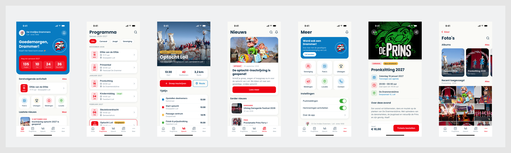

# 17 – Design system (op basis van Figma)

> Status: concept v0.1 · 2026-09-24
> Bron: Figma-bestand **"Vrolijke Drammers – App Design"** (`8EzBpDFQ28pJTf5Ciq6XHh`). Het Figma-ontwerp is leidend voor de app-UI (A-10). Implementatie volgt in de bouwfase; in deze fase is alleen de designtaal vastgelegd.

## 1. Bronnen

| Sectie | Node | Frame | Export |
|---|---|---|---|
| iOS — iPhone 15/16 (licht) | [`5:624`](https://www.figma.com/design/8EzBpDFQ28pJTf5Ciq6XHh/Vrolijke-Drammers-%E2%80%93-App-Design?node-id=5-624) | 393 × 852 | [design/ios-licht.png](design/ios-licht.png) |
| Android — Material 3 (licht) | [`5:625`](https://www.figma.com/design/8EzBpDFQ28pJTf5Ciq6XHh/Vrolijke-Drammers-%E2%80%93-App-Design?node-id=5-625) | 412 × 917 | [design/android-licht.png](design/android-licht.png) |
| iOS — Dark mode | [`9:313`](https://www.figma.com/design/8EzBpDFQ28pJTf5Ciq6XHh/Vrolijke-Drammers-%E2%80%93-App-Design?node-id=9-313) | 393 × 852 | [design/ios-donker.png](design/ios-donker.png) |
| Android — Dark mode | [`9:1137`](https://www.figma.com/design/8EzBpDFQ28pJTf5Ciq6XHh/Vrolijke-Drammers-%E2%80%93-App-Design?node-id=9-1137) | 412 × 917 | [design/android-donker.png](design/android-donker.png) |

### Schermen per sectie

| # | Scherm | iOS licht | Android licht | iOS donker | Android donker |
|---|---|---|---|---|---|
| 01 | Home | `3:2` | `3:126` | `9:314` | `9:1138` |
| 02 | Programma | `4:46` | `4:256` | `9:438` | `9:1263` |
| 03 | Nieuws | `4:474` | `4:566` | `9:756` | `9:1590` |
| 04 | Optocht | `5:174` | `5:282` | `9:648` | `9:1481` |
| 05 | Meer | `5:391` | `5:505` | `9:848` | `9:1684` |
| 06 | Activiteit detail | `8:262` | `8:346` | `9:962` | `9:1803` |
| 07 | Foto's | `8:428` | `8:519` | `9:1046` | `9:1885` |



## 2. Kleuren

### Merkkleuren (Figma-variabelen)

| Token | Waarde | Figma-variabele | Gebruik |
|---|---|---|---|
| `brand.red` | `#ED0012` | `color/drammers-rood` | Primaire actie, actieve tab, countdown, datumblok, sectie-links |
| `brand.blue` | `#087BC1` | `color/loils-blauw` | Hero Home, "Lid worden"-kaart, secundaire knop (outline), info-iconen |
| `brand.navy` | `#123047` | `color/donkerblauw` | Primaire tekst (licht), schaduwbasis |
| `brand.green` | `#39A935` | `color/eikenloof-groen` | Toggles aan, locatie-icoon, succes |
| `brand.offWhite` | `#FAFAF7` | `color/warm-wit` | Achtergrond (licht) |
| `accent.yellow` | `#F4B942` | (geen variabele) | Uitslagen-icoon, badges "Hoogtepunt"/"Bijna uitverkocht" |

### Semantische tokens

| Token | Licht | Donker | Bron |
|---|---|---|---|
| `bg.canvas` | `#FAFAF7` | `#0D1A25` | Figma |
| `bg.surface` (kaarten, tabbar) | `#FFFFFF` (tabbar 96 % wit) | `#172939` | Figma |
| `text.primary` | `#123047` | `#F2F4F6` | Figma |
| `text.secondary` | `#5B6C7B` (Figma: navy 65 %, iets donkerder voor ≥ 4,5:1 op canvas) | `#8F99A1` | Figma + OQ-66 |
| `text.tertiary` / tab inactief | `#5F7080` (Figma 55 % = 3,4:1) | `#8F99A1` | OQ-66 |
| `border.subtle` | `rgba(18,48,71,.10)` | `rgba(242,244,246,.08–.10)` | Figma |
| `action.primary.bg` | `#ED0012` | `#ED0012` | Figma |
| `action.primary.fg` | `#FFFFFF` | `#FFFFFF` | Figma |
| `action.accentText` (links "Alles", "Meer", actieve tab) | `#D4000F` (Figma `#ED0012`) | `#FF5A6A` (Figma `#FF4557`) | OQ-66 |
| `linkText` (blauwe tekstlinks) | `#066AA6` (Figma `#087BC1` = 4,35:1 op canvas) | `#5AB0E6` | OQ-66 |
| `textOnLightButton` (tekst op witte knop in blauw vlak) | `#066AA6` | `#066AA6` (Figma `#5AB0E6` = 2,4:1) | OQ-66 |
| `successText` (groene tekst, badge "Jeugd") | `#287A26` | `#4FB84B` | OQ-66 |
| `icon.tint.red/blue/yellow/green` (tegel-achtergrond) | kleur @ 14 % | kleur @ 14 % | Figma |
| `shadow.card` | `0 4 16 rgba(18,48,71,.08)` | `0 4 16 rgba(0,0,0,.35)` | Figma |
| `scan.valid` | `#39A935` + ✓ | idem | Nieuw (scanner) |
| `scan.warning` | `#F4B942` + ⚠ (tekst `#123047`) | idem | Nieuw |
| `scan.invalid` | `#ED0012` + ✕ | idem | Nieuw |

## 3. Typografie

| Rol | Font | Grootte / regelhoogte | Voorbeeld |
|---|---|---|---|
| Large title | Poppins Bold | 32 / 40 | "Meer", "Nieuws" |
| Hero title | Poppins Bold | 28 / 34 | "Goedemorgen, Drammer!" |
| Countdown-cijfer | Poppins Bold | 26 / 30 | "135" |
| Card title (groot) | Poppins Bold | 19 / 24 | "Word ook een Drammer!" |
| Datumblok-dag | Poppins Bold | 20 / 24 | "11" |
| Section header | Poppins SemiBold | 17 | "Eerstvolgende activiteit" |
| App-naam | Poppins SemiBold | 16 | "De Vrolijke Drammers" |
| Body strong / list title | Inter SemiBold | 15–16 | "Elfde van de Elfde" |
| Body | Inter Regular/Medium | 14–15 | |
| Caption | Inter Regular | 12–13 | "11:11 uur · Dorpsplein Loil" |
| Overline / datum | Inter SemiBold | 10–11, uppercase | "12 SEPTEMBER 2026", "WO" |
| Tab label | Inter Medium | 10 | |

- Fonts: Poppins en Inter (Google Fonts, OFL), gebundeld via `expo-font`.
- **Dynamic Type**: alle tekst schaalt mee (max. factor 1,6 voor titels en 2,0 voor body); lay-outs vloeien door (geen vaste hoogtes voor tekstcontainers).

## 4. Vorm, ruimte en elevatie

| Token | Waarde |
|---|---|
| `radius.sm` | 12 (datumblok, tegel-inner, nieuwsafbeelding, countdown-cellen) |
| `radius.md` | 16 (kaarten, lijstgroepen) |
| `radius.lg` | 20 (countdown-kaart, "Lid worden"-kaart) |
| `radius.hero` | 28 (onderhoeken hero) |
| `radius.pill` | 100 (knoppen, chips, badges) |
| `radius.iconBubble` | 22–24 (44–48 px cirkels) |
| `space` | 4, 6, 8, 10, 12, 14, 16, 20, 24 (paginamarge 20) |
| `size.touch` | ≥ 44 pt (iOS) / 48 dp (Android) |
| `size.icon` | 20 (chevron), 22 (tegel), 24 (tab/nav) |
| Iconstijl | Lijn, 24 px, stroke 2, eigen set (o.a. `Icon/optocht` = paard met praalwagen) |

## 5. Componentinventaris

| Component | Gebruikt in | Varianten / opmerkingen |
|---|---|---|
| AppHeader (logo + naam + subtitel + bel) | Home | Op hero-blauw |
| LargeTitleHeader (+ acties zoek/bel) | Programma, Nieuws, Meer, Foto's | iOS large title; Android top app bar (M3) |
| BackHeader | Foto's, Activiteit detail | iOS "‹ Meer"; Android ← |
| HeroCard / Countdown | Home | Dagen/Uur/Minuten/Seconden, live |
| EventCard met DateBlock | Home, Programma | Badge (Jeugd, Hoogtepunt), chevron, geselecteerd (rode rand) |
| ShortcutTile (icoonbubbel + label) | Home (4), Meer (6) | Kleurtint per functie |
| FilterChips | Programma | Actief = rood gevuld (+ ✓ op Android) |
| MonthSectionHeader | Programma | "NOVEMBER 2026" overline |
| NewsCard (featured / list) | Home, Nieuws | Categorielabel (DANSGARDE, PRINS, OPTOCHT) |
| StatRow | Optocht | "13:30 Start · 42 Deelnemers · 3,2 km Route" |
| Timeline | Optocht | Gekleurde stippen per fase + tijd |
| PrimaryButton / SecondaryButton (outline) | Optocht, Nieuws, Detail | Met icoon |
| FAB | Programma (Android) | "Mijn agenda" |
| SettingsList (toggle, chevron) | Meer | iOS-switch / M3-switch |
| InfoRow (icoon + titel + subtitel) | Detail | Datum/tijd/locatie + actie-link |
| ProgressBar tickets | Detail (donker) | "82 % verkocht" |
| StickyCTA (prijs + knop) | Detail | "Vanaf € 10,00 · Tickets bestellen" |
| AlbumCard / PhotoGrid | Foto's | 3 kolommen, 2 px gap |
| TabBar (5 tabs) | Alle | Actief = rood icoon + label; Android M3 active indicator |

**Nieuw te ontwerpen** met dezelfde bouwstenen (OQ-42): LoginForm, ActivationFlow, QRCard (live-ververs-indicator, max helderheid), ScanResultSheet (groen/oranje/rood, full-bleed kleurvlak + groot icoon + tekst), WizardStepper, AddressFields, NumberStepper, FileUploadList, StatusBadge (optochtstatussen), NotificationListItem, EmptyState, ErrorState, OfflineBanner.

## 6. Platformverschillen (volgens Figma)

| Aspect | iOS | Android |
|---|---|---|
| Statusbalk | 54 pt, 9:41 | 40 dp, 9:30 |
| Titels | Large title links | Top app bar, kleinere titel |
| Chips | Tekstchip | Chip met ✓ bij actief (M3) |
| Tabbar | Label onder icoon, home indicator | M3 navigation bar met pill-indicator achter het actieve icoon |
| Terug | "‹ Meer" (tekst + chevron) | ← icoon |
| FAB | — | "Mijn agenda" extended FAB |
| Toggles | iOS switch | M3 switch met ✓ in de thumb |

Implementatie: één componentenset met `Platform.select` voor deze verschillen; geen aparte schermen per platform.

## 7. Toegankelijkheid – bevindingen en voorstellen

Contrastberekening (WCAG 2.2, normale tekst ≥ 4,5:1; grote tekst ≥ 18,66 px bold of 24 px, en UI-componenten ≥ 3:1):

| Combinatie | Ratio | Oordeel | Voorstel |
|---|---|---|---|
| Wit op rood `#ED0012` | 4,56 | ✅ AA (krap) | Behouden |
| Wit op blauw `#087BC1` | 4,55 | ✅ AA (krap) | Behouden |
| Donkerblauw op warm-wit | 13,0 | ✅ AAA | — |
| **Rood tekst op warm-wit** ("Alles", "Meer" 14 px) | **4,36** | ❌ AA kleine tekst | Tekst-variant `brand.redText = #D4000F` (5,28) of links vet ≥ 18,66 px |
| Secundaire tekst 65 % op wit | 4,58 | ✅ | — |
| **Tab inactief 55 % op wit** (10 px) | **3,42** | ❌ | `text.tertiary = #5F7080` (5,1) |
| **Groen `#39A935` als tekst op wit** | **3,04** | ❌ tekst / ✅ icoon | Tekst-variant `#287A26` (5,15); icoon mag blijven |
| **Lichtblauw `#5AB0E6` op wit** ("Lid worden"-knop, donker) | **2,39** | ❌ | Knoptekst `#087BC1` (4,55) of `#066AA6` (5,8) |
| Rood-dark `#FF4557` op surface `#172939` | 4,42 | ❌ (krap) | `#FF5A6A` (4,9) |
| Tekst op donker bg/surface | 16,0 / 13,5 | ✅ AAA | — |
| Muted 55 % op donker surface | 5,12 | ✅ | — |
| Geel badge met donkerblauwe tekst | 7,71 | ✅ | — |

**Besloten (OQ-66), vastgelegd in `packages/design-tokens` en bewaakt door contrasttests:** de toegankelijke varianten worden gebruikt voor kleine tekst; de merkkleuren zelf blijven ongewijzigd. De designer kan dit later bevestigen of aanpassen in Figma.

Overige richtlijnen:
- Kleur nooit als enige drager (statusbadges en scanner altijd met icoon + tekst).
- `accessibilityLabel` bij icoonknoppen (bel, zoek, deel, terug); countdown als één label ("Nog 135 dagen tot carnaval").
- Fotogrid: alt-tekst uit `caption` of "Foto x van y, album …".
- Beweging: geen essentiële animaties; respecteer "Reduce Motion" (de QR-ververs-animatie wordt dan een statische timer).
- Scanner: haptiek + geluid per resultaat; tekst ≥ 24 pt.

## 8. Tokens als code (bouwfase)

`packages/design-tokens` exporteert:

```ts
export const tokens = {
  color: {
    light: { canvas: '#FAFAF7', surface: '#FFFFFF', textPrimary: '#123047', /* … */ },
    dark:  { canvas: '#0D1A25', surface: '#172939', textPrimary: '#F2F4F6', /* … */ },
    brand: { red: '#ED0012', blue: '#087BC1', navy: '#123047', green: '#39A935', yellow: '#F4B942' },
  },
  radius: { sm: 12, md: 16, lg: 20, hero: 28, pill: 100 },
  space:  [0, 4, 6, 8, 10, 12, 14, 16, 20, 24],
  font:   { display: 'Poppins', body: 'Inter' },
} as const;
```

Het beheerportal gebruikt dezelfde tokens (CSS custom properties), zodat app en beheer als één product voelen. De synchronisatie Figma-variabelen → tokens gebeurt handmatig per designwijziging (klein aantal tokens; tooling zoals Tokens Studio is optioneel).
