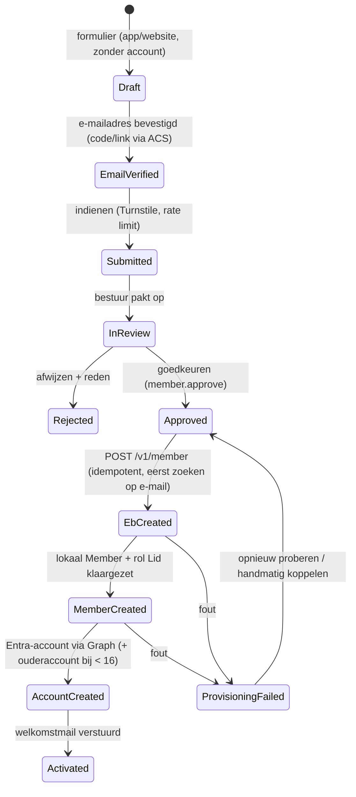

# ADR-014: Accountregistratie en -provisioning (alleen leden)

- **Status**: Geaccepteerd (besluit B-05, opdrachtgever) · 2026-09-24 · uitwerking van de flow door de architect op verzoek van de opdrachtgever
- **Gerelateerd**: ADR-004 (authenticatie), ADR-010 (e-Boekhouden), 07-rbac

## Context

De opdrachtgever heeft besloten (B-05):
- **Alleen leden** krijgen een account, met één uitzondering: **ouders/verzorgers van minderjarige leden** (B-05b). Zij zien alleen gegevens, meldingen en QR van hun eigen kinderen, geen ledencontent.
- Niet-leden die met de optocht meedoen, schrijven zich in via een **openbaar webformulier zonder account** en worden per e-mail geïnformeerd (B-05a).
- Een registratie uit de app mag **pas naar Entra ID worden geschreven als het bestuur de inschrijving heeft goedgekeurd**. Tot die tijd staat de aanvraag in een tijdelijk gedeelte. Na goedkeuring wordt ook e-Boekhouden bijgewerkt. De opdrachtgever vroeg de beste volgorde uit te zoeken.

Geverifieerde feiten (Microsoft Learn, 2026):
- Zelfregistratie in een Entra External ID-user flow kan uit via Graph: `onInteractiveAuthFlowStart.isSignUpAllowed = false` ("Disable sign-up in a sign-up and sign-in user flow"). Bestaande gebruikers kunnen daarna nog inloggen.
- Klantaccounts kunnen door een beheerder of via **Microsoft Graph** worden aangemaakt (identity `emailAddress`), in plaats van via zelfregistratie ("Add and manage customer accounts").
- e-Boekhouden ondersteunt `POST /v1/member` (lidnummer automatisch als het leeg blijft) en `GET /v1/member?email=…` (OpenAPI v1, geverifieerd 2026-09-24).

## Options considered

| Optie | Beschrijving | Voordelen | Nadelen |
|---|---|---|---|
| A. Zelfregistratie + lidnummer-check (custom auth extension) | Entra-registratie vraagt het lidnummer; onze API valideert tijdens het registreren | Direct een account | Werkt niet voor **nieuwe** leden (zij hebben nog geen lidnummer); tegen de wens "pas na goedkeuring naar Entra" |
| B. Zelfregistratie vrij, activeren verplicht | Iedereen maakt een Entra-account; de API weigert tot activatie | Eenvoudig | Accounts van niet-leden in Entra; tegen besluit B-05 |
| **C. Wachtrij → goedkeuring → e-Boekhouden → lokaal → Entra** (voorstel opdrachtgever, uitgewerkt) | Zelfregistratie uit. Aanvragen staan in onze DB. Na goedkeuring maakt de backend achtereenvolgens het lid in e-Boekhouden aan (`POST /v1/member`), het lokale `Member` en het Entra-account (Graph), en verstuurt een welkomstmail | Geen enkel Entra-account zonder goedkeuring; geen dubbele invoer; direct lidnummer; e-Boekhouden blijft de bron | Schrijfrechten op het e-Boekhouden-token; meerstapsproces (saga) met foutafhandeling |
| D. Wachtrij → goedkeuring → **handmatig** in e-Boekhouden → nachtelijke sync → Entra | Zoals C, maar de secretaris voert het lid zelf in e-Boekhouden in; de sync maakt daarna het account | Token blijft read-only | Dubbele invoer; vertraging tot de volgende sync; risico op koppelfouten (welk nieuw lid hoort bij welke aanvraag?) |

Volgorde binnen C, "eerst Entra, dan e-Boekhouden" versus "eerst e-Boekhouden, dan Entra": **eerst e-Boekhouden**. Het lidnummer ontstaat daar; het lokale `Member` en de koppeling `User.member_id` hebben het nodig. Mislukt e-Boekhouden, dan bestaat er nog geen account zonder lidmaatschap.

## Decision

**Optie C**, met optie D als handmatige terugvaloptie per aanvraag. Drie instroompaden, één gedeelde provisioning-service:

### 1. Nieuw lid (app of website)

### 2. Bestaand lid vraagt een account aan ("Ik ben al lid")
- Anoniem endpoint `POST /account-requests` met lidnummer + e-mailadres (Turnstile, rate limit, **altijd dezelfde generieke respons**: "Als de gegevens kloppen, ontvang je binnen enkele minuten een e-mail").
- **Exacte match** met een actief lid uit de sync (lidnummer + e-mailadres in e-Boekhouden) → het account wordt direct aangemaakt (het lid is al door het bestuur toegelaten) en de welkomstmail verstuurd. Wie het e-mailadres niet bezit, kan niet inloggen (e-mail-OTP).
- **Geen match** (bijv. een ander e-mailadres) → het verzoek komt in de wachtrij van het bestuur; na verificatie wordt eerst het e-mailadres in e-Boekhouden gecorrigeerd en daarna het account aangemaakt.
- Leden zonder e-mailadres: het bestuur laat het e-mailadres in e-Boekhouden vastleggen; daarna volgt dezelfde route.

### 3. Ouder/verzorger van een minderjarig lid
- Bij de aanvraag voor een lid onder de 16 worden de gegevens van de ouder verplicht vastgelegd. Na goedkeuring maakt de provisioning ook het ouderaccount aan (als dat e-mailadres nog geen account heeft), met de rol Ouder en een geverifieerde `GuardianMemberRelation`.
- Voor bestaande minderjarige leden: het bestuur legt de relatie vast in het portal → ouderaccount via dezelfde service.
- Eén ouderaccount kan aan meerdere kinderen gekoppeld zijn (één e-mailadres = één account).

### Technische uitwerking
- **Entra**: `isSignUpAllowed = false` op de user flow; aanmeldmethode e-mail-OTP (en optioneel wachtwoord via "wachtwoord vergeten"). Accounts via Graph (`POST /users` met identity `emailAddress`, willekeurig wachtwoord dat nooit wordt gecommuniceerd, `displayName`). Graph-app-permissie `User.ReadWrite.All` voor een aparte provisioning-app-registratie (credential in Key Vault).
- **Idempotente saga** (`identity.AccountProvisioning`): elke stap legt het resultaat vast (`eb_member_id`, `member_number`, `entra_object_id`). Opnieuw proberen hervat vanaf de laatste geslaagde stap. Vóór `POST /v1/member` eerst `GET /v1/member?email=` om dubbele leden te voorkomen. Vóór het aanmaken van het Entra-account eerst Graph-lookup op de identity.
- **Vrije velden** (B-06) bij `POST /v1/member`: geboortedatum, inschrijfjaar (huidig jaar), status `actief`, categorie.
- **Levenscyclus**: lid wordt inactief/overleden → Entra-account `accountEnabled = false` + sessies ingetrokken; verwijderen volgens de bewaartermijn (06 §13). Heractivatie zet het account weer aan.
- **Dev/Acc** (B-02): testaccounts via dezelfde provisioning, plus toewijzing aan de Dev/Acc-app-registratie en het attribuut `environmentAccess`.

## Reasoning

- Voldoet letterlijk aan de wens van de opdrachtgever: geen Entra-account zonder goedkeuring, en e-Boekhouden wordt automatisch bijgewerkt.
- De volgorde e-Boekhouden → lokaal → Entra garandeert dat er nooit een account zonder lidnummer bestaat.
- Bestaande leden hoeven niet opnieuw beoordeeld te worden bij een exacte match; ze zijn al lid. Dat scheelt het bestuur honderden handelingen bij de lancering.
- Geen accounts vooraf in bulk voor alle leden: alleen wie de app wil gebruiken, krijgt een account (dataminimalisatie).

## Consequences

- Het e-Boekhouden-token heeft **schrijfrechten** nodig voor leden (`POST /v1/member`, eventueel `PATCH` voor e-mailcorrectie). Vóór fase 9 verifiëren of een e-Boekhouden-gebruiker tot de ledenadministratie kan worden beperkt (OQ-03).
- Nieuwe beheerschermen: wachtrij accountverzoeken, provisioningstatus met "opnieuw proberen" en "handmatig koppelen".
- Het inlogscherm in de app biedt "Inloggen" en "Account aanvragen / Lid worden", maar geen "Registreren".
- `/me/activate` en activatiecodes vervallen.
- Optocht voor niet-leden: een aparte, anonieme inschrijfroute (13/14) zonder account.

## Security implications

- Geen accounts van niet-leden, dus een kleiner aanvalsoppervlak; spam op de aanvraag-endpoints wordt afgevangen met Turnstile, rate limits, e-mailverificatie en handmatige beoordeling.
- Generieke respons op accountverzoeken voorkomt het uitvissen van lidnummers en e-mailadressen.
- Het bezit van het e-mailadres wordt bewezen bij de eerste inlog (OTP); er gaan nooit wachtwoorden per mail.
- Graph `User.ReadWrite.All` is een krachtige permissie: aparte app-registratie, credential (certificaat) in Key Vault, alleen gebruikt door de provisioning-service, elk gebruik in de AuditLog; periodieke controle.
- Schrijfrechten op e-Boekhouden vergroten de impact van een gelekt token → opslag in Key Vault, minimale gebruikersrechten in e-Boekhouden, alerts bij ongebruikelijke aantallen `POST`-calls.

## Cost implications

- Geen extra Azure-kosten; ACS-e-mail (verificatie + welkomstmail) verwaarloosbaar.
- Ontwikkeling: ± 1 week extra in fase 9 (saga, wachtrij, e-mails), maar minder beheerwerk voor bestuur en secretaris (geen dubbele invoer).
